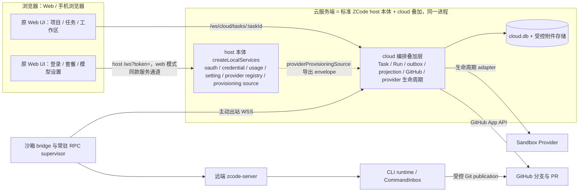
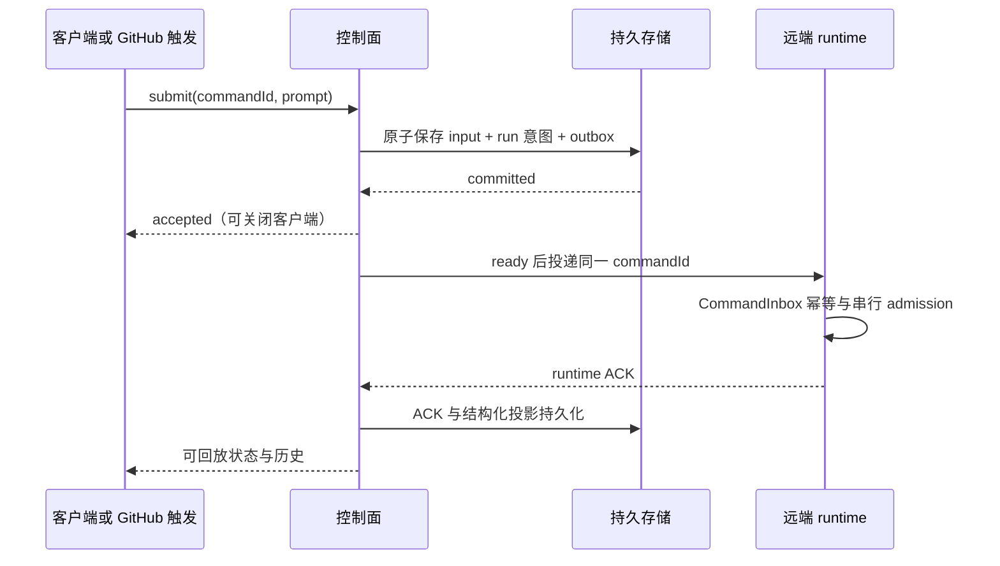

# Cloud Agent 总方案

状态：目标设计。2026-10-06 云端实现代码已整体回退，工作区只保留本 spec 组（见 [10 §10](./10-implementation-plan.md)），实施从零开始。

本次只制定和修订设计。2026-10-06 云端实现代码已整体回退：工作区等于远端 `main` 加上本 spec 组，`packages/*/src/cloud`、cloud 测试与 Docker/WSL 退役代码均不在工作区。文档中所有“已实现/已通过/E2E 已验证”的记录只作历史证据，不作为完成前提。2026-10-05 新增 11 并同步创建/启动、幂等、停止和 UI 边界。

## 1. 产品目标与范围

将 ZCode 的 Agent 执行能力迁移到云沙箱，以 Web 为主客户端。客户端关闭后，已接受的任务仍能开始和继续工作。任务、输入和可回放历史不依赖浏览器或某一次沙箱实例，产物以任务分支和 PR 交付。

首版建议采用“单用户受保护部署 → 验证核心闭环 → 多账号公开服务”的顺序。单用户也必须有认证和稳定的部署主体。若首版要求多人使用，M7 的租户边界必须前移到 M1，不能共享全局凭据上线。该范围属于待产品确认项。

| 项目类型    | 执行载体         | 行为                                           | 生命周期所有者 |
| ----------- | ---------------- | ---------------------------------------------- | -------------- |
| GitHub 仓库 | 每任务独占云沙箱 | 任务可有多个顺序 run，同时只有一个有效写入 run | 控制面         |

云模式不提供部署服务器本地文件夹、Agent、终端或 Git 执行入口。迁移期保留 Desktop 本地开发和手机附加桌面 Host 的路径，作为另一种明确的模式；它们不能成为云任务的隐式 fallback。Docker/WSL 远程目标在云闭环验证后移除，宿主平台的 WSL 兼容能力保留。

首版不包含 Android 推送、iOS、沙箱快照恢复、多 Agent 共享 checkout、任务共享/RBAC、任意第三方 Git 托管平台。云客户端只有 Web（含手机浏览器）；Android 壳与 Desktop 云入口已按 2026-10-06 决议移除，见 §11 决议记录⑥。

## 2. 当前源码基线

| 当前源码                                                                   | 可复用能力                                  | 尚未具备的云能力                                                                          |
| -------------------------------------------------------------------------- | ------------------------------------------- | ----------------------------------------------------------------------------------------- |
| `packages/server/src/http.ts`                                              | HTTP、WS、token 认证和连接作用域            | 没有云任务 API；`/ws/remote/:id` 仅一次性消费连接，注册 file/git/system/terminal 四个服务 |
| `packages/server/src/remote/connect.ts`、`ssh-backend.ts`、`handshake.ts`  | SSH、stdio 握手、远端部署和 RPC             | 云 driver、出站 bridge、多端持久 attachment                                               |
| `packages/client/src/remoteServiceAccess.ts`                               | 服务 descriptor 与 RPC 代理                 | getter 存在不代表服务端已经注册或授权                                                     |
| `packages/services/src/zcode-agent/zcodeAgentConnectionScope.ts`           | 受信角色、订阅归属和代际防护                | 控制面持久化、run fencing、跨进程恢复                                                     |
| CLI `zcode-protocol-v4/command-inbox.ts`                                   | 串行 admission、commandId 幂等与查询        | 沙箱尚未创建时的服务端输入持久化                                                          |
| CLI `conversation-topic-publisher.ts`、UI `conversationProjectionStore.ts` | snapshot/delta、logEpoch/revision、缺口恢复 | 沙箱销毁后的云历史存储                                                                    |
| `packages/rpc/src/persistent-protocol.ts`                                  | 有界 ACK/重传与背压                         | 持久事件日志、无限离线缓存                                                                |
| `packages/shared/src/remote-workspace-identity.ts`                         | SSH/WSL/Docker 身份工具                     | 原基线不支持；现有未提交 cloud identity 骨架仍须验证整条链路                              |
| `packages/services/src/session/tasksDatabase/`                             | SQLite 迁移/事务参考                        | 现有 task index 不是 Cloud Task 注册表                                                    |

`packages/sandbox-provisioner`、`packages/sandbox-bridge`、`packages/control-plane` 目录中的构建产物不能视为当前源码包。实施从正式新增模块、契约和构建入口开始，不恢复已撤销实现。

基线表描述原有模式参考；当前 shared/client/server/web 的 `src/cloud/` 和 UI 的 `src/hooks/cloud/`、`src/store/cloud/` 等骨架的路径与差距见 [11 §2](./11-project-task-creation.md#2-当前源码依据与差距)。存在部分骨架不改变本方案待实现/待验证的状态。

## 3. 目标拓扑

云服务端运行 host 本体（含本机执行域），但**云任务与浏览器执行请求的落点只有沙箱 attachment**：部署机 host 执行域不构成任何隐式 fallback（[03 §2](./03-control-plane.md)）。沙箱网络断开只释放网络 facade，不关闭常驻 supervisor 持有的 stdio；当前 stdio EOF 会释放服务，不能把网络关闭直接映射成 Agent stdin EOF。

## 4. 唯一所有者

| 事实                                                   | 唯一所有者                                                                                                                                              | 其他组件职责                                  |
| ------------------------------------------------------ | ------------------------------------------------------------------------------------------------------------------------------------------------------- | --------------------------------------------- |
| Project、Task、run、配额和生命周期操作                 | 控制面持久应用服务                                                                                                                                      | 客户端读投影并提交命令                        |
| 已接受、尚未 runtime admission 的输入与投递记录        | 控制面 durable outbox                                                                                                                                   | 仅投递与对账，不分配 running 输入顺序         |
| 已 admission 的 busy/running 输入和权限裁决            | CLI CommandInbox/runtime                                                                                                                                | 控制面保存 ACK 投影，不另建执行队列           |
| 会话、工具执行和运行时投影生成                         | 远端 runtime                                                                                                                                            | 云历史保存结构化投影，不重新裁决业务          |
| 跨端历史/事件读取                                      | 控制面持久投影存储                                                                                                                                      | bridge 保存未确认出口，客户端按 cursor 恢复   |
| bridge/客户端连接对象                                  | 控制面内存注册表                                                                                                                                        | 可按持久 run 重建，不能成为元数据事实源       |
| 已推送代码、checkpoint、PR                             | GitHub                                                                                                                                                  | 控制面保存 SHA/链接；本地 commit 不等于已保存 |
| provider 凭据、GitHub App 私钥                         | 模型/provider 凭据与账号设置归 host 本体 credentialService/settingService；GitHub App 私钥、webhook secret、云部署 auth token 归 cloud 层部署秘密加载器 | 不进浏览器，不复制整个 store 到沙箱           |
| Task 草稿启动配置                                      | 控制面 Task owner                                                                                                                                       | 客户端编辑 overlay 经 revision 提交           |
| 未提交正文、布局、submit attempt 与 optimistic overlay | 客户端                                                                                                                                                  | attempt 仅对账，不充当 accepted 队列          |

控制面接收、runtime admission、执行完成、产物保存是四个不同事实。

## 5. 身份与状态

仓库 Task 的稳定 `workspaceIdentity=cloud-task:<taskId>`，不编码 provider/run/仓库名称/path。`workspacePath` 单独传递用于 cwd、文件、Git 与展示；既有本地模式继续支持 `workspaceIdentity?.trim() || workspacePath`。SSH 保留为本机/桌面连接能力及其原 `remote:ssh:...` 工作区身份，不属于云执行路径；云侧不再提供 SSH attachment（2026-10-06 决议，见 §11 ⑥）。

远端写入携带 `taskId/runId/runGeneration/connectionEpoch`：identity 隔离任务，runGeneration 隔离执行代际，connectionEpoch 防旧连接复活。

- Task：`draft/active/completed/failed/archived`。
- Run：`provisioning/ready/paused/disconnected/draining/stopped/expired/failed`（paused 为 2026-10-09 生命周期 v2 增补，仅分级能力 provider 出现；状态全集以 08 §3.2 为准）。
- Execution：`unknown/idle/running/awaiting-input`，来自 runtime；产物保存和 PR 另有状态。

断网只进入 disconnected。新 run 必须在 provider 终止证据与旧写权限处置完成后获得写入权，不能心跳超时即“过期重开”。

## 6. 持久化与恢复承诺

采用独立 SQLite 数据库和受控附件存储。通过异步 repository port 访问；使用同步 `node:sqlite` 时放 storage worker，不能在 HTTP 事件循环执行大型 SQL。事务与唯一约束承担状态迁移，不用设置 JSON 文件作为任务数据库。

持久内容包括任务、输入正文/附件、commandId、run/provider handle、代际、恢复验证信息、外部操作意图、ACK、结构化历史、checkpoint SHA 和 schema 版本。完整用户内容与密钥不进入普通日志。

控制面重启恢复创建/投递/保存/发布操作；浏览器关闭不丢 accepted 输入；沙箱销毁后保留已推送代码与已 ingest 历史。重新打开是同任务分支上的新 runtime session，可引用历史摘要，不能声称恢复旧工具/进程状态。离线缓存有界，耗尽必须暴露暂停或数据风险。

Git 只持久化已跟踪且已推送的产物，不能代替聊天、任务、输入、权限、附件和未跟踪文件。

## 7. 生命周期与 GitHub

heartbeat、轮询与被动观看不算业务活动；续期合并调度，provider 确认后更新真实 expiresAt；只能估计期限的 provider 保存 deadlineEstimate/deadlineConfidence 并以保守截止 drain，不能伪装精确确认。checkpoint 先协调停止写入，再提交白名单文件、push 并核实远端 SHA。闲置、用户停止和硬到期前 drain 使用同一保存通道。失败后保留运行只在租期允许时成立，必须标 `dataAtRisk`，不能承诺硬到期后不丢。

Task 区分 `baseBranch/baseSha/taskBranch/lastCheckpointSha`；PR `head=taskBranch`、`base=baseBranch`。Agent 轮次完成、PR 创建、用户验收、PR merge 分别表示不同事件。

临时 repo write token 的首版仅适用于可信单用户部署。GitHub contents:write 不是分支级权限，generation 不能撤销已发 token；公开服务前必须落实 Git 写代理或验证过的 ref 保护。详见09。

## 8. 工程边界

建议新增受控模块 `packages/server/src/cloud/`，HTTP 入口通过契约调用。按 `domain/app/adapters` 分层；SDK、SQLite、GitHub、WS/子进程只在 adapters。实施前注册架构策略与公开入口，并建立 `module.ts/contract.ts/contract.example.ts/CONTRACT.md`。

跨包 schema 放 shared 公开入口；UI 通过 hooks、公开 descriptor 和平台依赖注入访问服务。UI 不访问 Repo，services 不引用 CLI runtime 具体实现，server 不深导入 CLI 执行逻辑。

bridge 建议在 `cloud/execution/` 注册独立受控 `cloud-execution` 子模块（独立 domain/app/adapters、公开contract和构建入口），与父 `cloud-control-plane` 模块按最深根归属、依赖仅走公开入口；精确模块名在 M0/M2 发布试验后冻结，不引用不存在的旧包脚本。runtime、bridge protocol、数据库 schema 独立版本化。

## 9. 统一阶段

| 阶段 | 成果                                                    | 退出门槛                                     |
| ---- | ------------------------------------------------------- | -------------------------------------------- |
| M0   | 基线、契约、架构阅读包和测试入口                        | 现有错误与新错误分开；状态/owner/API 收敛    |
| M1   | 云安全装配、认证和持久元数据/input/run 意图             | 绕过 UI 无法本机执行；重启不丢元数据         |
| M2   | 单 provider、常驻 bridge supervisor、握手               | 出站连接、ready 明确、断网不 EOF、无重复创建 |
| M3   | durable input、ACK、持久 replay、Web 闭环               | 关闭页面仍执行；重启和缺口恢复通过           |
| M4   | checkpoint、租期/回收、分支和 draft PR                  | 保存风险可见；停止幂等；重开无双写           |
| M5   | 多端 Web 回归（桌面浏览器/移动浏览器）、Docker/WSL 移除 | 两种 delivery 通过；类型与消费者原子收敛     |
| M6   | （已移除）Android 内置 Web 壳                           | 不适用：2026-10-06 决议移除，见 §11 ⑥        |
| M7   | 多账号/公开门槛、GitHub webhook/checks                  | 条件性：单用户模型下不在当前路线图（§11 ⑤）  |

sandbox provider 已拍板（2026-10-05）：首期同时实现 E2B、Modal、Daytona 三家 adapter，共用同一 SandboxDriverPort contract；各家以真实账号实测（能力、配额、期限、启动）解禁，验证完成前 capability 门控不显示可选，不得以共同接口抹平期限、资源和停止语义。首版多人使用时，M7 中安全基础前移，webhook 可继续后置。

## 10. 索引与冻结规则

| 文档                                                             | 唯一负责的细节                                               |
| ---------------------------------------------------------------- | ------------------------------------------------------------ |
| [01-provisioning.md](./01-provisioning.md)                       | driver、bootstrap、创建执行、凭据、资源                      |
| [02-bridge-protocol.md](./02-bridge-protocol.md)                 | 握手、ACK、fencing、重连、durable ingest                     |
| [03-control-plane.md](./03-control-plane.md)                     | 服务装配、数据库、HTTP/WS、鉴权、恢复                        |
| [04-web-client.md](./04-web-client.md)                           | 交互、hook、客户端投影、移动布局                             |
| [05-android-shell.md](./05-android-shell.md)                     | 已移除（2026-10-06 决议⑥）：文件保留为历史记录，不构成路线图 |
| [06-removal-docker-wsl.md](./06-removal-docker-wsl.md)           | 原子删除、旧身份兼容、宿主保留                               |
| [07-connection-architecture.md](./07-connection-architecture.md) | 拓扑、连接owner、RPC/投影通路                                |
| [08-project-task-model.md](./08-project-task-model.md)           | 数据模型、状态、生命周期、恢复                               |
| [09-github-integration.md](./09-github-integration.md)           | 分支、PR、webhook、权限、撤权                                |
| [10-implementation-plan.md](./10-implementation-plan.md)         | PR 拆分、依赖、验收、迁移、运行与验证                        |
| [11-project-task-creation.md](./11-project-task-creation.md)     | 仓库项目、草稿配置、首次启动流程与专项验收                   |
| [12-account-domain.md](./12-account-domain.md)                   | 账号域云适配：登录、套餐、套餐模型进沙箱（决议⑦）            |
| [13-module-map.md](./13-module-map.md)                           | 模块地图、依赖矩阵、代理分工波次与工作单规范                 |
| [modules/W0–W10](./modules/W0-contract-freeze.md)                | 按模块的实施工作单：每个代理的输入、接口、边界与验收         |

重叠细节以该负责文档为源，其他文档引用。改变 API、状态或术语必须同步引用方。计划测试不代表现有覆盖或已通过。实施期按 [13](./13-module-map.md) 的模块工作单分派：工作单只引用本表章节，不复制规则。

## 11. 待产品冻结项

首版部署人数与信任范围；provider/预算/限额/保留期；Desktop 本地模式最终去留；completed 是否由用户验收或 PR merge 自动触发。建议迁移期保留 Desktop 本地模式、completed 默认显式验收。SSH Web attachment 与 Android 壳已由 2026-10-06 决议移除，不再是待冻结项。

这些决定不阻塞方案准备，依赖它们的实现和上线前必须冻结。

决议记录（2026-10-05）：仓库项目、服务端 draft、选择基础分支/provider、首输入持久接受后才创建沙箱已确认，见11；正文首发/暂不接 provisioning append 是可调整的实施默认，不等于用户否定首发附件。provider 已拍板为首期三家（E2B/Modal/Daytona，见 §9）；其余各项（单用户可信部署、迁移期保留 Desktop 本地、completed 显式验收）暂按本节推荐默认执行，可随时显式变更。

决议记录（2026-10-06）：①沙箱 runtime 直接使用控制面同源 provider/model 配置与凭据（可信单用户；代理升级为条件性基线，见01 §7.1）；②自举要素经 provider 原生命令会话通道注入，模板 `start_cmd` 只作构建占位（见01 §6.2）；③控制面与沙箱 server 的交互与 SSH 模式同构，沙箱特有复杂度仅限传输/生命周期/无人值守恢复三类（见07 §2）；④会话展示只依赖控制面持久副本，与客户端在线与否无关（见02 §7.3）；⑤**部署模型为单用户**（2026-10-06 确认：本项目计划即单用户模型，非"首版"过渡）——M7（多账号/公开服务/GitHub webhook 触发）不在当前路线图，保留为条件性设计；全文所有"公开/多租户上线前必须"类条款（Git 写隔离、模型代理、租户边界等）随之转为**条件性基线**，仅在部署模型变更为多用户/公开服务时成为前置条件，不构成当前实施范围。

决议记录（2026-10-06，范围收敛）：⑥产品确认原始设计目标为 GitHub App + 每任务沙箱 + 复用 SSH 模式连接沙箱 agent server + 沙箱生命周期管理，将云项目/任务管理接入原 Web UI。据此移除三项超出范围的功能：**云 SSH attachment**（控制面 SSH 项目接入，原 07 §11/P13）、**Android 壳**（原 05/P15）、**Desktop 云工作区入口**（原 04/P12 部分）。保留 SSH 作为 Desktop 本机/远控连接能力与沙箱 runtime 的交互同构参考，两者均不受影响。§9 阶段表的 M5/M6 相应收敛；条件性基线约束不变。

决议记录（2026-10-06，账号域）：⑦**云模式保留官方模型登录（OAuth）与 Coding Plan 入口**；套餐模型信息必须可供沙箱使用，链路与 SSH 模式同构（控制面保管凭据 → run envelope → 沙箱 target 安装，套餐走 `zhipu-account` 动态换 key）。据此 07 §166"控制面账号作用域"由条件性转为当前范围，新接口族与验收见 [12-account-domain.md](./12-account-domain.md)；多租户凭据代理仍为条件性基线。（决议⑧ 修正："控制面"不再指独立账号子系统——凭据与账号服务由 host 本体保管/提供，本决议的范围结论不变。）

决议记录（2026-10-06，host 本体）：⑧**不存在需要单独建设的"控制面"子系统——云服务端就是标准 ZCode host 本体**（与 web 模式同一装配：`createLocalServices` + HTTP/WS，见 `entry-http.ts`）。登录、账号、凭据、模型目录、`providerProvisioningSource` 等全部是 host 自带能力，零改动可用；浏览器按 web 模式同款方式连接 host（`/ws` 服务通道）。cloud 的沙箱任务编排（cloud/ 模块）是叠加层。此前“控制面轻装配 4 个账号服务”的方案作废。边界保留一项：云任务的执行目标只路由到沙箱 attachment，host 执行域不构成云任务的隐式 fallback。

术语记录（2026-10-06）：**本 spec 组中的“控制面”一律指云服务端进程内的 cloud 编排叠加层**（Task/Run/outbox/projection/GitHub/provider 生命周期），不是独立子系统、独立进程或账号权威；账号域与模型目录的权威是同一进程里的 host 本体（决议⑧）。

决议记录（2026-10-06，代码状态）：云端实现代码整体回退到远端 `main`，工作区只保留本 spec 组（证据与影响见 [10 §10](./10-implementation-plan.md)）。设计结论 ①–⑧ 不变，实施从零开始。
