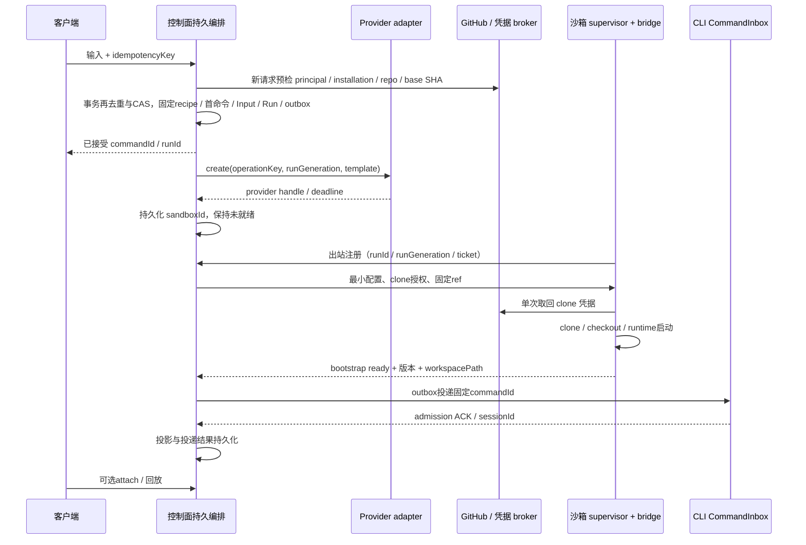
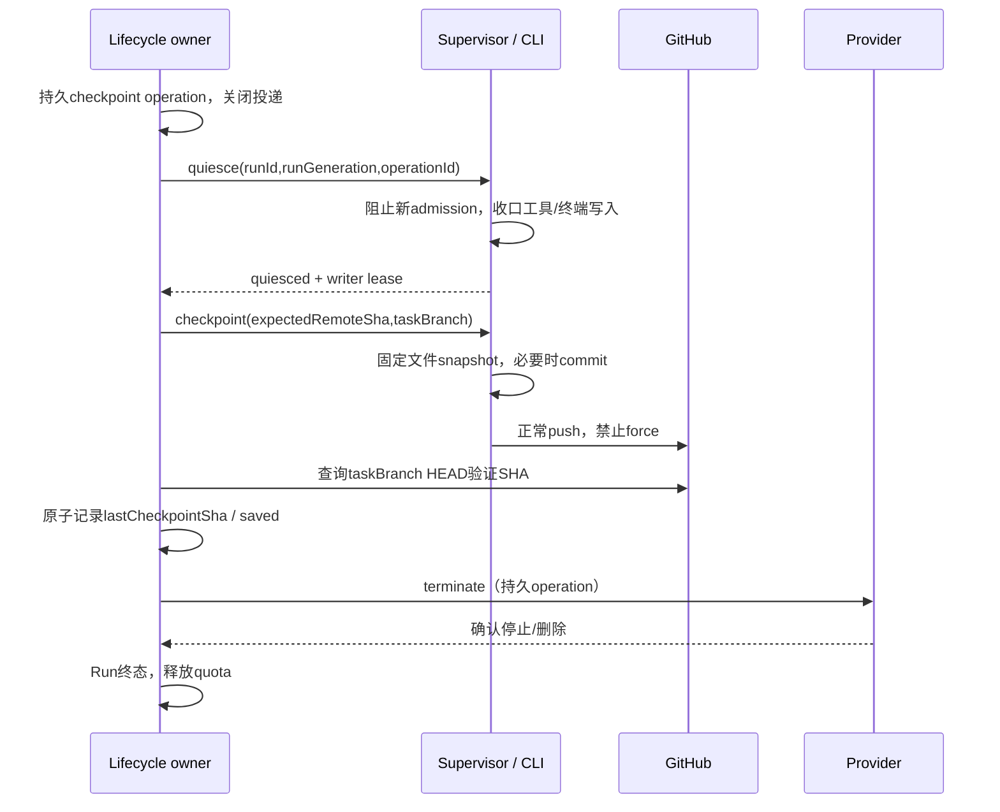

# Spec 01 — 沙箱供给、凭据与运行环境

状态：目标设计（2026-10-06 云端实现代码已整体回退，尚未实施）
父文档：[00-overview.md](./00-overview.md)
关联：[02](./02-bridge-protocol.md)、[03](./03-control-plane.md)、[08](./08-project-task-model.md)、[09](./09-github-integration.md)、[11](./11-project-task-creation.md)
实施阶段：M0 / M1 / M2 / M4；GitHub 触发与多租户属于 M7。

## 1. 基线与边界

原有云实现曾撤销；当前工作区又有未提交 cloud 骨架，需按11 §2逐项核验。旧的 `packages/sandbox-provisioner`、`packages/sandbox-bridge`、`packages/control-plane` 即使留有目录或生成文件，也不构成可复用源码，不据此恢复旧模块、依赖或测试。本文的 provider driver、credential broker、模板、bootstrap、沙箱端点均是新建目标。

cloud 编排代码计划位于 `packages/server/src/cloud/`，**叠加在云服务端 host 本体的服务图上**（`createLocalServices` + `/ws`，决议⑧，见 [12 §1.2](./12-account-domain.md)）。供给编排属于该模块；provider SDK 与 GitHub API 包在其 adapters 内依赖注入。产品不新增独立 provisioner HTTP 服务；云任务的执行目标只路由到沙箱，不接到部署机 host 本体的执行入口（路由边界见 [03 §2](./03-control-plane.md)）。

已核实可以参考的原有模块如下；“参考”不表示现有契约已满足云场景。

| 当前源码                                                                   | 可以参考的能力                                          | 仍需新建或验证的边界                                                                                                                                                               |
| -------------------------------------------------------------------------- | ------------------------------------------------------- | ---------------------------------------------------------------------------------------------------------------------------------------------------------------------------------- |
| `packages/server/src/http.ts`                                              | Hono HTTP / WS、静态文件、现有远程入口                  | 当前 `/ws/remote/:id` 是单客户端取出即删除，不是持久沙箱表；云鉴权、恢复与路由需新建                                                                                               |
| `packages/server/src/remote/posixShell.ts`                                 | POSIX 参数引用                                          | Git ref / repository / path 校验、固定 argv 执行与 bootstrap 安全闸需新建                                                                                                          |
| `packages/server/src/remote/connect.ts`                                    | SSH deploy / handshake、显式环境变量白名单              | 云采用出站 bridge；不假定现有 SSH connection 已提供云生命周期                                                                                                                      |
| `packages/services/src/credential/credentialService.ts`                    | 加密值、异步 IO、文件锁、原子写、损坏文件保护           | 账号/模型凭据直接复用该实现（host 本体，数据目录指向云持久卷）；需新建的只有云侧部署秘密（auth token、GitHub App 私钥、webhook secret）与其授权/撤销；任何路径都不复制整个凭据文件 |
| `packages/services/src/setting/settingsWriteQueue.ts`                      | 提交阶段不能被超时释放的写入顺序原则                    | Task / Run / Input / outbox 事务由 03 的控制面存储负责，不能用设置 JSON 写队列代替事务                                                                                             |
| `packages/shared/src/remote-workspace-identity.ts`                         | 统一 identity 构造 / 解析                               | 原基线只支持 SSH / WSL / Docker；现 cloud identity 骨架仍需链路验证，不从 identity 解析执行路径                                                                                    |
| `apps/zcode-cli/packages/bootstrap/src/zcode-protocol-v4/command-inbox.ts` | 幂等、串行 admission、busy 输入队列                     | 云 outbox 只投递，runtime 是否接受输入仍由 CLI 决定                                                                                                                                |
| `packages/shared/src/zcode-protocol-v4/command.ts`                         | `createSession.firstInput`、`sendText`、执行配置 schema | 云地址、runGeneration、bootstrap / lifecycle 新契约按 02 / 08 扩展并运行时校验                                                                                                     |

当前 OAuth adapters 是 BigModel / ZAI（`packages/services/src/oauth/providers/index.ts`），不是已接入 GitHub OAuth。首期 commit 作者使用明确配置的 GitHub App bot 身份；用户 GitHub 身份关联是后续新增能力。

## 2. 产品规则与唯一所有者

1. Agent、工具命令、仓库 checkout 只能运行在沙箱；cloud 编排层只做鉴权、持久编排、投递、投影和外部 API 操作，不把 host 本体的本机执行域作为任何云任务的 fallback。（2026-10-06 决议移除云 SSH attachment，原"或 SSH 对端"条款作废，见 00 §11⑥）
2. 控制面成功接受输入前，先事务持久化完整 prompt、附件引用、执行配置与 outbox。任务启动不依赖发起浏览器继续在线；浏览器只按需 attach。输入 API 以03为准，项目/草稿/首次启动流程以11为准。
3. 一个仓库 Task 最多一个有有效写权限的 Run。供给前获得 Task runGeneration 与 CAS 预约；不能先查 running 数量再无锁创建，也不能因网络断开直接建新 Run。
4. Task 逻辑身份为 `cloud-task:<taskId>`，跨 provider / Run 稳定。Run 保存 provider、sandboxId、workspacePath、bridgeSessionId 和期限；IO 使用路径，路由检查 taskId / runId / runGeneration。
5. `baseBranch`、`baseSha`、`taskBranch`、`lastCheckpointSha` 属于持久 Task；首次 checkout 从固定 baseSha 开始，重开从确认的任务分支 checkpoint 开始，不能误 clone 当前默认分支。
6. runStatus、执行状态、保存状态、Task 产品状态分别维护。provider 存活不是 CLI 执行，bridge 在线不是任务完成；状态全集以 08 为准。
7. lifecycle owner 唯一控制 provider 生命周期。页面离线不销毁沙箱；创建失败清理、明确停止、idle 归档、deadline 回收均为持久操作。
8. 首期为强制鉴权的可信单用户部署，所有资源标记唯一 principalId。App / provider key 与模型凭据不进入浏览器。多租户前须完成账号、installation、repo 绑定，不允许把单用户模式作为公共多用户服务开放。
9. 沙箱磁盘不是永久事实源。git checkpoint 只保证确认的代码产物；OOM、磁盘故障、网络分区、provider 强制终止仍可能丢失最近一次 checkpoint 后的改动，必须暴露 `dataAtRisk`。



## 3. 新模块分工与依赖

以下为目标职责/路径，已有部分未提交骨架，不得因此写成已验证 API。

| 目标                                                     | 职责                                                                                                                                                              |
| -------------------------------------------------------- | ----------------------------------------------------------------------------------------------------------------------------------------------------------------- |
| `packages/server/src/cloud/app/provisioning/`            | Run 预约后供给、create 操作恢复、readiness、补偿清理                                                                                                              |
| `packages/server/src/cloud/app/lifecycle/`               | 保活、idle / deadline drain、checkpoint / stop / reconcile                                                                                                        |
| `packages/server/src/cloud/adapters/sandbox/`            | E2B / Modal / Daytona SDK、provider 查询与错误归一                                                                                                                |
| `packages/server/src/cloud/adapters/github/`             | App JWT、installation / repo校验、token、branch / PR / webhook API                                                                                                |
| `packages/server/src/cloud/app/credentialAuthorization/` | principal / task / run授权策略、秘密白名单与grant元数据编排                                                                                                       |
| `packages/server/src/cloud/adapters/secret/`             | 云侧部署秘密（auth token、App 私钥、webhook secret）的加载与 git-grant 凭据 broker 传输/取回、过期与外部撤销 adapter；账号凭据不在此（归 host credentialService） |
| `packages/shared/src/cloud/`                             | HTTP / bridge / lifecycle严格schema、公共类型、错误码                                                                                                             |

cloud 编排只依赖接口；adapter 不反向改 Task 状态。UI 通过 hooks / 注入服务访问，provider SDK、Repo、云秘密不进入 `packages/ui`。M0 先更新架构策略与模块公开入口，再生成受控上下文。

## 4. Provider contract

### 4.1 内部接口草案

```ts
interface SandboxDriver {
  describeCapabilities(): Promise<{
    createOperationLookup: "native-key" | "metadata-search" | "none";
    canInspect: boolean;
    canExtendDeadline: boolean;
    canConfirmTermination: boolean;
    maxLifetimeSeconds?: number;
    deadlineSource: "provider" | "estimated";
    supportsOutboundWss: boolean;
  }>;
  create(input: {
    operationKey: string; // 持久operationId，重试不更换
    runId: string;
    runGeneration: number;
    imageRef: string; // 版本 / digest固定，禁止latest
    resources: { cpu: number; memoryMiB: number; diskGiB: number };
    requestedDeadline: number; // epoch 毫秒（实施决议：与 V4 Timestamp 对齐，替代 ISO 字符串）
    publicControlPlaneUrl: string;
    bootstrapTicket: string; // 短效单次、绑定run；无App/provider key
    labels: Record<string, string>; // 无prompt / 用户内容 / 凭据
    signal: AbortSignal;
  }): Promise<ProviderSandboxHandle>;
  findCreateResult(
    operationKey: string,
    options?: { operationAttemptedAtMs?: number },
  ): Promise<CreateReconciliation>; // 窗口内一律回 unknown 保守对账；只有明显晚于 attempt 时刻仍无命中才判 notFound
  inspect(handle: ProviderSandboxHandle): Promise<ProviderObservation>;
  extendDeadline(
    handle: ProviderSandboxHandle,
    requestedDeadlineMs: number,
  ): Promise<DeadlineResult>; // 不支持返回能力错误，不伪造成功
  terminate(handle: ProviderSandboxHandle): Promise<TerminationObservation>;
}
```

`ProviderSandboxHandle` 包含 provider、sandboxId、templateRevision、providerDeadline / deadlineEstimate，不含浏览器 attach 凭据。`ProviderObservation` 区分 running / stopped / notFound / unknown，记录 observedAt、证据来源与归一错误，并提供可选有界 `evidence`（≤160 字符，运营核对用，不得放凭据/prompt/私有代码）；network timeout、503、权限丢失不是 notFound。

所有 SDK 调用异步，有限重试并支持请求取消。取消本地等待不代表 provider 创建已取消；create 结果未知进入 reconcile。没有原生 idempotency / operation lookup 时，不能声称 exactly-once 创建：唯一 worker 用持久租约串行，未知结果不自动第二次 create，先按标签 / 清单查询或让运营确认；残留资源保持计费告警与清理记录。

### 4.2 Provider 差异

首期同时实现 E2B、Modal、Daytona 三家 adapter（2026-10-05 拍板，见 00 §9）。各家以真实账号实测后解禁：实测覆盖能力声明、期限语义、停止语义与启动开销；验证完成前 capability 门控不显示可选。共同接口不抹平期限、资源和停止语义。

| Provider | 适配与验证                                                                        | 不能假定的能力                                                                            |
| -------- | --------------------------------------------------------------------------------- | ----------------------------------------------------------------------------------------- |
| E2B      | 模板固定runtime/资源；create、inspect、kill、`setTimeout`映射；核实账号计划的上限 | 并非所有账号可跑4h；延长timeout不是无限生命周期                                           |
| Modal    | 固定image/资源；create、`fromId`、poll、terminate；期限估计单独标记               | create timeout不能直接等价E2B的运行中续期；不支持延期时首建到硬上限，由控制面idle提前回收 |
| Daytona  | snapshot / image、resources、labels、get / stop / delete、自动生命周期显式配置    | stop / pause / archive / delete不同；bridge流量不保证算provider活动；首期不依赖磁盘恢复   |

E2B 的 `setTimeout` 到期会自动 kill，最长时间按计划不同；SDK 与实际账号能力在实现时锁定并真实测试。[E2B Sandbox SDK](https://e2b.dev/docs/sdk-reference/js-sdk/v2.6.2/sandbox)

Modal 区分创建、运行、结束与 timeout；官方示例的 remaining lifetime 是应用估计，不能作为精确期限。[Modal Sandboxes](https://modal.com/docs/guide/sandboxes)、[Modal Sandbox SDK](https://modal.com/docs/sdk/js/latest/Sandbox)、[Modal期限估计示例](https://modal.com/docs/examples/sandbox_pool)

实施决议（2026-10-06，Modal 通道已接入；细节与实测见 §6.2 与本条）：Modal adapter 经**官方 Python SDK**（子进程桥）实现 create/exec/terminate/inspect/list——上表 Modal 行与「期限估计不能作精确期限」的结论不变（`deadlineSource=estimated`、`canExtendDeadline=false`）；Modal 与其他两家的差异行补充为：create 对账 `metadata-search`（tag 服务端过滤，但官方 `Sandbox.list` 固定 `include_finished=False`，只反映存活资源）、终止经 `terminate()`（SIGKILL，实测退出码 137）、镜像 Modal 端构建（有构建耗时与冷启动开销）、无磁盘规格参数。

Daytona 分别定义生命周期、自动停止与 wall-clock TTL，需核实实际部署 / SDK 版本。[Daytona Sandboxes](https://www.daytona.io/docs/en/sandboxes/)

### 4.3 期限与配额

- 持久化 hardDeadline、providerDeadline?、deadlineEstimate?、deadlineConfidence 和最近续期 Operation。UI 对估计倒计时明确标注，不把控制面时间当 provider 保证。
- 可用期取部署预算与 provider 能力较小值；Run 硬上限候选4h是待冻结的产品上限，provider更小时收敛并提示。不得无声换provider或自动新建Run。
- **修订（2026-10-08，账号设置覆盖部署基线）**：沙箱 provider 秘密与可用期上限支持「账号设置覆盖部署基线」——部署 env（`ZCODE_CLOUD_SANDBOX_MAX_LIFETIME_SECONDS`、`E2B_API_KEY` 等）是**基线与硬上界**；账号设置（设置页，归属账号域，见 [12 §2 修订](./12-account-domain.md)）可覆盖 E2B key 与超时预算：**生效超时 = min(设置值, env 核实上限)**，**生效 key = credential 存储值 ?? env 部署值**。E2B hobby 订阅核实上限为 1 小时（3600 秒）。覆盖只影响**新 create**：进行中 Run 的 recipe（§2 第 5 条）不变，续期仍按生效上限收敛（不放大旧 Run 的已确认期限）。动机（2026-10-08 真实事故）：部署 env 键名拼错（`ZCODE_CLOUD_MAX_LIFETIME_SECONDS` 少写 `SANDBOX`）被静默忽略 → 控制面按默认预算（>1h）请求 E2B create 被 hobby 上限拒绝 → run failed 且 UI 无感知；把预算与 key 搬进设置页后，用户无需重部署即可纠正这类漂移，且 capabilities 会如实透出 env 核实上限（`maxLifetimeSeconds`）与生效 key 是否已配置（`apiKeyConfigured` 布尔，不暴露值与来源细节）。
- 全局并发上限候选3，M0冻结。provisioning、ready、disconnected、draining，以及终止结果未知的资源都占槽；事务 reserve / release。provider确认资源释放后才释放计费槽，不能靠页面取消或删Task释放。
- 续期结果未知保持旧的已确认期限并重查。活动节流合并为一次续期，不逐stream chunk调API。
- 分开识别用户输入、runtime执行、工具执行、有限页面presence；heartbeat、轮询、SSE、日志和协议ACK不算用户活动。Agent常驻进程不等于任务运行。
- provider自动idle kill不能抢在checkpoint前。首期关闭其提前idle回收，或设在控制面保存预算之后；provider硬deadline保留为费用上界，不靠心跳无限续期。

## 5. 供给事务、补偿与重启恢复

### 5.1 接受与创建

接纳及幂等契约由03负责，完整客户端流程见11；本篇限定执行：

1. 新请求在鉴权/重复查询后核验principal/Task/Project/repo及启动配置。外部ref查询在事务外；03事务再次去重/CAS后固定baseSha、任务分支、recipe、首命令、Input/Run/配额/create操作。
2. create worker领取操作前检查当前代际和08的stopRequested。使用Run recipe中的provider、模板版本/image digest、资源及配置，不读取新部署默认值；clone origin限已核验GitHub/显式GHE HTTPS，禁止任意URL。
3. create成功立即持久handle/deadline，再等bridge。创建在途被停止时，迟到handle只能进入清理；回调不能发布ready或启动Agent。callback早于create响应按预登记run/generation核验。
4. bootstrap clone固定SHA、验证路径/版本、最小配置及runtime handshake后才ready。实际grant/checkout再按09核验当前权限，预检成功不代表权限永久有效。
5. 控制面投递固定firstInputCommandId的createSession(firstInput)，同commandId和query key持久映射。后续输入仍经过durable port；ready不是CLI admission。

本地校验/DB失败不建资源。provider已建而初始化失败持久补偿terminate；结果未知对账不盲重建。输入确定未投递时按03收口为rejected，资源清理未确认仍占额；create成功而写handle前崩溃为必测断点。

实施决议（2026-10-08，账号设置覆盖的解析时点）：create worker 调用 provider 前经 `SandboxRuntimeSettingsPort.readEffectiveSandboxConfig(provider)` 解析生效配置（超时与 key 的收敛公式见 §4.3 修订）。解析发生在 **create 时点**而非启动期固化——账号设置保存后对新 create 立即生效，无需重启部署；进行中 Run 沿用其 recipe 与已确认期限。部署 env 仍是启动期 fail-closed 的装配基线（缺 env 秘密的 provider 照旧拒绝启动，账号设置不解除装配校验）；host 设置/凭据读取失败时回落 env 基线并留 warn，不因设置存储故障阻断 create。

### 5.2 Readiness 与错误

- bootstrap soft timeout默认120s，总体预算默认5min，可配置。timeout仅表示未就绪，不证明资源不存在；查provider事实后补偿。
- bridge登录、clone、runtime handshake是不同阶段，错误不能全压成“连接失败”。
- 页面离线不取消已接受供给。显式取消写持久cancel Operation，阻止新投递并查明/清理资源。
- App失效、repo转移/删除、base ref消失、模板不匹配需可操作解释；秘密、provider原始响应与私有代码不入用户错误或生产日志。
- 确定未投递的准备失败保留原输入终态，用户显式以新commandId/Run关联原记录重试；同Run的传输对账仍复用原commandId。ACK/执行不确定先查CLI状态，禁止跨Run重放uncertain命令。重开由用户明确请求并告知最近确认checkpoint。

### 5.3 启动对账

重启恢复create/terminate/extend/checkpoint Operation、quota与runGeneration。查询provider事实、等合法bridge恢复再投递；内存表清空不是Run消失。旧ticket不能重新登记已撤销Run，合法重连使用02的run-scoped恢复认证。

未登记资源按operationKey/labels关联唯一记录或清理重复。迟到create响应、重复bridge、旧runGeneration的ready/saved/terminated事件不能覆盖activeRun。provider不可用时标记unknown并保留槽、有界对账及运营入口，不建替代沙箱。

## 6. 模板与 bootstrap

### 6.1 环境

模板预置git、CA、Node（当前 `mise.toml` 为24.14.0）、兼容CLI和supervisor/bridge；不带repo、用户设置、App key、模型凭据、MCP token、登录缓存。目标资源2vCPU/4GiB RAM/10GiB磁盘，按provider能力显式收敛；这是待基准测试的配置，不是已验证的OOM数据。

记录templateRevision、CLI build、protocolVersion、OS/arch和资源。先制模板并验证，再启用adapter；版本不兼容fail-closed。模板构建命令、SDK依赖在M2进入实际package.json后才写成可用命令。

### 6.2 步骤

1. supervisor用短效ticket注册控制面、领run配置；App/provider key永远不下发。
2. 创建 `/workspace/<repo>`，服务端解析展示名并防path traversal/symlink越界。仅workspacePath作cwd，identity不作cwd。
3. 受控helper单次领read token，以固定origin与argv clone；ref严格schema再经Git原生ref检查。ref、prompt不拼shell程序。
4. 首Run从固定baseSha建taskBranch；有checkpoint的重开fetch任务分支，核对lastCheckpointSha与远端HEAD关系。没有checkpoint且已证明任务分支从未发布的准备失败，可按08显式从冻结baseSha重启；分支发布未知、删除/回退/外部改写先对账或冲突，不静默重建覆盖工作。
5. depth=1为可选优化；支持按需fetch/deepen/unshallow，验证固定SHA、diff与ancestry对象完整。私有submodule、LFS、跨仓库依赖需单独授权，不扩大clone token。
6. supervisor启动沙箱内host/CLI、显式配置并握手ready。仓库setup/install hook只在沙箱执行，受工具权限、网络和预算限制。
7. 控制面outbox送Input到CLI；首条工作与createSession.firstInput绑定，后续sendText仍经过同一接纳/投递port。不使用浏览器autoSend，也不使用createSession成功后另发一次无幂等关联的prompt。

实施决议（2026-10-06）：provider 模板的 `start_cmd` 是**构建期启动、随快照恢复**的进程，运行时注入的 provider env（含 E2B `envVars`）不进其环境（实测）。因此自举要素（runId/runGeneration/ticket 等）由控制面在 create 成功后经 **provider 原生命令会话通道**下发——E2B 为 SDK `commands.run(background:true, envs)` 拉起镜像内 `start-supervisor.sh`（flock 单例幂等，控制面重试/重启重复调用无副作用）；模板 `start_cmd` 仅作空转占位以通过构建校验。supervisor 再按步骤 6 以常驻 stdio 持有 zcode-server，沙箱出站回连 bridge。**provider 命令通道只下发自举要素**（runId/runGeneration/ticket/operationKey/publicOrigin/taskId/workspacePath，均为非秘密），且在 `SandboxCreateInput` 里以**显式字段**传递（`bootstrapAddress`），不得借 provider labels/tags/metadata 运输（那是 provider 可见面），也不得承载凭据；运行配置、clone 事实与 provisioning envelope 走 **bridge 认证通道的 `bootstrap.config`（02 §4）**——provider env 与 provider 元数据对 provider API 可见，不得承载凭据。

实施决议（2026-10-06，provider 启动通路）：自举契约三家共用（`adapters/sandbox/sandboxSupervisorStart.ts`：`SupervisorStartInput`、自举 env 名映射、有界重试预算、`startSupervisorOrTerminate` 补偿分类），差异只在通道；**create 成功路径必须在返回 handle 前完成启动**，失败 → 补偿终止（`bootstrap_failed` 已确认清理 / `provider_termination_unknown` 未确认、保留占槽对账；§5.1、§9），不留静默孤儿。

- **Daytona**（已实现，`daytonaBootstrap.ts`）：官方通道是 toolbox API，基址取自 sandbox DTO 的 `toolboxProxyUrl`（官方 OpenAPI 原文：base URL 为 `{toolboxProxyUrl}/{sandboxId}/{endpoint}`，Daytona Cloud 默认 `https://proxy.app.daytona.io/toolbox/{sandboxId}`；鉴权与主 API 同 Bearer key）。步骤：`POST /env` 注入自举 env（官方 SDK `Sandbox.updateEnv` 语义：「processes spawned after the call (exec, sessions, PTYs) inherit them」）→ 幂等取得固定会话 `zcode-supervisor`（`GET /process/session/{id}` 404 才 `POST /process/session`）→ `POST /process/session/{id}/exec`（`runAsync: true`）后台拉起 `start-supervisor.sh`（官方文档：sessions「run long-lived processes in the background」）→ `GET .../command/{cmdId}` 做即时失败探测。`SessionExecuteRequest` 无 env 字段，故自举要素只经 `/env` 通道、不进命令字符串。边界（如实声明）：后台命令是沙箱内进程，随 stop/销毁失效，控制面重启不自动重拉（脚本 flock 幂等兜底）；沙箱重启后会话是否恢复未实测。
- **Modal**（未实现，gate 保持）：2026-10-06 重新核实仍无官方 HTTP/REST 沙箱 API（官方指南与 API Reference 只给 Python/JS/Go SDK；官方 npm 包 `modal@0.11.0` 依赖 nice-grpc/protobufjs），不得手写 gRPC 网关。`modalBootstrap.ts` 的 starter 确定性拒绝（`resource_unsupported`）；驱动 create 的成功路径已接入启动门禁（当前 create 通道本身也未接入，故该分支不可达），通道接入后失败即补偿终止。
- **Modal（2026-10-06 第二批实施决议，取代上一条的「未实现」状态；上一条的 API 调研结论仍然有效）**：官方控制面通道取 **Python SDK**（`modal`，本次联调核实 1.6.1；官方沙箱指南只给 Python/JS/Go SDK，无 REST），**不手写 gRPC**；控制面用**一次性受控子进程桥**调用它——`adapters/sandbox/modalSdkBridge.ts`（契约/错误归一/超时表）+ `modalBridgeProcess.ts`（spawn、stdin JSON、stdout 哨兵行 `##ZCODE-BRIDGE-RESPONSE##`）+ `modal/modal_bridge.py`（SDK 侧 op：`probe`/`create`/`exec`/`terminate`/`inspect`/`list`）。凭据只经子进程 env（最小 env，且 `MODAL_CONFIG_PATH` 固定为私有空配置）；bootstrap ticket 与 provisioning envelope 只经 stdin，不进 argv/日志/tags。create 步骤：本地校验（镜像来源/期限/tags，确定失败不发请求）→ `App.lookup(create_if_missing)` → `Image.from_dockerfile(dockerfile, context_dir=...)`（**Modal 端构建**，本机无需 docker）→ `Sandbox.create(image, app, timeout, workdir, tags, cpu, memory)`（不设 `idle_timeout`，§4.3）→ 经 **exec 通道** `sb.exec("/opt/zcode/start-supervisor.sh", env=自举env, stdout/stderr=DEVNULL)` 后台拉起，等 1s 后 `poll()` 做即时失败探测（非 0 退出按失败重试，预算 5 次退避同三家契约）→ `sb.detach()`。官方 docstring 原文：「Detaching doesn't terminate or otherwise affect the remote Sandbox; it only cleans up client-side resources.」；**实测（2026-10-06 真实账号）**：create 14.9s（含镜像构建，缓存后）、supervisor 第 1 次尝试拉起、`exec node -v` = v24.21.0、detach 与桥进程退出后后台 tick 计数 19→30（进程不随客户端退出而死）、`findCreateResult` 按 tags 命中、terminate 2.7s、inspect `stopped (exit 137)`。能力差异（§4.2 表格之外补充）：`createOperationLookup=metadata-search`（`tags.operationKey` + `Sandbox.list(tags)` 服务端过滤；官方固定 `include_finished=False`，故「无结果」只证明无存活资源，窗口外 `not-created` 语义是「可安全重试」）、`canInspect=true`、`canConfirmTermination=true`、`canExtendDeadline=false`（官方无运行中改 timeout 通道；首建到硬上限 + 控制面 idle 回收）、`deadlineSource=estimated`（无 provider 返回的期限时间戳，记 `deadlineEstimate`+`confidence=medium`）。模板约束：Dockerfile 的 CMD 必须常驻/阻塞（沙箱生命周期 = entrypoint + timeout，空转占位语义同其他两家）；`/opt/zcode/start-supervisor.sh` 需 0755。依赖与失败语义：解释器由 `ZCODE_CLOUD_MODAL_PYTHON` 指定（venv 部署必须显式；缺 `modal` 包 → 桥报 `resource_unsupported`/`dependency-missing` definite，create 明确失败，不静默降级）；镜像来源缺配置 → `validation_failed` 点名 `ZCODE_CLOUD_MODAL_TEMPLATE_DIR`/`modalImageDockerfile`，不猜镜像；未注入桥的 driver 保留**门禁降级**（`modalBootstrap.ts` 的确定性拒绝 + 补偿终止，证据注释保留）。细节与运维说明见 `adapters/sandbox/README.md`。

SSH 作为 Desktop 本机/远控连接继续走现有 backend/deploy，不经 SandboxDriver，也不属云执行路径（云侧 attachment 已移除，见 07 §11）。

## 7. 凭据与秘密边界

### 7.1 授权与存放

| 秘密                                      | 所有者                                                                                                                                                      | 沙箱权限                                     |
| ----------------------------------------- | ----------------------------------------------------------------------------------------------------------------------------------------------------------- | -------------------------------------------- |
| Provider API key、App私钥、webhook secret | 模型/provider 凭据与账号凭据归 host 本体 credentialService（envelope 只读快照）；GitHub App 私钥与 webhook secret 归 cloud 层部署秘密加载器；配置只保存引用 | 无                                           |
| GitHub installation token                 | 控制面worker / 临时broker内存                                                                                                                               | 按单repo、read/write分开的grant按需领取      |
| 模型API key / OAuth request auth          | principal选定的provider connection                                                                                                                          | 优先代理；直连仅注入本任务选定的最小秘密     |
| MCP / registry / 依赖凭据                 | 显式授权的task manifest                                                                                                                                     | 默认空；purpose/origin/工具/run白名单        |
| bootstrap/reconnect ticket                | 控制面认证owner                                                                                                                                             | run/runGeneration/期限绑定，不是一般用户权限 |

按白名单读 `ICredentialService`（就是 host 本体的既有实现，云服务端数据目录指向云持久卷），禁止复制 credentials.json、settings 全表、store 或 App 私钥。云侧部署秘密（auth token、App 私钥）与账号凭据分开管理，备份加密密钥与数据库分开存放。

模型manifest固定connectionId/account/allowed origin/purpose/run，由控制面解析；客户端不能用任意endpoint诱导秘密外送。沙箱不得获得所有provider配置/token；新Run重新授权，旧Run不能领新grant。

实施决议（2026-10-06，可信单用户）：首版沙箱 runtime 直接使用**控制面同源的 provider/model 配置与凭据**（单一配置源：改控制面一处，新 Run 自动生效），经 §6.2 的自举通道在 run 开始时安装、run 内持久、沙箱销毁即灭；与"每次任务在 UI 里重选一遍模型配置"相比更接近 SSH 模式的安装语义。部署模型为单用户（00 §11 决议⑤），因此代理升级是**条件性基线**——仅在部署模型变更为多用户/公开服务时成为前置条件，不构成当前实施范围；本段不改变上表其余行与 §7.2 的边界。

实施决议（2026-10-06，账号域，见 [12](./12-account-domain.md)）：上段"单一配置源"扩展为 **静态 `config.model` 与账号登录态二者之一**：存在账号登录态时，envelope 由 **host 本体的 `providerProvisioningSource`** 组装（[12 §6](./12-account-domain.md)，零新增装配）（同 `ProviderProvisioningEnvelope` schema：账号设置 + 凭据白名单，套餐 provider 保持 `zhipu-account` 类型，不得转 `api-key` 直灌），否则退回静态单 provider envelope；两者互斥、不合并。凭据仅在创建期下发本人 run 的沙箱，规则不变。

实施决议（2026-10-06 第二批，可信单用户）：v1 clone 走**控制面单次 grant 端点**——`/api/cloud/runs/:runId/git-grant`（只接受执行节点出站、run-scoped 认证）按 09 矩阵 mint contents:read（clone）/contents:write（checkpoint push）installation token，默认 TTL 60s、单次兑换、绑定 task/run/runGeneration/repo/purpose；沙箱内 helper 经 TLS 取回，token 只过内存/pipe，不写 argv、.git/config、磁盘与日志。Task 创建时冻结 `baseSha`（GitHub refs API 解析，事务外预查 + 事务内持久）；clone 以冻结 SHA checkout 并创建 taskBranch，分支发布未知/被改写按 §6.2 步骤 4 对账。写权限仍按 §7.2 的公开部署条件性基线处理（多用户前补 write proxy 白名单）。

### 7.2 Git grant

- 明确repositoryId与permissions mint单repo token。installation/repo校验失败不回落全installation、匿名clone或PAT。
- clone/fetch token为contents:read；checkpoint push为contents:write；PR/check/comments token留控制面，矩阵见09。
- broker端点统一 `/api/cloud/*`；run-scoped认证。grant短效单次（默认60s）、恒定时间比较、绑定task/run/runGeneration/repo/purpose；不把Bearer放query。
- 经TLS取回，token只在helper短暂内存/pipe；不写argv、.git/config、磁盘、日志、不进持久Agent环境。清空系统/全局/仓库helper防继承缓存。
- 同UID的不可信代码仍可能观察进程内存/pipe/env；不落盘不构成秘密隔离。此边界仅适合可信单用户v1，敏感部署优先代理。
- GitHub token原生1h有效；single-use grant不缩短兑换后token期限。操作结束/run撤销后尽力revoke，结果持久且可重试；broker删内存不等于GitHub已撤销。仅持久grantId/purpose/issuedAt/expiresAt等元数据，不持久raw token；控制面重启若已无法取回旧token执行revoke，必须等待其最晚到期或确认旧sandbox死亡，不能伪造撤销完成。[Installation token](https://docs.github.com/en/apps/creating-github-apps/authenticating-with-a-github-app/authenticating-as-a-github-app-installation)
- contents:write是repo权限，并不天然限制taskBranch。产品流程禁止直推base，但沙箱持write token技术上有更广写能力。公开/多租户上线前必须补Git write proxy的ref白名单，或实测有效的GitHub ruleset/授权策略；未完成不得上线。workflow额外权限见09。
- runGeneration只拒绝后续grant，无法立刻收回已发token。换Run前确认旧provider资源终止；若资源仍活，必须证明旧write token已撤销/过期且writer隔离。不确定则不发新write lease，不宣称CAS能拦旧sandbox直接push。

### 7.3 Commit 作者

首期服务端固定App bot作者/email，并标明发起人，不从prompt推导作者。Git author是元数据，不需要OAuth token。用户GitHub归属需后续新增可信身份关联与邮箱隐私规则，不声称已有GitHub OAuth。

Run recipe的模板/资源固定来自03接纳；provider能力变化或所需版本不可用返回明确失败，不在worker中替换模板或provider。仓库提交对象无法fetch时同样失败，不回落当前默认分支。

## 8. Checkpoint 与停止

状态及持久stop屏障以08为准；provider/supervisor执行有前置依赖的保存→终止流程，不能独立terminate worker绕过checkpoint。创建途中取消、迟到资源与不确定结果依08处理。



- supervisor负责quiesce和checkout独占写lease；bridge在线不代表写入收口。terminal、后台shell、子Agent、tool subprocess均在writer清单。无法quiesce不承诺一致snapshot，也不用固定等待秒数冒充同步。
- 文件范围为tracked及non-ignored untracked代码；排除产物、缓存、已声明秘密路径、越界symlink，拒绝未解merge/rebase。git不保存ignored文件、数据库、进程状态、未上传附件；UI说明边界。
- operationId幂等，无变更不建空WIP commit；有变更提交候选resultingSha，只有GitHub taskBranch HEAD查询确认才推进lastCheckpointSha。
- push结果未知按远端SHA对账，不重做commit、不force；non-fast-forward/外部push保留sandbox并提示冲突。撤权保留历史与dataAtRisk，不因项目失效删Run。
- idle保存失败可预算内继续并有界重试；硬deadline不可无限延长。提前留drain/checkpoint预算（初始5min，待实测），停止新输入；失败dataAtRisk，最终按provider真实终态报告。
- 周期保存仅在工具写安全点/turn边界，减少风险；默认目标5min，持续工具得不到安全点时标记风险，不声称已保存。
- stop失败/kill timeout/unknown保留quota和runGeneration、禁止新writer。意外死亡只能从已确认checkpoint恢复；uncertain runtime输入不自动重跑。

## 9. 错误与审计

| 类别                                              | 行为                                          |
| ------------------------------------------------- | --------------------------------------------- |
| unauthenticated/unauthorized/installation_revoked | 拒绝新供给和grant，已有资源受控处理，历史保留 |
| invalid_ref/unsupported_template/resource         | create前拒绝、不占quota                       |
| quota_exceeded/budget_exceeded                    | 事务拒绝预约，可操作提示                      |
| provider_create_unknown                           | 保留operation/quota，对账，不盲重试           |
| bootstrap_failed/protocol_incompatible            | 持久失败及补偿，脱敏阶段错误                  |
| bridge_disconnected/provider_unreachable          | 离线/未知，不冒充expired或开新writer          |
| checkpoint_failed/non_fast_forward/data_at_risk   | 不标saved，显示确认SHA和风险                  |
| provider_termination_unknown                      | 保留计费槽、cleanup operation和告警           |

审计只记principal/task/run/runGeneration/operation/provider、变更类型、归一错误与时间，不记prompt/token/私有代码。服务使用 `createServiceLogger(scope)`；高频协议数据仅debug，UI用统一logger。

## 10. 验证方案（全部待实现）

cloud测试路径/入口随M0/M1添加；当前 `packages/server` 没有cloud测试脚本，不能把下表当已覆盖。

| 场景          | 断点/操作                                      | 断言                                            |
| ------------- | ---------------------------------------------- | ----------------------------------------------- |
| 页面关闭      | Input接受后、create前关闭                      | 持久Input、只建一次、runtime自行启动            |
| 重复供给      | 双击/并发/响应丢失                             | 单runGeneration/quota，幂等返回                 |
| create未知    | 创建成功丢响应/存handle前崩溃                  | 关联原资源、不盲建第二个                        |
| callback早到  | bridge早于create响应                           | 匹配预登记Run，bootstrap前不ready               |
| bootstrap失败 | clone/模板/协议错误                            | 明确阶段、持久清理，无假ready                   |
| 重启          | creating/ready/extending/saving/terminating    | Operation恢复、runGeneration不回退、quota不早放 |
| 长断网        | 旧Agent/provider仍活                           | disconnected非expired，不双writer               |
| 换provider    | 显式reopen                                     | identity不变，path/provider改变，从确认SHA恢复  |
| 凭据          | scope回包、grant重放/过期/旧run、磁盘/日志检查 | 最小repo/permission、不扩大fallback、无持久秘密 |
| Git保存       | 无改动、push丢响应、外部写、撤权               | remote SHA确认、commit幂等、不force、风险准确   |
| 硬deadline    | 持续写、保存失败、provider更早超时             | drain、停新输入、真实终态，无绝不丢承诺         |
| provider差异  | 不支持延期/期限估计/stop未delete               | 能力错误、费用计数、清理正确                    |

M2用隔离测试repo/account完成真实create→出站bridge→私有clone→CLI ready→terminate，验证资源峰值、权限失败与秘密清理。M4完成重启/网络分区/kill/checkpoint故障注入和费用上界；不使用真实用户凭据，不提交环境数据。

## 11. 实施拆分

| 总阶段                   | 交付                                                     | 门槛                                                                         |
| ------------------------ | -------------------------------------------------------- | ---------------------------------------------------------------------------- |
| M0契约/基线              | 能力、schema、架构边界、秘密manifest                     | 无旧源码假设，对齐02/03/08/09                                                |
| M1安全/持久Task          | 鉴权、Run预约、Operation/outbox、quota、云侧部署秘密加载 | 未鉴权不可操作，重启恢复，云任务执行目标只路由沙箱（host 本体不作 fallback） |
| M2首provider/bridge      | 一个driver、模板、bootstrap、read grant、对账补偿        | 私有repo端到端、create未知恢复、资源清理                                     |
| M3持久输入/回放/Web      | ready后outbox投递及CLI admission关联                     | ACK丢失恢复确定，浏览器仅attach                                              |
| M4生命周期/checkpoint/PR | write grant、quiesce、remote SHA、idle/deadline/周期保存 | 风险准确、无双writer、PR与清理对账                                           |
| 后续provider             | Modal/Daytona adapter与能力门控                          | 每家完整contract和真实期限/费用测试后启用                                    |
| M7账号/公网上线/webhook  | 账号-installation-repo绑定、Git写隔离、细化配额          | 不可信用户授权/ref隔离通过才开放                                             |

每个实施PR先更新spec/场景，使用architecture-governance，运行 `pnpm typecheck`、`pnpm lint`、受影响测试和交互E2E。本文只规划，未修改运行代码，也未声称执行cloud验证。
