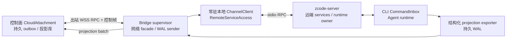
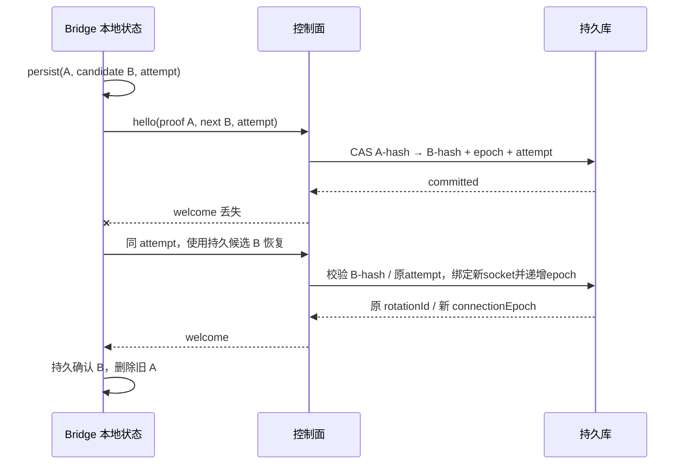
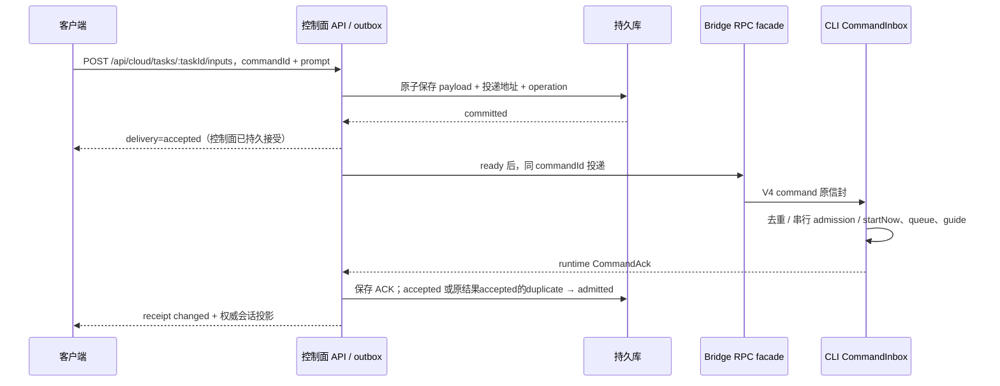

# Spec 02 — 云执行节点 Bridge 协议与可靠投递

状态：目标设计（2026-10-06 云端实现代码已整体回退，按本 spec 组重新实施）；基于原有代码重新制定。
父文档：[00-overview.md](./00-overview.md)
关联：[01-provisioning.md](./01-provisioning.md)、[03-control-plane.md](./03-control-plane.md)、[07-connection-architecture.md](./07-connection-architecture.md)、[08-project-task-model.md](./08-project-task-model.md)

项目/draft/首输入生命周期见 [11](./11-project-task-creation.md)，firstInputCommandId/stop屏障由08负责，start/append与request fingerprint由03负责。桥接只投递持久绑定的首命令；不能按时间/UUID重选，也不能把202作为CommandAck。新增generation/意图字段实施时同步严格schema，原Local/SSH协议语义保持。

## 0. 原 Web UI 的受控 RPC 承载（2026-10-06）

增加严格校验的 `rpc.open` / `rpc.request` / `rpc.response` / `rpc.close` 帧，携带 runId/runGeneration/connectionEpoch 与有界 base64 RPC 字节。复用已有 Channel RPC 的序列化、事件和取消；不另建文件/Git/终端业务协议。控制面只转发已鉴权浏览器 streamId 的有界字节，在每一帧上验证当前 ready attachment；浏览器使用原 ChannelClient，沙箱用现有常驻 stdio client 的受控公开 channel 组成 ChannelServer，不重启 runtime。外网断开清网络侧 client/server 和订阅，保留 stdio/runtime；旧代际帧拒绝。浏览器任务 facade 鉴权后绑定 Task 当前 Run，白名单不含 secret read、provider provisioning target 或 Main 原生操作（该白名单只约束沙箱 attachment 通道；账号域经 host `/ws` 提供，分面见 [03 §7.1](./03-control-plane.md)）。沙箱 attachment 的**服务通道名、命令名与帧事件名沿用既有 V4 协议**（浏览器用原 ChannelClient 与既有会话 channel，不另造业务协议）；云侧只冻结"允许经 attachment 暴露哪些 channel"的白名单常量，供 UI 与 SDK 共用，禁止各端自行硬编码。

## 1. 当前基线与目标

云实现已撤销。`packages/control-plane`、`packages/sandbox-bridge` 即使存在目录，其生成物也不是当前源码、可构建包或测试覆盖；本设计不依赖或恢复这些目录。

| 当前源码                                                                                  | 已有能力                                               | 云方案需要增加的部分                                |
| ----------------------------------------------------------------------------------------- | ------------------------------------------------------ | --------------------------------------------------- |
| `packages/server/src/entry-stdio.ts`、`stdio.ts`、`stdio-lifecycle.ts`                    | stdio 握手、服务 RPC、退出回收                         | 网络断连与 stdio 生命周期分离；云执行节点装配       |
| `packages/server/src/remote/connect.ts`、`handshake.ts`                                   | `SocketProtocol → ChannelClient → RemoteServiceAccess` | 出站 Bridge、跨网络重连、run 鉴权与 fencing         |
| `packages/rpc/src/persistent-protocol.ts`                                                 | 有界传输 ACK、短时未确认帧重传、拥塞信号               | 持久事件确认与完整恢复；它不是持久日志              |
| `packages/services/src/zcode-agent/zcodeAgentConnectionScope.ts`                          | 可信连接、订阅所有权、continuous/replayable 边界       | 云 Host facade、连接代际与客户端作用域              |
| `apps/zcode-cli/packages/bootstrap/src/zcode-protocol-v4/command-inbox.ts`                | commandId 去重、串行 admission、持久事实查询           | 云投递状态与既有 ACK/query 的映射；不复制 admission |
| `apps/zcode-cli/packages/bootstrap/src/zcode-protocol-v4/conversation-topic-publisher.ts` | runtime 权威投影、有界 delta 窗、base 恢复             | 结构化持久导出与 WAL；内存窗不是云历史存储          |
| `packages/shared/src/zcode-protocol-v4/`                                                  | V4 信封、ACK、topic、epoch、profile 与校验             | cloud route、Bridge 控制帧、持久投影契约            |

目标：浏览器关闭、控制面重启或网络短断时，已运行 Agent 继续工作，输入和可回放结果有明确恢复边界。Bridge 负责执行节点监督、RPC 转接、结构化记录投递与连接认证；任务执行、权限决定、busy/running 输入 admission 仍属于沙箱内 CLI/runtime。

控制面新增在 **`packages/server/src/cloud/`（计划新增）**。Bridge 源码计划位于 **`packages/server/src/cloud/execution/`（计划新增、独立受控子模块与构建入口，含 domain/app/adapters 和公开 contract）**，经受控接口使用已有 services/RPC 的公开入口。打包脚本在实现阶段加入当前 `packages/server/package.json`；没有现成云启动/测试命令。

## 2. 状态所有者与不变量

| 状态                                       | 唯一所有者            | Bridge/控制面的职责                                 |
| ------------------------------------------ | --------------------- | --------------------------------------------------- |
| Task、Run、activeRunId、runGeneration      | 控制面持久库          | Bridge 携带签发的路由上下文                         |
| prompt 与待投递 commandId/payload          | 控制面 command outbox | runtime ACK 前可靠投递，不决定 startNow/queue/guide |
| runtime 输入队列、轮次、权限、command 结果 | 执行节点 CLI/runtime  | 控制面保存投递结果和投影，不重新准入                |
| canonical 会话投影、logEpoch、topic seq    | 执行节点投影 owner    | exporter 输出已提交结构化记录；控制面存副本与回放   |
| 未 durable ingest 的投影记录               | 执行节点 WAL          | 按持久 cursor 重传，不靠内存承诺无损                |
| 已 ingest 的事件副本、快照                 | 控制面持久库          | 冷启动、慢客户端、Run 结束后的只读回放              |
| 草稿与 pending overlay                     | 客户端                | 按 commandId 关联 receipt 与权威投影                |

必须保持：

1. 仓库任务 `workspaceIdentity = cloud-task:<taskId>`，由服务端生成并固定，不含 provider、workspacePath、runId 或 connectionEpoch。`workspacePath` 用于 IO、cwd、Git 和显示；两者同时传递，禁止从身份猜执行路径。
2. （2026-10-06 决议移除）：原 SSH 云 attachment 条款作废，见 07 §11；`remote:ssh` 身份仅用于 Desktop 本机/远控，云 Task 只落在独占沙箱。
3. 每个新 Run 在 Task 内事务性递增 `runGeneration`；同 Run 每次 attachment 接管递增 `connectionEpoch`。旧 generation 不得修改新 Run；旧 epoch 不得继续投递或发布在线状态。
4. 网络断连只改变 connectivity，不把 Run 自动变为 expired/failed，也不授权另建 Run。终态必须有 provider 终止确认、受控停止结果或执行节点退出事实。
5. 新 Run 创建前须确认旧 Run 已终止；无法确认时保留 disconnected/待对账事实，并返回 `recovery-required` 错误与操作入口，阻止自动重开。RPC fencing 不能阻止旧 Agent 已持有的外部 Git/模型凭据继续产生副作用，不能替代 provider 隔离。
6. transport/runtime admission/durable ingest 是三类 ACK；outbox accepted 是另一个持久接收 receipt，不是 runtime ACK。这四种确认禁止互相冒充，也不证明任务完成或产物已保存。
7. 外网 WSS 断开不关闭本地 stdio RPC、不给 zcode-server 写 EOF。当前 `stdio-lifecycle.ts` 会在 stdin 结束时回收 services 并退出。

## 3. 执行节点进程与连接结构



Bridge 与 zcode-server 完成一次本地 stdio 握手并持有常驻 RPC client；每个外网 attachment 建立独立的连接作用域 RPC facade，通过服务代理访问本地 client。不能直接把网络字节透传到唯一 stdio 管道，再在网络关闭时销毁该管道。

进程监督区分：

- 外网 WSS 断：释放网络 facade，保留 server/CLI、local RPC、WAL。
- zcode-server/CLI 异常退出：真实退出诊断与 runtime recovery；不能宣称换网络连接即可恢复。
- Bridge 崩溃：v1 不承诺原 stdio 子进程可重新接管；provider 监督核验进程树后恢复或明确 run failed。需要独立重启 Bridge 时，先设计可重连本地 IPC 与 supervisor；不允许孤儿进程继续运行时盲目 spawn 第二套。
- 显式 stop：完成 spec 08 的 checkpoint、provider terminate、状态落库；关闭 WSS 不是停止。

## 4. 地址与网络帧

以下是**计划新增**协议，需在 `packages/shared` 公开入口提供类型及严格运行时校验。

```ts
interface CloudRunAddress {
  taskId: string;
  runId: string;
  runGeneration: number; // 正整数，Task 内单调
  workspaceIdentity: string; // 仓库任务为 cloud-task:<taskId>
  workspacePath: string; // 当前 Run 真实 checkout 路径
  remoteSessionId: string; // 当前 Run attachment 路由键
}
interface CloudAttachmentAddress extends CloudRunAddress {
  connectionEpoch: number; // Run 内单调，数据库 CAS 接管
}
```

客户端面为 `/ws/cloud/tasks/:taskId`；认证后由控制面解析 activeRun，不能以浏览器传的 runId、identity/path、generation 或 trusted clientMode 授权；expectedRunGeneration/epoch应与当前run比较，旧期待值拒绝，不能静默改为新run后执行。Bridge 专用端点为 `/ws/cloud/bridge/:runId`，只接受执行节点出站连接，不复用浏览器 cookie 或 `/ws/host` capability。

`packages/shared/src/remote-workspace-identity.ts` 当前只解析 SSH/WSL/Docker，不能称为已支持 cloud-task。实现阶段同步改造依赖 identity 还原 cwd 的调用点，云路径由显式 `workspacePath` 提供；保留原有本地 fallback 和 Desktop SSH。

| 控制帧                                | 方向            | 关键字段与含义                                                                                                                                                                                                                                           |
| ------------------------------------- | --------------- | -------------------------------------------------------------------------------------------------------------------------------------------------------------------------------------------------------------------------------------------------------- |
| `bridge.hello`                        | Bridge → 控制面 | 协议版本、Run 地址、helloAttemptId、当前凭据、预先持久候选 nextResumeToken、runtime incarnation                                                                                                                                                          |
| `bridge.welcome`                      | 控制面 → Bridge | connectionEpoch、rotationId、能力清单、持久 ingest cursors、策略版本                                                                                                                                                                                     |
| `bootstrap.config`                    | 控制面 → Bridge | welcome 之后、ready 之前下发：taskId、workspacePath、clone 事实（repositoryId/fullName/baseSha/taskBranch）、`provisioningEnvelopeJson`（有界、不入日志）、`credentialGeneration`（A-08 代际核对）、policy 版本；**不走 provider env/元数据**（01 §6.2） |
| `bridge.ready`                        | Bridge → 控制面 | configVersion、runtime incarnation、exporter/WAL 就绪、执行能力                                                                                                                                                                                          |
| `bridge.heartbeat`                    | Bridge → 控制面 | epoch、进程存活、活动摘要、WAL 水位；不是轮次/权限裁决                                                                                                                                                                                                   |
| `bridge.phase`                        | Bridge → 控制面 | bootstrap 阶段、错误码、脱敏诊断；无 token/prompt/秘密                                                                                                                                                                                                   |
| `projection.batch` / `projection.ack` | 双向            | 第 7 节的持久语义记录/提交后确认                                                                                                                                                                                                                         |
| `bridge.fault` / `bridge.drain`       | 双向            | 鉴权、协议、容量、撤销、受控回收与可重试性                                                                                                                                                                                                               |
| `checkpoint.request`                  | 控制面 → Bridge | operationId、purpose（stop/drain/manual）、run/generation/epoch；幂等键与 outbox operation 同键（01 §8）                                                                                                                                                 |
| `checkpoint.result`                   | Bridge → 控制面 | operationId、saved/失败原因、`branch`、`hadNewCommits`、`remoteSha`；additive 字段缺席不推断（08 §8.1）                                                                                                                                                  |

RPC 和控制帧需要版本化 discriminator；校验类型/尺寸后分别路由。二进制 RPC 帧不是事件日志，stderr 是限流脱敏诊断，不进入会话投影。`checkpoint.request/result` 只承载 [01 §8](./01-provisioning.md) 的保存/停止通路结果，不替代 outbox operation 事实：result 未确认时按 operationId 对账，不重做 commit、不伪造 saved。

## 5. 握手、token 旋转与 Ready 门控

### 5.1 初始认证与持久恢复

1. Provisioning 先事务性写 Task/Run、初始 token hash、到期时间、bootstrap operationId，再创建 provider 资源。明文 token 只走秘密注入通道，不进 URL query、ps 可见命令行、普通日志。
2. Bridge 发 hello **之前**，将当前 token、候选 nextResumeToken、helloAttemptId 写权限受限本地文件；异步 IO、原子替换。
3. 控制面事务校验 hash/时效、activeRunId/generation、Run 非终态，消费初始凭据、保存候选 resume hash、helloAttemptId、rotationId；新的网络 socket 绑定同时递增 connectionEpoch。
4. 提交后发 welcome。控制面只持久 hash，重启后从 DB 恢复认证/路由，不依赖内存 Map 或重新使用原 token。
5. 相同 attemptId 仅在 Run、候选 hash 等内容完全一致时复用 rotationId，不重复旋转凭据；相同 attemptId 不同内容拒绝。同 socket 重复 hello 返回原 epoch；新的 socket 接管总是递增 epoch，旧 socket 不能因 attempt 相同而保留写权。

### 5.2 旋转响应丢失的恢复算法

采用 **Bridge 先持久候选、控制面 CAS 切换 hash**，避免服务器已消费旧 token、welcome 丢失后客户端永远无法认证：



- 初始 token 与 resume token 用相同恢复原则；候选在发送前已写入 Bridge 本地。
- 恢复时先用候选 B 查询同 attempt。若首次事务未提交，B 校验失败，才用本地 A + 原 attempt/候选 B 重试；若首次已提交则 B 有效、A 已失效。两者均失败时 fail closed，不设置旧 token 通用有效重叠窗口。
- 新 attempt 使用当前 token 并提交新候选；并发 hello 只有一个 CAS 胜出。旧 token 不能创建不同 attempt/新 attachment。
- 重复 welcome 不授权两条网络路径；控制面将 credential rotation 幂等与 socket epoch 接管分开，接管新 socket 后撤销旧路径。
- Token 到期、Run 已终止、generation 过旧、候选状态丢失时 fail closed；不能用 sandboxId、repo/path 或未认证 heartbeat 重建路由。
- 覆盖 CAS 前后 crash、welcome 丢失、Bridge 本地确认前 crash，不用“旋转token”一句话替代恢复契约。

### 5.3 Ready 条件

welcome 只证明认证；ready 按顺序满足：

1. 本地 server 握手与 RPC 能力版本匹配。
2. 按 Run 授权清单安装 provider/model 配置及必要凭据，不复制整个 credential store。
3. 安装版本化 runtime preferences/policy snapshot；执行节点的服务端 responder 独立应答，页面不承担 Host 应答。
4. 结构化 exporter/WAL 可写，启动或恢复快照通过校验。
5. 命令事实、projection cursor 对账完成；旧网络 facade 已释放。
6. 控制面按 activeRunId/generation/epoch CAS 写 ready，再允许 outbox dispatcher 发 createSession/首个 prompt。

当前 `desktop-attached-remote` 将 runtime preferences 请求交外部 Host（`packages/services/src/node.ts`），其 15s timeout 不提供云授权。新增云执行节点装配/authority 见 07；不能靠页面 responder 或加长 timeout 处理。

## 6. 持久接受、投递与 runtime admission



### 6.1 唯一写入路径

- 接受输入前持久保存 commandId 与 prompt/payload；关浏览器后仍继续 provision/投递。禁止 URL prompt、页面 autoSend、localStorage 或“ready再点发送”承担事实投递。
- SessionPane 可复用已有 command API，但云 facade 必须转到**同一个 durable command gateway**，与 HTTP `/inputs` 共用幂等事务；不能 HTTP/RPC 各执行一份。
- Outbox 只记录 `accepted → delivering → admitted/rejected/uncertain/cancelled`，是未进入 runtime 前的投递，不计算 queue 位置、startNow/guide、轮次/权限。
- 多端不同命令以 CommandInbox 实际 admission 为序；receiptOrdinal 不能冒充 runtime admissionSeq。

### 6.2 保留既有 V4 语义

- 沿用 commandId/clientId/sessionId/type/payload/baseRevision/baseLogEpoch；retry 不换 commandId。
- 首输入优先复用已有 `createSession.firstInput`，一个稳定 commandId 绑定创建与首条工作；M2/M3 需验证其 ACK/query、持久 command facts 与恢复保证。控制面保存 receipt commandId 与 runtime query key/sessionId 的映射，不因重连重造会话。若能力缺口要求拆成 createSession + sendText，须先修订对应契约并验证两个持久投递步骤的部分成功恢复，不能偷偷增加第二条写入路径。
- 复用 `sendConversationCommandV4`、`queryConversationCommandsV4`，云 facade 注入可信 connection context；浏览器不能自报 trusted mode。
- duplicate 检查原结果，不能一律当 admitted；rejected/stale/noop/failed 保持错误与原因。
- 当前 `command.ts` 明确 accepted 不承诺跨 CLI 进程存活；admitted 只表示 runtime 曾准入，不表示任务完成或跨新 Run 自动执行。
- 同 commandId 不同 payload 返回 idempotency conflict；DB 唯一键至少含账号作用域、taskId、commandId，payload hash 检测内容变化，不记录秘密正文。

### 6.3 ACK 丢失与执行节点退出

RPC timeout/断连不是 runtime rejected。先置 receipt `uncertain`，重连 query 同 command key；查到结果则持久保存，unknown 且确认同 Run/runtime 可安全去重才重发原信封。

不把未确认命令自动移到新 Run；新 Run 只接受显式新输入。CLI 退出后先恢复持久 command facts/transcript 再 query；仍无证据则保留不确定状态、让用户决定，不承诺端到端 exactly once。

未开始投递的 outbox 输入可经事务 CAS 标 cancelled，dispatcher 不再取出；已经投递但 ACK 未知时，取消先对账，不能声称 runtime 已停止。已 admitted 的取消由新的幂等 runtime 命令处理，不删除 runtime 接受事实。

取消/权限响应携带 task/run/generation、runtime session/interaction key。断网时控制面不代替 runtime 完成取消/审批；过期 interaction、旧 Run cancel 返回 stale。停止沙箱是 lifecycle operation，不伪造 runtime cancel ACK。

## 7. 结构化投影、WAL 与 durable ingest

### 7.1 导出位置与格式

Exporter 接在**执行节点权威投影提交后的语义边界**，不能把 stdout chunk 当事件，不能存带旧 subscriptionId 的客户端 delivery frame 再广播。M2 做 spike，核实 conversation/sessions-index/workspace-config 的 canonical commit hook、序列作用域、快照屏障；稳定恢复是 M3 门槛。

Runtime 内的 hook/导出实现留在 CLI 自己的模块，跨进程只经 shared schema、service contract 与 RPC；server/services 不导入 CLI runtime 具体类。M2 可验证节点与导出能力，M3 的 durable gateway/持久回放完成前不能宣称生产输入闭环已就绪。

```ts
// 计划新增；payload 必须有对应严格 schema。
interface CloudProjectionRecord {
  schemaVersion: number;
  taskId: string;
  runId: string;
  runGeneration: number;
  runtimeIncarnation: string;
  topic: string;
  logEpoch: string; // 内容代际，不是 connectionEpoch
  sourceSeq: number; // topic/epoch 内单调持久 export cursor
  kind: "snapshot" | "delta" | "command-result" | "lifecycle";
  payload: unknown;
  contentHash: string;
}
```

网络 batch 另带 connectionEpoch；record 不含网络代际，可在新连接重投。去重键 `(runId,runtimeIncarnation,topic,logEpoch,sourceSeq)`；同键同内容幂等，同键不同内容报一致性 fault。

projection.ack 显式携带当前 attachment epoch、源 stream key、已连续持久化 sourceSeq、对应 ingestCursor；Bridge 仅以匹配源 stream 的 sourceSeq 清 WAL，不能拿控制面全局 ingestCursor 当本地数组下标。每个新源 stream 先提供可验证 snapshot，再接连续 delta；收到缺口返回 expectedSourceSeq，不跳跃确认。

sourceSeq 是执行节点 export cursor，控制面另外持久单调 ingest cursor，二者与 V4 fromSeq/toSeq 状态水位分别计量；若采用 V4 源序列，完整保存区间/snapshot 水位，不把 coalesced 区间压成假逐事件 seq。客户端 replay token 必须声明使用的 cursor 类型及 epoch，服务端提供两层 cursor 的一致映射；禁止仅 lastSeq。

### 7.2 写入与确认顺序

1. Runtime hook 给已提交不可变记录，exporter 异步写 WAL；写成功才推进 exported cursor。
2. Bridge 发有界 batch；控制面校验 Run/generation/current epoch、schema、序列连续性/hash。
3. DB 事务追加投影、更新快照/水位或持久待处理记录；**提交成功**才发 projection.ack。ACK 只覆盖连续持久水位，不跳缺口。
4. Bridge 持久 ACK cursor 后才清理 WAL；ACK 丢失重投，DB 幂等返原水位。
5. Fan-out 读已提交记录。通知失败不撤销持久事实、不要求 Agent 重做；客户端恢复读取。

若 runtime commit 与 WAL 不在同一事务，提供 `snapshot barrier → transcript/事实恢复 → 缺口对账`；保证限定为本地进程/磁盘完整时可重传，provider 强制回收前尚未 ingest 的输出可能丢失。无事务证据不能承诺任意崩溃下逐事件零丢失。

### 7.3 快照、历史与恢复

- 持久存 topic/epoch 一致快照及后续 delta；环形内存缓存不是历史存储。
- 客户端持有一致状态才携 `{logEpoch,seq}`；epoch匹配且保留窗覆盖则resume，否则持久snapshot。对齐现有 subscribeParamsSchema/ConversationTopicPublisher。
- Attach用一致屏障：注册实时水位H，发快照/历史至H，再接H后记录；不在读历史/开订阅之间漏帧。
- 慢客户端独立有界队列丢实时提示后收到gap/resync，从持久库补齐或snapshot；权限状态不能只丢而不恢复。
- 已ingest历史在Run结束后只读保留，按03保留/清理策略处理；沙箱消失不等于删服务端投影。
- 客户端展示路径只依赖控制面持久副本：会话内容在 runtime 生成时持续 ingest（与客户端在线与否无关）；任何端打开会话都从控制面读快照+增量恢复，不要求 Run 在线、不从沙盒拉取历史，沙箱已销毁亦然。与 SSH 模式（远端机器持久、可随时重读）机制不同，但用户可见语义一致。
- 冷快照不恢复活终端、进程、未完成工具、完整文件系统；历史回放、runtime恢复、新Run分开。

### 7.4 continuous/replayable

v1云会话面统一 `web-remote-replayable`，Desktop打开云任务也用此语义。节点到控制面的可信RPC是Host传输，不能据此把最终UI提升desktop-continuous。

原Desktop本地/SSH `desktop-continuous`保持实时语义；临时工具内容、遥测、专属订阅帧不进云replayable日志。未来支持云continuous时，按delivery profile在节点生成各自投影、声明capability/恢复边界，不用客户端mode或一份raw event混合广播。

实施决议（2026-10-06 第二批）：v1 canonical export 钩子采用既有 V4 conversation topic 面——执行节点 bridge 在 runtime 就绪后调用 `subscribeConversationV4`（服务在沙箱内进程边界，非浏览器路径）拿已提交话题记录，按 `(topic, logEpoch, seq)` 写 WAL 并转 `projection.batch`；控制面提交后回 `projection.ack` 清 WAL，缺口/重连按 §7.1 先 snapshot 再 delta。该钩子只读已提交投影，不改 runtime 内部；若实现中发现 topic 无法提供完整 canonical 记录，先按 §1 修订本文并说明证据，不堆降级分支（P06 门槛）。控制面历史读取沿用 §7.3：客户端只读控制面持久副本。

## 8. 背压与故障

PersistentProtocol默认未ACK缓冲8 MiB/45s，超限abandon；接收Regular也不是DB确认。仅服务logical transport存活时短断线续传；控制面重启、缓存越界、重握手走semantic recovery，不保证旧RPC请求/订阅仍有效。

| 故障                 | 控制面行为                                       | 执行节点行为                 | 客户端/恢复                       |
| -------------------- | ------------------------------------------------ | ---------------------------- | --------------------------------- |
| 网络断/heartbeat缺失 | Run=disconnected，保留Run/outbox；健康属性待对账 | Agent继续，WAL累积，退避重连 | 显示重新连接/暂不可达，读已存历史 |
| 控制面重启           | DB/run/hash恢复，不新建沙箱                      | 重认证接管，query命令，补WAL | 持久快照/cursor恢复               |
| welcome/旋转响应丢失 | 同attempt复用rotationId，新socket独立接管epoch   | 持久候选恢复                 | 无重复attachment                  |
| DB ingest失败        | 无durable ACK，告警/限流                         | 保留WAL，重试                | 未提交不能称已保存                |
| 长断线/WAL高水位     | archival-lag，停接超预算输入                     | 明确容量策略，不静默删WAL    | 保存滞后/错误                     |
| WAL满/不可写         | 归档失败事实，不承诺无损继续                     | 停新投递，有序暂停/终止策略  | 恢复可写后继续                    |
| provider确认终止     | Run终态，撤销凭据/attachment                     | 旧回连拒绝                   | 只读历史，允许显式新Run           |
| 旧generation/epoch   | 拒绝控制/在线写入                                | 停旧facade，不能改新Run      | 新状态不污染                      |
| runtime崩溃          | receipt=uncertain，等待事实恢复                  | 监督报告，恢复facts/投影     | 不自动重复工作                    |

实施时给出并验证单帧/批次字节、WAL容量、未确认窗、客户端缓冲、保留窗、退避/jitter的数值/config schema。心跳可取30s、退避上限60s；timer只触发探测/恢复，不证明死亡。容量耗尽禁止无限内存和静默丢记录。

## 9. 安全与授权

- 执行、projection、ready、lifecycle均核对持久Run/current attachment；路径不是归属校验。
- Bootstrap token只用于该Run，resume只恢复同Run，终止后撤销。DB仅hash，本地secret最小权限。
- Provider/model凭据按账号授权清单下发；云provider管理密钥、无关OAuth、SSH私钥不复制进沙箱。
- 凭据、prompt、附件正文不写日志；只记operationId、task/run、错误码、水位等脱敏信息。
- Browser不得调用IProviderProvisioningTargetService.apply；该服务只由云服务端内部装配调用（host 本体 + cloud 层，决议⑧）。
- Artifact版本/hash校验，失败不回退未经校验旧包；资产、出口、平台能力由01约束。

## 10. 分阶段实施与计划文件

以下全部待实现，精确文件可在架构受控上下文中调整，不能当已有能力引用。

| 阶段 | 计划位置                                                                                                | 交付/依赖                                           |
| ---- | ------------------------------------------------------------------------------------------------------- | --------------------------------------------------- |
| M0   | `packages/shared/src/cloud/bridge-protocol.ts`及公开导出（新增）                                        | 地址、控制帧、投影、错误/校验，与03/08统一          |
| M1   | `packages/server/src/cloud/`持久库/安全图（新增）                                                       | Task/Run、token hash、generation、outbox schema     |
| M2   | `cloud/execution/adapters/bridge.ts`、`localRpcOwner.ts`、`credentialState.ts`（新增）                  | stdio/network解耦、旋转、首provider、exporter spike |
| M3   | `cloud/app/attachments/`、`app/commands/`、`app/projections/`、execution WAL（新增）及CLI/services hook | ready、单输入路径、query、ingest/ACK、Web回放闭环   |
| M4   | 03/08 lifecycle与09 PR                                                                                  | checkpoint/stop/终态与持久结果闭环                  |
| M5   | 07云Host responder、allowlist、多端 Web 回归                                                            | 桌面+移动浏览器，不混淆原Desktop/mobile路径         |

Bridge entry/artifact构建在M2加入`packages/server/package.json`，不调用已撤销云包命令。原Desktop SSH保留，不恢复历史SandboxBackend、调试入站能力。

## 11. 验收与故障注入

| ID   | 场景                               | 必须断言/证据                                                                                     |
| ---- | ---------------------------------- | ------------------------------------------------------------------------------------------------- |
| B-01 | durable accepted后关浏览器         | 继续provision/投递，runtime一次准入，原commandId可query                                           |
| B-02 | 运行中断WSS超过2分钟               | server/CLI PID不变，Run非expired，WAL补齐，无新沙箱                                               |
| B-03 | hello CAS前后控制面crash           | DB/hash/epoch恢复，单attachment，无孤儿重建                                                       |
| B-04 | 丢welcome，重载候选credential状态  | 同attempt恢复rotationId，新socket递增epoch，旧token不能新连；Bridge进程crash另验证runtime恢复边界 |
| B-05 | 并发hello、旧socket发ready/command | 单epoch生效，旧路径拒绝，无重复准入                                                               |
| B-06 | runtime accepted后丢ACK            | uncertain→query/同key去重，不造新session/commandId                                                |
| B-07 | CLI accepted后退出，facts存在/缺失 | 有事实恢复，无证据不确定，不把admitted当完成                                                      |
| B-08 | DB提交后丢projection ACK           | 重投幂等，同key不同hash fault                                                                     |
| B-09 | runtime commit与WAL write之间crash | snapshot/transcript对账，保证边界可见，不跳cursor                                                 |
| B-10 | 慢客户端、高频输出、长断网         | 队列/WAL受限，gap可恢复，客户端不拖Bridge                                                         |
| B-11 | 同仓库同provider两Task，各重开     | identity隔离且跨Run稳定，旧Run不串台                                                              |
| B-12 | 失联但provider实例存活             | Run=disconnected，返回recovery-required而非expired/reopen                                         |
| B-13 | 已终止generation回连               | hash/fence拒绝，当前状态/命令不污染                                                               |
| B-14 | 无页面/多端，prefs/权限请求        | 服务端prefs应答，runtime裁决，重复/过期响应ACK/stale                                              |
| B-15 | 原SSH continuous与云replayable     | profile可信，临时内容不进回放，SSH回归                                                            |
| B-16 | WAL满、DB失败、token过期、版本错   | 错误/恢复明确，无无限缓冲、静默丢日志、鉴权回落                                                   |

实施前建立contract/integration/E2E入口，测试文件/命令以届时package.json为准。当前没有本spec云E2E覆盖。实施后执行现有`pnpm typecheck`、`pnpm lint`、架构检查及新增测试，真实报告失败与环境限制。
