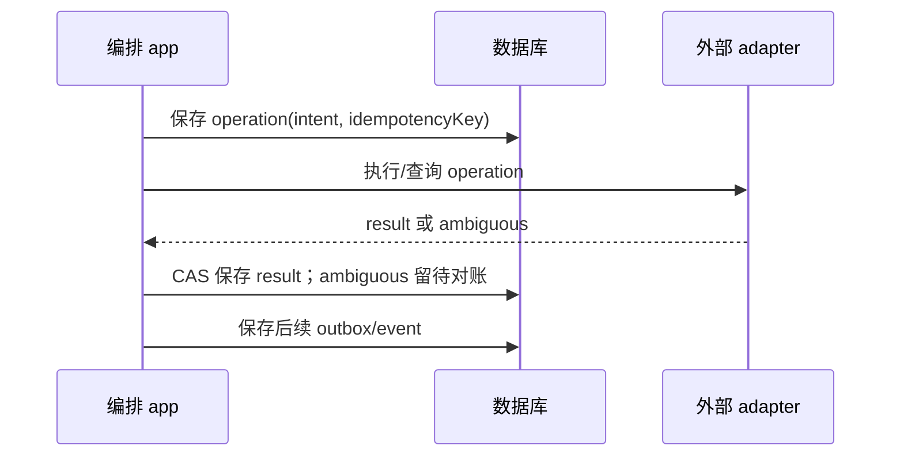

# Spec 03 — 控制面（= 云服务端内的 cloud 编排叠加层）、持久化与对外契约

状态：目标设计；端到端能力待实现（2026-10-06 云端实现代码已整体回退，工作区只有本 spec 组）。
父文档：[00-overview.md](./00-overview.md)。领域状态以 [08](./08-project-task-model.md) 为准；bridge 以 [02](./02-bridge-protocol.md) 为准；项目/草稿/首次启动流程见 [11](./11-project-task-creation.md)。

## 1. 目标与当前差距

控制面在没有任何客户端在线时也能创建执行载体、投递已接受输入、处理 runtime ACK、保存历史、保活、checkpoint 和回收。列表与历史不要求连上沙箱。

当前 `entry-http.ts` 使用 `createLocalServices()`，`http.ts` 的普通 `/ws` 暴露本地服务——这正是云服务端 host 本体的装配基准（决议⑧）；`/ws/remote/:id` 从内存 Map 取出后立即删除，只注册四个远端服务。云产品入口在此基础上叠加 cloud 模块（沙箱任务编排），并按 §2 边界保证云任务执行目标只路由到沙箱。

新增控制面承担 task/run 管理和远端编排。它不是现有桌面远控 relay：relay/Main 继续只转发 attachment，不新增任务数据库或输入队列。云 metadata、durable delivery 和历史 projection 是一个明确的新业务 owner，不能塞到 Main。

## 2. 模块结构与运行模式

以下是目标结构；已有部分未提交骨架按当前源码逐项核验，不将此目录示例当成完成状态：

```text
packages/server/src/cloud/
  module.ts / contract.ts / contract.example.ts / CONTRACT.md
  domain/       Task/Run 状态迁移、配额规则、幂等与保存策略
  app/          taskService、runOrchestrator、inputDelivery、lifecycle、projection、reconciler
  adapters/     HTTP/WS、SQLite worker、provider、GitHub、secret、资产发布
```

领域层不得 IO；app 通过有限的 ports 决定副作用；adapters 实现数据库、SDK、网络和子进程。接口按 task/run/projection/lifecycle/credential 能力拆分，单契约不演变为数十个方法的大 Service。

运行模式必须在服务端启动时明确：

| 模式                               | 服务图                                      | 可运行 Agent 的位置                         |
| ---------------------------------- | ------------------------------------------- | ------------------------------------------- |
| 既有本地/桌面开发                  | 当前 Local Host 服务图                      | 原有本地工作区或显式远端                    |
| 云服务端（host 本体 + cloud 叠加） | host 原生服务图（含账号域）+ cloud 任务编排 | 沙箱；云任务执行目标只路由到沙箱 attachment |
| 沙箱执行节点                       | 远端 runtime 服务图                         | 当前远端独占工作区                          |

云入口**就是一个标准 ZCode host 本体**（2026-10-06 决议⑧，见 [12](./12-account-domain.md)）：与 web 模式同一装配（`createLocalServices` + HTTP/WS，见 `entry-http.ts`），cloud 模块（`cloud/`）作为沙箱任务编排叠加在同一服务图上。登录/账号/凭据/模型目录/provisioning source 使用 host 原生能力，不另建账号子系统。

云侧必须保持的边界（取代原"云入口不得调用整套 createLocalServices"条款）：

- **云任务的执行目标只路由到沙箱 attachment**（owner/run/generation/epoch 校验）：控制面不把 host 本机执行域作为任何云任务/请求的隐式 fallback（请求不存在远端 owner 时返回结构化错误）。
- host 执行域面向本机开发用途的既有能力（如桌面/CLI 连接的本地 workspace 场景）不在云产品入口开放给浏览器：浏览器经 `/ws` 获得的服务面中，涉及本机 workspace 执行的调用路径必须按"无本机 workspace"拒绝，而不是指向部署机文件系统。

计划新增 `ZCODE_SERVER_MODE=local|cloud`；local 保持现有行为，cloud 要求显式认证、持久目录、公网 origin 和 provider 配置，否则启动失败。该变量及其他新配置在实现前加入公开配置契约与测试，不采用 scattered process.env 读取。

## 3. 鉴权与主体

首版可信单用户采用稳定的 `deploymentPrincipalId`，在安装配置/数据库中生成并持久化，认证凭据与该主体绑定。客户端不能通过 `accountId` 或 installationId 自行切换主体。

现有 `zcode_lite_token` 可作为受保护单用户启动设施的参考，不是多租户账号模型。浏览器 OAuth 登录成功也不自动证明其属于某个 GitHub installation；登录身份、GitHub 授权和模型账号分别核验。

每次 HTTP/WS、历史分页、附件、Git 凭据、provider 操作均检查：

1. principal 是否有效；
2. principal 是否有该 Project/Task 权限；
3. repository 数字 ID 与 installation 绑定是否仍有效；
4. run 是否为当前有效代际；
5. 该 capability/操作是否允许。

跨主体资源统一返回 404，不泄露存在性。WS upgrade 校验凭据和 Origin 白名单，不能把 taskId/runId 当密码；客户端不获得 trusted-host-relay 角色。变更 HTTP API 校验 CSRF；Bearer 与 cookie 两种客户端模式分别定义，默认浏览器 cookie、APK 以验证过的跨 origin 登录方案为准。

多账号上线前增加 principal/account membership、installation 绑定、任务/附件/历史查询隔离、按用户配额和审计。仓库列表必须基于用户授权的 installation，而不是 App JWT 能列出的所有 installations。

## 4. 持久数据与约束

选择单控制面进程、独立 SQLite WAL 数据库作为首版。主库放持久卷，不能放沙箱；数据库与附件目录启动时检测可写性/锁/空间。使用异步 repository 接口；同步 SQLite 仅在 worker。新数据库迁移不复用现有 tasks-index 的 schema 或 TaskIndexRepo 实例。

| 表/记录               | 核心内容                                                                                                                   | 必须约束                                                                     |
| --------------------- | -------------------------------------------------------------------------------------------------------------------------- | ---------------------------------------------------------------------------- |
| principals            | 部署/账号主体与禁用状态                                                                                                    | 唯一稳定主体 ID                                                              |
| projects              | owner、repo descriptor、展示名称                                                                                           | owner + repoId 去重                                                          |
| tasks                 | owner、project、creationKey、draftStartConfig、冻结分支、状态、activeRunId、completeRequested、revision                    | taskId 唯一；owner+creationKey 唯一；metadata revision CAS                   |
| runs                  | task、runGeneration、firstInputCommandId、executionRecipe、stopRequested/操作、provider handle、期限、状态、token 验证信息 | task+generation 唯一；每任务至多一个有效写入 run                             |
| task_inputs           | commandId、原始请求/guard、正文/附件、payload hash、acceptanceSeq、resolvedExecutionConfig、投递状态、目标 session/run     | owner+task+commandId 唯一；同 key 不同 payload 拒绝；task+acceptanceSeq 唯一 |
| external_operations   | 创建/销毁/续期/保存/PR 操作意图与结果                                                                                      | operationId 唯一；状态提交 CAS                                               |
| projection_events     | task/run/session/topic/epoch/sourceSeq、结构化 payload、ingest cursor                                                      | source 唯一键防重复；本地 ingest cursor 单调                                 |
| projection_snapshots  | 版本、logEpoch/revision、覆盖 cursor、历史索引                                                                             | snapshot 必须声明所覆盖事件范围                                              |
| checkpoints           | task/run/op、local SHA、确认 remote SHA、文件范围/风险                                                                     | published 必须有 remote SHA 证据                                             |
| task_artifacts        | kind=code/noChanges、branch/PR或持久summaryRef、hash/生成来源                                                              | 无差异输出保存摘要；不创建空PR                                               |
| account_installations | 主体与 installation/repo 权限投影                                                                                          | 公开服务前必需                                                               |
| webhook_inbox         | deliveryId、payload hash、授权结果、处理状态                                                                               | 后续 M7；deliveryId 唯一                                                     |

重要输入与状态提交采用能支撑进程崩溃恢复的事务；建议关键提交 `synchronous=FULL`，具体吞吐测量后调整并说明故障承诺。数据库成功后才返回 accepted；数据库失败、磁盘满或迁移未就绪时，不创建 provider 资源、不返回已接受。

附件正文进入受控存储，数据库保存内容地址/大小/类型/owner。先写临时对象、校验、原子发布，之后在输入事务中引用；未引用对象按保留期清扫。不得把浏览器临时路径作为 durable 附件引用。

持久模型补充：Task 保存唯一 draftStartConfig 与生命周期验收意图；Run 保存 firstInputCommandId、resolvedExecutionConfig/recipe、stopRequested 及停止操作关联；Input 保存 request fingerprint、acceptanceSeq、完整正文及实际目标。终止操作具有 checkpoint 前置条件，不能独立领取后无条件执行。字段/迁移依据08实施，现有表不视为已具备这些保证。

## 5. 外部操作不是数据库事务

provider create、push、GitHub PR 无法与 SQLite 做原子事务，必须用 durable operation 意图与对账：



网络超时不等于失败。创建已发生但结果未保存时，用 provider metadata 的 operationId/runId 查找；无可靠查询能力时必须暴露 `reconciling` 阻止盲目重复创建。PR push 成功但回包丢失时查询远端 SHA，PR 创建成功但回包丢失时按 head/base 对账，不能直接重复副作用。

配额预留、run 建立、input 保存和创建意图在同一事务中提交。预留覆盖 provisioning/ready/disconnected/draining，不能只数 running；最终释放以终止/失败核验为依据。

## 6. HTTP API（计划，统一前缀）

| API                                                      | 作用与幂等                                                                                                                                                          |
| -------------------------------------------------------- | ------------------------------------------------------------------------------------------------------------------------------------------------------------------- |
| `GET /api/cloud/capabilities`                            | 当前模式、provider capabilities、客户端能力和协议版本，不含 secret；含 `principalId`（客户端 scope 隔离键，已认证返回、非秘密，见 [12 §5](./12-account-domain.md)） |
| `GET /api/cloud/repositories`                            | 当前主体可用的仓库，分页与授权缓存                                                                                                                                  |
| `GET /api/cloud/repositories/:repoId/branches`           | 分支与 SHA，repo 授权后查询                                                                                                                                         |
| `GET/POST /api/cloud/projects`                           | 分页/创建项目；creation key 或唯一约束去重                                                                                                                          |
| `PATCH /api/cloud/projects/:projectId`                   | 展示元数据，不接受任意 credential/path 改写                                                                                                                         |
| `DELETE /api/cloud/projects/:projectId`                  | 默认有活动任务时409；明确归档，不静默销毁                                                                                                                           |
| `GET /api/cloud/projects/:projectId/tasks`               | 服务端任务列表；不查询沙箱                                                                                                                                          |
| `POST /api/cloud/tasks`                                  | 建 draft，允许正文仍未提交；creation key 去重                                                                                                                       |
| `GET/PATCH /api/cloud/tasks/:taskId`                     | Task/Run/执行/保存/产物及 action capabilities；标题和 draftStartConfig 带 revision，启动配置只在 draft 可改                                                         |
| `POST /api/cloud/tasks/:taskId/inputs`                   | 明确 start/append 意图；去重先于新请求 CAS；首发原子固定 recipe 并预约 Run                                                                                          |
| `GET /api/cloud/tasks/:taskId/inputs`                    | 当前主体可查询的输入/回执分页，已提交正文通过受控投影恢复                                                                                                           |
| `GET /api/cloud/tasks/:taskId/inputs/:commandId`         | 查询接收、投递与runtime ACK，解决响应丢失                                                                                                                           |
| `POST /api/cloud/tasks/:taskId/inputs/:commandId/cancel` | 幂等撤销operation；已admitted使用独立cancelCommandId转runtime取消命令                                                                                               |
| `POST /api/cloud/tasks/:taskId/reopen`                   | 旧run终止证据充分时创建新generation，不重放旧未知输入                                                                                                               |
| `POST /api/cloud/tasks/:taskId/stop`                     | 原子持久 stopRequested/操作，先阻断启动/投递，再按08保存及核验终止                                                                                                  |
| `POST /api/cloud/tasks/:taskId/force-stop`               | 显式loss acknowledgement、revision和operationId；不能由普通stop失败自动触发                                                                                         |
| `POST /api/cloud/tasks/:taskId/extend`                   | 请求续期；返回provider确认期限或明确标记的保守估计；不支持则能力错误                                                                                                |
| `POST /api/cloud/tasks/:taskId/complete`                 | 显式验收；先检查保存/产物状态，必要时drain                                                                                                                          |
| `POST /api/cloud/tasks/:taskId/archive`                  | 无活动写入run时归档；历史仍可读                                                                                                                                     |
| `POST /api/cloud/tasks/:taskId/reactivate`               | completed且PR未merged时显式转active，不自动建run；merged工作新建follow-up Task                                                                                      |
| `POST /api/cloud/tasks/:taskId/restore`                  | 从archived恢复archivedFromStatus，仍需显式reopen获得新run                                                                                                           |
| `GET /api/cloud/tasks/:taskId/history`                   | 控制面历史分页；支持旧session，不要求沙箱存活                                                                                                                       |
| `GET /api/cloud/tasks/:taskId/events`                    | 按cursor结构化恢复；带retention floor                                                                                                                               |
| `GET /api/cloud/tasks/:taskId/snapshot`                  | 匹配epoch/cursor的权威投影snapshot                                                                                                                                  |
| `GET /api/cloud/events`                                  | SSE元数据变化；断线后全量拉列表对账                                                                                                                                 |
| `POST /api/cloud/attachments`                            | 受限上传并生成 owner 级持久引用（`multipart/form-data`，字段名固定：单文件 `file` + 可选 `taskId`；未支持 task-owned 上传的部署返回 `not_configured`）              |
| `POST /api/cloud/github/webhook`                         | M7验签/schema后持久delivery inbox；worker完成sender授权后业务接纳                                                                                                   |

首发可以拆分上线这些 API，但不能将未实现接口写成现有功能。旧 `/api/connect-remote` 与 `/ws/remote/:id` 继续服务旧本地模式；不添加一个既可路由cloud也可回落本机的模糊入口。

端点分阶段语义（实施决议）：`repositories` 在 GitHub installation 投影装配前返回 `not_configured`（503）——部署配置缺失不等于用户未授权；`events` 在 M3 durable 事件源落地前返回 `not_implemented`（501）——两者均不得伪装成空列表或成功。任务详情响应为 `{task, activeRun?, execution?, latestCheckpoint?}`，输入列表与历史为 `{items, nextCursor?}` cursor 分页信封（shared `cloud/responses.ts` 冻结的唯一形状）。

输入请求概念契约（新增目标，现 schema/SDK 必须同步改造）：

```ts
interface TaskInputBody {
  commandId: string;
  prompt: string;
  attachmentIds?: string[]; // 仅声明支持 task-owned 上传的部署开放
  requestedConfig?: CloudExecutionConfig;
}
type SubmitTaskInput =
  | (TaskInputBody & {
      intent: "start";
      expectedTaskRevision: number;
      start: { provider: string; baseBranch: string; templateRef?: string };
      expectedRunGeneration?: never;
    })
  | (TaskInputBody & {
      intent: "append";
      expectedRunGeneration: number;
      start?: never;
      expectedTaskRevision?: never;
    });
interface InputReceipt {
  taskId: string;
  commandId: string;
  deliveryStatus: "accepted" | "delivering" | "admitted" | "rejected" | "uncertain" | "cancelled";
  runId?: string;
  runGeneration?: number;
  runtimeAck?: unknown; // 实施时使用既有严格 CommandAck schema
}
```

实际 wire 为 discriminated union 严格 Zod schema，限制长度、未知字段和附件总量；caller 不指定主体、workspacePath、provider secret、trusted role。start 仅 draft，携带当前已保存 draftStartConfig 的完整选择和 revision，事务验证两者一致；active 上的新 start 冲突，不忽略选择并降为 append。append 要求当前 ready Run、generation 匹配且无 stopRequested。provisioning/disconnected 首版只保留客户端下一条草稿，不接受新的 append。reopen 为独立显式命令，携带新 commandId/工作要求、Task revision 和恢复选择，按08原子预约新 Run并持久新输入；不自动迁移旧输入。

PATCH Task 只接受标题与 draftStartConfig 及 expectedRevision，启动配置只在 draft 可改；不能任意 PATCH status/activeRunId/baseSha。Project 创建由当前主体选择 repositoryId，服务端按09取得权威 installation/owner/name/defaultBranch；显示名是可编辑元数据，不接受请求字段自证授权。

### 6.1 请求 fingerprint 与执行 recipe

原请求 `payloadHash` 是规范结构化编码后计算的 fingerprint，包含 intent、完整正文、附件/顺序语义、requestedConfig、start、expectedTaskRevision 或 expectedRunGeneration 等语义字段。不得只比较 prompt，或将可变字段拼成含歧义的分隔符字符串。省略默认值仍按原始请求计算；解析出的默认值/SHA 不混入原请求 hash。

Run 的 `executionRecipe` 固定启动时的 provider、templateRef 与版本/image digest、resources、首命令 model/mode/planEnabled、基础/恢复 SHA，以及非秘密授权引用。Input 的 `resolvedExecutionConfig` 固定该命令的模型/模式配置；后续 append 可按能力选择命令配置，但不能改写 Run 的启动 recipe。secret 只经 broker，不能落 payload。新请求首次接纳时解析默认值并固定，执行 worker 只消费相应持久快照；合法重放不重新解析默认值、SHA 或模板。

主体认证/资源归属后先查同 commandId：同 fingerprint 返回原 receipt（可反映最新投递状态），不同 fingerprint 409。仅新请求进入外部预检；事务内再次去重，然后检查 revision、Task/Run/stop 条件与配额，写 Input、Run recipe、firstInputCommandId、acceptanceSeq、配额和 create outbox。一旦已接受，任务 revision 增长不能拒绝原请求重放。

### 6.2 投递、失败与响应

`acceptanceSeq` 在 Task 内事务性递增，用于控制面 durable delivery 顺序；不是 CLI admissionSeq，也不是第二个 runtime 队列。首次 Run 的 firstInputCommandId 按08固定，不能按 acceptedAt/UUID 选取。返回/查询同一输入应给出一致 runId/generation 关联。

确定未投递而环境准备失败的 input 收口为 rejected，带 environment-preparation-failed 和可读原因；已发但未确认为 uncertain，继续同 Run 对账。首命令被取消/拒绝不得静默提拔下一条；按08阻断启动并清理。资源清理未确认时 Run/配额仍保留，不因 input 终态释放。

202 代表持久接收，不是 runtime 执行。commandId 与 HTTP 幂等键统一；新请求的配置/目标冲突是结构化错误，返回 `{code,message,retryable,traceId,details?}`，不透传 token/provider 原响应。新 not-ready、启动意图冲突、持久草稿失败等错误语义实施时同步 shared schema/SDK，不依赖错误文案解析。客户端 submit-attempt 的跨刷新对账归04。

## 7. RPC/WS 适配与单一输入通路

### 7.1 两个服务通道的分面（决议⑧）

云服务端对外有两个语义不同的通道，权限边界不能互相借用：

| 通道                                     | 面向                        | 服务面与边界                                                                                                                                                                             |
| ---------------------------------------- | --------------------------- | ---------------------------------------------------------------------------------------------------------------------------------------------------------------------------------------- |
| host `/ws`（同源、lite-token `?token=`） | 浏览器 ← 云服务端 host 本体 | 账号域（oauth/credential/usage/setting/provider-settings/model-selection/coding-plan-subscription/onboarding-record/broadcast）与 web 模式同款 host 服务；登录、套餐、模型目录的唯一入口 |
| `/ws/cloud/tasks/:taskId`                | 浏览器 ← 沙箱 attachment    | 按 capability 白名单的执行域代理；无 secret read、无 provider provisioning target、无 Main 原生操作、无本机 fallback                                                                     |

host 通道不承载云任务的执行目标（§2 边界），沙箱通道不承载账号域；两通道各自校验主体与代际，不能因为浏览器在 host 通道已认证就放宽沙箱通道的白名单。

客户端连接 `/ws/cloud/tasks/:taskId`；服务端认证并查有效run，再建立connection scope。run尚未ready时可以返回metadata/projection订阅，文件/终端操作返回not-ready，不能占一个HTTP请求无限等待。

复用现有 `sendConversationCommandV4` 时，cloud facade 必须调用同一个 durable input application port。HTTP创建首输入与RPC发送后续输入不是两套执行路径。CommandAck保留runtime语义；控制面receipt通过新增cloud服务或状态事件表达，禁止伪造CommandAck accepted冒充runtime admission。

`queryConversationCommandsV4` 与cloud receipt一起用于对账。命令发送超时先查询commandId；不能生成新ID重试。权限应答/取消命令绑定interactionId/sessionId/logEpoch/currentRun，过时返回stale；相同审批两端同时提交由runtime唯一裁决。

沙箱 attachment 通道按capability白名单暴露，不把整个远端 ServiceCollection 或credential read/save透出（host 通道的账号域语义见 §7.1）。客户端只能访问当前task的workspace；路径canonicalize与越界检查在远端执行owner，控制面不拿部署机路径来检查远端文件。

取消input与投递并发时，持久CAS标记撤销意图；已经发出但结果不明不能报cancelled，应查询runtime并在必要时用独立cancelCommandId发取消。取消receipt不承诺回滚已发生工具副作用；stop/force-stop也不伪造runtime ACK。

SSE仅承载task.changed/run.changed等metadata投影，含entity revision，不能承担对话数据可靠投递。对话通过持久history/snapshot+delta恢复，不能把SSE心跳当业务保活。

## 8. 重启与故障恢复

启动顺序：配置/schema验证 → 数据目录与 host 本体启动（`setDataBaseDir(cloudDataDir)`、materialize builtin、`createLocalServices`，决议⑧）→ 云侧部署秘密加载（auth token/App 私钥）→ cloud DB migration →恢复操作/租期核验 →监听认证入口（cloud 路由与 host `/ws` 同源）。migration失败时不开始provider操作。

恢复器读取所有非终态run：

- provider确认存活：等待/验证bridge恢复；不创建重复沙箱。
- provider确认终止：写终态、释放配额，记录保存结果/风险。
- provider不可查询：保留disconnected/reconciling信息，禁止新的写run。
- durable input有receipt无ACK：同run查询runtime commandId，确认为unknown才重投同ID。
- 已admitted但runtime已丢：标uncertain/lost-execution，需要用户显式新输入；不跨run自动重放副作用。
- lease续期结果不明：能查询则核验provider expiresAt；只能估计时保留deadlineEstimate/deadlineConfidence，以保守截止drain，不能将估计提升为confirmed。
- token rotation响应丢失：遵循02的Bridge候选token预持久化、DB hash CAS和同attempt恢复；每次新socket绑定仍递增connectionEpoch，防合法bridge锁死与旧socket复活。

控制面进程重启不保证数据库卷灾难丢失后的零损失。备份必须同时覆盖DB schema、projection、附件与secret恢复配置；恢复备份后先撤销/核验旧写权，再开放新run。

## 9. 背压、留存与观测

runtime结构化投影持久ingest后才ACK。慢客户端不阻塞上行；有限发送缓冲超限时关闭该attachment或通知resync，不能随意丢掉某些delta后继续假装连续。

建议默认history/input保留30天（待产品冻结），任务元数据和checkpoint SHA保留到显式删除；仅轮次文本的重复中间stream可合并。不能在活跃任务的subscriber cursor仍依赖时清除唯一恢复数据；retention越界返回resync-required与可用snapshot，不静默从零猜测。

日志使用 `createServiceLogger(scope)`。trace关联taskId/runId/operationId/commandId/connectionEpoch；不记录prompt正文、header、token或完整工具输出。应可观察创建耗时、投递延迟、ACK延迟、未确认事件字节、断线时长、保存失败、续期失败、活动/孤儿run和成本估算（估算不冒充provider账单）。

## 10. 代表验收（均为计划）

| ID    | 设置与动作                                       | 断言/证据                                                       |
| ----- | ------------------------------------------------ | --------------------------------------------------------------- |
| CP-01 | cloud启动后绕过UI调用本机Agent/terminal/file RPC | 访问被拒绝；部署机无Agent进程；local模式回归正常                |
| CP-02 | 输入事务提交前磁盘满/DB worker错误               | 无accepted receipt、无provider创建                              |
| CP-03 | DB提交成功后HTTP回包丢失，同commandId重试        | 一个input、一个run意图、同receipt                               |
| CP-04 | provider创建成功后控制面崩溃                     | 查operation标签恢复同实例，无第二沙箱                           |
| CP-05 | accepted后关闭唯一浏览器                         | 无客户端也会ready并runtime admission                            |
| CP-06 | runtime已admitted但ACK回包丢失                   | 查询原commandId，副作用不重复                                   |
| CP-07 | 控制面重启、旧token旋转响应丢失                  | 合法bridge能恢复；旧代际不能复活                                |
| CP-08 | 跨主体查询task/history/附件/WS                   | 均404/拒绝，不泄漏内容或secret                                  |
| CP-09 | slow attachment超缓存/游标过retention            | snapshot重同步；上行不丢；不伪造连续delta                       |
| CP-10 | run失联但provider仍alive，用户reopen             | 拒绝双写，显示核验状态                                          |
| CP-11 | 尚未ready时文件/终端操作                         | 明确not-ready，无本机fallback                                   |
| CP-12 | project/Task删除时仍有活动run                    | 默认409，显式stop流程完成后再归档                               |
| CP-13 | accepted后更改默认model/mode，另浏览器打开       | 原requestedConfig保持，secret不落payload                        |
| CP-14 | cancel与RPC投递/ACK并发                          | 不误报cancelled，query对账，独立cancelCommandId无副作用回滚承诺 |

M1完成安全装配/持久metadata，M2连接，M3durable input与projection，M4生命周期，M7账号与触发。实施拆分见10；本次未创建测试或运行云服务。
