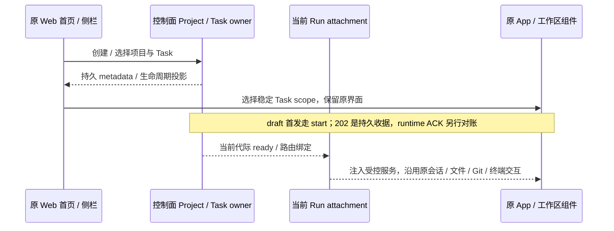
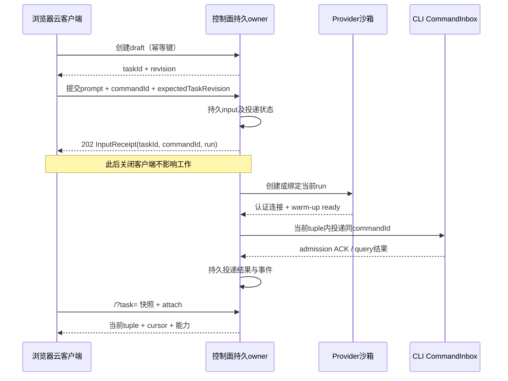

# Spec 04 — Web 云客户端与 Desktop 模式边界

状态：目标设计（2026-10-06 云端实现代码已整体回退）；端到端云功能待实现，按本 spec 组重新实施。
父文档：[00-overview.md](./00-overview.md)。
关联：[03-control-plane.md](./03-control-plane.md)、[07-connection-architecture.md](./07-connection-architecture.md)、[08-project-task-model.md](./08-project-task-model.md)、[09-github-integration.md](./09-github-integration.md)、[11-project-task-creation.md](./11-project-task-creation.md)。

## 1. 当前基线与范围

此前的云实现已撤销。本方案以当前检出的原有源码为起点，不恢复旧模块，不把遗留 `dist` 目录视作实现。

| 当前文件                                                                       | 已有行为                                                                                                                                  | 本方案需要新增的能力                                                                                                                |
| ------------------------------------------------------------------------------ | ----------------------------------------------------------------------------------------------------------------------------------------- | ----------------------------------------------------------------------------------------------------------------------------------- |
| `packages/web/src/main.tsx`                                                    | 无 `remote` 参数时连接 `/ws`，读取 `/api/server-info` 首个工作区；有参数时连接 `/ws/remote/:id`；`Root` 设置 `allowRemoteWorkspace=false` | cloud bootstrap、项目/任务列表、稳定任务路由；账号域经 host `/ws`，执行域由当前 Run attachment 覆盖                                 |
| `packages/server/src/entry-http.ts`                                            | 启动时创建 `createLocalServices`                                                                                                          | 云入口即 host 本体装配（`createLocalServices` + `/ws`）+ cloud 叠加；边界是路由：云任务与浏览器执行请求只落沙箱 attachment（03 §2） |
| `packages/server/src/http.ts`                                                  | `/api/connect-remote`、一次性远端 WS attach，仅代理部分服务                                                                               | 可重复、多端 attachment；完整作用域服务代理；云 API、投递、回放                                                                     |
| `packages/desktop/src/renderer/src/remoteWorkspaceSessionServices.ts`          | Desktop 远端任务/会话/文件/配置等服务覆盖                                                                                                 | 作为服务覆盖清单参考，不能据此声称 Web 通道已实现                                                                                   |
| `packages/ui/src/Root.tsx`、`WorkspaceSidebar.tsx`、`WorkspaceSidebarItem.tsx` | 原有工作区导航和共享 UI                                                                                                                   | 产品层项目/任务导航与运行期工作区视图适配                                                                                           |
| `packages/ui/src/store/remoteWorkspaceSessionStore.ts`                         | 原有 remote session 的客户端登记与绑定                                                                                                    | 云 attachment 投影及 run fencing，不成为 Task/Run 事实源                                                                            |

`packages/web/src/cloud/`、UI hooks/store 和 SDK 当前已有未提交骨架，需逐项核对；其独立列表/textarea 页面不作为最终布局。原有模式参考与新骨架的差距见11 §2。旧文档中的 `RepoProject/cloudProjectSessions/cloudPrompt/cloudModeTabReconcile` 无已验证迁移前提，下文契约与验收仍为 **planned**。

## 2. 产品入口与运行模式

| 模式               | 入口/执行位置                  | 状态和链路                                                             |
| ------------------ | ------------------------------ | ---------------------------------------------------------------------- |
| Cloud Web          | 选 GitHub 仓库，每任务独占沙箱 | 控制面持久 Project/Task；按需 attach                                   |
| Desktop 本地开发   | 原有本地文件夹、现有 SSH       | 迁移期保留 window-scoped Local Host、owner/lease、`desktop-continuous` |
| 手机 Desktop 远控  | 已配对 Desktop Host attachment | 复用现有运行时及 `web-remote-replayable`，不另起 Agent/Host/CloudTask  |
| 本机 `zcode --web` | 原本机工作区                   | 明确选择本机服务，不作为公网云入口                                     |

模式由部署/客户端显式配置。URL 缺少 `remote`、网络失败或 identity 解析失败不能自动切回本机。Cloud 的“禁本机”必须落到**路由边界**：云服务端确实运行 host 本体（含本机执行域），但云任务与浏览器执行请求只能路由到沙箱 attachment，部署机 host 执行域不构成 fallback（03 §2）；关闭“打开文件夹”只是呈现层。

Desktop 本地和 Cloud 登录、service accessor、tab/cache 命名空间隔离，不导入本地路径作云 IO。原 Desktop SSH 由窗口连接注册表管理，保持原语义。Docker/WSL 远程目标按 06 移除；宿主 WSL、本地开发、手机桌面远控保留。云侧不再有 SSH attachment 与 Desktop 云入口（2026-10-06 决议，见 00 §11⑥：云客户端只有 Web）。最终 Desktop 本地模式产品去留见总览待定决策。

v1 所有 Cloud Task 客户端统一使用 `web-remote-replayable`。原 Desktop 本地/SSH 继续 `desktop-continuous`；不能因 Desktop 窗口或 Host 上游可信将云 UI 升格为 continuous/trusted Host。

## 3. 页面与交互

### 3.0 原始 Web UI 增量改造边界（2026-10-06 用户确认）

用户期待是在 ZCode 原始 Web UI 上增加项目、任务管理能力，其他 UI 与交互保持原样。本节约束下面所有页面和实施决议；复用少数组件、样式 token 或 Root provider 不构成满足本要求。

- 原有 `Root` → `RootWorkspaceContent` → `App` → `WorkspaceShellLayout` 主界面继续承载云工作区。首页保留原输入框与项目选择位置；原侧栏增加 Project → Task 数据与管理动作，不替换成项目卡片首页或另一套 Cloud 导航。
- 新增范围是项目创建/选择/管理、任务创建/选择/管理，以及这些动作所需的分支/provider 选择、生命周期状态和收据。放进原有菜单、对话框、输入框 contextHeader 与状态区域，保持原布局和操作习惯。
- 会话、输入框、模型/模式选择、工具和审批呈现、文件树、Git、终端、Side Pane、设置导航、主题、国际化、快捷键和移动布局继续使用既有组件与交互；新增 Cloud 配置按 §3.1 放入原设置页，不替代原有设置能力或把模型/模式改成固定文案。
- 允许为执行位置和 Cloud Task 生命周期增加 service scope、连接代理、稳定草稿 scope、持久提交对账与能力门控。这些是支撑原 UI 的接入改造，不构成重做 UI 的授权。无沙箱 draft/断连等确实不能执行的能力按已有禁用/加载/错误形态呈现；ready 时应由当前 attachment 提供原有工作区服务，不能用长期不可用 stub 宣称改造完成。
- 禁止用 `cloudShell` 提前返回独立外壳来绕过原 `App`，也不能把 taskId 当 runtime sessionId 或 workspaceIdentity 当真实文件路径以强行挂载原组件。Project/Task metadata 仍属于控制面；现有 runtime session、文件、Git 和终端事实属于当前执行节点，UI 通过 hooks 和服务接口消费。

原先独立的 CloudShell / CloudHomePage / CloudProjectPage / CloudTaskPage 及 Root 的提前返回已在本轮移除；即使其中挂载原 `SessionPane`，也不是本节要求的最终 UI。不得为了追认该实现而改写产品目标。

### 3.0.1 本次接入与删除范围

原 Root、App、WorkspaceShellLayout、WorkspaceSidebar 与 SessionPane 仍为唯一渲染路径。CloudWorkspace context 只携带控制面选择与当前 Run 路由；不携带替代页面。原 sidebar 项目区域消费 Project → Task 投影，添加仓库使用原 Dialog；首页 contextHeader 增加项目/启动配置选择，任务动作使用原菜单。

草稿 cwd 为空且 runtimeSessionId 为 null；不预热、文件/附件/catalog 不进行运行时 IO。UI 草稿 scope 为 origin/principal/task 的稳定键，不能随 runtime session 改变。首发从原 composer 进入 durable input port，HTTP receipt 独立展示；不合成 CommandAck。unknown attempt 在 HTTP 前持久冻结，刷新先查询原 commandId，再允许同 payload 重试；receipt 只清本次提交版本。

ready 使用 Cloud task RPC facade → 当前 attachment → 沙箱原 zcode-server ChannelClient，保留原组件的命令、事件与二进制语义；控制面不运行本机服务。RPC 前后校验 owner/run/generation/epoch，输入写入口不能绕过 durable port。各浏览器的订阅有独立 connection scope，固定 replayable 语义。断连释放网络订阅，不停止沙箱内 stdio owner。

本轮删除独立 CloudShell、CloudHomePage、CloudProjectPage、CloudTaskPage、CloudTaskSidebar、CloudSessionPane、cloudConversationTransport 及仅为这些页面服务的展示辅助代码；保留并修正共享 cloud SDK/hooks/store、部署入口与 Cloud 设置分组。删除前检查静态引用，应用代码之外的本地改动不回滚。

浏览器主题、语言和引导记录按 origin/principal 隔离，原设置页默认入口保持。窄屏复用原侧栏内容，默认收起并以覆盖层展开，不能挤窄会话。首输入在项目未建 draft 时由同一动作先创建 draft 再持久提交；创建结果未知也冻结 creationKey 与完整请求。云任务排序/归档视图读取控制面任务事实，不能重复显示本地 CLI 的空任务区。

### 3.0.2 原交互载荷与附件保持

原输入区的 `AttachmentRef` 在 ready attachment 内上传，持久输入冻结完整引用和 expectedRunGeneration；控制面存储、幂等 hash 与 sendText 投递不得丢弃这些字段。无沙箱草稿隐藏依赖真实运行时的附件能力，ready 后恢复原能力。

原 Permission / AskUserQuestion / Plan 对话框沿用原组件，Cloud durable 决定保留 optionId/action 以及原 answer 的 freeText/content。决定使用同一 commandId 对账，202 只显示提交中；唯有 admitted 才按原对话框执行成功处理，未知结果不关闭、也不清用户回答。

持久输入/审批扩展保留未使用新增字段时的原幂等规范串；新字段加入比较，不能使旧记录的同键重试突然变为冲突。任务事实始终由控制面返回。

### 3.1 项目列表

- 沿用原 Root、侧栏、输入框和工作区：首页有项目/任务管理入口，侧栏按 Project → Task 组织。新建项目只有仓库一种类型（2026-10-06 决议）：通过已授权仓库选择器；仓库选择器支持分页、搜索、加载、空态、撤权与 App 未安装引导；未配置显示部署问题。
- 设置导航新增“Cloud 运行时”分组，GitHub 与 Sandbox 位于该组，不能放基础设置。配置页只展示当前主体可访问的操作，App/provider 密钥仍由01/09的控制面秘密 owner保存，不回显真实秘密。
- 模型设置：官方模型登录（OAuth）与 Coding Plan 入口在云模式**保留并可用**（2026-10-06 决议⑦，见 [12](./12-account-domain.md)）。登录/套餐组件不加云分支：其数据源就是 host `/ws` 的账号域服务（base accessor，[12 §5](./12-account-domain.md)），不再由 `createCloudBrowserServices` 覆盖；浏览器不持有 token 正文，登录/取消/错误形态沿用原组件。
- 仓库列表按当前账号 App installations 的权限过滤；同账号同仓库去重由控制面执行，多端重复添加幂等。
- 仓库项目显示 `owner/name`、任务计数、权限状态；项目不持有沙箱、不显示连接状态。展开只查控制面 Task，不连沙箱。
- （2026-10-06 决议移除）：原“SSH 项目显示目标/远端路径和 attachment 状态”条款作废，云侧不再有 SSH 项目类型。
- Cloud Task 列表不是 CLI task index 或 Session 列表的重命名。

### 3.2 草稿与首输入

完整创建流程及用例由 [11](./11-project-task-creation.md)负责。UI 规则：

1. 新建任务先以 creationKey 创建持久 draft，不创建沙箱/session；未收到 Task 时不伪造已创建。
2. 原输入框 contextHeader 展示基础分支/provider/受控模板及模型/模式。启动配置保存到唯一服务端 draftStartConfig，正文按稳定 Task scope 本地持久；配置并发冲突保留编辑。
3. 发送前持久完整 submit attempt，随后依03提交 start/revision。失败保留正文；unknown 恢复原 key，不能重新组装 payload 或自动换 key。
4. 202 后显示“已提交，等待环境”，ready 后后台投递固定 firstInputCommandId。浏览器只 attach，不 autoSend，receipt 不冒充 runtime ACK。
5. 客户端退出/刷新不撤销 accepted 工作；刷新先恢复 unknown attempt，并查询已提交正文、receipt、Task/Run/历史，而不只重新拉元数据。
6. receipt 只清本次正文版本，等待期间新编辑不受迟到响应影响。ready 后继续走同一 durable input port，不能直发绕过控制面。

### 3.3 任务详情与状态矩阵

详情包含 Task 产品状态、Run 状态/provider/阶段、执行活动、input 投递结果、对话/工具/审批、代码变更/PR、停止/重开/归档。`Task.active` 不等于 attachment ready。

| Task 状态   | 页面行为                    | 动作                                    |
| ----------- | --------------------------- | --------------------------------------- |
| `draft`     | composer，无沙箱成本        | 首输入；改 base/provider；归档          |
| `active`    | 按 Run/活动呈现进度或工作区 | 补充 input；审批；状态门控后的停止/重开 |
| `completed` | 结果、历史、产物            | 显式重新激活后按08重开，不隐式建run     |
| `failed`    | 错误、已有产物、input 结果  | 显式重试/重开，控制面判断新 run         |
| `archived`  | 只读                        | 按 08 恢复归档，不接受执行命令          |

| Run 状态       | 视图/能力                   | 门控                                                     |
| -------------- | --------------------------- | -------------------------------------------------------- |
| `provisioning` | 创建/clone/启动/warm-up进度 | 只看进度/停止，下一条正文可编辑但不发送，无文件/终端调用 |
| `ready`        | 当前工作区可用              | route tuple 校验；审批匹配 interaction revision          |
| `disconnected` | 重连；最后快照标为旧状态    | 不凭断线变 expired，不新发 append；未经对账不执行审批    |
| `draining`     | 保存并停止；checkpoint进度  | 不接新增执行命令/文件写入；结果真实                      |
| `stopped`      | 安全停止，产物可读          | 重开新 run；旧 run 不复活                                |
| `expired`      | provider确认环境已消失      | 最近保存点/可能未保存内容可见；重开新 run                |
| `failed`       | 失败原因/保护信息           | 可用动作由 owner 给出，不由 UI 猜测                      |

有效活动为 `idle` / `running` / `awaiting-input`；缺少可靠runtime事实时为 `unknown`，保留last-known并标过期，不猜idle。与Task/Run状态独立，无 `Task.connected`、`Task.running`。浏览器打开、心跳和终端输出不等于运行活动；等待审批/问题有明确入口，不能被闲置停止静默抹掉。

stopRequested 是优先于 Run 状态的持久门控：收到受理后显示“正在停止”，禁止新输入、审批/写操作及新 Run；迟到 ready 不重新开放。可操作 actions 来自控制面/runtime 能力投影，但服务端仍独立验证。stopped 只表明环境终止，是否已保存必须另外显示 checkpoint/dataAtRisk。

### 3.4 输入层次与多端

| 层次                          | 所有者                     | 恢复/呈现                                      |
| ----------------------------- | -------------------------- | ---------------------------------------------- |
| Task 草稿启动配置             | 控制面 Task owner          | 客户端局部编辑经 revision 保存                 |
| 未提交正文草稿                | 客户端                     | Task scope 可编辑，不是服务端队列              |
| 冻结 submit attempt / unknown | 客户端持久对账记录         | 跨刷新恢复原 commandId/payload，不离线自动发送 |
| pending optimistic overlay    | 客户端                     | request key关联响应；刷新对账，不补造 accepted |
| 已持久、尚未 CLI admission    | 控制面投递记录             | 独立等待投递投影，可跨设备查询                 |
| admitted busy/running input   | CLI/runtime `CommandInbox` | 唯一 admission/执行队列；同 commandId 不重复   |
| rejected / failed delivery    | 决定 owner                 | reason 可见，结果明确后新工作意图才创建新命令  |

控制面 `InputReceipt` 使用03的 `accepted/delivering/admitted/rejected/uncertain/cancelled`；投递错误记录在lastError，不另造 `deliveryStatus=failed`。202只代表持久接收，不伪造CLI CommandAck accepted。input以 `{taskId, commandId}`查询，不另设客户端inputId寻址。

取消已提交input走服务端状态转移，不能只删除UI消息。新run不自动重放旧run的uncertain input。cloud receipt、commandId和runtime sessionId分别表达收据、幂等命令与会话。两端审批由runtime对interaction revision原子决定，另一端展示已处理结果。

首input的HTTP和共享会话UI的 `sendConversationCommandV4` 后续input都调用同一durable application port；ready后共享composer不能绕控制面直发CLI。cloud facade新增receipt投影，保留runtime ACK原义。ACK不确定先 `queryConversationCommandsV4` + receipt对账，unknown才在同run重投同commandId。

### 3.4.1 Cloud composer scope 与能力门控

Cloud 使用显式 task-owned scope（principal + controlPlaneOrigin + taskId），不把 runtimeSessionId 或临时 workspacePath 作为草稿身份。现 `__draft__` 与 task identity 联合可继续使用；问题是项目级共用或 session 换代后的归属漂移，而非字符串本身。Local/SSH 保持原 scope，不能用 taskId 伪装 runtime sessionId。

submit attempt 在 HTTP 前持久冻结完整请求/commandId、正文版本和阶段；本地写入失败阻止 Cloud 提交并解释恢复限制。刷新后先查询原 key，网络失败保持 unknown；可以继续编辑下一条正文，但不能将未知原提交当成没发。获得明确 receipt 后按版本清理旧正文。登出切主体清投影，attempt 按原主体隔离并仅在重新认证后恢复，不跨账号投递，也不把正文写入日志。

首版推荐正文/模型/基础分支/provider。Cloud draft 禁 runtime 预热，文件/Git/终端及依赖 session 的附件/目录能力未实现时从 hook 和事件入口门控，包含粘贴/drop。现 `useComposerAttachments` 的 waitingSession 不能通过虚构 sessionId 解决。若首发支持附件，先新增 task-owned 控制面上传、materialization及artifact ref授权，不为此提前创建空session。未 ready 时不传伪 workspacePath 诱发 IO；原组件需按 capability 注入或抽取无 runtime 的编辑器控制边界。

### 3.5 SSH 项目（2026-10-06 决议移除）

云侧 SSH 项目（控制面作为 SSH 客户端的 attachment）已整体移除，本节原设计（目标 → 认证 → 主机身份确认 → 安装/握手 → 选远端目录 → 持久 Project → Task attachment、单写约束、无 extend/terminate 语义等）作废，实施证据保留在 git 历史。

保留项：

- Desktop 原 SSH 连接、canonical path、凭据和工作区身份不变（本机/远控路径，不属云执行）。
- 沙箱 runtime 与 SSH 模式交互同构（[07 §2.7](./07-connection-architecture.md)）继续成立。
- 维护 `cloudTaskId ↔ runtimeSessionId` 映射的规则适用于沙箱 Run：不把旧 runtime taskId 当 Cloud taskId。

## 4. 服务与客户端落点（planned）

| 落点                                            | 职责/边界                                                                                                                                      |
| ----------------------------------------------- | ---------------------------------------------------------------------------------------------------------------------------------------------- |
| `packages/shared` 公共契约                      | Cloud metadata、input投影、route tuple、错误/能力、runtime schema；不依赖 server/UI                                                            |
| `packages/client/src/cloud/`（planned）         | HTTP/事件/attachment client，显式 origin，幂等/取消；SDK公开入口导出                                                                           |
| `packages/ui/src/hooks/` cloud hooks（planned） | 查询/提交/绑定/取消订阅；组件只经 hooks/service accessor；含 JSX 用 `.tsx`                                                                     |
| `packages/ui/src/store/` cloud投影（planned）   | 快照/revision/cursor、选择、optimistic；只缓存，不写业务事实或再建 admitted 队列                                                               |
| `packages/web/src/main.tsx`                     | mode、origin、OAuth/分享公共路由、启动错误；云模式的 `/ws` 就是 host 本体服务通道（同源、lite-token），不得回落开发机/本机 workspace bootstrap |
| `packages/ui/src/Root.tsx` 和sidebar            | 复用 shell/chat/tool/file/Git；按 service scope 适配导航                                                                                       |
| `packages/server/src/cloud/`（planned）         | cloud 编排叠加层：API、投递/attachment owner；装配在 host 本体服务图上（`createLocalServices` + `/ws`，决议⑧），不恢复旧 src                   |

准确 service interface/文件名在 architecture context 阶段确定。UI 不直接导入 server 实现、不调 Repo、不直接调用 `window.zcode`。原生能力经 `IPlatformService`，平台差异注入。

| 服务类别                                                                              | 列表页                      | ready工作区                             |
| ------------------------------------------------------------------------------------- | --------------------------- | --------------------------------------- |
| 账号/云设置、Project/Task/Run/input                                                   | 控制面 metadata             | 同一控制面 owner                        |
| Agent/Session/runtime task index、文件/Git/checkpoint、终端/system、附件/媒体/watcher | 禁止执行调用                | 当前 run attachment 完整代理            |
| provider/model、skills/plugins/MCP/hooks/commands                                     | 列配置/能力，不执行本机插件 | 明确同步当前目标，不能漏回 baseServices |
| 文件选择/外部编辑器/内嵌browser                                                       | platform capability         | Web用下载/复制/系统browser等替代        |

逐服务验证scope，按capability白名单暴露UI需要的能力，不透出整个远端ServiceCollection/credential read-save（该白名单针对沙箱 attachment 通道；host `/ws` 通道的账号域分面见 03 §7.1）。无ready attachment拒绝执行请求，不回落本机。当前四项代理不足以复用Root，需补齐受限服务/权限；账号/provider 配置事实在 host 本体，目标只持应用版本及必要授权配置。

阶段实现记录（2026-10-06 第二批，不构成 §3.0 的 UI 验收）：会话面数据来自控制面持久投影——
`GET /api/cloud/tasks/:taskId/history?topic=conversation&limit&cursor` 返回 `{items:[{topic,logEpoch,seq,kind,payload,ts}],nextCursor?}`（严格 schema，按 seq 游标）；`/events` 只做增量提示，不替代历史快读。最终应将历史、收据与当前 attachment 接入原工作区会话和审批呈现。draft 首输入走 start；曾执行任务无 active run 时按状态提供显式 reopen，不能仅凭没有 Run 将 draft 或 completed 自动送入 reopen。

## 5. 路由、身份和事件顺序

- 主路由 `/?task=<taskId>`，项目展开/选择不改身份。
- 仓库 Task workspaceIdentity=`cloud-task:<taskId>`，不透明且跨provider/run/path稳定；IO单独传workspacePath。
- 每次绑定校验 `{runId, runGeneration, connectionEpoch}`；旧tuple的事件、审批、文件调用/完成响应拒绝或忽略，不能只按path/taskId匹配。客户端手里的 tuple 事实源是 task detail（`GET /api/cloud/tasks/:taskId` 的 activeRun），只作 expected 值用于 stale 检测；服务端在 WS upgrade 时自行解析 activeRun，不接受客户端自报的 runId/generation/epoch（[02 §4](./02-bridge-protocol.md)），因此不新增浏览器侧握手帧。
- `?remote=<id>`保留原本机Web/桌面远控语义，不自动导入CloudTask；本次没有旧cloud数据。未来兼容入口必须显式查控制面映射。
- 重开不复活终态run，历史按旧run持久内容/产物展示，不拿新sqlite当旧历史。

metadata SSE带entity revision，重连全量拉列表对账，不作为对话可靠投递。对话history/snapshot/delta使用持久cursor，订阅竞态、去重、缺口按03/07。后台停止订阅不停止run。

## 6. API映射（全部planned）

schema/权限/并发/错误以03/08/09为准，不另造 `/v1/sessions` 链路。

| 动作                  | 接口族/最低契约                                                                                                      |
| --------------------- | -------------------------------------------------------------------------------------------------------------------- |
| repo/base选择         | `/api/cloud/repositories`、branches子资源；账号权限、分页cursor、撤权                                                |
| Project列表/增删      | `/api/cloud/projects`；幂等；删除活跃项目必须处理run                                                                 |
| 启动能力              | `GET /api/cloud/capabilities`；mode、协议、provider/客户端能力，不含secret                                           |
| Task创建/列表/详情    | `/api/cloud/tasks`、project tasks；Task/Run/活动分离、revision/账号域                                                |
| 修改标题/草稿启动配置 | `PATCH /api/cloud/tasks/:taskId`；revision，配置仅draft可写，不任意赋值status/路径                                   |
| 首发送/补充           | `POST /api/cloud/tasks/:taskId/inputs`；成功前持久，draft首发送可建run、ready继续复用run                             |
| input查询/取消        | `GET /api/cloud/tasks/:taskId/inputs/:commandId`、`POST .../:commandId/cancel`；同receipt对账，admitted取消走runtime |
| 显式重开              | `POST /api/cloud/tasks/:taskId/reopen`；新run；旧uncertain input不跨run replay                                       |
| 停止/完成/归档        | `POST /api/cloud/tasks/:taskId/stop`、`/complete`、`/archive`；revision、tuple、状态门控；归档不走PATCH status       |
| metadata/历史/input   | snapshot/events/input子资源；cursor/revision、恢复对账                                                               |
| 工作区                | `/ws/cloud/tasks/:taskId`；认证受限proxy、当前tuple，cloud统一可回放；原continuous分开                               |

错误code区分未配置、认证失效、撤权、quota、provider不可用、stale run、checkpoint失败；UI不解析异常文字。

## 7. 移动与设计约束

遵守 `DESIGN.md`，复用 `text-ui-*`、语义主题token和 `components/ui`；移动输入必要时用 `text-mobile-input-safe`。宽屏sidebar/conversation/Side Pane，手机单列/抽屉/返回，所有创建、输入、审批、停止、PR动作均可达。键盘/安全区、横屏、长输出、中英长文案、亮暗主题都验证。后台/断网恢复先认证、快照对账；UI日志走logger，不打印prompt/凭据/仓库内容。

## 8. 阶段与回退

| 总里程碑                  | 客户端实施/退出条件                                                                                     |
| ------------------------- | ------------------------------------------------------------------------------------------------------- |
| M0契约/基线               | mode/scope/Task-Run-input交互，登记测试runner；无旧cloud迁移假设                                        |
| M1安全图/持久Task         | cloud bootstrap、列表/draft；云任务与浏览器执行请求只落沙箱 attachment，部署机 host 执行域不作 fallback |
| M2首provider/bridge       | progress、ready attachment/能力；真实provider全scope，不提前宣称输入闭环                                |
| M3持久输入/replay/Web闭环 | 发送、投递投影、恢复；无autoSend；关闭页面仍执行；去重隔离                                              |
| M4保存/lifecycle/PR       | 停止/重开/产物/保存失败；真实保存点及终止确认                                                           |
| M5多端Web/移除目标        | 桌面+移动浏览器多端E2E和06清理；原模式回归                                                              |
| M6Android（已移除）       | 不适用：2026-10-06 决议移除，见00 §11⑥                                                                  |
| M7多账号/公网上线/webhook | 条件性：单用户模型下不在路线图（00 §11⑤）                                                               |

显式mode控制新入口；bundle回退遵守API兼容窗口，不删除持久input/Task。本机入口不能作cloud回退路径。

## 9. 验收计划（全部planned）

每例留UI+HTTP/事件+owner/runtime证据；通过故障注入/受控ACK验证时序，不依赖固定sleep。

| ID   | Setup / Action                                                             | Assertions                                                                                          |
| ---- | -------------------------------------------------------------------------- | --------------------------------------------------------------------------------------------------- |
| W-01 | 两浏览器添加同repo                                                         | 一个Project；换设备一致；列表无沙箱连接                                                             |
| W-02 | 未装App/未配置/撤权/>100repo                                               | 状态区分、权限过滤、分页可达                                                                        |
| W-03 | 新建draft不发送                                                            | 有Task，无run，provider零创建                                                                       |
| W-04 | 首输入202后关页面，另一设备看                                              | CLI仍admit一次；prompt持久；无autoSend                                                              |
| W-05 | POST成功响应丢失，同key重试                                                | input/Task/run不重复；HTTP与CLI ACK区分                                                             |
| W-06 | 同repo两个任务，不同provider/同path                                        | identity不同；消息/缓存/未读/file/Git/input/PR隔离                                                  |
| W-07 | 切Task/重开换provider，迟到旧事件/响应                                     | identity稳定、新tuple；旧run终态不复活；旧事件拒绝                                                  |
| W-08 | running/awaiting-input断网恢复                                             | 不凭断网变failed；正确回放；审批先对账                                                              |
| W-09 | 持久input后CLI ACK前重启控制面                                             | query同commandId，不重复执行                                                                        |
| W-10 | 保存失败/终止延迟/重复停止                                                 | 真实错误；未确认终止不称释放；不丢工作                                                              |
| W-11 | cloud请求本机path/ws/file/terminal、unknown identity                       | 服务端拒绝；云任务执行目标只到沙箱 attachment，不落到部署机 host 执行域（host 进程本身按决议⑧存在） |
| W-12 | （已移除）原 SSH 指纹/凭据用例随云 SSH attachment 移除                     | 不适用（2026-10-06 决议，见00 §11⑥）                                                                |
| W-13 | Desktop本地/SSH、已配对手机远控                                            | window Host、owner/lease、连续/回放保留，无CloudTask                                                |
| W-14 | 手机键盘/抽屉/横屏/中英/两主题                                             | 创建/输入/审批/停止/PR可达，无溢出/丢输入                                                           |
| W-15 | completed/failed/archived、深链/返回                                       | 产品/run状态分离，门控一致，不隐式新run                                                             |
| W-16 | 对照原 Web UI，打开云首页、创建项目/任务并进入任务                         | 原首页输入框、侧栏、App 工作区与设置交互保留；只增项目/任务管理，不进入独立 Cloud 页面              |
| W-17 | 当前 attachment ready，操作模型/模式、工具/审批、文件/Git/终端与 Side Pane | 既有组件与操作路径可用，服务目标是当前 Run；无固定模型/模式文案或永久不可用 stub                    |
| W-18 | draft/断连/重开、打开设置再返回，桌面与移动视口对照                        | 能力按真实生命周期门控；Task 草稿稳定；设置覆盖和返回沿用原行为，不重建另一套工作台                 |

当前根有 `pnpm typecheck`、`pnpm lint`、`pnpm architecture:check --changed`、`pnpm fmt:check`；Web/UI scripts没有统一单测/E2E入口。M0登记真实runner/fixtures/启动命令后再建立交互E2E，不能写现有覆盖。实现时实际执行typecheck、lint和适用架构检查，分别报告已跑、未跑、环境受限结果。
