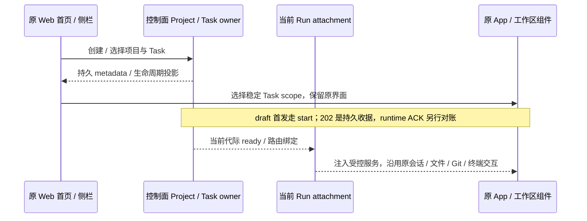
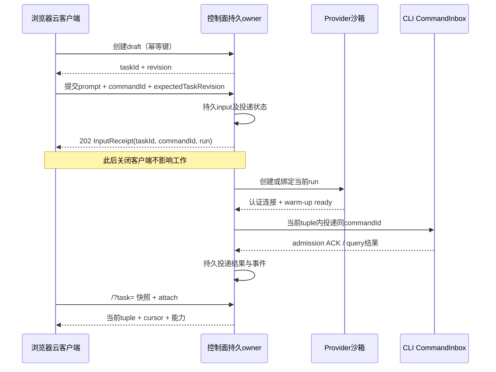

# Spec 04 — Web 云客户端与 Desktop 模式边界

状态：目标设计（2026-10-06 云端实现代码已整体回退）；端到端云功能待实现，按本 spec 组重新实施。
父文档：[00-overview.md](./00-overview.md)。
关联：[03-control-plane.md](./03-control-plane.md)、[07-connection-architecture.md](./07-connection-architecture.md)、[08-project-task-model.md](./08-project-task-model.md)、[09-github-integration.md](./09-github-integration.md)、[11-project-task-creation.md](./11-project-task-creation.md)。

## 1. 当前基线与范围

此前的云实现已撤销。本方案以当前检出的原有源码为起点，不恢复旧模块，不把遗留 `dist` 目录视作实现。

| 当前文件                                                                       | 已有行为                                                                                                                                  | 本方案需要新增的能力                                                                                                                |
| ------------------------------------------------------------------------------ | ----------------------------------------------------------------------------------------------------------------------------------------- | ----------------------------------------------------------------------------------------------------------------------------------- |
| `packages/web/src/main.tsx`                                                    | 无 `remote` 参数时连接 `/ws`，读取 `/api/server-info` 首个工作区；有参数时连接 `/ws/remote/:id`；`Root` 设置 `allowRemoteWorkspace=false` | cloud bootstrap、项目/任务列表、稳定任务路由；账号域经 host `/ws`，执行域由当前 Run attachment 覆盖                                 |
| `packages/server/src/entry-http.ts`                                            | 启动时创建 `createLocalServices`                                                                                                          | 云入口即 host 本体装配（`createLocalServices` + `/ws`）+ cloud 叠加；边界是路由：云任务与浏览器执行请求只落沙箱 attachment（03 §2） |
| `packages/server/src/http.ts`                                                  | `/api/connect-remote`、一次性远端 WS attach，仅代理部分服务                                                                               | 可重复、多端 attachment；完整作用域服务代理；云 API、投递、回放                                                                     |
| `packages/desktop/src/renderer/src/remoteWorkspaceSessionServices.ts`          | Desktop 远端任务/会话/文件/配置等服务覆盖                                                                                                 | 作为服务覆盖清单参考，不能据此声称 Web 通道已实现                                                                                   |
| `packages/ui/src/Root.tsx`、`WorkspaceSidebar.tsx`、`WorkspaceSidebarItem.tsx` | 原有工作区导航和共享 UI                                                                                                                   | 产品层项目/任务导航与运行期工作区视图适配                                                                                           |
| `packages/ui/src/store/remoteWorkspaceSessionStore.ts`                         | 原有 remote session 的客户端登记与绑定                                                                                                    | 云 attachment 投影及 run fencing，不成为 Task/Run 事实源                                                                            |

`packages/web/src/cloud/`、UI hooks/store 和 SDK 当前已有未提交骨架，需逐项核对；其独立列表/textarea 页面不作为最终布局。原有模式参考与新骨架的差距见11 §2。旧文档中的 `RepoProject/cloudProjectSessions/cloudPrompt/cloudModeTabReconcile` 无已验证迁移前提，下文契约与验收仍为 **planned**。

## 2. 产品入口与运行模式

| 模式               | 入口/执行位置                  | 状态和链路                                                             |
| ------------------ | ------------------------------ | ---------------------------------------------------------------------- |
| Cloud Web          | 选 GitHub 仓库，每任务独占沙箱 | 控制面持久 Project/Task；按需 attach                                   |
| Desktop 本地开发   | 原有本地文件夹、现有 SSH       | 迁移期保留 window-scoped Local Host、owner/lease、`desktop-continuous` |
| 手机 Desktop 远控  | 已配对 Desktop Host attachment | 复用现有运行时及 `web-remote-replayable`，不另起 Agent/Host/CloudTask  |
| 本机 `zcode --web` | 原本机工作区                   | 明确选择本机服务，不作为公网云入口                                     |

模式由**服务端**决定，客户端在启动时向同源地址探测（见 §2.1）。URL 缺少 `remote`、网络失败或 identity 解析失败不能自动切回本机。Cloud 的“禁本机”必须落到**路由边界**：云服务端确实运行 host 本体（含本机执行域），但云任务与浏览器执行请求只能路由到沙箱 attachment，部署机 host 执行域不构成 fallback（03 §2）；关闭“打开文件夹”只是呈现层。

### 2.1 模式判定服务端驱动（2026-10-07 修订）

决议：**客户端不再显式判定 cloud 模式**。同一个 Web 产物（编译、启动、使用均同一条路径）在启动时探测服务端模式，模式是服务端事实而非部署期/bundle 期声明。

- 探测：`GET /api/cloud/capabilities`，**同源、不带凭据**（不带 `token`，不带 cookie 之外的自报模式）。这是启动阶段唯一的模式来源。
- 结果映射：`200` 且 `mode=cloud` → 云客户端（云壳）；`401/403` → 云客户端 + 凭据门（服务端明确要求凭据）；`200` 且 `mode=local` → 原有本地 Web 路径，`?remote=` 语义不变；其余（404、5xx、网络失败、非契约响应体）→ **错误屏（可重试）**。
- 作废条款（2026-10-07）：`?mode=`、构建期 `VITE_ZCODE_CLOUD_MODE`/`VITE_ZCODE_SERVER_MODE`、`VITE_ZCODE_CLOUD_ORIGIN` 声明 origin，以及由此产生的 `mode-invalid` / `origin-mismatch` 失败类。origin 不再是构建期契约：所有同源地址在运行时由 `window.location.origin` 拼装（03 §7.1「同源」本身已足够，不需要构建期重复声明）。
- **fail-closed 精神保留且加强**：任何不确定（不可达、404、非法/未知响应体、协议版本不支持）都停在错误屏，**绝不回落 local**——这正是原「缺 remote、网络失败、identity 解析失败不得自动切回本机」的反 fallback 要求；且它不再依赖客户端自报，服务端没回答就无法进入任何模式。
- 本地模式也必须回答该端点（无鉴权，`mode=local`，providers/features 为空集、`protocolVersion` 与云分支同源，见 [W5](./modules/W5-cloud-entry.md) §4）。否则探测无法区分「本地」与「不可达」，只能把本地部署误判成错误屏。
- `?task=` 主路由、`?token=` 凭据通道保留：`?token=` 仍在探测被拒（401/403）后的凭据门里发起一次同源握手（12 §5），不在探测阶段携带。

Desktop 本地和 Cloud 登录、service accessor、tab/cache 命名空间隔离，不导入本地路径作云 IO。原 Desktop SSH 由窗口连接注册表管理，保持原语义。Docker/WSL 远程目标按 06 移除；宿主 WSL、本地开发、手机桌面远控保留。云侧不再有 SSH attachment 与 Desktop 云入口（2026-10-06 决议，见 00 §11⑥：云客户端只有 Web）。最终 Desktop 本地模式产品去留见总览待定决策。

v1 所有 Cloud Task 客户端统一使用 `web-remote-replayable`。原 Desktop 本地/SSH 继续 `desktop-continuous`；不能因 Desktop 窗口或 Host 上游可信将云 UI 升格为 continuous/trusted Host。

## 3. 页面与交互

### 3.0 原始 Web UI 增量改造边界（2026-10-06 用户确认）

用户期待是在 ZCode 原始 Web UI 上增加项目、任务管理能力，其他 UI 与交互保持原样。本节约束下面所有页面和实施决议；复用少数组件、样式 token 或 Root provider 不构成满足本要求。

- 原有 `Root` → `RootWorkspaceContent` → `App` → `WorkspaceShellLayout` 主界面继续承载云工作区。首页保留原输入框与项目选择位置；原侧栏增加 Project → Task 数据与管理动作，不替换成项目卡片首页或另一套 Cloud 导航。
- 新增范围是项目创建/选择/管理、任务创建/选择/管理，以及这些动作所需的分支/provider 选择、生命周期状态和收据。放进原有菜单、对话框、输入框 contextHeader 与状态区域，保持原布局和操作习惯。
- 会话、输入框、模型/模式选择、工具和审批呈现、文件树、Git、终端、Side Pane、设置导航、主题、国际化、快捷键和移动布局继续使用既有组件与交互；新增 Cloud 配置按 §3.1 放入原设置页，不替代原有设置能力或把模型/模式改成固定文案。
- 允许为执行位置和 Cloud Task 生命周期增加 service scope、连接代理、稳定草稿 scope、持久提交对账与能力门控。这些是支撑原 UI 的接入改造，不构成重做 UI 的授权。无沙箱 draft/断连等确实不能执行的能力按已有禁用/加载/错误形态呈现；ready 时应由当前 attachment 提供原有工作区服务，不能用长期不可用 stub 宣称改造完成。
- 禁止用 `cloudShell` 提前返回独立外壳来绕过原 `App`，也不能把 taskId 当 runtime sessionId 或 workspaceIdentity 当真实文件路径以强行挂载原组件。Project/Task metadata 仍属于控制面；现有 runtime session、文件、Git 和终端事实属于当前执行节点，UI 通过 hooks 和服务接口消费。

原先独立的 CloudShell / CloudHomePage / CloudProjectPage / CloudTaskPage 及 Root 的提前返回已在本轮移除；即使其中挂载原 `SessionPane`，也不是本节要求的最终 UI。不得为了追认该实现而改写产品目标。

### 3.0.1 本次接入与删除范围

原 Root、App、WorkspaceShellLayout、WorkspaceSidebar 与 SessionPane 仍为唯一渲染路径。CloudWorkspace context 只携带控制面选择与当前 Run 路由；不携带替代页面。原 sidebar 项目区域消费 Project → Task 投影，添加仓库使用原 Dialog；首页 contextHeader 增加项目/启动配置选择，任务动作使用原菜单。

草稿 cwd 为空且 runtimeSessionId 为 null；不预热、文件/附件/catalog 不进行运行时 IO。UI 草稿 scope 为 origin/principal/task 的稳定键，不能随 runtime session 改变。首发从原 composer 进入 durable input port，HTTP receipt 独立展示；不合成 CommandAck。unknown attempt 在 HTTP 前持久冻结，刷新先查询原 commandId，再允许同 payload 重试；receipt 只清本次提交版本。

ready 使用 Cloud task RPC facade → 当前 attachment → 沙箱原 zcode-server ChannelClient，保留原组件的命令、事件与二进制语义；控制面不运行本机服务。RPC 前后校验 owner/run/generation/epoch，输入写入口不能绕过 durable port。各浏览器的订阅有独立 connection scope，固定 replayable 语义。断连释放网络订阅，不停止沙箱内 stdio owner。

本轮删除独立 CloudShell、CloudHomePage、CloudProjectPage、CloudTaskPage、CloudTaskSidebar、CloudSessionPane、cloudConversationTransport 及仅为这些页面服务的展示辅助代码；保留并修正共享 cloud SDK/hooks/store、部署入口与 Cloud 设置分组。删除前检查静态引用，应用代码之外的本地改动不回滚。

浏览器主题、语言和引导记录按 origin/principal 隔离，原设置页默认入口保持。窄屏复用原侧栏内容，默认收起并以覆盖层展开，不能挤窄会话。首输入在项目未建 draft 时由同一动作先创建 draft 再持久提交；创建结果未知也冻结 creationKey 与完整请求。云任务排序/归档视图读取控制面任务事实，不能重复显示本地 CLI 的空任务区。

### 3.0.2 原交互载荷与附件保持

原输入区的 `AttachmentRef` 在 ready attachment 内上传，持久输入冻结完整引用和 expectedRunGeneration；控制面存储、幂等 hash 与 sendText 投递不得丢弃这些字段。无沙箱草稿隐藏依赖真实运行时的附件能力，ready 后恢复原能力。

原 Permission / AskUserQuestion / Plan 对话框沿用原组件，Cloud durable 决定保留 optionId/action 以及原 answer 的 freeText/content。决定使用同一 commandId 对账，202 只显示提交中；唯有 admitted 才按原对话框执行成功处理，未知结果不关闭、也不清用户回答。

持久输入/审批扩展保留未使用新增字段时的原幂等规范串；新字段加入比较，不能使旧记录的同键重试突然变为冲突。任务事实始终由控制面返回。

### 3.1 项目列表

- 沿用原 Root、侧栏、输入框和工作区：首页有项目/任务管理入口，侧栏按 Project → Task 组织。新建项目只有仓库一种类型（2026-10-06 决议）：通过已授权仓库选择器；仓库选择器支持分页、搜索、加载、空态、撤权与 App 未安装引导；未配置显示部署问题。
- 设置导航新增“Cloud 运行时”分组，GitHub 与 Sandbox 位于该组，不能放基础设置。配置页只展示当前主体可访问的操作，App/provider 密钥仍由01/09的控制面秘密 owner保存，不回显真实秘密。
- 模型设置：官方模型登录（OAuth）与 Coding Plan 入口在云模式**保留并可用**（2026-10-06 决议⑦，见 [12](./12-account-domain.md)）。登录/套餐组件不加云分支：其数据源就是 host `/ws` 的账号域服务（base accessor，[12 §5](./12-account-domain.md)），不再由 `createCloudBrowserServices` 覆盖；浏览器不持有 token 正文，登录/取消/错误形态沿用原组件。
- 仓库列表按当前账号 App installations 的权限过滤；同账号同仓库去重由控制面执行，多端重复添加幂等。
- 仓库项目显示 `owner/name`、任务计数、权限状态；项目不持有沙箱、不显示连接状态。展开只查控制面 Task，不连沙箱。
- （2026-10-06 决议移除）：原“SSH 项目显示目标/远端路径和 attachment 状态”条款作废，云侧不再有 SSH 项目类型。
- Cloud Task 列表不是 CLI task index 或 Session 列表的重命名。

### 3.2 草稿与首输入

完整创建流程及用例由 [11](./11-project-task-creation.md)负责。UI 规则：

1. 新建任务先以 creationKey 创建持久 draft，不创建沙箱/session；未收到 Task 时不伪造已创建。
2. 原输入框 contextHeader 展示基础分支/provider/受控模板及模型/模式。启动配置保存到唯一服务端 draftStartConfig，正文按稳定 Task scope 本地持久；配置并发冲突保留编辑。
3. 发送前持久完整 submit attempt，随后依03提交 start/revision。失败保留正文；unknown 恢复原 key，不能重新组装 payload 或自动换 key。
4. 202 后显示“已提交，等待环境”，ready 后后台投递固定 firstInputCommandId。浏览器只 attach，不 autoSend，receipt 不冒充 runtime ACK。202/重开成功后客户端启动**有界 run 观察**（2026-10-08 修订）：只静默刷新唯一详情投影，2s 间隔、60s 上限，run 可见且非 provisioning 或进入终态即停，切换任务/组件卸载即停；不引入第二份状态副本。
5. 客户端退出/刷新不撤销 accepted 工作；刷新先恢复 unknown attempt，并查询已提交正文、receipt、Task/Run/历史，而不只重新拉元数据。
6. receipt 只清本次正文版本，等待期间新编辑不受迟到响应影响。ready 后继续走同一 durable input port，不能直发绕过控制面。

### 3.3 任务详情与状态矩阵

详情包含 Task 产品状态、Run 状态/provider/阶段、执行活动、input 投递结果、对话/工具/审批、代码变更/PR、停止/重开/归档。`Task.active` 不等于 attachment ready。

| Task 状态   | 页面行为                    | 动作                                    |
| ----------- | --------------------------- | --------------------------------------- |
| `draft`     | composer，无沙箱成本        | 首输入；改 base/provider；归档          |
| `active`    | 按 Run/活动呈现进度或工作区 | 补充 input；审批；状态门控后的停止/重开 |
| `completed` | 结果、历史、产物            | 显式重新激活后按08重开，不隐式建run     |
| `failed`    | 错误、已有产物、input 结果  | 显式重试/重开，控制面判断新 run         |
| `archived`  | 只读                        | 按 08 恢复归档，不接受执行命令          |

| Run 状态       | 视图/能力                                                   | 门控                                                                                                |
| -------------- | ----------------------------------------------------------- | --------------------------------------------------------------------------------------------------- |
| `provisioning` | 创建/clone/启动/warm-up进度                                 | 只看进度/停止，下一条正文可编辑但不发送，无文件/终端调用                                            |
| `ready`        | 当前工作区可用                                              | route tuple 校验；审批匹配 interaction revision                                                     |
| `disconnected` | 重连；最后快照标为旧状态                                    | 不凭断线变 expired，不新发 append；未经对账不执行审批                                               |
| `draining`     | 保存并停止；checkpoint进度                                  | 不接新增执行命令/文件写入；结果真实                                                                 |
| `paused`       | 暂停保留中；发消息触发自驱 resume（同 run，不换代、不重开） | 仅分级能力 provider 出现（能力位 none 无此投影）；暂停期间无文件/终端调用（2026-10-09 生命周期 v2） |
| `stopped`      | 安全停止，产物可读                                          | 重开新 run；旧 run 不复活                                                                           |
| `expired`      | provider确认环境已消失                                      | 最近保存点/可能未保存内容可见；重开新 run                                                           |
| `failed`       | 失败原因/保护信息                                           | 可用动作由 owner 给出，不由 UI 猜测                                                                 |

有效活动为 `idle` / `running` / `awaiting-input`；缺少可靠runtime事实时为 `unknown`，保留last-known并标过期，不猜idle。与Task/Run状态独立，无 `Task.connected`、`Task.running`。浏览器打开、心跳和终端输出不等于运行活动；等待审批/问题有明确入口，不能被闲置停止静默抹掉。

stopRequested 是优先于 Run 状态的持久门控：收到受理后显示“正在停止”，禁止新输入、审批/写操作及新 Run；迟到 ready 不重新开放。可操作 actions 来自控制面/runtime 能力投影，但服务端仍独立验证。stopped 只表明环境终止，是否已保存必须另外显示 checkpoint/dataAtRisk。

2026-10-08 修订（run 终态可见性与归档接线实测缺陷）：

- 任务面板（工作区主区横幅）按详情投影呈现 run 状态：`provisioning`/run 未出现 → 进行中提示；`failed`/`stopped`/`expired` → 终止标题 + `activeRun.lastError`（shared 契约驼峰字段）或 `endReason`，不再让失败静默成「没反应」。
- 重开入口只对服务端 actions 投影含 `reopen` 的任务给出；resume 模式**按持久事实自动选择**（`latestCheckpoint.state === "saved"` → checkpoint，否则 restart-from-base）并向用户说明依据（08 §9 分支两侧显式声明），不提供与服务端事实冲突的二选一。
- 归档入口统一走控制面独立端点 `POST /tasks/:id/archive`（useCloudTask → port.archiveTask）：Header「归档任务」菜单对云任务工作区分流到该端点（不得落本机 zcodeTaskService），侧栏任务行提供同路径入口；可用性按 actions 投影门控，服务端拒绝的错误信封必须以既有反馈组件（toast）呈现，不得吞掉。归档成功后任务退出侧栏活动列表（云模式无本地归档视图）。

2026-10-08 修订（无头巡检驱动：云壳层交互缺陷）：

- **drag region 桌面限定**：`[app-region:drag]` 只在桌面端（Electron 窗口）渲染；侧栏顶部占位与 WorkspaceHeader 的 drag 容器在 Web/云 Web 保留布局高度但不渲染 drag region（浏览器中它只是悬在顶栏交互区之上的实体层，命中测试会吞掉按钮点击）。云入口的顶栏「New task」按钮始终可见（窄视口侧栏会被自动收起，顶栏按钮不能沿用「侧栏可见即隐藏」的桌面互斥规则）。
- **侧栏已归档分区**：控制面列表里的 archived 任务不再被直接滤掉——项目任务列表下新增「已归档」可折叠分区（默认收起，头部显示数量），行内提供恢复入口（`POST /tasks/:id/restore` 独立端点，与归档对称分派）。恢复成功后任务回到活动列表；归档不再是死胡同。
- **archived 只读呈现**：已归档任务详情在工作区主区呈现只读横幅（说明已归档 + 恢复入口），composer 按 `useCloudTaskWorkspaceStatus` 置为只读——不再出现「假可写、Send 静默无请求」。云任务 Header 标题回落控制面投影（云任务不在本机 CLI 任务索引，本地 meta 恒为空）。
- **云入口移动端抽屉**：窄视口（<md）侧栏被 conversation 自动收起后，提供汉堡触发器 + 遮罩抽屉（复用同一份侧栏 DOM，不复制第二份组件与订阅），覆盖任务列表/新建入口；只作用于云入口，桌面与本地 Web 布局语义不变。
- **主路由任务不存在**：`?task=<合法 UUID>` 但控制面返回 `not_found` 时，与非法 task id 一致地渲染整页错误屏（reason=`task-not-found`，恢复动作 open-home/reload），不静默回落欢迎页；错误屏同时卸载工作区树，收敛多个订阅方各自重发的 404 详情请求。判定按结构化错误码（控制器新增 `taskDetailErrorCode` 投影），不解析文案。
- **错误文案用户可读**：任务动作（归档/恢复）失败 toast 的 reason 经 shared 错误码目录映射成 i18n 文案（`cloud.errors.*`），未映射码回落原始码展示；侧栏归档入口与 Header 菜单对齐按 actions 投影预禁用（有缓存详情而投影不含 `archive` 时禁用并说明原因）；入口错误屏文案去掉内部语义（如「链接不会退化成…」），诊断行标注「诊断信息」前缀。

2026-10-08 修订（无头复检驱动：云壳层收尾缺陷，第三批）：

- **抽屉跨回宽屏恢复停靠（P2）**：云 Web 宽视口没有任何再展开侧栏的入口（桌面靠标题栏按钮，云 Web 抽屉触发器 `md:hidden`），窄视口自动收起后跨回宽屏（≥md）若保持收起，`--workspace-sidebar-panel-width` 恒为 0px 且须刷新解锁。跨断点（narrow→wide 的 media change）时自动收起抽屉并恢复停靠侧栏：宽度取收起记忆值，无效/缺失回退默认宽，恢复宽度永不为 0（`resolveCloudMobileSidebarDockedRestorePlan` 纯函数，node:test 覆盖）；挂载即宽屏不触发恢复（保留用户静态宽屏下的收起选择）；非云入口不受影响。
- **composer 运行中保留 Stop（P3）**：运行中 composer 有草稿时发送位切换成「Queue message」的旧状态机让 Stop 完全退场——手机端无 Esc 键，写下草稿后无法停止。修订为：运行中 + 有草稿 → 发送（入队）按钮旁并置 Stop（同一按钮形状与 testid，`v4-stop`）；运行中 + 空草稿 → Stop 独占发送位（旧语义不变，桌面布局零变化）。决策收口 `resolveComposerSubmitControls` 纯函数（node:test 覆盖），云任务停止沿用既有 `useCloudTaskStop` 分流（不经 agent command 通道）。

2026-10-08 修订（无头巡检驱动：会话链路缺陷，第二批）：

- **workspace 落定前不绑定会话（P1）**：runtime 会话绑定（pane 订阅 `conversation/<runtimeSessionId>`）要求 `activeRun.runtimeSessionId` 与 `activeRun.workspacePath` **同时落定**——路径未落定时按「无会话」渲染等待态，不得用 pane scope 的空串路径发起 `subscribeConversationV4`（02 §2 不变量 1：身份与路径同时传递，空串路径被 runtime zod 以 `workspace.workspacePath` too_small 拒绝）。控制器在详情投影刷新时把落定的路径同步进云任务 tab（按 `cloudTaskId` 匹配、不抢激活），pane scope 因此始终携带真实 checkout 路径。
- **订阅错误不进对话正文（P1）**：订阅失败的错误呈现分类化——结构化校验错误（zod issues JSON / `Invalid params`）给专门文案，原始串收进可展开的次要细节区；任何 `lastError` 都不得作为对话正文渲染。
- **stop 接线（P1）**：云任务工作区的 v4-stop 分流到控制面独立端点 `POST /tasks/:id/stop`（useCloudTask 生命周期分派），不经 agent command 通道；stop 受理后 run 进入 `draining`，任务面板横幅呈现「正在停止」（含保存/收尾进度语义），不再只有 composer 的 Working 计时。force-stop 入口按 actions 投影（含 `force-stop` 成员）给出，请求体携带 `lossAcknowledgement:true + expectedRevision + operationId`（shared `forceStopCloudTaskRequestSchema`）并带丢失确认对话框；普通 stop 失败不得自动升级（08 §8.2）。
- **optimistic 用户消息（P2）**：发送 202 后按 commandId 登记 pending optimistic overlay（用户消息气泡 + 「等待环境」提示）；权威投影出现同 commandId 的 queue/userInput 行即退场，run 终态也收口。overlay 是 pending 呈现，不是第二份会话事实。
- **重连保留历史（P2）**：订阅断开/重连中但已持有回放快照时不清空时间线——错误降级为时间线上方提示条（含重连入口），只有从未取得投影时才整面错误面板；composer（含模型选择器）不因重连中整体禁用（云输入走 HTTP 独立通道，目录已加载时选择器状态保持）。
- **first-run 引导（P2）**：云模式下引导判定叠加账号域事实——账号已有任务/项目即不触发 first-run 引导（record 服务按 deviceMid 记录，浏览器「首跑」与账号事实可能脱节）；record 服务不可用时关闭引导回落 settings 的「跳过」保守默认（仅当从未作答），保证关闭持久。

2026-10-08 修订（真实环境复现驱动：终态 run 的发送行为与假等待收口）：

- **终态 run 发消息 → 自动重开继续（2026-10-08 用户产品决议，03 §6/08 §5/§9 同步修订）**：任务 active/failed 且无有效 run（服务端详情投影对终态 run 不再返回 `activeRun`，客户端以 `actions` 投影含 `reopen` 为准）时，composer 发送不再发出注定 409 的 append，而是把该消息作为 reopen 的工作要求自动走 `useReopenCloudTask` 既有通路（resume 按持久事实自动选择：`latestCheckpoint.state === "saved"` → checkpoint，否则 restart-from-base，UI 说明依据）；服务端 actions 投影不含 `reopen` 或 provider 不可解析时不自动重开，按归一文案说明。触发面只在「用户主动发送」：草稿恢复、unknown attempt 对账、投递重试仍不得触发重开。自动重开受理后 UI 明示进入 provisioning 等待（既有横幅语义），不静默。
- **409 竞态兜底**：发送时详情陈旧（仍显示活 run）→ append 收到 409 `not_ready/no-active-run` → 自动改走 reopen 重试一次（复用上述事实选择），仍失败才把归一错误呈现给用户；其余 `not_ready` reason（stop-requested/run-not-ready 等）不自动重开。错误信封按 `code + details.reason` 细分映射为用户可读文案（如 `no-active-run` → 「运行已结束，重开任务后才能继续对话」，新增 i18n key，zh/en 同步），不解析 message 文本。
- **乐观 overlay 回滚**：pending optimistic overlay（P2）的收口不再只依赖「权威投影出现 / activeRun 终态」——详情投影显示「无有效 run 且可重开」（run 已被服务端收回，权威投影永不出现）时同样退场；被 409 明确拒绝的发送不登记 overlay。禁止假「已提交，等待运行环境」状态永久挂起。
- **ended 优先于 waiting 投影**：`projectCloudTaskRunPanel` 对「active/failed + 无 run + actions 含 `reopen`」返回「上一次运行已结束（可重开）」视图，不再呈现 `waiting-for-run`——后者只属于 202 成功后 run 尚未出现的事务窗口。run watch（04 §3.2.4）把「详情出现 reopen 能力」追加为停止条件：provisioning → 终态的迁移在投影里表现为 run 消失，不得当作「尚未出现」继续轮询到超时。

2026-10-09 修订（生命周期 v2：用户决议发消息自动继续 + pause/resume 分级能力）：run 状态投影如实呈现 `paused` 与恢复中的 `resuming`（暂停保留与恢复进度复用既有进行中横幅语义）；`paused` 期间用户发消息走 03 §6 的控制面自驱 resume（同一 run，UI 明示「正在恢复运行环境」，不得呈现为重开或新 run）；能力位 `none` 的 provider 不出现 `paused` 投影（fail-closed：UI 不为未声明的能力保留状态位）。

2026-10-09 修订（用户实测缺陷：paused run 被全屏「连接已断开」错误面板遮蔽）：

- **paused 不绑定实时会话（P1）**：`activeRun.status === "paused"` 时 pane 不绑定 runtime 会话（`resolveCloudTaskRuntimeSession` 返回无会话）——执行域 attachment 已被控制面 detach，继续按 `sess_…` 订阅只会得到 `cloud task … has no ready run attachment` 的结构化失败，全屏「连接已断开」错误面板替换工作区、composer 消失，「发消息即可恢复」横幅被遮蔽。不绑定时 pane 呈现：paused 横幅（CloudTaskRunStatusBanner）+ 跨 run 只读历史（GET /tasks/:id/history，02 §7.3 持久副本，沙箱暂停亦可读）+ 可用 composer（HTTP 独立通道）；用户发送走 paused→resume（03 §6），run 回 ready 后详情刷新、绑定自然恢复、订阅带回回放——paused 前的历史回合在恢复前后都不丢。
- **run watch 覆盖 paused append**：paused append 202 后与首发同款启动有界 run 观察，且 `paused` 从「停止条件」改为「继续条件」——自驱 resume/预算耗尽收口由服务端异步推进，客户端靠轮询把 ready（恢复绑定）或终态（reopenable 投影）翻回详情投影，60s 上限兜底。
- **订阅错误标题归一**：`… has no ready run attachment` 这类云执行域不可用失败不是「与代理的连接已断开」——`classifySubscribeError` 新增 `cloud-unavailable` 分类，标题呈现「运行环境暂不可用，稍后会自动重试；也可以点击重连」，原始串仍收进技术细节区；真正断连场景（generic）沿用重连文案。

2026-10-09 修订（用户实测复发：欢迎/迁移向导每次刷新必弹且关闭不持久）：首启「欢迎使用 ZCode」迁移向导（`OnboardingDialog`，挂载于 Root 的 `OccupationOnboarding` children 内）的 first-run 判定走 `settings-sync` 频道（`getFirstRunPromptState`/`markFirstRunPromptHandled`），而该频道不在 03 §7.1 云 host 暴露面（扫描/导入本机执行域配置，按 allowlist 边界不外露）。云模式下状态读取被未知频道超时拒绝时，原实现按 fail-open 弹出向导且关闭写回同样失败，形成「刷新必弹、关闭无效」死循环（server.log 实证 `Unknown channel: settings-sync`）。行为统一到 first-run 引导同一套纪律（§first-run 引导 P2 修订）：

- **fail-closed**：首启提示状态读取失败（频道不存在/RPC 错误）时不得自动弹出向导——读不到的键同样写不进，fail-open 必然死循环；仅记录 warn 保持关闭，设置页与引导链的显式打开入口不受影响。firstRun 意图的 detect 失败同理不自动弹（manual 意图保留打开以呈现错误）。
- **账号事实短路覆盖该向导**：云模式账号已有任务/项目（`useCloudAccountHasActivity` === true）时迁移向导不自动弹；事实 pending（探测进行中）期间保持关闭等待，不在事实到达前闪弹。探测复用会话级缓存。
- **关闭持久化回落同键**：`markFirstRunPromptHandled` RPC 失败时回落 `settingService.update({ settingsSyncFirstRunPromptHandled: true })`——读取键（`settings.settingsSyncFirstRunPromptHandled`）与回落写入键是同一 AppSettings 字段，`settingService` 在云暴露面内，保证 X /「开始使用 ZCode」/完成任一关闭路径跨刷新、跨会话持久。

2026-10-09 修订（用户实测缺陷：云任务运行中 composer 切换模型不生效）：模型/模式选择属「随消息参数走」的执行配置，不是账号 provisioning 代际——composer 在发送点击冻结的 Submission（modelSelection/mode/planEnabled，`createComposerSubmissionConfig`）必须经云发送适配层映射为控制面 input 的 `requestedConfig`（`buildCloudRequestedConfig`，node:test 覆盖），随 start/append/reopen 请求落进 input record，控制面投递信封（03 §6.1、02 §6.2）把它携带进 createSession（firstInput+config）/sendText payload，沙箱 runtime admission（`resolveSubmittedExecutionState`/`applyRequestedSessionConfig`）据此更新 Session Selection。运行中切换模型后，下一条消息即用新模型执行，选择器状态经既有 ModelSelected 投影回读保持一致；禁止改为 provisioning 代际或第二套配置命令通路。Submission 未完成（null）时省略 `requestedConfig`，回落 runtime Session Selection，不阻断发送。

### 3.4 输入层次与多端

| 层次                          | 所有者                     | 恢复/呈现                                      |
| ----------------------------- | -------------------------- | ---------------------------------------------- |
| Task 草稿启动配置             | 控制面 Task owner          | 客户端局部编辑经 revision 保存                 |
| 未提交正文草稿                | 客户端                     | Task scope 可编辑，不是服务端队列              |
| 冻结 submit attempt / unknown | 客户端持久对账记录         | 跨刷新恢复原 commandId/payload，不离线自动发送 |
| pending optimistic overlay    | 客户端                     | request key关联响应；刷新对账，不补造 accepted |
| 已持久、尚未 CLI admission    | 控制面投递记录             | 独立等待投递投影，可跨设备查询                 |
| admitted busy/running input   | CLI/runtime `CommandInbox` | 唯一 admission/执行队列；同 commandId 不重复   |
| rejected / failed delivery    | 决定 owner                 | reason 可见，结果明确后新工作意图才创建新命令  |

控制面 `InputReceipt` 使用03的 `accepted/delivering/admitted/rejected/uncertain/cancelled`；投递错误记录在lastError，不另造 `deliveryStatus=failed`。202只代表持久接收，不伪造CLI CommandAck accepted。input以 `{taskId, commandId}`查询，不另设客户端inputId寻址。

取消已提交input走服务端状态转移，不能只删除UI消息。新run不自动重放旧run的uncertain input。cloud receipt、commandId和runtime sessionId分别表达收据、幂等命令与会话。两端审批由runtime对interaction revision原子决定，另一端展示已处理结果。

首input的HTTP和共享会话UI的 `sendConversationCommandV4` 后续input都调用同一durable application port；ready后共享composer不能绕控制面直发CLI。cloud facade新增receipt投影，保留runtime ACK原义。ACK不确定先 `queryConversationCommandsV4` + receipt对账，unknown才在同run重投同commandId。

### 3.4.1 Cloud composer scope 与能力门控

Cloud 使用显式 task-owned scope（principal + controlPlaneOrigin + taskId），不把 runtimeSessionId 或临时 workspacePath 作为草稿身份。现 `__draft__` 与 task identity 联合可继续使用；问题是项目级共用或 session 换代后的归属漂移，而非字符串本身。Local/SSH 保持原 scope，不能用 taskId 伪装 runtime sessionId。

submit attempt 在 HTTP 前持久冻结完整请求/commandId、正文版本和阶段；本地写入失败阻止 Cloud 提交并解释恢复限制。刷新后先查询原 key，网络失败保持 unknown；可以继续编辑下一条正文，但不能将未知原提交当成没发。获得明确 receipt 后按版本清理旧正文。登出切主体清投影，attempt 按原主体隔离并仅在重新认证后恢复，不跨账号投递，也不把正文写入日志。

首版推荐正文/模型/基础分支/provider。Cloud draft 禁 runtime 预热，文件/Git/终端及依赖 session 的附件/目录能力未实现时从 hook 和事件入口门控，包含粘贴/drop。现 `useComposerAttachments` 的 waitingSession 不能通过虚构 sessionId 解决。若首发支持附件，先新增 task-owned 控制面上传、materialization及artifact ref授权，不为此提前创建空session。未 ready 时不传伪 workspacePath 诱发 IO；原组件需按 capability 注入或抽取无 runtime 的编辑器控制边界。

### 3.5 SSH 项目（2026-10-06 决议移除）

云侧 SSH 项目（控制面作为 SSH 客户端的 attachment）已整体移除，本节原设计（目标 → 认证 → 主机身份确认 → 安装/握手 → 选远端目录 → 持久 Project → Task attachment、单写约束、无 extend/terminate 语义等）作废，实施证据保留在 git 历史。

保留项：

- Desktop 原 SSH 连接、canonical path、凭据和工作区身份不变（本机/远控路径，不属云执行）。
- 沙箱 runtime 与 SSH 模式交互同构（[07 §2.7](./07-connection-architecture.md)）继续成立。
- 维护 `cloudTaskId ↔ runtimeSessionId` 映射的规则适用于沙箱 Run：不把旧 runtime taskId 当 Cloud taskId。

## 4. 服务与客户端落点（planned）

| 落点                                            | 职责/边界                                                                                                                                                  |
| ----------------------------------------------- | ---------------------------------------------------------------------------------------------------------------------------------------------------------- |
| `packages/shared` 公共契约                      | Cloud metadata、input投影、route tuple、错误/能力、runtime schema；不依赖 server/UI                                                                        |
| `packages/client/src/cloud/`（planned）         | HTTP/事件/attachment client，显式 origin，幂等/取消；SDK公开入口导出                                                                                       |
| `packages/ui/src/hooks/` cloud hooks（planned） | 查询/提交/绑定/取消订阅；组件只经 hooks/service accessor；含 JSX 用 `.tsx`                                                                                 |
| `packages/ui/src/store/` cloud投影（planned）   | 快照/revision/cursor、选择、optimistic；只缓存，不写业务事实或再建 admitted 队列                                                                           |
| `packages/web/src/main.tsx`                     | 启动探测得出模式（§2.1）、OAuth/分享公共路由、启动错误；云模式的 `/ws` 就是 host 本体服务通道（同源、lite-token），不得回落开发机/本机 workspace bootstrap |
| `packages/ui/src/Root.tsx` 和sidebar            | 复用 shell/chat/tool/file/Git；按 service scope 适配导航                                                                                                   |
| `packages/server/src/cloud/`（planned）         | cloud 编排叠加层：API、投递/attachment owner；装配在 host 本体服务图上（`createLocalServices` + `/ws`，决议⑧），不恢复旧 src                               |

准确 service interface/文件名在 architecture context 阶段确定。UI 不直接导入 server 实现、不调 Repo、不直接调用 `window.zcode`。原生能力经 `IPlatformService`，平台差异注入。

| 服务类别                                                                              | 列表页                      | ready工作区                             |
| ------------------------------------------------------------------------------------- | --------------------------- | --------------------------------------- |
| 账号/云设置、Project/Task/Run/input                                                   | 控制面 metadata             | 同一控制面 owner                        |
| Agent/Session/runtime task index、文件/Git/checkpoint、终端/system、附件/媒体/watcher | 禁止执行调用                | 当前 run attachment 完整代理            |
| provider/model、skills/plugins/MCP/hooks/commands                                     | 列配置/能力，不执行本机插件 | 明确同步当前目标，不能漏回 baseServices |
| 文件选择/外部编辑器/内嵌browser                                                       | platform capability         | Web用下载/复制/系统browser等替代        |

逐服务验证scope，按capability白名单暴露UI需要的能力，不透出整个远端ServiceCollection/credential read-save（该白名单针对沙箱 attachment 通道；host `/ws` 通道的账号域分面见 03 §7.1）。无ready attachment拒绝执行请求，不回落本机。当前四项代理不足以复用Root，需补齐受限服务/权限；账号/provider 配置事实在 host 本体，目标只持应用版本及必要授权配置。

阶段实现记录（2026-10-06 第二批，不构成 §3.0 的 UI 验收）：会话面数据来自控制面持久投影——
`GET /api/cloud/tasks/:taskId/history?topic=conversation&limit&cursor` 返回 `{items:[{topic,logEpoch,seq,kind,payload,ts}],nextCursor?}`（严格 schema，按 seq 游标）；`/events` 只做增量提示，不替代历史快读。最终应将历史、收据与当前 attachment 接入原工作区会话和审批呈现。draft 首输入走 start；曾执行任务无 active run 时按状态提供显式 reopen，不能仅凭没有 Run 将 draft 或 completed 自动送入 reopen。

## 5. 路由、身份和事件顺序

- 主路由 `/?task=<taskId>`，项目展开/选择不改身份。
- 仓库 Task workspaceIdentity=`cloud-task:<taskId>`，不透明且跨provider/run/path稳定；IO单独传workspacePath。
- 每次绑定校验 `{runId, runGeneration, connectionEpoch}`；旧tuple的事件、审批、文件调用/完成响应拒绝或忽略，不能只按path/taskId匹配。客户端手里的 tuple 事实源是 task detail（`GET /api/cloud/tasks/:taskId` 的 activeRun），只作 expected 值用于 stale 检测；服务端在 WS upgrade 时自行解析 activeRun，不接受客户端自报的 runId/generation/epoch（[02 §4](./02-bridge-protocol.md)），因此不新增浏览器侧握手帧。
- `?remote=<id>`保留原本机Web/桌面远控语义，不自动导入CloudTask；本次没有旧cloud数据。未来兼容入口必须显式查控制面映射。
- 重开不复活终态run，历史按旧run持久内容/产物展示，不拿新sqlite当旧历史。

metadata SSE带entity revision，重连全量拉列表对账，不作为对话可靠投递。对话history/snapshot/delta使用持久cursor，订阅竞态、去重、缺口按03/07。后台停止订阅不停止run。

## 6. API映射（全部planned）

schema/权限/并发/错误以03/08/09为准，不另造 `/v1/sessions` 链路。

| 动作                  | 接口族/最低契约                                                                                                                                               |
| --------------------- | ------------------------------------------------------------------------------------------------------------------------------------------------------------- |
| repo/base选择         | `/api/cloud/repositories`、branches子资源；账号权限、分页cursor、撤权                                                                                         |
| Project列表/增删      | `/api/cloud/projects`；幂等；删除活跃项目必须处理run                                                                                                          |
| 启动能力              | `GET /api/cloud/capabilities`（启动探测的唯一来源，§2.1）；云模式返回 mode、协议、provider/客户端能力，不含secret；本地模式无鉴权返回 `mode=local` 与空能力集 |
| Task创建/列表/详情    | `/api/cloud/tasks`、project tasks；Task/Run/活动分离、revision/账号域                                                                                         |
| 修改标题/草稿启动配置 | `PATCH /api/cloud/tasks/:taskId`；revision，配置仅draft可写，不任意赋值status/路径                                                                            |
| 首发送/补充           | `POST /api/cloud/tasks/:taskId/inputs`；成功前持久，draft首发送可建run、ready继续复用run                                                                      |
| input查询/取消        | `GET /api/cloud/tasks/:taskId/inputs/:commandId`、`POST .../:commandId/cancel`；同receipt对账，admitted取消走runtime                                          |
| 显式重开              | `POST /api/cloud/tasks/:taskId/reopen`；新run；旧uncertain input不跨run replay                                                                                |
| 停止/完成/归档        | `POST /api/cloud/tasks/:taskId/stop`、`/complete`、`/archive`；revision、tuple、状态门控；归档不走PATCH status                                                |
| metadata/历史/input   | snapshot/events/input子资源；cursor/revision、恢复对账                                                                                                        |
| 工作区                | `/ws/cloud/tasks/:taskId`；认证受限proxy、当前tuple，cloud统一可回放；原continuous分开                                                                        |

错误code区分未配置、认证失效、撤权、quota、provider不可用、stale run、checkpoint失败；UI不解析异常文字。

## 7. 移动与设计约束

遵守 `DESIGN.md`，复用 `text-ui-*`、语义主题token和 `components/ui`；移动输入必要时用 `text-mobile-input-safe`。宽屏sidebar/conversation/Side Pane，手机单列/抽屉/返回，所有创建、输入、审批、停止、PR动作均可达。键盘/安全区、横屏、长输出、中英长文案、亮暗主题都验证。后台/断网恢复先认证、快照对账；UI日志走logger，不打印prompt/凭据/仓库内容。

## 8. 阶段与回退

| 总里程碑                  | 客户端实施/退出条件                                                                                     |
| ------------------------- | ------------------------------------------------------------------------------------------------------- |
| M0契约/基线               | mode/scope/Task-Run-input交互，登记测试runner；无旧cloud迁移假设                                        |
| M1安全图/持久Task         | cloud bootstrap、列表/draft；云任务与浏览器执行请求只落沙箱 attachment，部署机 host 执行域不作 fallback |
| M2首provider/bridge       | progress、ready attachment/能力；真实provider全scope，不提前宣称输入闭环                                |
| M3持久输入/replay/Web闭环 | 发送、投递投影、恢复；无autoSend；关闭页面仍执行；去重隔离                                              |
| M4保存/lifecycle/PR       | 停止/重开/产物/保存失败；真实保存点及终止确认                                                           |
| M5多端Web/移除目标        | 桌面+移动浏览器多端E2E和06清理；原模式回归                                                              |
| M6Android（已移除）       | 不适用：2026-10-06 决议移除，见00 §11⑥                                                                  |
| M7多账号/公网上线/webhook | 条件性：单用户模型下不在路线图（00 §11⑤）                                                               |

模式由服务端探测得出（§2.1），无客户端开关；bundle回退遵守API兼容窗口，不删除持久input/Task。本机入口不能作cloud回退路径，探测不确定也不得回落本机。

## 9. 验收计划（全部planned）

每例留UI+HTTP/事件+owner/runtime证据；通过故障注入/受控ACK验证时序，不依赖固定sleep。

| ID   | Setup / Action                                                                | Assertions                                                                                                                                                                   |
| ---- | ----------------------------------------------------------------------------- | ---------------------------------------------------------------------------------------------------------------------------------------------------------------------------- |
| W-01 | 两浏览器添加同repo                                                            | 一个Project；换设备一致；列表无沙箱连接                                                                                                                                      |
| W-02 | 未装App/未配置/撤权/>100repo                                                  | 状态区分、权限过滤、分页可达                                                                                                                                                 |
| W-03 | 新建draft不发送                                                               | 有Task，无run，provider零创建                                                                                                                                                |
| W-04 | 首输入202后关页面，另一设备看                                                 | CLI仍admit一次；prompt持久；无autoSend                                                                                                                                       |
| W-05 | POST成功响应丢失，同key重试                                                   | input/Task/run不重复；HTTP与CLI ACK区分                                                                                                                                      |
| W-06 | 同repo两个任务，不同provider/同path                                           | identity不同；消息/缓存/未读/file/Git/input/PR隔离                                                                                                                           |
| W-07 | 切Task/重开换provider，迟到旧事件/响应                                        | identity稳定、新tuple；旧run终态不复活；旧事件拒绝                                                                                                                           |
| W-08 | running/awaiting-input断网恢复                                                | 不凭断网变failed；正确回放；审批先对账                                                                                                                                       |
| W-09 | 持久input后CLI ACK前重启控制面                                                | query同commandId，不重复执行                                                                                                                                                 |
| W-10 | 保存失败/终止延迟/重复停止                                                    | 真实错误；未确认终止不称释放；不丢工作                                                                                                                                       |
| W-11 | cloud请求本机path/ws/file/terminal、unknown identity                          | 服务端拒绝；云任务执行目标只到沙箱 attachment，不落到部署机 host 执行域（host 进程本身按决议⑧存在）                                                                          |
| W-12 | （已移除）原 SSH 指纹/凭据用例随云 SSH attachment 移除                        | 不适用（2026-10-06 决议，见00 §11⑥）                                                                                                                                         |
| W-13 | Desktop本地/SSH、已配对手机远控                                               | window Host、owner/lease、连续/回放保留，无CloudTask                                                                                                                         |
| W-14 | 手机键盘/抽屉/横屏/中英/两主题                                                | 创建/输入/审批/停止/PR可达，无溢出/丢输入                                                                                                                                    |
| W-15 | completed/failed/archived、深链/返回                                          | 产品/run状态分离，门控一致，不隐式新run                                                                                                                                      |
| W-16 | 对照原 Web UI，打开云首页、创建项目/任务并进入任务                            | 原首页输入框、侧栏、App 工作区与设置交互保留；只增项目/任务管理，不进入独立 Cloud 页面                                                                                       |
| W-17 | 当前 attachment ready，操作模型/模式、工具/审批、文件/Git/终端与 Side Pane    | 既有组件与操作路径可用，服务目标是当前 Run；无固定模型/模式文案或永久不可用 stub                                                                                             |
| W-18 | draft/断连/重开、打开设置再返回，桌面与移动视口对照                           | 能力按真实生命周期门控；Task 草稿稳定；设置覆盖和返回沿用原行为，不重建另一套工作台                                                                                          |
| W-19 | 启动探测（2026-10-07 §2.1）：云入口、本地入口、需凭据入口、无该端点地址各一次 | 云→云壳；本地→原本地 Web（`?remote=` 不变）；401/403→云壳+凭据门；404/不可达/非法响应→错误屏（可重试）且**不进入任何本地工作区**。URL 无 `?mode=`、无构建期 env 也不影响结果 |

当前根有 `pnpm typecheck`、`pnpm lint`、`pnpm architecture:check --changed`、`pnpm fmt:check`；Web/UI scripts没有统一单测/E2E入口。M0登记真实runner/fixtures/启动命令后再建立交互E2E，不能写现有覆盖。实现时实际执行typecheck、lint和适用架构检查，分别报告已跑、未跑、环境受限结果。
