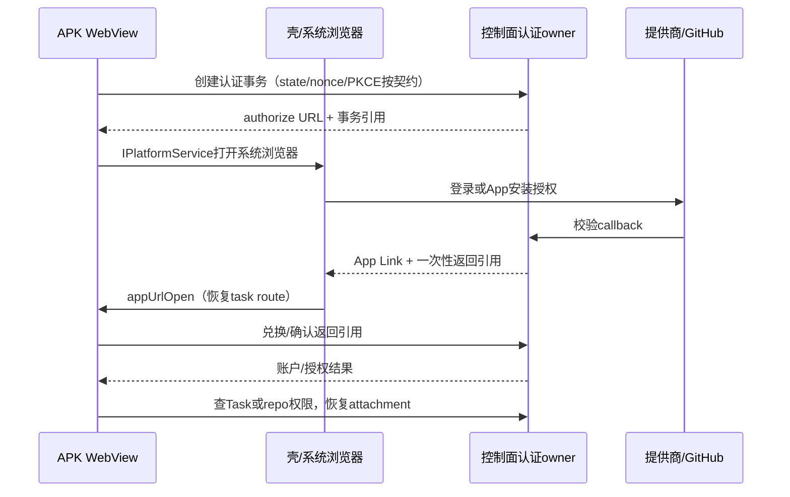

# Spec 05 — Android APK（Capacitor 壳，无推送）

**状态（2026-10-06 更新）：已移除。** 按范围收敛决议（[00 §11⑥](./00-overview.md)），云客户端只有 Web（含手机浏览器），Android 壳超出范围：`apps/android-shell/` 骨架已删除，本文件仅作为历史设计记录保留，不再属于路线图，其 A0–A4 验收全部作废。

以下原文保留为历史材料，不构成当前实施范围。

---

状态：实现方案草案（历史）；Capacitor 工程、webDir 内置产物、签名发版与全部 A0–A4 验收未实现且已作废。
父文档：[00-overview.md](./00-overview.md)。
前置：[04-web-client.md](./04-web-client.md) 的 Web 云闭环、移动交互、认证与恢复通过 M5 验收；本工程原属 M6。

## 1. 定位和当前基线

APK 复用 `packages/web` 云页面和 `@zcode/ui`，不维护第二套业务 UI。Project/Task/Run、input、审批、PR 和恢复走同一控制面协议。壳只负责资源加载、系统浏览器/深链、返回键、前后台与 platform adapter；Agent 不在手机运行，不后台常驻。

当前 Web 有 Vite build 和浏览器 OAuth，尚无 `apps/android`、Capacitor 配置、Gradle 工程或 Android 发布入口。下文目录、模块、命令和测试全部 **planned**；不能将 APK 标为已实现或假定已有 `build:android`。

首期不含推送、通知栏进度、iOS、小组件、离线执行和原生 Agent。最近 metadata 缓存仅供离线显示，标记上次同步时间；离线不接受输入/审批。功能同 Web 指云业务闭环，不宣称具备 Desktop 原生内嵌浏览器、本机终端、外部编辑器能力。

手机到 Desktop 的既有远控仍是独立模式。APK 后续若提供此入口，必须复用 Desktop 已有 Host attachment，不能因此新增 Agent/Host/CloudTask。

## 2. 工程与资源策略（planned）

```text
apps/android/                    # planned
  package.json                   # 固定Capacitor版本、明确脚本
  capacitor.config.ts            # webDir指向已准备的Web产物
  android/                       # Gradle原生壳
  scripts/                       # 复制/配置校验/构建入口
```

内置产物使用 `webDir`；`server.url` 是在 WebView 加载外部 URL，官方用于 live reload，不是内置包路径。参考：[Capacitor 配置文档](https://capacitorjs.com/docs/config)。A0 固定实际 Capacitor/JDK/SDK/Gradle 版本并登记支持矩阵、CI 和构建命令。

A0 之前的最小骨架已落在 `apps/android-shell/`（单 Activity + `WebView`，Kotlin，AGP 8.5.2 / Kotlin 1.9.24 / Gradle 8.7，`compileSdk 34` / `minSdk 26`）：加载**配置 origin 上的 Web 云页面**，实现 §3.1 的 origin 校验与 fail-closed（含首次启动的 origin 配置对话框）、§5 的返回键/外链交系统浏览器、§6 的 WebView 进程回收后重建。它**不是**上表规划的 `apps/android`：不含 Capacitor、不含 webDir 内置产物（因此 release 仍依赖远端 Web 部署）、不含深链/OAuth/推送，构建与限制见 `apps/android-shell/README.md`。上述 Capacitor 工程仍是 M6 目标形态。

首期 **内置 Web 产物，随 APK 发版**：Web build → 复制 webDir → Capacitor sync → 签名 APK。不承诺“部署 Web 即更新 APK”。控制面独立升级，必须有协议版本/最低兼容 APK 检查；不兼容时显示可操作更新页，不能忽略 schema 差异继续提交。

热更新为后续独立方案，需签名 manifest、资源完整性、允许来源、原子切换、坏包回退、桥接/API 兼容窗口及凭据 origin 稳定性。验收前不引入更新插件或远程 JS 任意下载。内置包保证启动资源可用，不保证离线能使用云服务。

## 3. origin、HTTP、WS与凭据

### 3.1 显式控制面 origin

- 注入公开非敏感 `controlPlaneOrigin`，release 只允许 HTTPS origin，对应 attachment 用 WSS；开发地址独立，不进 release。
- HTTP API、metadata events、认证、附件、WS 都从此 origin 派生。不能取内置 WebView 的 `window.location.host`（通常 localhost）作为控制面。
- 当前 `packages/web/src/main.tsx` 的 WS 从页面 host 计算，`/api/server-info` 是相对路径；先在 04 的 client adapter 改为显式 origin，再给 APK 复用。
- 缺失/无效 origin 启动即配置错误页；不回落本机 `/ws`、Desktop 服务或调试地址。
- App Link 只给 taskId/认证返回引用，不能覆盖控制面 origin。

### 3.2 跨 origin 认证

内置 WebView、系统浏览器、控制面可能是三个 origin，cookie/localStorage 不天然共享。03 的认证必须支持以下契约，不能只写“沿用 Web cookie/token”：

| 项目      | 首期要求                                                                                               |
| --------- | ------------------------------------------------------------------------------------------------------ |
| HTTP      | 明确 session cookie/token；CORS 精确允许 origin；credential 模式经实机验证，不能通配 origin 携带凭据   |
| WS        | 浏览器/WebView不能任意设 upgrade header；用03规定的短时 attachment票据或明确 cookie；绑定账号/task/run |
| 保存      | 尽量复用共享账户层；壳不复制账户业务状态；需要原生安全存储时由唯一 platform credential adapter读写     |
| 退出      | 清 WebView凭据/attachment，服务端撤销会话/票据；不停止云任务                                           |
| 日志/链接 | 不传长期 token 深链，不记录 token/一次性code/完整认证query                                             |

当前 `packages/web/src/auth/browserOAuthCredentialRepo.ts` 使用 localStorage/sessionStorage，`webAuthService.ts` 依赖当前 origin 和 pending nonce。必须验证实际 WebView origin、回调和进程恢复；不能据此认定跨 origin 已兼容。

## 4. OAuth与GitHub App授权

登录、GitHub App安装/授权在系统浏览器进行，WebView不内嵌提供商登录页。结果通过已验证的 App Link/回调交共享账户层兑换；深链无长期 token。



- 认证owner校验state/nonce/返回引用；不能依赖外部浏览器的sessionStorage读取WebView pending nonce。共享账户层记事务引用和返回Task route。
- 冷启动、后台返回、重复callback幂等；取消/拒绝授权保留草稿；code不得重用。
- App Link部署 `assetlinks.json`，匹配applicationId和签名证书；debug/release证书分开，不把签名私钥入仓。
- 若选 custom scheme，只接协议限定的返回，不能将任意 `zcode://` URL 当认证成功；涉及认证信息时优先验证HTTPS App Links。
- 事务过期、browser被杀、WebView丢进程有可读恢复入口；不静默新建Task/run或重发prompt。

## 5. 深链、返回与平台适配

稳定任务入口统一 `/?task=<taskId>`；外部HTTPS App Link映射到此路由。壳可解析 `zcode://task/<taskId>`，不另造 `/s/:sessionId`；Session/bridgeSessionId不是稳定产品入口。

| 情况                         | 行为                                              |
| ---------------------------- | ------------------------------------------------- |
| 已登录任务深链               | 查访问权和Task快照；draft/历史页或attach当前run   |
| 未登录深链                   | 保留taskId，登录后重查；不读前账号缓存            |
| 不存在/无权/已归档/无活跃run | 错误或只读页，不自动重开                          |
| 冷/热启动                    | launch URL和运行中URL事件交唯一router adapter去重 |

| 壳能力        | 计划行为                                                                       |
| ------------- | ------------------------------------------------------------------------------ |
| 外链          | 经 `IPlatformService` 到系统browser；PR/授权不替换根WebView                    |
| 返回键        | 先关菜单/抽屉/面板，再路由返回；首层按Android退出；不停止Task                  |
| 前后台        | 前台重新认证/快照对账/attach；后台断线不改服务端Task                           |
| 常亮          | 用户可选择任务观看前台常亮；离页/后台立即释放；无后台保活                      |
| 键盘/安全区   | 复用04响应式，composer/发送/审批可见                                           |
| 附件/下载     | 明确platform capability；附件传当前run，手机path不作sandbox path；用户动作下载 |
| Native bridge | 最小插件清单与导航allowlist；外站不得获得内部bridge能力                        |

插件调用集中在platform adapter，不散入共享业务组件，不直接调 `window.zcode`。壳不持有Project/Task/input的第二套状态。

## 6. 弱网与进程回收

- 使用03/07的持久cursor和快照。缓存是旧投影，前台先对账再允许审批/写文件。
- 首input 202后被杀：控制面继续建run/投递；重开只查状态并attach，不执行客户端autoSend。
- running时断网/休眠/被杀不影响run；恢复补缺去重，不另起Agent。
- HTTP成功但响应丢失保留同commandId/幂等键，查input，不能换key重发。
- 缓存按账号隔离、标最后同步；退出清可见缓存。不承诺完整离线会话/文件/离线input队列。
- run已停止/expired时展示保存的产物与真实恢复能力，不承诺从已毁sandbox完整恢复sqlite。

## 7. M6实施和发布

| 子阶段        | 工作                                              | 退出条件                                           |
| ------------- | ------------------------------------------------- | -------------------------------------------------- |
| A0前置/工具链 | M5移动Web验收；固定工具链；受控工程/脚本          | Web无客户端常驻依赖，可复现debug build，许可证清单 |
| A1资源/网络   | webDir、origin、HTTP/WS认证/错误页                | release不访问localhost API，真实TLS/CORS/WS通过    |
| A2壳能力      | App Links、系统browser登录、返回/前后台、platform | 冷/热启动/回调正确，无第二套业务状态               |
| A3全验收      | 实机弱网/杀App、多端、交互、签名release           | 下表E2E通过，API兼容/更新提示正确                  |
| A4发布        | 可重复build、签名保管、版本/证书/产物记录         | 安装/升级/回退明确，持久Task/input不丢             |

APK不阻塞Web上线。签名由发布环境持有，凭据不入仓；新增原生依赖需登记来源、版本和许可证，结合现有 `scripts/third-party-notices.mjs`、`third-party/inventory.json` 与 `THIRD-PARTY-NOTICES.md` 的产物机制扩展原生声明。

## 8. 验收（全部planned）

| ID   | Setup / Action                             | Assertions / Evidence                             |
| ---- | ------------------------------------------ | ------------------------------------------------- |
| A-01 | release内置包实机启动                      | webDir资源，HTTP/WSS只到配置origin，无live-reload |
| A-02 | 系统browser登录成功/取消/过期/重复callback | state/返回引用正确，存储origin不混，草稿保留      |
| A-03 | 安装App/仓库授权后返回                     | 权限重查，无token深链，无权repo不可访问           |
| A-04 | 首input持久202后杀App                      | CLI继续且admit一次，重开只查询/attach，无重复run  |
| A-05 | running/awaiting-input断网/休眠/杀进程     | 执行继续，恢复补齐，旧审批/epoch拒绝              |
| A-06 | Web/APK同Task，两端同审批                  | runtime只决定一次，投影一致，重复有明确结果       |
| A-07 | 深链冷/热、未登录/无权/不存在/停止         | `/?task=`一致，登录保留目标，无隐式重开           |
| A-08 | 横屏/软键盘/长输出/返回/两主题/中英        | 关键动作可达，返回不停止，常亮释放                |
| A-09 | 离线首次/缓存启动后恢复                    | 网络状态可读、缓存标旧，不接受离线执行，恢复对账  |
| A-10 | 换账号/token失效/WS票据过期                | 缓存隔离，认证恢复，不attach前账号                |
| A-11 | origin缺失/不安全/外链改origin             | 显式失败，无本机fallback，bridge不授外站          |
| A-12 | APK覆盖升级、API不兼容                     | Task/input不丢，更新页可操作，无伪成功            |

当前无Android runner/原生测试命令。A0登记实际构建、安装、设备测试入口；分别保留网络、控制面Task/input、CLI admission和实机证据。实现时执行仓库typecheck/lint及适用架构检查；APK build/实机E2E独立报告，Web编译通过不能代替原生验收。
