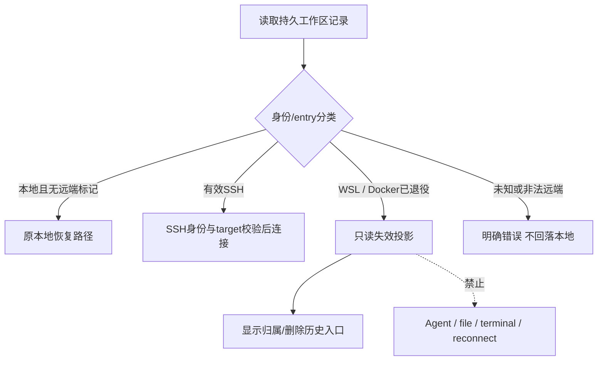

# Spec 06 — Docker / WSL 远程目标退役与旧数据保护

状态：目标设计；Docker/WSL 退役尚未实施（2026-10-06 云端实现代码整体回退后，退役改动同样不在工作区）。
父文档：[00-overview.md](./00-overview.md)。
执行阶段：M5；前置 M3 Web 云闭环、M4 保存/停止/PR 验收通过，并完成 SSH 回归基线。

实施决议（2026-10-06，执行完成）：按本文件 §2–§6 **完成原子退役**（server/shared/services/desktop/ui/web/CLI 同一轮类型闭合 + docs/skills 同步）。落地要点：活跃 `RemoteTarget` 只留 SSH；`remote:wsl:`/`remote:docker:` 识别为退役远端身份且稳定拒绝（`remote.targetRetired`），不回落本地/SSH；新增 `RetiredRemoteWorkspaceEntry`（严格 schema）作为只读失效投影，`PersistedWorkspaceSessionEntry` 容纳它；settings 用受限 legacy reader 只转换 `lastWorkspaceSession` 的退役记录、其余字段保留（`packages/services` 迁移测试覆盖幂等与整份 settings 保护）。删除的 backend/探测/proxy 与旧 happy-path 测试替换为「拒绝/失效/迁移」回归。

验证（历史记录，对应已回退的实现，不代表当前工作区）：`pnpm typecheck` 0 错误（原子闭包证据）；`pnpm lint` 72 warnings / 0 errors（未高于基线）；`pnpm architecture:check --changed` 0 violations；新回归测试 `retiredRemoteTargetScan`(3)、`settingServiceRetiredRemoteMigration`(2)、`remoteTargetRetiredHttp`(3)、`retiredRemoteTargetReadonly`(4) 全绿；`shared` 39、`services` 12、`ui` 32、`client` 29、`server` cloud 376（371 pass / 5 凭据门控 skip）全绿；R-10 扫描（backend/connect options/探测方法名）仅命中扫描测试自身的禁用清单，无活引用。

仍未验证（如实）：R-01/R-07/R-08/R-09 的桌面交互与 Windows/WSL 宿主实测无法在本机执行（无 GUI/Windows 宿主）；settings 迁移为单测级证据，未在真实用户 settings 文件上演练（首次启动升级路径需在真机回归）。

## 1. 退役范围

退役的是 ZCode 产品的 Docker/WSL **远程连接目标**：docker exec / wsl.exe backend、选择器、连接协议、目标探测、恢复重连和相关 IPC。新云任务在 provider 沙箱运行，SSH 为保留的手动远端目标。

不删除 Docker/WSL 作为开发/宿主工具的全部引用：容器构建镜像、CI、用户 repo 中的 Dockerfile、Windows/WSL 路径和启动适配、ZCode 在 WSL 环境运行、打开宿主编辑器等能力逐处判定。Desktop 本地开发、原 SSH、手机连接现有 Desktop Host 远控按总览迁移期保留；最终本地模式去留单独决策，不能借本清单删除。

当前云实现已撤销，本清单不恢复旧 sandbox package/src，不假定当前 `RemoteTarget` 有 sandbox 分支。出站云 bridge 是独立云 attachment 路径；传统 `RemoteTarget` 收敛为 SSH，是否需要另立 Cloud target 契约由 02/07 的传输设计确定，不能为了 UI 下拉硬塞 sandbox backend。

## 2. 已核查的当前源码

| 文件/位置                                                                                                                         | 当前事实                                                                        | 计划处理                                                 |
| --------------------------------------------------------------------------------------------------------------------------------- | ------------------------------------------------------------------------------- | -------------------------------------------------------- |
| `packages/server/src/remote/docker-backend.ts`、`docker-detect.ts`                                                                | Docker连接/探测                                                                 | 删除远程目标实现及导出                                   |
| `packages/server/src/remote/wsl-backend.ts`、`wsl-detect.ts`、`wslProxy.ts`                                                       | WSL连接/探测/proxy                                                              | 删除目标实现，先排除宿主复用                             |
| `packages/server/src/remote/create-backend.ts`                                                                                    | switch 为 ssh/wsl/docker                                                        | 收敛SSH；出站cloud不复用此switch                         |
| `packages/server/src/remote/index.ts`                                                                                             | 导出上述backend/探测/列表类型                                                   | 与consumer原子清理公开入口                               |
| `packages/shared/src/remoteTarget.ts`                                                                                             | `RemoteTarget = SSHConnectOptions \| WSLConnectOptions \| DockerConnectOptions` | 活跃目标契约只留SSH                                      |
| `packages/shared/src/validation.ts`                                                                                               | 连接/IPC等使用三种target schema                                                 | 活跃协议拒绝已退役target                                 |
| `packages/shared/src/protocol.ts`                                                                                                 | 三种 `RemoteTargetSnapshot`、`PersistedWorkspaceSessionEntry`                   | 拆分活跃快照与只读legacy失效记录                         |
| `packages/shared/src/validationAppSettings.ts`                                                                                    | `lastWorkspaceSession`读取支持三种目标                                          | 先迁移再严格校验，保护整份settings                       |
| `packages/shared/src/remote-workspace-identity.ts`                                                                                | parser/builder支持ssh/wsl/docker；部分调用方区分remote/local                    | 保留退役识别，禁止旧identity回落本地path                 |
| `packages/shared/src/platform.ts`                                                                                                 | target/editor类型；isDockerAvailable/listWSLDistros/listDockerContainers        | 按引用清理远程目标接口，保留宿主能力                     |
| `packages/ui/src/hooks/useRemoteConnectionForm.ts`                                                                                | 三种目标与探测状态                                                              | 收敛SSH表单/props/候选项                                 |
| `packages/ui/src/RemoteConnectionDialogContent.tsx`、`RemoteConnectionFields.tsx`、`SSHDialog.tsx`                                | 目标tab、步骤、验证、连接动作                                                   | 移除退役入口；Cloud provider选择留在任务创建             |
| `packages/ui/src/lib/remoteWorkspaceHistory.ts`、`root/useRemoteWorkspaceHistory.ts`、`root/remoteWorkspaceSessionPersistence.ts` | 持久历史、恢复重连、identity、凭据                                              | 读legacy失效记录，禁止恢复连接                           |
| `apps/zcode-cli/packages/bootstrap/src/zcode-protocol/workspace.ts`                                                               | 从workspaceId解析远端路径，非法remote已有拒绝                                   | 保护拒绝语义；cloud不透明identity需单独workspacePath契约 |

以上为现有文件，下面新增legacy表示/迁移测试均为 **planned**。移除前仍需通过 `rg --files` 和导出引用查询补齐consumer；本表不承诺固定行数/固定引用数量。

## 3. 活跃类型与持久历史分离

### 3.1 活跃接口

- 删除 `DockerConnectOptions`、`WSLConnectOptions` 与对应连接schema/adapter；公开 `RemoteTarget`、连接factory、IPC、platform和所有consumer在同一编译单元一致。
- Cloud任务创建通过repo/provider而非远程连接向导。向导只SSH；provider不成为“SSH/Docker/WSL/云沙箱”同列目标。
- 旧kind的HTTP/IPC请求返回明确 `remote.targetRetired` 或等价稳定code，不尝试任何 docker/wsl 执行，不把它转换为SSH/本地请求。
- rolling版本兼容以协议版本/能力判断，旧客户端提示升级；旧target不在新版backend残留为兜底。

### 3.2 历史失效投影（planned）

旧记录只保留展示/用户数据归属：原kind、label、workspaceIdentity、workspacePath、最近打开时间、`invalidReason: target-retired`。可以提供删除历史/导出信息，不能重连/启动任务/打开本地同路径。

活跃target与legacy失效记录使用独立 persisted entry kind，计划契约如下：

```ts
interface RetiredRemoteWorkspaceEntry {
  kind: "retired-remote";
  retiredKind: "wsl" | "docker";
  workspacePath: string;
  workspaceIdentity?: string;
  label?: string;
  lastOpenedAt?: number;
  invalidReason: "target-retired";
  originalAuthority?: { distro?: string; user?: string; container?: string };
}
```

字段以严格schema校验，时间为非负整数，authority仅保留显示元数据；不包含密码/私钥/可执行target。`PersistedWorkspaceSessionEntry`加入此只读分支，活跃 `RemoteTarget`、backend和连接接口不接受它。legacy entry没有identity时也不能按path转本地。删除历史仅删投影，原tasks/session数据不连带删除；备份保留。

### 3.3 settings迁移顺序

当前 `packages/services/src/setting/settingService.ts` 对 `appSettingsSchema.safeParse` 失败会返回整份默认设置。因此仅缩小 `validationAppSettings.ts` 联合类型会让一条WSL/Docker历史影响语言、主题、账号/配置等无关字段。必须：

1. 读取原JSON，保留备份与版本；不要先以新活跃schema解析整份数据。
2. 通过受限legacy reader识别 `lastWorkspaceSession` 和现有更老历史格式中的退役记录，转换为只读失效表示；其他字段保留。
3. 对转换结果运行新schema，成功后异步原子写入；重复启动幂等。
4. 转换/校验失败保留原文件、展示明确错误；不能为清理历史写默认配置或删除原数据。
5. 失效记录仍能显示，SSH/本地条目按原恢复语义，凭据key归属不误删。

没有 `zcode-cloud-repo-projects` 或旧云Task数据迁移任务。真正当前存量是上述本地/远端工作区历史；cloud数据不存在，不运行旧云迁移脚本。

## 4. identity与路由边界

`remote:wsl:...`、`remote:docker:...` 虽然不再可连接，仍必须被识别为**退役远端身份**。不能让parser返回null后被消费方按本地workspacePath继续执行。



- 身份key仍用 `workspaceIdentity?.trim() || workspacePath`；已有远端标记一旦非法/退役，不能因fallback把同path本地数据当成原远端。
- 不重写旧identity为cloud-task，不把旧远端task index搬到控制面作为已实现cloud任务。
- `cloud-task:<taskId>` 不可从字符串还原路径；cloud workspaceRef显式携带真实 `workspacePath` 与当前run tuple（07/08）。类型新增和consumer更新与legacy退役规则对齐。
- 退役远端的stream、pinned/timeline条目可显示失效归属，禁止自动补建local tab或复活任务。启动恢复、context actions、双击导航、打开编辑器等入口均守卫。

## 5. 跨包consumer清理清单

### Server / Shared

删除backend、detect、proxy、公开export及死依赖；factory仅SSH。检查deploy/平台支持判断哪些为SSH/宿主共同能力，不能整组删除。Shared同步连接类型、snapshot、platform、schema、索引导出与身份工具。`validationAppSettings.ts`只读legacy reader保留最小必要字段。

### Desktop

已核查目标文件：

- `packages/desktop/src/main/desktopWslTargetResolver.ts`
- `packages/desktop/src/host/windowRemoteConnectionRegistry.ts`、`hostRemoteWorkspaceProxyState.ts`、`hostWorkspaceTaskTracker.ts`
- `packages/desktop/src/main/desktopRemoteSessions.ts`、`desktopHostProcess.ts`、`desktopMainIpcRemote.ts`、`desktopRuntimeEnv.ts`、`index.ts`
- `packages/desktop/src/preload/index.ts`
- `packages/desktop/src/renderer/src/desktopPlatform.ts`、`remoteWorkspaceSessionServices.ts`
- `packages/desktop/src/main/openInEditor.ts`、`editors.ts`

以上按远程target分支清理。`editors.ts` / `openInEditor.ts` 和启动环境中的WSL宿主路径/执行适配先分类，宿主能力保留并注明原因。不因清理registry删除SSH owner/lease、跨Host路由、stale run防护或窗口Host隔离。

### UI / Web

清理上述表单及 `useCancelPendingRemoteConnection`、`useRemoteConnectionLogs`、目标验证/helper的调用链；完整路径从当前源码查找。清理 `useTaskListItemContextActions.ts`、`root/reconnectingRemoteWorkspaceLogs.ts`、`root/useRemoteWorkspaceHistory.ts`、`app-shell/taskNavigationWorkspace.ts` 的可执行退役分支，保留只读失效呈现。

清理 `packages/web/src/main.tsx` 的platform目标探测方法，与 `IPlatformService` 原子对齐；不能因云模式不使用这些方法就留下不匹配类型。i18n只删可执行目标文案，新增失效原因/帮助并保留展示旧记录必需名称。

### 文档 / 技能 / 构建

同步现有 `AGENTS.md`、`README.md`、`README.en.md`、`.agents/skills/`、`CONTEXT.md` 和实际配置里关于远程target的引用；Docker构建/WSL宿主说明保留。`.agents/skills/feature-boundary-planner/references/zcode-feature-graph.yaml`如有target节点，按已核查source更新，不恢复缺失历史模块。

`architecture-policy.yaml`是否变化由实际模块/公开入口检查决定，不能预先写“无需变更”。新增cloud module已由总方案规划，删除backend不意味着相关依赖边界可豁免。

## 6. 实施顺序与原子PR

| 步骤             | 产物                                                              | 退出条件                                                          |
| ---------------- | ----------------------------------------------------------------- | ----------------------------------------------------------------- |
| R0调查/fixture   | 全部export与consumer、宿主/target分类；旧settings/identity样本    | 无凭据/真实数据的fixture；SSH/Desktop/远控基线可跑                |
| R1契约与测试     | 活跃SSH契约、legacy表示、迁移/拒绝/恢复测试                       | 先补行为测试，覆盖整份settings保护和非法identity                  |
| R2单个原子实现PR | server + shared + desktop + ui + web + CLI consumer + docs/skills | 同一PR类型闭合；删除实现/公开export/props/IPC；所有consumer可编译 |
| R3验证/发布      | 静态检查、runtime/交互E2E、数据备份/回退说明                      | SSH/宿主WSL/Desktop/远控通过；旧记录只读失效                      |

不能拆成“server+shared先收窄类型，下一PR再改desktop/ui”。可在一个PR分commit方便审阅，但每个对外可发布版本必须类型/调用闭合，不能保留可运行目标作为中间态。

回退保护：升级前保留settings备份；新版legacy表示与旧版本的读取兼容必须在发布说明中定义。回退代码不能写坏新版持久数据；不能删除用户历史文件，也不因回退恢复已退役的连接入口。需要回退到仍有旧target的产品版本时按明确版本策略处理，不混合运行新旧backend。

## 7. 验收计划（全部planned）

| ID   | Setup / Action                                      | Assertions / Evidence                                           |
| ---- | --------------------------------------------------- | --------------------------------------------------------------- |
| R-01 | Desktop/Web远程向导与Cloud任务创建                  | 向导仅SSH；provider在repo任务页；无Docker/WSL探测IPC/进程       |
| R-02 | settings含本地、SSH、WSL、Docker混合记录升级        | 两退役项只读失效；其他项/语言/主题/配置保留；不返回整份defaults |
| R-03 | 同一迁移重复/中断写入/解析失败                      | 幂等、原子、保留源文件/备份，不删用户数据                       |
| R-04 | 直接HTTP/IPC构造旧kind                              | 明确target-retired，不执行docker/wsl/本机路径                   |
| R-05 | 旧identity与同路径本地workspace并存，点击/恢复/菜单 | 不串台、不本地fallback、不新起Agent，不打开本地文件             |
| R-06 | unknown/malformed remote identity                   | 明确错误，无path fallback；CLI/service/UI一致                   |
| R-07 | SSH密码/私钥/canonical path、重连、不同host同path   | 原身份/凭据/owner边界保持；完整服务到SSH                        |
| R-08 | Windows宿主、WSL内启动/编辑器路径                   | 宿主能力不回归；无退役远程入口                                  |
| R-09 | Desktop本地运行、手机连接既有Host，连续/回放流      | 无CloudTask；不另起Host；owner/lease和stale保护保持             |
| R-10 | 清理后export/依赖/IPC扫描                           | 无可执行退役target；legacy/宿主引用有明确用途                   |

实际测试入口按目标包scripts和源码确认，当前不能声称存在统一远程E2E。实现前登记runner及步骤；删除旧目标happy-path测试时替换为拒绝/失效/迁移回归，不能只降低覆盖。

必须实际执行 `pnpm typecheck`、`pnpm lint`、`pnpm architecture:check --changed`；运行 `pnpm knip` / `pnpm dep:refs`确认死export并核查真实引用，保留baseline失败说明。修改前按architecture-governance读取受控模块context；行为测试/E2E和Windows/WSL宿主验证单独报告，不能把编译成功当作用户数据迁移正确。
