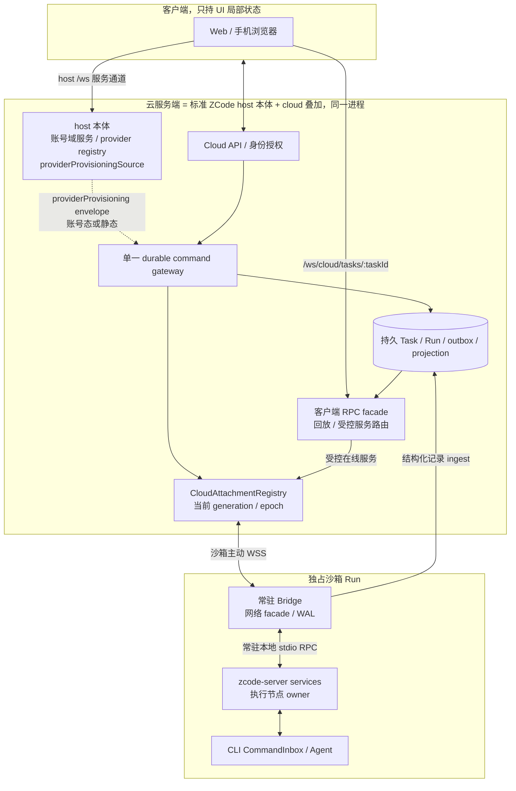
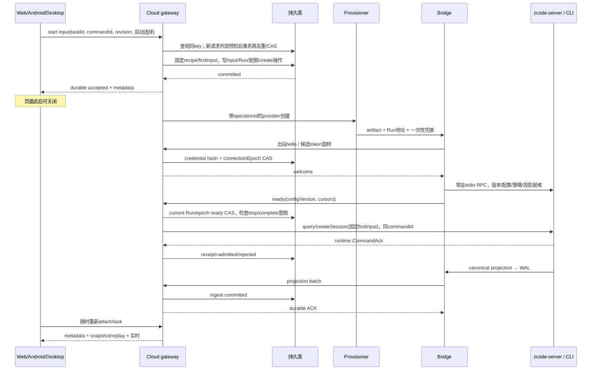

# Spec 07 — Cloud Agent 连接架构与平台边界

状态：目标设计（2026-10-06 云端实现代码已整体回退）；基于当前源码，待实现。
父文档：[00-overview.md](./00-overview.md)
关联：[02-bridge-protocol.md](./02-bridge-protocol.md)、[03-control-plane.md](./03-control-plane.md)、[04-web-client.md](./04-web-client.md)、[08-project-task-model.md](./08-project-task-model.md)

## 1. 当前可以复用什么

| 当前源码                                                                | 已有事实                                                                                                                             | 不能据此推断的云能力                                                                                         |
| ----------------------------------------------------------------------- | ------------------------------------------------------------------------------------------------------------------------------------ | ------------------------------------------------------------------------------------------------------------ |
| `packages/server/src/http.ts`                                           | `/api/connect-remote` 与 `/ws/remote/:id`；后者从 Map 一次性取走连接，仅注册 file/git/system/terminal                                | 不是可多端重连的云 Task attachment，没有云 provision/事件库                                                  |
| `packages/server/src/remote/connect.ts`、`backend.ts`、`ssh-backend.ts` | 检测/部署/握手、远端 stdio RPC、SSH backend                                                                                          | 没有云 run 的持久 metadata、凭据恢复、generation fencing                                                     |
| `packages/server/src/entry-stdio.ts`、`stdio.ts`、`stdio-lifecycle.ts`  | zcode-server 远端服务装配与退出处理                                                                                                  | stdin EOF 会回收 services，不能称网络断了 Agent 仍永远运行                                                   |
| `packages/client/src/websocket.ts`、`remoteServiceAccess.ts`            | SocketProtocol/ChannelClient 的类型化服务代理                                                                                        | 代理 getter 存在不代表任一服务端已注册全部 channel                                                           |
| `packages/services/src/zcode-agent/zcodeAgentConnectionScope.ts`        | 连接可信上下文、订阅所有权、profile 路由                                                                                             | 不能靠客户端 mode header 升格成 Host                                                                         |
| `packages/shared/src/serviceAuthority.ts`                               | desktop-local / desktop-attached-remote / standalone-server 三种现有 authority                                                       | 尚无云控制面/云执行节点模式                                                                                  |
| `packages/shared/src/remote-workspace-identity.ts`                      | SSH/WSL/Docker identity 构造解析                                                                                                     | 尚不支持 cloud-task 逻辑身份                                                                                 |
| `packages/services/src/node.ts`                                         | **云入口的 host 本体装配来源**（`createLocalServices`）：原有本地/远端服务装配、provider provisioning、runtime preferences authority | 不能据此把本机执行域当作云任务/浏览器请求的 fallback（路由边界见 §2）；云端仍需 cloud 叠加与 attachment 路由 |

`packages/control-plane`、`packages/sandbox-bridge` 仅生成物目录不算源码或当前 workspace package。旧的 `sandboxBridgeSessions.ts`、`webRemoteChannelOverrides.ts`、云页面 responder、自动公网 tunnel 不再作为基线引用。本文所有 `/api/cloud/*`、`/ws/cloud/*` 与 `packages/server/src/cloud/` 路径均为计划新增。

## 2. 产品与部署边界

1. 仓库 Task 一任务一沙箱；Project 只分组和授权入口，不持有执行连接。打开 Task 才 attach，不为每个 Project 在侧栏后台常开连接。
2. 云控制面负责 metadata、持久 command outbox、持久事件投影、路由、鉴权与生命周期；runtime admission/执行/权限/队列仍在远端 CLI/runtime。
3. **云服务端运行 host 本体（含本机执行域），但云任务与浏览器执行请求只能路由到沙箱 attachment**（[03 §2](./03-control-plane.md)，决议⑧）。运行时必须在沙箱；断连返回 attachment-unavailable，不回落部署机 cwd/home。SSH 远端不再是云执行目标（2026-10-06 决议，见 §11）。
4. 云客户端的应用设置、授权和凭据是服务端账号/安装作用域；浏览器只持 UI 草稿/overlay、展开、焦点等局部状态，不负责 runtime settings responder。
5. 沙箱只有出站连接（2026-10-06 决议移除云 SSH attachment，原"SSH 是单独的服务端 adapter"条款作废，见 §11）。
6. 原 Desktop 的 window-scoped Local Host、SSH 连接注册表、mobile attachment/relay、owner/lease 路由保留。云 Task 的连接不是“手机接管桌面已有 Host”的同义路径。
7. **交互同构原则（2026-10-06 决议）**：控制面与沙箱内 zcode-server 的交互方式与 SSH 模式保持同构——同一套 stdio RPC、服务面、命令信封与配置安装（provider provisioning）；沙箱特有复杂度只允许来自三处：传输（反向 WSS/Bridge）、生命周期（provider 机器归控制面）、无人值守恢复（断线重连/围栏）。新的沙箱专用机制若无法归因到这三者，不得侵入交互层。

云模式必须通过新的 entry/装配 profile 与原有 standalone-server 区分。计划新增 `packages/server/src/cloud/adapters/entry-cloud*.ts`、`module.ts` 装配（名称待架构受控上下文确认），默认 fail closed。云入口按决议⑧启动 host 本体并把 `/ws` 服务通道挂到云入口（同源、lite-token `?token=`，[12 §4](./12-account-domain.md)）：浏览器经该通道获得账号域与 web 模式同款 host 服务；云任务的执行目标仍只路由沙箱 attachment（§2 第 3 条、03 §2）。

## 3. 目标拓扑与所有者

Metadata 和连接状态不是同一个对象。`Task.activeRunId` 是数据库事实；在线 socket/facade 是可丢失的 cache；客户端订阅是连接作用域；CLI runtime 事实不因 socket 重建而被重新创建。

依赖方向：Web/UI hooks → shared service contract → cloud facade/gateway → attachment port → 远端 services；云 orchestration → provisioning port/持久 repository。UI 不直接 Repo，services 不导入 `packages/server/src/cloud` 具体实现，cloud adapters 经包公开入口调用 services/RPC。

## 4. 身份、路由与 fencing

| 概念                          | 目标定义                           | 使用位置                                              |
| ----------------------------- | ---------------------------------- | ----------------------------------------------------- |
| projectId                     | 授权域中的项目记录 id              | 分组、repo 授权                                       |
| taskId                        | 一次工作的稳定 id                  | 页面路由、outbox、metadata、云授权                    |
| workspaceIdentity             | 仓库 Task 为 `cloud-task:<taskId>` | 标签/绑定/缓存/topic/队列隔离；跨 Run 稳定            |
| workspacePath                 | 当前远端实际路径                   | 文件、cwd、Git、终端、显示                            |
| runId / runGeneration         | 一次独占执行与 Task 内单调代际     | 生命周期、命令目标、旧 Run fencing                    |
| remoteSessionId               | 当前 Run attachment 路由 key       | 请求关联；不得仅路径匹配                              |
| connectionEpoch               | 同 Run 网络接管的单调代际          | 当前 socket/可信 RPC、ready/在线事件 fencing          |
| runtimeIncarnation / logEpoch | runtime 及 topic 内容代际          | command recovery、快照/增量恢复；不等同 network epoch |

服务端解析 Task 当前 Run，补齐 workspaceIdentity/workspacePath/remoteSessionId。客户端输入中的地址仅是预期版本，用于检测 stale，不能决定路由。路由 port 必须校验 `(taskId,activeRunId,runGeneration,connectionEpoch)`，所有异步回调回写时再 CAS，不能在 await 前查一次后无条件写入。

同仓库同 provider/path 的两个 Task 用不同 cloud-task identity；同 Task 重开用相同 identity、新 runId/generation。缓存如果存的是执行实例数据，还必须绑定 runGeneration；逻辑 identity 稳定不意味着旧终端/文件缓存有效。

当前部分 CLI createSession 以 workspaceId 还原 cwd。实现时同时传递可信 `workspacePath` 并建立映射契约，不能把 `cloud-task:*` 当本地目录，也不能靠复用旧 remote parser 偷渡 provider/path 格式。

SSH 保持 `remote:ssh:<authority>:<path>` 的既有 workspace identity（用于 Desktop 本机/远控路径）；云侧不再有 SSH 执行目标，云 Task 只落在独占沙箱。既有 owner/lease、跨 Host/stale-run 防护对原 Desktop/mobile 路径不变（2026-10-06 决议，见 §11）。

## 5. 计划端点与统一输入路径

| 端点                                             | 调用方            | 所有者与语义                                                          |
| ------------------------------------------------ | ----------------- | --------------------------------------------------------------------- |
| `POST /api/cloud/tasks/:taskId/inputs`           | 客户端/受控触发器 | 单一 durable gateway，先存 commandId+payload，再返回 receipt          |
| `GET /api/cloud/tasks/:taskId`                   | 客户端            | 数据库 metadata/current Run/receipt 摘要；离线也可读                  |
| `GET /api/cloud/tasks/:taskId/inputs/:commandId` | 客户端            | 投递 receipt；不把未知 ACK 猜为失败                                   |
| `GET /api/cloud/tasks/:taskId/events`            | 客户端            | topic/epoch/cursor 的持久分页回放；与 WS 用相同授权                   |
| `GET /api/cloud/events`                          | 客户端            | metadata 通知/对账入口，详细契约见 03                                 |
| `/ws/cloud/tasks/:taskId`                        | 客户端            | 认证后解析 activeRun；RPC facade + replayable 订阅，独立 client scope |
| `/ws/cloud/bridge/:runId`                        | 沙箱 Bridge       | 专属 token、runGeneration/connectionEpoch、RPC/持久 ingest            |
| `/api/cloud/assets/*`                            | 执行节点          | 经版本/hash 清单分发 bootstrap/runtime，入口细节见 01                 |

Project、provision/reopen/stop/extend API 与请求响应 schema 以 03/08 为准，创建流程见 [11](./11-project-task-creation.md)；本节只定义连接有关接口。全部尚未实现。

输入即使由 SessionPane 的 `sendConversationCommandV4` 发出，也必须经 cloud facade 转同一 durable gateway。HTTP 与 RPC 共享 idempotency key、payload hash、投递 receipt 和 outbox dispatcher；不能一个通路接受/排队，另一个通路直接执行。

读离线投影、写待投递输入与在线文件/终端有不同能力条件。无沙箱或Run断连时可读已存历史；首版新start仅draft、新append仅ready且无停止/验收意图，provisioning/disconnected不接新append。已接受输入的后台恢复和同key查询/重放仍按03执行，不因网络故障被当作新请求。客户端离线只保留草稿和unknown attempt，不接受新执行操作。文件/terminal/system/git 在线执行不可排进输入 outbox，断线返回 `attachment-unavailable`，不改用服务器本地服务。

## 6. 从输入到无人值守执行

Ready 是整体初始化屏障，不能只看 hello、进程出现、某条 RPC 成功或重试三次。Provider/model/prefs、command facts recovery、投影 WAL/快照与当前 epoch 全部就绪后才 dispatcher 放行。超时只能产出可恢复错误/operation 状态，不能将未同步事实视为成功。

M2 的无页面 ready 验证是节点能力/技术试验；公开接收与执行输入的产品 ready 还依赖 M3 durable gateway 和投影恢复完成，不能把阶段性 spike 当完整产品保证。

首个 prompt 已在控制面持久化，浏览器不承担 autoSend。ready 后的客户端重连不重新执行首个输入；多端同时打开同 Task 只增加订阅，不启动额外 Agent 或沙箱。

## 7. 服务分区与权限清单

不能把 RemoteServiceAccess 所有 getter 或“若干 service channel 原样可用”当云权限设计。计划由 cloud facade 使用显式 descriptor + 方法级 allowlist，并在每次调用校验账号/Task/current attachment。

| 服务族                                                                     | 权威位置                                                              | 云 facade 处理                                                                |
| -------------------------------------------------------------------------- | --------------------------------------------------------------------- | ----------------------------------------------------------------------------- |
| file / file-watcher / media-preview / Git / checkpoint / system / terminal | 当前远端执行节点                                                      | 在线调用，经 Run地址/路径/能力检查；禁止本机 fallback                         |
| zcode-agent / zcode-session 写命令                                         | CLI/runtime                                                           | cloud durable gateway 投递后由 runtime裁决；不能绕过outbox                    |
| 会话/history/sessions-index/workspace-config读                             | runtime事实；控制面持久投影为读副本                                   | 离线读持久副本，在线同epoch续流；不造第二份权威task索引                       |
| provider-settings / model-selection                                        | 账号配置权威在 host 本体；Run 应用版本在节点                          | 账号授权配置下发；运行时选择按既有命令/版本确认                               |
| skills / plugins / MCP / commands / hooks / subagents                      | 远端执行作用域                                                        | 按Task/Run配置与能力开放；不引用控制面本机home                                |
| setting / OAuth / credential / coding-plan / usage 等账号服务              | **host 本体自带**（[12](./12-account-domain.md) §1.2/§4，零新增装配） | 浏览器经 host `/ws` 拿状态/操作接口；不另建账号子系统、不把账号服务复制进沙箱 |
| provider provisioning target                                               | 云服务端（host 本体 + cloud 层）→ 沙箱执行节点                        | 只允许云服务端内部装配调用；Browser不可通过频道名调用                         |
| native windows/dialog、Desktop CUA等平台服务                               | 原Desktop平台                                                         | 云Web使用IPlatformService适配；不伪装可用本机能力                             |

云 Task 列表来自控制面 metadata，不调用远端 `zcodeTaskService.listTasks` 作为产品 Task 注册表。既有 zcode-task/session/index 是远端 runtime 会话投影，cloud taskId 与 runtimeSessionId 建显式映射，不能因当前名词相近而共用主键/状态所有者。

鉴权发生在连接与每个写操作两层；跨Task、账号或过时代际拒绝。目标Task的metadata读权限不自动授予终端/root等所有运行能力。M1先建立权限图、scope、错误契约，M2/M3只开放闭环所需服务。

服务端云设置/凭据的作用域早于多账号上线就需建立：M1可采用单账号部署域，但所有repository/API键都携scope。禁止复制整个服务端credential store到沙箱，也不允许浏览器把providerEnv/任意backend/可信角色注入请求。

## 8. 执行节点 authority 与 Host 应答

当前 `desktop-attached-remote` 通过外部Host应答session runtime preferences；`packages/services/src/node.ts`将其配置为external。`zcodeAgentService.ts`超时返回-32022，CLI的`server-operations.ts`只对旧Host兼容错误提供有限fallback，其他错误会阻止runtime创建。云方案不能把“页面关了无人应答”留到多端阶段。

M2/M3新增云执行节点assembly/authority，具体schema纳入`packages/shared/src/serviceAuthority.ts`并同步现有解析/门禁，不能默认为desktop-local。节点获得只读、版本化账号policy snapshot和最小provider授权；本地服务端responder无需浏览器在线。

| 请求                                           | 云方案应答方                           | 离线规则                                               |
| ---------------------------------------------- | -------------------------------------- | ------------------------------------------------------ |
| runtime preferences / shell / memory /预算策略 | 执行节点从已授权configVersion快照应答  | 保留运行轮配置；新配置需服务器签发，不能取页面本地值   |
| provider/model配置与运行时headers              | 服务端账号授权 + 执行节点受控安装/刷新 | 已有授权可按明确TTL运行；过期fail closed并暴露原因     |
| permission/interaction                         | runtime是决定owner；授权客户端响应     | 无客户端保持pending或既定runtime策略，不由控制面自批准 |
| local path/file/terminal能力                   | 执行节点服务                           | 断连返回unavailable，不在控制面执行                    |

Config version属于Run已应用配置，设置存储属于账号；不能建多个互相广播的权威写路径。Cloud responder与Desktop现有Host responder分开装配，回环/回写由版本与明确所有者防止。

## 9. 多端订阅与恢复

v1云Task各端统一`web-remote-replayable`，Host上游可为可信RPC，但浏览器不能继承其可信权限。每客户端建立独立connectionId/subscriptionId/cursor/有界缓冲；复用runtime事实与控制面投影，不为手机或第二浏览器起Agent。

恢复规则与02一致：topic+runtime/log epoch+一致cursor；先snapshot或补齐至水位H，再接实时。授权/订阅注册与先到帧需保持现有connection scope的所有权顺序，不能靠“订阅后睡几十毫秒”避免竞态。

- 一端发输入：receipt与runtime投影按commandId在其他端可见；其他端打开不会重发输入。
- 一端慢消费：仅该客户端gap/resync，不能阻塞Bridge/WAL ingest或其他端。
- 一端断开：释放其scope，不释放共享Run，也不向新runtime误退订旧subscription。
- Runtime/log epoch变化：旧增量作废，读新snapshot；不能把connectionEpoch当topic logEpoch续接。
- 原Desktop本地/SSH continuous与mobile replayable链路仍分别验证；云接入不能删除原owner/lease、跨Host和stale-run边界。

## 10. 故障、重启与生命周期

| 事件                     | 目标行为                                                                                          |
| ------------------------ | ------------------------------------------------------------------------------------------------- |
| 客户端断网/关页          | 只释放客户端scope；服务器继续outbox/provision/Agent，重开可回放                                   |
| Bridge外网断             | Run=disconnected，UI显示重新连接；Agent继续、WAL累积；不自动expired                               |
| 心跳长期缺失             | 保留disconnected，provider核验/待对账，返回recovery-required错误；不视为终止证据、不自动开第二Run |
| 控制面重启               | DB恢复metadata/run/token hash/dispatcher lease，Bridge重新认证；未确认命令先query                 |
| 两个网络连接/旧回调      | epoch CAS接管，旧ready/状态/命令拒绝；async完成再核验generation                                   |
| Provider已确认回收       | Run终态、撤销attachment/token，Task/history保留；显式新Run                                        |
| 手动stop/checkpoint失败  | operation失败可见、保留Run；不能仅删连接或谎称已保存                                              |
| 同Task重新打开           | 新Run/generation，旧Run先确认终止；稳定Task身份，新实例缓存清理                                   |
| Runtime崩溃/命令结果未知 | query/持久facts恢复，receipt未知保持uncertain，不自动跨Run重发                                    |
| 投影存储或WAL容量故障    | ACK/准入边界可见，有界资源，明确停止新投递/恢复策略                                               |

持久projection是只读恢复数据，不是活runtime snapshot/任务队列。沙箱到期会丢失尚未归档的进程/文件状态；已ingest会话历史仍可读。Checkpoint/generation/外部Git副作用的处理由08/09定义，网络fencing不取代真实资源停止。

## 11. SSH 与云范围的收敛（2026-10-06 决议）

原 Desktop SSH 继续走 window-scoped Local Host 及远端注册表；手机远控复用已有 Host attachment。本设计不重新实现这条路径，也不将其配置/私钥复制到云。

**决议（2026-10-06，见 [00 §11](./00-overview.md) ⑥）**：产品确认原始设计目标为 GitHub App + 每任务沙箱 + 复用 SSH 模式的连接同构 + 沙箱生命周期管理；**云侧 SSH attachment（控制面作为 SSH 客户端连接用户主机）超出范围，已移除**。本节此前的 Web SSH 设计（旧 §11 差异表与 §11.1 P13 实施记录）随之作废，实施证据保留在 git 历史：

- 移除范围：`packages/server/src/cloud/adapters/ssh/`、domain 的 `sshTargetRef`、app 的 SSH attach service/dispatch、`SshAttachmentPort`、shared 契约的 `ssh-folder`/`ssh-attachment` 枚举与 `sshTargetRef`/`sshAttachmentRef` 字段、migration `ssh-attach` operation kind、UI 的 SSH 项目展示与创建入口、相应测试。
- 云 Project 只保留仓库（GitHub App）一种类型；云 Run 的 executionKind 只保留沙箱。
- **保留项**：①SSH 作为 Desktop 本机/远控的既有连接能力（本文档 §2.7 同构原则的前置语义之一）不变；②沙箱 runtime 与 SSH 模式**交互同构**：复用 `remote/handshake.ts`、`remote/stdio-socket.ts` 等公开原语与部署布局，这条设计原则不受移除影响；③既有 `remote:ssh:` 工作区身份的解析与保留逻辑用于本机模式，不回落本地 path。
- 原"云无人值守 SSH 需独立持久 host/可重连 IPC"的遗留项随功能移除关闭，不再是待办。

Docker/WSL 的移除按 06 执行并清理引用，与本决议无关。

## 12. 实施依赖与可审查交付

| 阶段                       | 本spec交付                                                                                      | 启动下一阶段的条件                                           |
| -------------------------- | ----------------------------------------------------------------------------------------------- | ------------------------------------------------------------ |
| M0 契约/基线               | 现有能力矩阵、地址/profile/所有者、public API与错误                                             | 00/02/03/08字段一致；未实现路径标注完成                      |
| M1 安全图/持久Task         | 云入口启动 host 本体 + cloud 叠加（`createLocalServices` + `/ws`），权限 scope，DB 与 operation | 云任务/浏览器执行请求只落沙箱 attachment；离线 metadata 可读 |
| M2 首provider/Bridge       | 本地RPC网络解耦、token旋转、授权配置、exporter spike                                            | 无浏览器可ready；网络断不EOF；恢复hook证据明确               |
| M3 输入/replay/Web         | durable command facade、projection WAL/ingest、Task订阅、平台适配                               | 关页继续执行、ACK丢失/控制面重启/慢端恢复通过                |
| M4 checkpoint/lifecycle/PR | stop/reopen结果与generation状态、只读历史/产物                                                  | provider真实终止，旧Run不污染，保存失败不谎报                |
| M5 多端 Web/清理           | 多客户端scope（桌面+移动浏览器）、清理Docker/WSL                                                | 原Desktop/mobile路径回归；两种delivery语义分别通过           |
| M6 Android（已移除）       | 不适用：2026-10-06 决议移除，见 §11                                                             | 不适用                                                       |
| M7 多账号/公网/webhook     | 条件性：单用户模型下不在路线图，见 00 §11⑤                                                      | 变更部署模型时重评                                           |

计划文件组为`packages/server/src/cloud/{domain,app,adapters}`与独立受控子模块`cloud/execution/{domain,app,adapters}`；attachments/commands/projections编排放app，IO实现放adapters；shared协议及服务端/客户端public入口同步扩展。具体架构module id要先登记策略并生成受控context，不将路径计划当architecture已合规。

已有命令仍是`pnpm dev:web`、`pnpm dev:desktop`、`pnpm typecheck`、`pnpm lint`、`pnpm architecture:check --changed`和按module-id的`pnpm architecture:context`。云entry/bridge/provider测试命令要在实现时新增package scripts，本文不虚构现成命令。

**修订记录（2026-10-07）：模式判定改为服务端驱动。** 原设计把 cloud/local 当作客户端/构建期开关（`?mode=`、`VITE_ZCODE_CLOUD_MODE`/`VITE_ZCODE_SERVER_MODE`、`VITE_ZCODE_CLOUD_ORIGIN` 加 origin 一致性校验），用户侧结论是「直接复用原本 zcode 的 web 模式，编译、启动、使用都不该先判断是不是 cloud」。

- 理由：①模式本来就是**部署事实**，客户端自报会与真实部署不一致（预览/换域名/同一产物多部署），且这个不一致只在运行时暴露；②两套模式判定意味着两套启动路径与两套失败面，回归面翻倍；③服务端在同一路径上回答模式后，编译产物与启动命令可以完全复用。
- 新契约（[04 §2.1](./04-web-client.md)、[W5 §3.1](./modules/W5-cloud-entry.md)、[W9 §4](./modules/W9-web-entry.md)）：单一入口 `packages/server/src/entry-http.ts` 读 `ZCODE_SERVER_MODE` 分派（`=cloud` 复用云启动事务，HOME 隔离先于服务图 import）；Web 客户端启动时同源探测 `GET /api/cloud/capabilities`——`200 mode=cloud`→云壳、`401/403`→云壳+凭据门、`200 mode=local`→本地路径（`?remote=` 不变）、其余→错误屏。本地分支也因此必须无鉴权回答该端点。
- **fail-closed 保留并加强**：探测不确定（404/5xx/网络失败/非法响应体/协议不兼容）一律停在错误屏，绝不回落 local；反 fallback 不再依赖客户端自律，而是「服务端不回答就无法进入任何模式」。云模式该端点仍需 lite-token（401 即客户端的「需要凭据」信号）。
- 影响面：`packages/server/src/entry-http.ts`、`packages/server/src/http.ts`（本地探测端点）、`packages/web/src/{main.tsx,cloud/cloudBoot.ts,cloud/cloudApp.tsx}`、`packages/shared/src/cloud/responses.ts`（capabilities 改为按 `mode` 的判别联合）与对应测试。`/ws` 通道分面、attachment 路由与 owner/lease 语义不变。

## 13. 验收与证据

| ID   | 场景                                       | 断言/必需证据                                                |
| ---- | ------------------------------------------ | ------------------------------------------------------------ |
| C-01 | Cloud模式启动，尝试本地file/terminal/agent | 服务不可用，控制面无Agent进程、无workspace执行fallback       |
| C-02 | 输入accepted后关所有页面                   | receipt可查，服务端独立ready/执行，重新打开可读同任务        |
| C-03 | 同仓库同provider多Task、各重开             | 稳定独立identity，run/path/session路由正确，旧cache隔离      |
| C-04 | 同Task两浏览器                             | 同Run同Agent，独立scope，输入/权限按commandId一致            |
| C-05 | HTTP与SessionPane RPC同时重试同commandId   | 一条outbox，一次runtime准入，同receipt；不同payload冲突      |
| C-06 | 网络分区>2分钟但provider仍活               | disconnected不expired，不生第二Run，PID保留、WAL恢复         |
| C-07 | DB提交/hello/ACK各点crash                  | metadata/hash/epoch/outbox恢复，unknown命令query，无重复工作 |
| C-08 | slow-client/gap、runtime/log换代、早帧     | 水位屏障/新snapshot正确，订阅不丢/串台，不睡眠兜底           |
| C-09 | Browser猜Host角色/频道、跨Task/账号请求    | fail closed，provider target/credential正文不暴露            |
| C-10 | 无浏览器触发新session及runtime prefs       | 服务端responder正确，无15s等待或页面依赖                     |
| C-11 | 当前Run停止/新Runready后旧callback写回     | generation/epoch CAS拒绝，旧终态不能覆盖新Task状态           |
| C-12 | Desktop原SSH+mobile relay回归              | continuous/replayable、owner/lease、跨Host、stale-run仍有效  |
| C-14 | 已归档Run无执行节点                        | 只读持久会话/产物可见，不尝试运行文件/终端                   |

测试入口先按各目标package.json和实际测试文件建立。当前没有本spec的云集成/E2E实现；完成实现才可运行并宣称通过。必须执行`pnpm typecheck`、`pnpm lint`、架构检查和相关新测试，报告真实失败、未执行项与平台限制。
