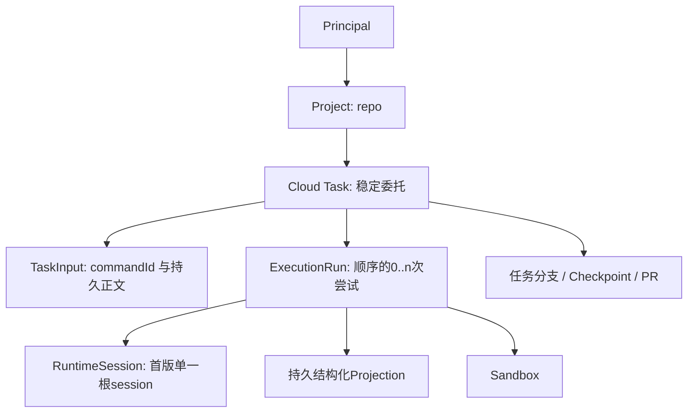
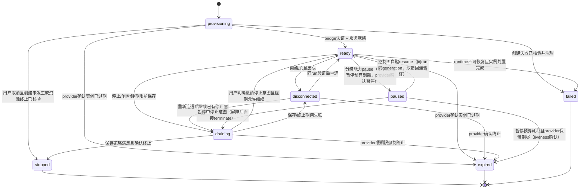
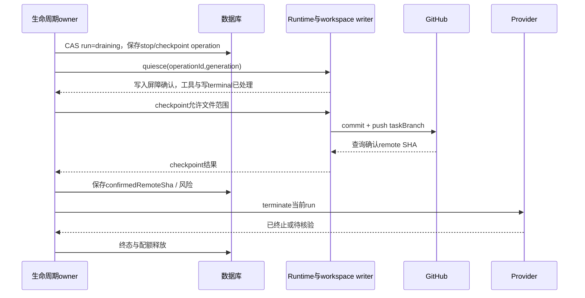

# Spec 08 — 项目、任务、执行 Run 与生命周期

状态：目标设计（2026-10-06 云端实现代码已整体回退），尚未实施。本文负责领域模型、状态迁移、单活写入规则与保存/恢复语义。
关联：[00](./00-overview.md)、[01](./01-provisioning.md)、[02](./02-bridge-protocol.md)、[03](./03-control-plane.md)、[09](./09-github-integration.md)、[11](./11-project-task-creation.md)。

## 1. 产品规则

1. Project 是分组与授权入口，不持有仓库任务的沙箱连接。
2. 仓库任务是一次工作委托，独占沙箱 checkout；Task 跨 run 持久，run 是易耗执行体。
3. Task 元数据、草稿启动配置、accepted 输入、历史与保存记录归控制面；轮次执行、已admitted队列和权限裁决归runtime。
4. 新建任务先成为持久 draft，不创建 provider 资源或 runtime session；基础分支/provider在草稿选择，首输入持久接受后才供给。完整流程由11负责。
5. 关闭页面、客户端切换、没有任何attachment不阻止任务启动或继续执行。
6. 同一task最多一个有效写入run；断网并不授权第二个run。
7. 任务产物以Git分支/PR交付，Git只保护已推送产物，不能替代任务和聊天存储。
8. 首版“重新打开”创建新runtime session，并从已保存任务分支继续工作，不保证旧进程/工具/session的精确续跑。
9. （2026-10-06 决议移除）：云侧 SSH 共享工作区条款作废，见 §4.3；Desktop/mobile 原 SSH 语义不受影响。

## 2. 概念与所有者

Cloud Task 和现有runtime task/session不是同一个数据库实体。新增 `taskId` 指控制面委托；runtime `sessionId` 仍由CLI生成，保存在明确映射中。不得用新的云task覆盖现有TaskIndexRepo的taskId含义，也不能把会话文件路径当云task身份。

| 实体           | 概念字段（实现须严格schema）                                                                                                                                                                                                                                                                                                               | 所有者                      |
| -------------- | ------------------------------------------------------------------------------------------------------------------------------------------------------------------------------------------------------------------------------------------------------------------------------------------------------------------------------------------ | --------------------------- |
| Project        | projectId, ownerPrincipalId, kind=repo, repositoryId/installationId/owner/name/defaultBranch, revision, createdAt                                                                                                                                                                                                                          | 控制面                      |
| Task           | taskId, ownerPrincipalId, projectId, title, status, creationKey, draftStartConfig?, baseBranch?/baseSha?/taskBranch?, workspaceIdentity, activeRunId, nextRunGeneration, lastCheckpointSha, completeRequested?, prRef, archivedFromStatus?, revision, createdAt/updatedAt                                                                  | 控制面                      |
| ExecutionRun   | runId, taskId, runGeneration, executionKind, firstInputCommandId, executionRecipe, stopRequested?, stopOperationId?, provider/providerHandle?, workspacePath?, status, connectionEpoch, runtimeSessionId?, expiresAt?, deadlineEstimate?, deadlineConfidence, hardDeadlineAt?, lastBusinessActivityAt?, endReason?, lastError?, dataAtRisk | 控制面                      |
| TaskInput      | taskId, commandId, intent, 原始请求/guard、payloadHash, acceptanceSeq, 正文/附件引用, requestedConfig/resolvedExecutionConfig、非秘密授权引用, retryOfCommandId?, acceptedAt, targetRunId?, runtimeSessionId?, deliveryStatus, runtimeAck?, lastError                                                                                      | 控制面投递与ACK投影         |
| RuntimeSession | sessionId, logEpoch, revision,轮次/工具/权限/输入队列                                                                                                                                                                                                                                                                                      | CLI runtime                 |
| Checkpoint     | operationId, task/run/generation, state, includedFiles, localSha?, confirmedRemoteSha?, riskSummary, timestamps                                                                                                                                                                                                                            | 控制面操作记录；Git保存产物 |
| TaskArtifact   | kind: code或noChanges, taskBranch, PR head/base, prNumber/prUrl/status, publishedSha, summaryRef?, lastCheckedAt                                                                                                                                                                                                                           | GitHub事实的控制面投影      |

仓库数值repositoryId是授权/重命名后的关联键；owner/name是展示与远端URL来源。Project默认分支改名或仓库转移不能无声重写已创建任务的baseSha。

## 3. 三种状态分开

### 3.1 Task：工作委托生命周期

| 状态      | 进入依据                               | 允许操作                                                             |
| --------- | -------------------------------------- | -------------------------------------------------------------------- |
| draft     | 元数据已创建，从未发送accepted input   | 编辑标题/起始配置、发送、归档                                        |
| active    | 首输入已持久接收，存在执行或可继续工作 | 查看、发送、停止、符合条件时重开、验收                               |
| completed | 用户验收或显式配置的PR merge策略       | 查看、归档；PR未merged时显式reactivate，已merged则新建follow-up Task |
| failed    | 已确定失败且无活跃写run，未完成目标    | 查看原因、重试/新输入、归档                                          |
| archived  | 无活动写run且用户归档                  | 只读历史；恢复为原前置状态后再操作                                   |

Task active不表示Agent此刻running；用户停止沙箱后Task可以仍active、run=stopped。不能把provider到期直接写为“任务完成”，也不能用connected作为Task状态。

### 3.2 Run：执行载体/连接状态

`reconciling`是pending operation/健康属性，不能靠任意timeout把不确定结果直接归failed。终态run不可复活。旧bridge迟到必须拒绝；重新打开创建runId和更高runGeneration，不能修改旧run继续使用。

**修订（2026-10-09，生命周期 v2：用户决议发消息自动继续 + pause/resume 分级能力）**：状态机增加 `paused` 节点与四条边（上图已并入）：`ready → paused`（仅 `pauseResume ≠ none` 的 provider；顺序冻结：checkpoint（如需）→ provider paused 确认 → detach registry → status=paused；watchdog 显式跳过 paused）；`paused → ready`（控制面自驱 resume，含用户发消息触发；同 run 同 generation，不换代、不重开）；`paused → draining`（暂停中收到停止意图：屏障后直接 terminate，暂停态无运行时写入可收口）；`paused → expired`（终局：暂停预算耗尽 → 停接受 resume（`budget_exhausted`）→ provider 保留期尽 → keepalive liveness 确认实例不存在 → expired，释放占槽）。`paused` 不是终态、照常占槽（§6）；能力位 `none` 的 provider 不进入 paused，生命周期行为与现状完全一致。

**修订（2026-10-09 第二批，暂停预算耗尽的用户意图闭环）**：暂停预算耗尽的 paused run 上，用户显式发消息（accepted append 存在）即继续工作意图——自驱 resume 不再无限重试被拒后让输入永远挂 accepted，而是控制面在同一 sweep 通路内自动「停止旧 run（复用暂停中停止推进，屏障+terminate+终态如实标 dataAtRisk）→ 以该消息为 prompt 串联 reopen（checkpoint 恢复语义：有 lastCheckpointSha 选 checkpoint、否则 restart-from-base；requestedConfig 随行；走同一 durable gateway，revision CAS 与 08 §9 重开核验原样生效）」。串联失败不自动重试：run 已终态时由既有 reopenable 投影 + 用户手动重开接管；多条排队输入只携带首条 append，其余由终态扫口如实收口 cancelled。无用户输入的 budget-exhausted run 维持原终局（保留期尽 → expired）。此闭环属用户意图的承接，不是自动续期暂停预算。

**修订（2026-10-10 用户产品决议，archive on paused run）**：归档是用户结束任务的显式意图——对 Run=paused 的任务直接归档不再 409，而是复用暂停中停止推进的同一实现（屏障复用 `run.stopOperationId` → `paused → draining` → 直接 terminate → `stopped` 收口，dataAtRisk 按停止 op 未结算如实标注）后完成归档；归档 HTTP 响应返回归档完成后的任务详情（同步收口）。terminate 未当场确认时 run 留在 draining（既有 stop/compensation sweep 按证据收口），归档按既有语义返回 409 `not_ready/task-has-active-run` 让 UI 重试。其余未终态（ready/provisioning/draining/disconnected）仍 409 引导先停止。actions 投影同表：paused run 投影 `archive`（`complete` 拒绝不变，仍须先 resume 或完成停止收口）。

### 3.3 Execution / 保存 / 产物投影

- Execution：unknown / idle / running / awaiting-input；更新必须有runtime来源、epoch与revision。
- 输入receipt：accepted / delivering / admitted / rejected / uncertain / cancelled。
- 保存：none / pending / saving / saved / failed，附confirmedRemoteSha与dataAtRisk。
- PR：none / creating / draft / open / merged / closed / publication-failed。

审批等待不是业务空闲。运行时失联时保留last-known execution并标过期时间，不用控制面猜idle。PR存在不代表无未保存修改；saved不代表用户完成验收。

## 4. 身份与单活边界

### 4.1 仓库任务

首次创建Task时固定 `workspaceIdentity=cloud-task:<taskId>`。不包含provider、repo slug、path、runId。provider失败换一家、仓库改名、checkout路径变化都不改变身份。

原基线只有ssh/wsl/docker；现未提交 shared/cloud identity 骨架需要全链路验证。必须区分“身份无法识别”与“本地path fallback”；云identity不能解析时应拒绝/要求协议升级，不能把它拿作本机cwd。

`workspacePath`来自run的已验证工作区描述，客户端不可指定。CLI创建session的workspace上下文应显式携带真实path与identity；实施时核对现有workspaceId解析链，并增加向后兼容的严格schema，不能只改一个字符串构造函数。

### 4.2 代际和租约

- `runGeneration`在数据库事务中每次新run递增，旧run终态永久保留。
- `connectionEpoch`由有效run每次连接替换生成，旧订阅/ACK/ready回调不得覆盖新连接。
- 外部操作、凭据申请、projection ingest和输入投递均绑定run与generation；仅稳定identity不足以授权写入。
- 每个Task的有效写入run通过数据库唯一约束/CAS分配；首版单控制面进程也需要此约束。
- provider create回调晚到、旧warm-up成功、旧checkpoint完成、旧stop释放配额均要校验代际。

bridge失联时旧Agent可能继续写文件，已发Git token也可能继续push。仅撤销控制面路由不能真正fence GitHub上的repo token。因此新写run之前必须确认旧实例终止，并处理尚有效的写凭据；结果不明时拒绝reopen。公开服务的更强写隔离见09。

### 4.3 SSH（2026-10-06 决议移除云侧接入）

云侧 SSH attachment 已移除（见 [00 §11⑥](./00-overview.md)）：云 Project 只有仓库类型，云 Run 只落在独占沙箱，云侧不再有共享持久工作区的执行目标。

保留项：Desktop 既有 window-scoped Host、手机附加 Desktop Host 路径及其 `remote:ssh` 身份语义不变，均属本机/远控模式；`sshAttachmentRef` 等云字段从 schema/端口移除（数据库冻结 0001 常量不回改）。

## 5. 首输入、后续输入与不确定结果

项目/draft/首发流程与恢复矩阵的权威入口为 [11](./11-project-task-creation.md)，HTTP/请求 fingerprint/事务由03定义。本文限定领域不变量：

- draft 只有唯一 draftStartConfig，无冻结baseSha/runtime/path；首次接纳固定 Task 基线和任务分支，Run 固定 resolved execution recipe。之后草稿选择不覆盖已冻结事实。
- 首次接纳事务固定 `Run.firstInputCommandId`，创建会话只能用该命令和原 commandId。控制面 acceptanceSeq 表达持久接收/投递顺序，不替代CLI admissionSeq；不得按acceptedAt/随机UUID选择首条。
- 首命令取消/明确拒绝后不静默提拔其他输入；阻断该启动流程并清理，用户显式重试才创建新意图。首版provisioning/disconnected不接受新的append，客户端可保存下一条正文。
- start携带draft revision；新start在active上冲突，不降为append。append携带当前generation。原commandId合法重放先返回原结果，不因revision增长失败；schema/hash以03为准。
- 明确未投递的准备失败将原input置rejected并记录原因；已发但结果未知为uncertain。同Task新Run不自动承接旧admitted/uncertain输入。
- 显式重试/重开持久新commandId/输入、Run/配额/create意图并关联原失败记录；保留原失败，不伪装旧命令执行成功。无有效Run时普通append不能自动reopen。
  - **修订（2026-10-08 用户产品决议）**：「普通append不能自动reopen」保留为**服务端契约**（append 预检对无有效 run 返回 `not_ready/no-active-run`，不隐式建 run）；客户端例外是**用户主动发送**：run 终态后用户在 composer 显式发送的新消息由客户端路由为 reopen 命令（消息即新工作要求，恢复选择按持久事实确定，见§9），不再发出注定 409 的 append。草稿恢复、unknown attempt 对账、投递重试等自动路径仍不得触发重开。
- 输入202、runtime ACK、执行结束、保存和用户验收分别投影。所有首发/后续输入经过同一durable application port，CLI唯一管理busy/running队列。

Task 的草稿配置、Run recipe、firstInputCommandId、stopRequested及 completeRequested 的字段/版本需要实施迁移；这些是新增目标，不因为现骨架表存在就假定具备。

## 6. 创建事务与配额

在provider调用前持久run、create operation和配额reservation；验证repo授权、provider capability、ref安全、runtime/bridge版本与资源配置。provider操作结果超时进入对账，不直接重试create。

建议初始全局并发上限3，可配置；这只是规划默认值，不是已有行为。占额包括provisioning/ready/paused/disconnected/draining（paused 为 2026-10-09 生命周期 v2 增补：暂停保留期占槽，quota_released_at 保持 NULL；并发上限 3 时「3 个 paused 占槽 → 第 4 个任务 409」为预期行为）。并发检查和预留必须事务化，不能先count后create。

bridge ready必须意味着：身份/generation有效、远端RPC握手完成、所需服务可用、选定模型/配置就绪、workspace真实路径校验、runtime服务能处理命令；实际admission/拒绝由独立CommandAck决定。若需warm-up，应通过明确readiness契约完成，不能订阅任意task list掩盖初始化时序。

创建失败清理也要有operation和确认。客户端取消provisioning不会删除Task。按§8先持久停止屏障并CAS撤销确定未投递输入，再处理在途create/清理；未知投递保持uncertain。provider handle未知时不能谎报已释放。

## 7. 租期与业务活动

默认建议（待真实provider能力测量）：

| 策略            | 默认候选       | 规则                                                                                                                                    |
| --------------- | -------------- | --------------------------------------------------------------------------------------------------------------------------------------- |
| 闲置归档阈值    | 15分钟         | execution idle、无pending input/interaction、无checkpoint、无业务写入；2026-10-09 起仅适用于维持 idle drain 的 provider（见下修订）     |
| 空闲 pause 阈值 | 10分钟（可配） | 仅 memory 级 provider：闲置且无客户端连接 → pause（替换 idle drain）；有客户端连接先广播「即将暂停」并顺延（2026-10-09 生命周期 v2 增） |
| 自动续期        | 开             | 业务running/写操作/pending交互保护需要时续期，合并provider请求                                                                          |
| 被动观看续期    | 关             | attach、heartbeat、侧栏轮询本身不算业务活动                                                                                             |
| 硬run时长       | 4小时候选      | 取部署预算与provider上限较小值；不承诺三家都支持4小时                                                                                   |
| 到期前drain预算 | 至少5分钟候选  | 结合checkpoint测量与provider剩余租期配置                                                                                                |
| 周期保存        | 5分钟候选      | 优先轮次安全点，dirty且能获得写屏障才执行                                                                                               |
| 并发上限        | 3              | 预留所有未终态资源，不只running                                                                                                         |

heartbeat只证明连接可见，不证明业务活跃。Agent进程存在不等于running；守护进程常驻时不应无限续期。runtime awaiting-input保留明确审批窗口，超过保护时间提示用户并根据保存策略drain，不伪装idle。

provider续期失败或到期时间未知时保留上一次已确认expiresAt；无法读取真实期限的provider持久保守deadlineEstimate/deadlineConfidence，UI标估计并提前drain。不支持extend返回能力错误，不伪造续期。续期结果晚到要CAS当前run，不能更新新的run。活动仅更新lastBusinessActivityAt，不逐帧调用setTimeout。

硬期限优先于“保存失败不停机”的愿望。到达期限前停止接收新工作、请求runtime进入安全点并保存；到期强制动作按能力分叉（2026-10-09 生命周期 v2）：memory 级 = pause（hardDeadline 转为「暂停预算」，到达即强制 pause 而非 terminate，provider 不再杀沙箱），其余 provider = terminate（provider强制终止时记录真实丢失范围和最后确认remote SHA）。显式用户 stop/force-stop 仍 terminate（preserve vs destroy 意图分离：空闲/预算到期 = preserve；用户停止 = destroy）。

**修订（2026-10-09，生命周期 v2：用户决议发消息自动继续 + pause/resume 分级能力）**：闲置规则改**按能力单轨**——`pauseResume=memory` 的 provider：满足闲置条件（execution idle、无 pending input/interaction、无 checkpoint、无业务写入）且无客户端连接、持续达到空闲 pause 阈值（默认 10 分钟，可配）→ **pause（替换原 idle drain）**；其余 provider 维持 idle drain 不变。有客户端连接时不直接暂停：先广播「即将暂停」并顺延。暂停前若存在未保存变更，先走既有 checkpoint 保存（同一保存通道）再暂停——boot 失败路径绝不成为恢复点。硬期限到期强制动作的能力分叉见上段；pause 保留期上限需实测核实（01 §4.3），暂停预算到期由 keepalive liveness 收口为 expired。

**修订（2026-10-09，终验缺陷 B：业务活动事实源收窄与保存失败退避）**：

- 业务活动事实源收窄：投影 ingest 只在批次**实际新增**记录（按 run 计 appendedRunIds 非空）时推进 lastBusinessActivityAt；执行节点 WAL 重投/补发（同键去重、0 新增）是恢复面流量，不是业务活动——重投循环不得制造「running」假象、不得阻塞空闲 pause。checkpoint/grant 尝试（兑换请求、checkpoint.request/result、op 租约与结算）都不是业务活动。
- 周期保存失败退避：连续失败按 30s→2min→5min 阶梯放大重试间隔（且不低于周期档），封顶 5 分钟；保存成功即清零。结果帧缺失（op attempt 封顶结算 failed）同样计入连续失败，不无限重建 op。
- checkpoint 在途占用有界：`saving/pending` 记录只在窗口内（2 分钟）算在途；超窗无更新的记录是僵尸事实，不再阻塞周期保存与空闲 pause，数据风险由 run.dataAtRisk 如实承载。「上次周期保存已 failed」不永久阻塞空闲 pause——v1 空闲 pause 无前置 checkpoint（见 QUIESCE_BOUNDARY），failed 的风险已在 run.dataAtRisk 标注，按事实暂停。

**修订（2026-10-09，生命周期 v2 审计第一批：空闲占用的输入事实含 uncertain）**：空闲判定（空闲 pause 拍与 idle drain 共用口径）的「无 pending input」事实必须计入 `uncertain` 投递状态——uncertain 输入可能已在沙箱执行（投递结果未知，03 §8 对账通路负责收敛），不是可安全暂停/归档的空闲事实；只数 accepted/delivering 会让带 uncertain 输入的 run 被空闲暂停且无法自驱恢复（与 resume 触发放宽配套，03 §6）。

## 8. 统一 checkpoint / stop 通路

### 8.1 停止屏障、依赖与创建途中取消

stop 事务写持久 stopRequested、operationId/generation 及操作关联；ready/disconnected可同时转draining，provisioning保持供给事实但停止意图优先。所有新input、create领取/回调、ready发布、投递及写能力入口检查此意图。stop受理后不再新启动Agent或接纳写操作；在途不可撤销外部操作的结果只用于对账/补偿，不能借迟到ready继续运行。

create未发出时取消意图并确认无资源；已在途时保留资源/配额核验，迟到handle进入清理。单纯 socket断线、按钮禁用或terminate outbox不能替代持久屏障。现有正在运行的工具通过quiesce收口，不承诺收到stop瞬间消除所有在途副作用。

正常stop操作具有依赖：stop intent → quiesce → checkpoint及远端SHA确认 → terminate →物理终止确认/配额释放。worker不能先领取terminate绕过保存前置。无运行时写入且已核验无需保存、用户明确force-stop或provider硬期限可采用对应分支，并记录证据和风险。保存失败允许剩余预算内重试；只有用户明确选择继续并CAS撤销停止意图才恢复输入，不能checkpoint失败就自动解除屏障。

**修订（2026-10-09，终验缺陷 B：结果帧必达与保存通路凭据）**：

- 沙箱对 `checkpoint.request` 的处理无论成败**必须回 `checkpoint.result`**（异常按 `failed` + `checkpoint_failed` 如实上报，02 §4）。不回帧时 op 只能靠 attempt 封顶结算 failed，且周期保存 sweep 因「无 checkpoint 记录」每拍重建新 op（终验实证：30 分钟 90 个 failed op、309 次 attempt 空转，并拖慢 stop drain 80-90s）。
- 周期保存与 stop/drain 同属保存通路：发 `checkpoint.request` 前由唯一签发点成组签发 push+fetch grant（01 §7.2 签发时机修订）；draining 下的 fetch 是 push 后远端 SHA 对账的规格内只读动作。

**修订（2026-10-09，生命周期 v2 审计第一批：terminate 明确拒绝后的持久重试）**：`terminate` op 结算 `failed`（provider 明确拒绝，如 403/402）不是终局——outbox 租约只领 pending/到期 leased/ambiguous，failed 行永不重领，而 `enqueue` 幂等返回既有行不改状态，非终态 run 会永久卡 draining/paused。规则：

- **重排队**：非终态 run 的 failed terminate op，由停止编排（stop sweep 对屏障指针不入队/无 op 的形态直接驱动 `terminateRun`）与补偿入口（`terminateRun` 内）按 attempt 退避重置回 `pending`（新增 `operations.requeueFailed` CAS：仅 `failed → pending`，attempt/幂等键/runGeneration 不变），由既有补偿循环重试 provider 终止。退避阶梯 30s→2min→5min 封顶（对齐周期保存退避风格），锚点为 op 的 failed 结算时刻（updatedAt）。
- **封顶告警**：attempt 达上限（10 次）后不再重排队，保持 failed 并升级结构化告警（error 日志）；终局兜底是 keepalive liveness（provider 实例消失 → draining 收口 stopped / paused 收口 expired）。
- **边界**：旧代际 terminate op（run 已换代）维持 failed 不重排队（08 §4.2 迟到操作不得作用于新 run）；`cleanup` op 不在本通路（对账窗口语义不变）；paused 停止推进与预算耗尽闭环复用同一 `terminateOperationKey` 幂等键，重排队不改键、不改写屏障指针。
- **force-stop 的 CAS 复核**：`force-stop` 写屏障后的 `paused/ready/disconnected → draining` CAS 必须检查结果——CAS 失败（与 resume sweep/停止推进并发）时重读状态分支处理：已是 `paused/draining` → 走暂停中停止推进（同一实现收口终态与 dataAtRisk）；已是 `ready/disconnected`（resume 赢得竞争）→ 重试 draining CAS 补 force-stop 标注后核验 terminate（再失败则由 drain/stop sweep 下一拍按 stopRequested 重驱动）；已终态/已换代 → 幂等返回。不得在 CAS 失败后仍按过期快照 terminate 而把 run 滞留在 `ready+stopRequested` 拖到硬期限。

首命令取消/拒绝阻断该Run继续启动或执行并清理；已经创建的会话仍记录真实结果，后续未投递输入不得被提拔；生命周期对确定未执行输入收口，unknown保留对账。环境清理未核验不释放资源槽。

### 8.2 保存与终止事实

quiesce是明确协议能力，不是“sleep几秒等Agent写完”。范围包括Agent工具、后台子任务和通过云terminal发起的写入；首版无法安全暂停的活动要展示停止失败/等待，不能与它并行git add。

文件策略：尊重gitignore与显式排除；禁止自动把.env、token文件、私钥、runtime缓存和用户未授权的大文件提交。清点未跟踪/ignored文件，无法保存的内容要显示；不能以“push成功”宣称所有工作都已保存。Git LFS、submodule和大二进制在首provider试验中确认支持范围，未支持时明确拒绝/风险提示。

stop默认checkpoint后终止；无变化但已有未push commit也必须push并核验。local commit成功、remote push失败状态是failed/dataAtRisk。可以在剩余租期内保留资源并重试保存；继续新工作须用户明确撤销停止意图，不能无限保活超硬期限。

**修订（2026-10-10 用户产品决议，归档驱动的暂停中停止）**：归档（archive on paused run）触发的停止属同一停止链路的例外分支——暂停态无运行时写入、无 checkpoint 前置可执行，直接 terminate 后收口 `stopped`；因为没有可结算的保存事实，dataAtRisk 必须如实标注（08 §8.2「不得宣称工作全部保住」），与 force-stop/keepalive 兜底认领同一诚实口径。归档与停止推进之间不复刻第二套状态裁决：屏障与 `paused → draining` 由既有 beginDrain 写入，terminate 与终态收口复用 advancePausedStop 同一实现，归档命令只在其返回终止已确认后才推进 Task → archived。

force stop是单独显式动作，返回预期丢失信息，需要用户选择；不得用普通stop失败后悄悄force。terminal/projection断线时operation仍持久恢复，不依赖某个页面确认才能继续。

实施决议（2026-10-06 第二批）：

- **checkpoint v1**：stop/硬期限 drain 先 quiesce（拒新投递、收口写入）→ 沙箱内以 contents:write grant push taskBranch → 核验远端 SHA 落 `checkpoints`（state=saved 必须有 confirmedRemoteSha）→ 再 terminate；保存失败不伪装 saved（state=failed + dataAtRisk）。
- **PR 发布 v1**：`publish-pr` operation 由控制面执行（token 不出控制面，01 §7.2），幂等键 `publish-pr:<runId>:<checkpointId>`；base/head 用冻结 baseBranch/taskBranch，重复请求返回既有 PR。
- **reopen v1**：`POST /api/cloud/tasks/:taskId/reopen`（body: provider/新工作意图），走 `runs.reserveRun`（generation+1、固定新 firstInputCommandId）；旧 run 必须已终态，有 checkpoint 时核对 lastCheckpointSha。
- **readiness 看门狗**：`provisioning` 超 soft timeout（默认 120s）→ 查 provider 事实（liveness）；running 且无 bridge → 持久 terminate 意图并按 provider 确认收口；unknown 保留对账，不建替代沙箱。

实施决议（2026-10-06 第三批，checkpoint 完整性）：

- **quiesce v1 = 控制面投递屏障 + 工作区收口提交（无等待面）**：draining 后控制面不再投递新命令，沙箱在 push 前做一次工作区收口（`git add -A` → 有暂存差异才用服务端固定作者提交）。**不实现**「等待在途命令结束」的有界等待：v4 权威协议没有可等待的 in-flight 命令数/会话空闲面——CommandAck 只是准入结论（`zcode-protocol-v4/command.ts` 明示 accepted 不承诺执行完成），`commandsQuery` 只回同一准入 ACK；唯一接近的会话状态投影（`subscribeConversationV4` 的 control.phase/pendingCommands/activeWorks）是推送式投影，沙箱内消费者是投影导出（WAL）通路，不是请求/响应语义，另接第二消费者会引入重复状态。因此不 sleep 冒充同步，收口提交如实捕获 checkpoint 时刻的工作区状态；把该投影接成有界等待（含超时口径）列为后续项。
- **收口提交（09 §7.3/§4.2）**：作者是服务端固定 bot 身份（bootstrap env `ZCODE_CLOUD_COMMIT_AUTHOR_NAME/EMAIL`，缺省 `ZCode Cloud Agent <agent@zcode.local>`，不从 prompt 推导）；作者经 `-c user.name/-c user.email` 传入，不改仓库/全局 config；`--no-verify` 跳过 repo hooks；提交信息含 runId/generation；工作区干净不建空提交。收口与 push 在同一在途 promise（同一把锁）内串行，并发 checkpoint.request 共享同一结果；是否产生提交/本地 SHA/HEAD 分支进结果日志与帧 facts（token 不进任何日志/argv）。
- **控制面 saved 屏障补强**：`saved` 的 remoteSha 必须形如 git object id（40/64 hex），否则 fail-closed 不写 saved、进对账；saved 的 operation facts 记录 branch 与 hadNewCommits（帧 additive 字段，缺席不推断；false 记 noNewCommits）。remoteSha 落在冻结 baseSha 时：帧报无新提交（工作区干净）→ 允许 saved（分支确实在远端）并记 no-new-commits，PR 通路按 09 §5.1 no-changes 处理，不标 dataAtRisk；帧报有新提交却仍停在 baseSha → 提交没落在发布分支（HEAD 被切走/detached rebase），远端没有这次工作，saved 但如实标 dataAtRisk + warn。
- **本批未做（如实记录）**：收口文件范围 v1 = tracked + non-ignored untracked（.gitignore 为准），产物/缓存/已声明秘密路径的额外排除与未解 merge/rebase 的显式拒绝未实现；`HEAD 分支 ≠ taskBranch` 的显式策略（失败还是改推其他 ref）未定，当前只经日志/facts 暴露；控制面 dispatch 下发作者 env 的接线未接（沙箱侧已读 env 并支持缺省身份）。

## 9. 重开、完成与历史

重开前：核验无有效写run、旧instance终止/凭据已处置、授权仍有效、配额可预留；有checkpoint时必须确认任务分支存在。新Run固定resumeSha=最后确认checkpoint SHA，并查询taskBranch HEAD是否一致；首次Run从首次接纳时冻结的baseSha派生taskBranch。没有checkpoint的任务只能显式选择从冻结baseSha重新开始；首次准备失败且已证明从未发布任务分支时允许重新创建该分支。分支发布结果未知或已发布分支消失/变化时先对账，不把它当作从未创建；不展示“已恢复全部工作”。

**修订（2026-10-08 用户产品决议）：「显式选择」指 reopen 请求必须显式声明恢复方式，不要求用户在二选一界面手工挑选。run 终态后用户主动发送的新消息触发自动重开时，客户端按持久事实确定声明值——有确认 checkpoint（`state=saved`）→ checkpoint，否则 restart-from-base——并向用户说明依据；服务端仍按本节前置条件独立核验，UI 侧自动选择不绕过任何核验。自动重开只由用户主动发送触发；重开仍是独立命令（不复用 append、不复活旧 run）。**

**修订（2026-10-09，生命周期 v2：用户决议发消息自动继续 + pause/resume 分级能力）**：重开前置硬核验增补——旧 run `quota_released_at` 非空（provider 终止已确认、计费槽已释放）才可重开；`quota_released_at` 为 NULL 时拒绝重开（含自动重开路径，返回 `recovery_required`），不得以超时或推断代替终止确认。`paused`（未终态、占槽）被既有「无有效写 run」前置拒绝（见 03 §6 paused 动作表）。

若远端branch头与lastCheckpointSha不一致，检查是本任务新push、用户编辑还是未知写入。保留远端事实，不force覆盖；需要merge/rebase/显式重新基线的工作作为新输入。外部分支删除明确失败，不能默认clone main当成恢复。

新runtime session可接收先前历史摘要、任务目标和confirmed artifact引用；完整会话历史供用户查看。首次实现不承诺恢复旧工具执行现场或将旧pending permission自动继续。

用户complete先持久验收意图，阻断新输入/写入并收口执行：accepted/delivering/uncertain全部计入未决输入，已admitted的在途执行也须达到可信安全点；不能只检查accepted集合。最终completed需保存策略/产物核验及活动Run终止确认，不把写outbox等同完成。保存风险必须可见，代码产物指向可review的分支/PR；无差异的调查/答疑允许kind=noChanges且有持久结果摘要，PR保持none，不创建空commit/空PR。Agent结束轮次不自动complete；merge自动完成是可配置产品规则，未启用时仅更新artifact状态。验收使用同一drain依赖通路；进行中显示验收/停止进度，必要条件未满足前不宣告最终completed。

归档与删除区分：归档保留历史和artifact，资源终止；物理删除遵循保留策略并独立清理附件。删除Project默认有任务时拒绝或要求明确归档策略，不级联丢历史。

## 10. 失败/恢复矩阵

| 场景                | Run/Task显示                    | 禁止行为                     | 所需证据                         |
| ------------------- | ------------------------------- | ---------------------------- | -------------------------------- |
| 浏览器关闭          | 原状态保持                      | 将disconnect当stop           | 服务端input receipt和runtime ACK |
| bridge网络分区      | disconnected、最后已知execution | 自动expired/reopen           | provider状态与旧token处置        |
| 控制面重启          | reconciling属性，随后恢复原run  | 无条件create新实例           | durable operation与provider标签  |
| provider硬到期      | expired、Task仍可继续或failed   | 报“工作全部保住”             | last remote SHA与dataAtRisk      |
| checkpoint/push失败 | 保存failed，剩余租期可继续      | 本地commit当saved            | 远端ref查询与错误归属            |
| App撤权             | retained history、操作denied    | 匿名fallback/newtoken        | 当前installation授权             |
| 旧bridge/ready晚到  | 拒绝旧代际                      | 复活终态run或覆盖activeRunId | runGeneration/epoch CAS日志      |
| PR创建响应丢失      | publication reconciling         | 重复建PR                     | head/base查询和operation记录     |
| 不同provider重试    | 同Task identity、新run          | 漂移草稿/历史归属            | identity与run映射断言            |

## 11. 验收场景（计划）

| ID    | 设置/动作                                            | 核心断言                                                   |
| ----- | ---------------------------------------------------- | ---------------------------------------------------------- |
| TM-01 | 建repo Project与draft，刷新/清浏览器存储             | 列表仍在，provider零创建                                   |
| TM-02 | 同repo同时两个task，相同path/provider                | identity不同、checkout独立、输入/未读/历史不串             |
| TM-03 | 首发送202后关页，另一设备稍后打开                    | 工作已执行，显示同commandId与历史                          |
| TM-04 | 同task两端首次发送并发                               | 只有一个有效run与正确配额预留                              |
| TM-05 | 首provider失败换provider                             | task identity不变，run代际递增                             |
| TM-06 | 断网超过2分钟但provideralive                         | 不expired、不双run、不重复Git写入                          |
| TM-07 | 旧ready/ACK/checkpoint晚到                           | 无新run覆盖、无错误释放配额                                |
| TM-08 | idle、running、awaiting-input、仅heartbeat分别测保活 | 各状态符合活动定义，观看不无限续期                         |
| TM-09 | stop与Agent/terminal写入并发                         | 屏障生效，snapshot无并行git污染                            |
| TM-10 | push成功回包丢失                                     | remote SHA查询确认，只一个checkpoint                       |
| TM-11 | push失败遇硬期限                                     | dataAtRisk可见，最后saved SHA准确，无“不丢”承诺            |
| TM-12 | 已admitted副作用后run死亡，再reopen                  | 旧input不自动重放，新session明确                           |
| TM-13 | 重开branch有外部新commit/已删除                      | 不force覆盖/不回main，明确处理                             |
| TM-14 | （已移除）原两个 SSH task 共享 folder 用例           | 不适用（2026-10-06 决议，见00 §11⑥）                       |
| TM-15 | 归档/删除存在活动run                                 | 受控drain或409，不能孤儿化                                 |
| TM-16 | 调查任务无代码差异并显式验收                         | kind=noChanges摘要持久、无空PR，completed与run停止分别确认 |

测试准备、动作、断言、日志和运行证据须与10的门槛关联；本次只定义场景，不宣称已实现。
