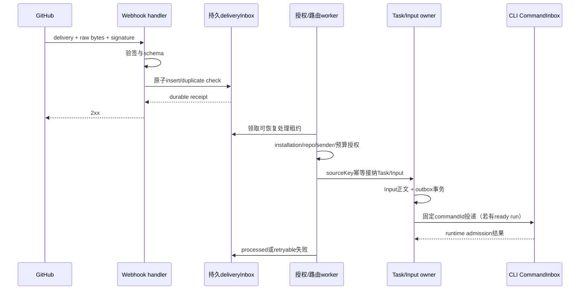

# Spec 09 — GitHub 仓库、任务分支、PR 与触发

状态：目标设计（2026-10-06 云端实现代码已整体回退）；尚未实施（2026-10-05 版方案）
父文档：[00-overview.md](./00-overview.md)
关联：[01](./01-provisioning.md)、[03](./03-control-plane.md)、[08](./08-project-task-model.md)、[11](./11-project-task-creation.md)
实施阶段：M1/M2 仓库授权与读取；M4 PR 产物闭环；M7 账号绑定、webhook、GitHub 状态回写。

## 1. 当前基线与产品范围

当前检出的原有代码没有 GitHub App installation 列表、branch API、Git 凭据 broker 或云 PR 产物服务。这些都需新建，不能引用已撤销的云实现或目录里的 dist 当基线。`packages/services` 的 credential service 可参考秘密存储与损坏保护；当前 OAuth adapters 只有 BigModel / ZAI，不能写成已关联 GitHub 用户。

目标实现位于 `packages/server/src/cloud/adapters/github/`，由 cloud application owner 调用。所有对外接口统一 `/api/cloud/*`；GitHub API worker、webhook handler 不直接操作 runtime 队列，UI 不拿 App key/token、不直接调 GitHub 写 API。

交付范围分开：

- 仓库可用性：经过 principal → installation → repository 授权后可选，project 是持久分组，不等于动态 installation 全量清单。
- 代码产物：固定 base 与 Task 唯一分支、checkpoint push、draft PR、PR 状态投影。
- GitHub 触发：经过签名、sender 授权、durable deliveryInbox 和幂等后生成同一 Task/Input API 的命令。
- 状态回写：控制面管理的 comment / check 外部副作用；与 runtime 的输入 admission / busy queue 分开。

首期不自动 merge、不修改仓库权限、不支持 fork PR 自动写入、不申请 administration、不假定任意 GitHub App 可作为 issue assignee。首版触发以 issue mention 和显式 label 为主，assignment / review-requested 等能力需后续单独验证与定义。

## 2. 身份、授权与仓库记录

### 2.1 可信单用户与多租户边界

M1 起部署必须有唯一明确 principalId，HTTP 与 WS 均鉴权；App 安装到 GitHub 账号不是产品用户登录，不授予任意来访者使用该 installation 的权利。

可信单用户 v1 由部署管理员显式配置允许的 installationIds / repositoryIds，所有 project/task 归该 principal。不得由客户端提供 installationId 就 mint token，不得用 App 能列出所有 installation 作为用户授权证明。

M7 公共/多租户开放前，新增经过验证的账号关联与以下记录：

| 记录                   | 最小字段与约束                                                                                                          |
| ---------------------- | ----------------------------------------------------------------------------------------------------------------------- |
| `GitHubAccountBinding` | principalId、GitHub稳定userId、验证来源、verifiedAt、revokedAt?；login只是展示                                          |
| `InstallationBinding`  | principal/tenant、appId、installationId、GitHub accountId、状态；管理权需通过受信安装/授权流程证明                      |
| `RepositoryAccess`     | principal/tenant、installationId、repositoryId、权限集合、checkedAt、revokedAt?；全installation访问不自动传播给所有用户 |
| `RepositoryProjection` | repositoryId、nodeId、owner/name、defaultBranch、private、installation、availability、updatedAt                         |

repositoryId 是关联和授权主键；owner/name、org、默认分支会变化，不能把 repo slug 作为永久权限键。repo rename/transfer 时更新展示和 Git origin，Task identity 不变；若目标 installation 变了需重新授权，不能无声沿用旧 token。

Web 创建 Task、webhook 建任务、reopen、clone/fetch、push、PR/check/comments 都重新验证对应授权。撤权 / App suspended / deleted 时停止新 grant、新任务与新外部写入，取消尚未投递的授权操作并保留历史；存活沙箱按 lifecycle 做受控保存/关闭，保存不通则 dataAtRisk。已存在 Task 不代表仍可执行。

### 2.2 Installation 投影与 Project

目标接口草案：

```text
GET  /api/cloud/repositories                 principal有权选择的仓库，分页
GET  /api/cloud/repositories/:repoId/branches
POST /api/cloud/projects                           显式选择repo创建持久Project
POST /api/cloud/github/installations/:id/reconcile  管理者主动对账（非普通用户任意绑定）
```

installation projection 只是可选仓库来源；不自动为每个已装仓库创建 Project，也不因撤权删除现有 Project / Task。侧栏历史 project 显示 unavailable 与原因，新建入口排除失效仓库。列表完整分页、按principal过滤、短期缓存与最近校验时间；GitHub API 暂不可用显示 stale/unknown，不把网络错误当仓库已删除。

M1/M2 先按显式单用户allowlist读取；M7用installation/installation_repositories/repository事件加定期对账，避免单次webhook漏失导致长期权限漂移。

项目创建按11：客户端选择repositoryId，控制面取得权威installation/owner/name/defaultBranch，不能直接信任请求元数据。权限预检只能证明当时有效；接纳后grant/checkout/push仍检查当前授权，撤权阻断后续副作用，不能宣称SQLite事务冻结了GitHub权限。

## 3. 完整权限矩阵

App 注册权限是上限；每次 mint 的 installation token 还须显式单个 repositoryId 与最小 permissions。metadata:read 是基础仓库元数据权限；App 私钥/JWT与installation token不是同一种凭据。

| 功能                              | App 注册权限 / 订阅                                                      | 每次token和执行位置                                                | 阶段     |
| --------------------------------- | ------------------------------------------------------------------------ | ------------------------------------------------------------------ | -------- |
| App/installation解析、mint        | App身份，JWT                                                             | JWT只在控制面；查installation不等于用户授权                        | M1/M2    |
| 仓库元数据、sender角色查询        | metadata:read                                                            | 单repo metadata:read，控制面                                       | M1/M2/M7 |
| 分支/SHA读取、clone/fetch         | contents:read                                                            | 单repo contents:read，API在控制面；clone按run read grant           | M2       |
| 任务分支push/checkpoint           | contents:write                                                           | 单repo contents:write，按run临时write grant；不包含PR/check/issues | M4       |
| draft PR创建/更新/读取            | pull_requests:write                                                      | 单repo pull_requests:write，控制面外部effect worker                | M4       |
| PR差异/merge状态投影              | pull_requests:read、需要的contents:read                                  | 最小read token，控制面查询；不自动merge                            | M4       |
| CI概要：checks与commit statuses   | checks:read、statuses:read                                               | 控制面；不默认申请actions:write                                    | M4可选   |
| `zcode agent` check创建/更新      | checks:write                                                             | 单repo checks:write，控制面；PR write不能代替                      | M7       |
| issue/PR普通评论触发              | issues:read，订阅issue_comment                                           | handler先验签/授权；不把token发runtime                             | M7       |
| issue label触发、issue上下文      | issues:read，订阅issues                                                  | 单repo issues:read，控制面                                         | M7       |
| 原issue进度评论创建/编辑          | issues:write                                                             | 单repo issues:write，控制面；PR评论按相应权限                      | M7       |
| PR review body/inline comment触发 | pull_requests:read，订阅pull_request_review及pull_request_review_comment | handler按action路由；sender授权不省略                              | M7扩展   |
| PR/branch生命周期投影             | pull_requests:read/contents:read，订阅pull_request/push                  | 控制面按repo+branch/PR关联，不触发任意Agent工作                    | M7       |
| `.github/workflows`修改           | workflows:write（明确额外授权）                                          | 默认不申请；批准后按任务、目的与仓库授权                           | 后续     |
| Actions日志/运行详情              | actions:read（可选）                                                     | 默认CI概要不依赖；新增功能再申请                                   | 后续     |
| App卸载/仓库撤权事件              | installation、installation_repositories、repository适用事件              | 验签后更新授权投影，不发沙箱token                                  | M7       |

Checks 创建/更新明确要求 checks:write；不能把 contents:write + pull_requests:write 描述为可开 check run。[GitHub Checks API](https://docs.github.com/en/rest/checks/runs#create-a-check-run)

issue_comment / issues 的订阅要求 issues 至少read；PR review/inline comment用相应PR事件。[Webhook事件与权限](https://docs.github.com/en/webhooks/webhook-events-and-payloads)

评论 API 接受 Issues 或 Pull requests 写权限，本文对 issue 功能使用明确 issues:write，避免依赖模糊替代权限；实现对每个目标 endpoint做真实permission测试。[Issue comments API](https://docs.github.com/en/rest/issues/comments#create-an-issue-comment)

Git HTTPS使用contents权限；workflow文件有额外Workflows权限。workflow写权限默认关闭，若checkpoint包含此目录改动且缺权限则报“需要额外授权”，保留dataAtRisk，不偷偷丢弃文件或扩大token。[GitHub App权限](https://docs.github.com/en/apps/creating-github-apps/registering-a-github-app/choosing-permissions-for-a-github-app)

sender角色查询可使用metadata:read；不能仅凭author_association字符串或repo公开状态授予运行权限。[用户仓库权限API](https://docs.github.com/en/rest/collaborators/collaborators#get-repository-permissions-for-a-user)

App新增权限后，既有installation可能尚未批准新权限；readiness明确检查实际permission集，缺失时fail-closed并提示重新授权。token作为opaque string处理，不写死长度/前缀；repo/permissions缺失时不回落mint全权限。[Installation token生成](https://docs.github.com/en/apps/creating-github-apps/authenticating-with-a-github-app/generating-an-installation-access-token-for-a-github-app)

## 4. Task 分支与 Git checkpoint

### 4.1 分支字段与不可变基线

```ts
// 以下为首次输入已接纳后的Task Git事实；draft不要求这些冻结字段
interface TaskGitState {
  repositoryId: number;
  baseBranch: string; // PR要合入的目标分支
  baseSha: string; // 首次输入接纳事务固定的起点
  taskBranch: string; // PR head / checkpoint分支
  lastCheckpointSha?: string; // GitHub查询确认后才推进
}
```

taskBranch 格式计划为 `zcode/task-<taskId>-<slug>`：使用完整唯一taskId，slug截断/规范化仅作展示；名称经Git ref验证。首次输入接纳事务中生成并持久化；此时尚未在GitHub创建分支，不因重开、标题更改、provider变更重算。首次Run从baseSha分叉；之后只从确认的taskBranch接着工作。

PR head=taskBranch，base=baseBranch，两者必须不同。默认baseBranch是仓库默认分支；不能写“任务分支即PR base”。draft可通过带revision的配置更新选择base；首次输入接纳后，baseBranch消失/重命名或用户想换base，均需要显式冲突/更新操作及重新验证，不能默默变更已接受输入的执行基线。

外部已经占用同名分支且不能证实由该Task建立时拒绝覆盖。首期禁止force push、删除默认分支、改变保护规则和自动merge。normal push非快进时暂停publication、保留workspace并展示冲突；不通过重试强制覆盖GitHub修改。

基础提交的固定时点由11的首次接纳定义：采用该请求预检查询的SHA，在03事务中持久；草稿创建不冻结SHA，合法提交重试不再解析HEAD。对象无法获取时明确失败，不换新基线。重开按08固定resumeSha并对照远端taskBranch，删除/漂移不静默恢复或force覆盖。

### 4.2 单活writer与风险

01/08的runGeneration/CAS负责Run选择和授权。所有内部push通知/PR更新/保存结果携带runId、runGeneration、operationId和candidateSha；旧Run事件不能推进当前Task。

但repo-scoped contents:write token不天然限制taskBranch。可信单用户v1允许短暂给当前run Git写凭据，产品路径只推taskBranch；这不是抗恶意代码的branch隔离。已发token在撤销/过期前仍可能写repo，控制面runGeneration不能拦截此类直接请求。重开须确认旧sandbox死亡或完成旧writer与已发token隔离；unknown状态不发新write lease。

公共/多租户M7上线必须完成Git write proxy/ref白名单，或经真实仓库ruleset/授权测试的隔离策略；未完成不能开放。不得给App仓库admin或默认绕过保护规则来“解决”push问题。

checkpoint按01/08先quiesce、写lease、commit、push，再控制面查远端SHA确认。git只持久确认代码；ignored文件、runtime状态、数据库与未保存内容另有边界。GitHub不可达/撤权/保护拒绝要dataAtRisk，不声称失败不停机就绝不丢工作。

## 5. PR 产物闭环（M4）

### 5.1 创建触发与无变更任务

首次确认任务分支上存在相对base的可交付差异时，创建draft PR；M4用checkpoint/publication确认事件加API对账，不依赖M7 webhook才可用。Agent turn结束、Run ready、sandbox退出都不能单独触发“已交付”。

没有代码变化的调查/答疑任务可结束为noChanges并保存结果摘要，不创建空PR、不靠空commit凑产物。首个push还没有差异时artifact保持none；PR创建失败不等于已确认代码丢失，分开显示artifactError。

Task产品状态、runtime执行结果、Run状态、Git保存状态与PR状态分别投影：

- runtime完成只说明本轮执行结束；还需checkpoint/产物对账。
- draft/open PR表示可review；PR merged/closed由GitHub查询确认。
- merge不是必然继续运行Agent；Task可由用户明确标记完成，默认不自动merge。
- closed未merged允许记录已关闭；后续输入不自动重开PR或另起分支，需要明确动作。

### 5.2 外部幂等effect

控制面持久 `GitHubEffect`（使用03的外部Operation/outbox存储）：effectId、taskId、repositoryId、kind、desiredRevision、expectedHeadSha、payload引用、status、lease、attempts、nextAttemptAt、remoteId?、lastError?。秘密不在payload。

1. checkpoint事务写lastCheckpointSha并追加`ensureDraftPr` effect，key为repositoryId+taskId+taskBranch；唯一约束防并行worker重复。
2. worker按租约确认Task归属和最新desiredRevision，查已有PR：同repo、同head、同base、含受控Task marker。
3. 已存在则关联；不存在才POST。body只包含任务链接、明确批准的标题/摘要、由控制面管理的状态片段；不贴完整prompt、secret、私有日志。
4. API创建成功但HTTP响应丢失/存prNumber前崩溃，effect变unknown，重试先查询PR并关联，不直接再创建。GitHub未提供一般幂等键，不宣称跨系统exactly-once。
5. 持久化prNumber/prUrl/nodeId/headSha及GitHub observedAt；marker不含token，仅用于对账，不当授权证明。
6. 并发更新body按desiredRevision合并受控段，不覆盖用户手写内容。失败重试有界，处理rate limit/retry-after；401刷新短token后再查授权，403/404不能盲重试或扩大scope。

PR写操作只由控制面worker执行；agent的shell不持PR写token。产品工具若支持创建PR，必须调用同一Task级effect入口，不能同时保留第二条自动/手动创建路径。

### 5.3 Follow-up 与外部修改

- active run上的follow-up生成持久Input后送CLI CommandInbox，CLI决定queue/guide/startNow，GitHub handler不自建busy queue。
- 无active run的follow-up先变持久待处理输入并提示reopen；v1不自动把uncertain旧输入重播到新Run。自动reopen若未来需要，须另定义明确用户授权与副作用风险。
- 本产品Task的PR按repositoryId+prNumber绑定；任意第三方PR/fork PR不自动借用Task身份或repo写token。
- PR人工push或base更新时读GitHub事实，核对已确认SHA与ancestry，显示冲突/需要同步；没有lease的Run不得覆盖。
- merged后任务分支可能被GitHub删除。再次工作创建follow-up Task与新分支，从明确base开始，并记录relatedTaskId/relatedPr；不能重建旧已合并任务分支继续推相同PR。

## 6. Webhook durable ingress 与sender授权（M7）

### 6.1 接收与ACK

目标端点：`POST /api/cloud/github/webhook`。该端点使用GitHub签名身份；普通cloud API使用用户身份，两者不互相替代。

1. 读取原始请求bytes，限制payload大小、Content-Type、event/action类型；用 `X-Hub-Signature-256` 对原始bytes做HMAC-SHA256恒定时间校验，不先JSON重编码。
2. 验签失败、缺deliveryId、来源App/installation/repository无效拒绝；通过后解析严格schema。未知但合法事件可确认ignored，不执行Task/外部写操作。
3. 事务插入durable `GitHubDeliveryInbox`，唯一key `(appId, X-GitHub-Delivery)`；保存payload hash、事件/action、installationId、repositoryId、senderId、收到时间、加密payload引用、处理状态/游标。
4. 同key同hash返回原收据，不重复业务；同key不同payload拒绝并审计。事务落盘成功后才2xx，handler不等待供给/Agent/PR创建；存储失败返回5xx。
5. 重启从received/processing/failed记录恢复，worker租约和状态CAS防重复。durable receipt不是CLI admission ACK，不代表Input已运行。

GitHub要求10s内响应，建议异步处理，并说明redelivery沿用同一X-GitHub-Delivery。目标正常ACK预算<2s；验签后写inbox是必需副作用，不能写“2xx之前不允许任何副作用”。[Webhook最佳实践](https://docs.github.com/en/webhooks/using-webhooks/best-practices-for-using-webhooks)

GitHub不自动重发失败delivery。M7需管理员补投入口和按delivery API定期对账；不假设返回503就自动恢复。处理失败保留inbox可重试，输入接受失败不得先标processed。[失败投递处理](https://docs.github.com/en/webhooks/using-webhooks)、[App webhook deliveries API](https://docs.github.com/en/rest/apps/webhooks)

### 6.2 业务授权

签名只证明事件来自GitHub且未被篡改，不能证明comment作者有权消耗预算/触发代码执行。

worker在建任务或输入前必须：

1. installation属于本产品配置的App，且绑定到明确principal/tenant；repo稳定id仍被该installation授权。
2. sender稳定userId绑定产品账户或配置allowlist；通过最新仓库permission查询，默认要求write/maintain/admin及产品项目运行权限。公开仓库的陌生评论者、只读/triage角色不自动授权。
3. label触发检查实施label操作的sender，而不是issue作者；PR follow-up检查sender与Task/PR归属。
4. 用户撤权、installation suspended或repo授权失效时fail-closed；API查询未知则延后授权，不用cached旧允许结果放行敏感执行。
5. 配额/预算在同一Task/Input接纳事务检查，按principal计账。来源issue/PR内容、URL、附件均是不可信输入，不允许借payload改变模型凭据、execution permission或仓库allowlist。
6. 自身bot的comment/label/check事件忽略：使用App的稳定bot userId/App identity；login只辅助展示。其他bot默认不允许，若后续允许须独立配置，避免bot链式循环。

业务授权拒绝保存明确状态和审计；不向陌生sender回写内部错误/任务链接。是否发公开拒绝说明是单独可配置effect，不影响验签ACK。

### 6.3 触发矩阵与幂等

| event/action                                          | v1 M7行为                                                                        | 输入/去重key                          |
| ----------------------------------------------------- | -------------------------------------------------------------------------------- | ------------------------------------- |
| issue_comment / created（普通issue）                  | 授权sender的明确mention命令建Task；上下文限量抓取、保存完整Input                 | repositoryId+commentId+triggerKind    |
| issues / labeled                                      | 仅预配置label的添加动作、授权sender；同issue同触发绑定已有Task，显式新委托再新建 | repositoryId+issueId+labelId+触发周期 |
| issue_comment / created（本产品PR）                   | 明确mention生成同Task follow-up Input；active run才投递                          | repositoryId+commentId+Task绑定       |
| pull_request_review_comment / created                 | 本产品PR的明确mention、授权sender；保留path/line/commit上下文                    | repositoryId+commentId+triggerKind    |
| pull_request_review / submitted                       | 后续扩展：review body中明确mention，不把每条review默认变任务                     | repositoryId+reviewId+triggerKind     |
| pull_request / lifecycle动作                          | 更新PR projection；review_requested不凭空解析mention/执行任务                    | repositoryId+prNumber+观察版本        |
| push                                                  | 对账taskBranch/headSha，非任务分支不触发Agent                                    | repositoryId+ref+sha                  |
| installation / installation_repositories / repository | 更新授权/可用性，触发对账                                                        | deliveryId与对应实体id                |
| issues / assigned                                     | 首版不启用；需验证App可指派能力、授权与事件契约后再设计                          | 未定义，不宣称可用                    |

delivery幂等之外，业务key确保同一comment重放/不同delivery不会建两Task。label removal只更新触发周期/绑定，不自动销毁运行任务；同一issue又被mention/label触发的合并规则按来源绑定显式处理，不用一个泛化payload hash吞掉真正的新命令。

评论edit/delete不自动更改已接受Input，保留提交时正文与来源revision；未来支持修改需独立命令和审计。所有follow-up保存完整text、上下文引用、配置、sourceId再接受，不依赖浏览器，也不以GitHub标题替代prompt。



## 7. Check、评论与CI投影（M7）

### 7.1 Check 生命周期

GitHub check依附具体head_sha，不依附抽象Task。持久映射repositoryId/taskId/runId/runGeneration/headSha/checkRunId/desiredRevision，API external_id携带稳定effect标识；新commit创建新的check，不把旧SHA的success当当前head通过。

| 产品观察                           | GitHub check写入                       |
| ---------------------------------- | -------------------------------------- |
| 已有head SHA，等待runtime接纳/执行 | status=queued                          |
| CLI确认执行中                      | status=in_progress                     |
| 执行成功且产物/保存已确认          | status=completed，conclusion=success   |
| 执行失败                           | completed/failure                      |
| 用户取消/idle归档没有完成本轮工作  | completed/cancelled或neutral，明确摘要 |
| provider强制超时                   | completed/timed_out                    |
| 等待权限/冲突无法继续              | completed/action_required              |

创建/更新check使用checks:write；running不是GitHub API合法status。保持actual head SHA与runGeneration检查，旧Run迟到完成事件不能把新Run/check覆盖为success。control plane网络断开只更新自身连接投影，不编造runtime成功或失败。[Check Run status/conclusion](https://docs.github.com/en/rest/checks/runs#update-a-check-run)

若尚无有差异的commit/PR，任务页显示执行状态；不承诺PR checks区在sandbox刚创建时已有check。CI概要由GitHub check/status查询，和 `zcode agent` 自报执行check分开；成功Agent check不代表项目测试全部通过。

### 7.2 评论与PR body

每个来源issue/PR持久commentId和受控marker，节点更新采用edit而非无限append。创建结果未知时先按marker/userId查comment；找不到才新建。同Task事件合并、频控、bounded retry，去重key不是易变标题。

评论仅回写创建/需要用户动作/PR就绪/确认失败等关键节点，不逐token或tool输出。公开仓库不默认把prompt/私有日志/凭据错误详情发公开评论；摘要先脱敏并遵守项目公开可见性设置。Task链接本身仍要求cloud鉴权，不能在链接query放访问token。

## 8. 持久化、恢复与错误

GitHub投影不是本地Task事实，也不是runtime队列。03持久存储需要以下新增表/记录，由M0先定schema、唯一约束和保留规则：

| 记录                                | 原子/唯一边界                                                             |
| ----------------------------------- | ------------------------------------------------------------------------- |
| account/installation/repository绑定 | principal与稳定GitHub id授权，撤销不能回退                                |
| TaskGitState / PRProjection         | task分支固定；观察版本、headSha、availability分别保存                     |
| GitHubEffect                        | business key唯一、租约、desiredRevision、remote id、unknown/reconcile状态 |
| GitHubDeliveryInbox                 | appId+deliveryId唯一、payload hash、加密body、处理状态                    |
| GitHubSourceBinding                 | repo+issue/PR/comment/review → Task/Input，不用URL字符串当权限            |
| GitHubCheck/Comment映射             | effect key与remote id，可恢复创建/更新                                    |
| 运行审计                            | principal/source/runGeneration/operation，不保存秘密                      |

默认原始webhook body与正文按03的敏感Input保留/删除策略管理，不能无限保存未授权评论；processed收据/dedupe tombstone与body可分开保留。到期删除敏感body不允许重新执行历史delivery，若已删除正文的事件被补投则查询业务binding或明确拒绝过期触发，不盲建新Task。

外部API错误按permission_revoked、repo_not_found、branch_conflict、rate_limited、network_unknown、validation_failed归一；raw 404不区分“真实不存在/无权限”时，不泄漏私有repo存在性。网络/5xx重试有界；401重新校验授权后刷新token；403处理权限/保护/rate limit差异；422 PR已存在先查PR而非删分支重试。

控制面重启恢复received delivery、未完成effect与PR/check/comment映射；至少一次投递加幂等/对账实现可靠效果，不声称两个系统跨网络事务。查询结果落后或乱序时以GitHub当前实体读取确认，不让旧webhook覆盖更新的head/merged状态。

## 9. 验收与测试计划（未实现、未执行）

| 场景                | 断点/输入                                         | 验收                                                            |
| ------------------- | ------------------------------------------------- | --------------------------------------------------------------- |
| 最小权限            | clone/push/PR/check/issues/workflow分别mint token | 回包single repo、permission正确，缺权限明确失败，不扩大fallback |
| repository改名/撤权 | rename/transfer/suspend/uninstall                 | identity/历史保留；重新授权/失效可见；新grant被拒               |
| 固定分支            | base移动、Task重开、provider切换                  | baseSha固定、taskBranch不变、从确认checkpoint恢复               |
| 首PR                | 有差异checkpoint确认                              | head=taskBranch，base=baseBranch，draft与正确Task链接           |
| 无代码变化          | 完成调查但无diff                                  | noChanges摘要，无空PR/空commit，无假PR就绪                      |
| PR响应丢失          | 创建成功前后、存remote id前崩溃                   | 查询关联同一PR，effect幂等                                      |
| push未知/冲突       | 响应丢失、外部push、workflow缺权限                | remote SHA确认，保护失败不force，dataAtRisk                     |
| 签名与授权          | 错签、陌生comment、read/triage、旧installation    | 无运行副作用、不消耗quota、不泄漏Task详情                       |
| webhook重放         | 同delivery、同comment不同delivery、重启处理中     | 同Input/Task，payload冲突被拒，恢复可靠                         |
| 关闭浏览器          | webhook触发或Web输入接受后无页面                  | durable Input自行投递，CLI admission保持唯一                    |
| ACK未知             | runtime接纳后断网、expired后reopen                | 查command事实，不给新Run自动重放uncertain输入                   |
| label/mention重合   | 同issue多个入口、label移除再添加                  | 显式source绑定，不重复同委托也不吞新指令                        |
| bot循环             | 自身comment、check、label事件                     | 不产生新Task/Input；其他bot默认拒绝                             |
| PR follow-up        | 活跃/离线/merged/第三方fork PR                    | queue由CLI；reopen显式；merged后新Task；fork不借权              |
| check准确性         | 新commit、旧runGeneration迟到、Agent成功但CI失败  | 逐SHA映射，无旧success覆盖，无伪造CI通过                        |
| comment幂等         | 创建丢响应、多worker、用户编辑body                | 查marker关联、有限edit、不覆盖用户内容                          |
| GitHub故障          | rate limit、5xx、漏webhook                        | 有界重试/对账，可操作错误、无无限资源创建                       |

新增测试入口以实施时 `package.json` 为准，先落permission/授权单测、存储事务与effect故障注入，再用隔离App/测试repo验证真实API。M4/M7交互E2E覆盖Web关闭、PR显示、授权失效、冲突与显式重开。测试不能只mock成功路径，也不能把计划写成已有coverage。

## 10. 实施拆分与上线门槛

| 总阶段                  | GitHub交付                                                                                | 依赖/门槛                                              |
| ----------------------- | ----------------------------------------------------------------------------------------- | ------------------------------------------------------ |
| M0契约/基线             | 字段、授权schema、permission矩阵、effect/inbox契约                                        | 原有源码证据清楚，不复活旧provisioner                  |
| M1安全/持久Task         | principal allowlist、repo/installation记录、Secrets引用                                   | 强制鉴权；客户端installationId不等于授权               |
| M2首provider/bridge     | App JWT、单repo read token、branch/baseSha、clone                                         | 私有repo、撤权、helper泄漏真实验证                     |
| M3持久输入/Web          | Git上下文随Input固定，PR UI占位与状态域分开                                               | prompt接受前落盘，不依赖页面                           |
| M4生命周期/PR           | taskBranch、write grant、checkpoint确认、draft PR/effect/轮询                             | PR head/base正确；unknown恢复；dataAtRisk与noChanges   |
| M7账号/公网上线/webhook | 账号/installation/repo绑定、durable inbox、sender授权、业务幂等、check/comments、定期对账 | Git写隔离、预算/权限/公开内容策略验证后启用触发        |
| 后续能力                | assignment、自动reopen、fork写入、workflow授权、更多CI详情                                | 每项单独spec/permission/验收，不由已有安装权限自动开启 |

代码实施每个PR使用architecture-governance，先补行为测试，再实现；运行 `pnpm typecheck`、`pnpm lint`、实际包测试和必要交互E2E。当前交付只修订spec，无运行代码、GitHub配置或外部仓库副作用。
