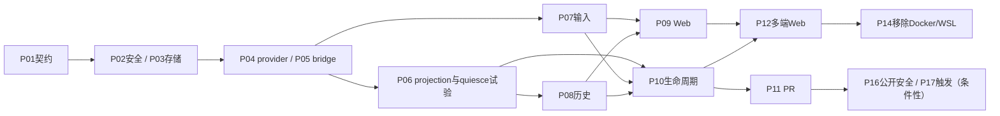

# Spec 10 — 实施计划、验收门槛与迁移

状态：计划，尚未执行。本文把00–09与11的设计转换为可审查的小步实施。此次仅修改spec，不安装provider SDK、不创建沙箱、不启动云服务、不提交或发布代码。

## 1. 已发现的设计问题与修订结果

| 原问题                                 | 修订                                                                                   | 主契约   |
| -------------------------------------- | -------------------------------------------------------------------------------------- | -------- |
| 原有云代码已撤销，文档仍称已实现       | 所有cloud功能标计划；当前源码证据与目标路径分开                                        | 00       |
| provision后依赖浏览器autoSend          | 接受前持久input，服务端ready后投递；首输入关联createSession                            | 03/08    |
| Task状态用connected，混淆工作与机器    | Task/Run/Execution/保存/PR分别建模                                                     | 08       |
| repo/provider/path身份随并发/重建漂移  | 仓库task不透明identity，run/连接代际单独路由                                           | 02/08    |
| ACK被当作可靠历史保证                  | transport/runtime/durable-ingest三类ACK与durable receipt分离；canonical projection出口 | 02       |
| 心跳丢失直接expired，再起新run         | disconnected + provider核验 + 旧写权限处置                                             | 01/02/08 |
| Git当全部持久层，聊天丢失              | 元数据/input/history/附件归控制面，Git保存产物                                         | 03/08    |
| push失败不停机却又有硬上限             | 周期安全点保存、期限drain、remote SHA、dataAtRisk                                      | 01/08    |
| 全凭据store推到沙箱                    | 按 run 用途授权白名单；账号/provider 凭据留 host 本体，App 私钥留 cloud 层（决议⑧）    | 01       |
| PR base/head同一branch，checks权限缺失 | baseBranch/baseSha/taskBranch分开、完整permission矩阵                                  | 09       |
| webhook验签等同用户授权                | delivery inbox、sender authorization、业务幂等、失败补投                               | 09       |
| 云禁本机仅隐藏按钮                     | 云入口独立服务图，绕过UI仍拒绝本机执行                                                 | 03/04    |
| APK默认同origin和热更新承诺            | webDir内置资源、显式controlPlaneOrigin、OAuth/deep-link契约                            | 05       |
| Docker/WSL类型和消费者分两个PR         | 类型/所有消费者同PR，旧身份invalid不回本地                                             | 06       |

这些是方案修订理由，不等于当前源码新增了相应实现。

本轮新增专项契约11：draftStartConfig、冻结submit attempt、start/append显式意图、firstInputCommandId/recipe、stop屏障与保存依赖。当前未提交骨架只作差距证据，不作为P03/P07/P09已完成的前提。

## 2. M0：实施前基线与决策冻结

### 2.1 基线工作

- 使用mise.toml固定的Node24.14.0与pnpm10.33.2。当前环境Node24.18.0、mise命令不可用，执行结果有环境偏差。
- 运行freshness正常fetch；权限问题先修复工作目录/生成物权限或使用合适工作树，不改用户业务代码来掩盖环境问题。
- 核对dist与当前source/package.json的差异，按现有真实构建入口刷新生成物；不得从dist恢复已撤销cloud源码。
- 将现有typecheck/lint问题记录成baseline。无关源码修复独立处理，不混入第一批cloud功能。
- `packages/server`、web/UI及CLI没有统一cloud单测/E2E命令；先为新增模块制定可执行runner入口，再引用命令。

### 2.2 需要冻结的架构选择

| 决策            | 推荐                                                                                            | 若改变的影响                                            |
| --------------- | ----------------------------------------------------------------------------------------------- | ------------------------------------------------------- |
| 部署模型        | 已决（2026-10-06）：**单用户本身就是本项目部署模型**（非过渡），强制认证保留；M7 不在当前路线图 | 若变更部署模型，租户隔离/Git写隔离/模型代理成为前置条件 |
| provider        | 已决（2026-10-05）：E2B+Modal+Daytona 三家 adapter                                              | 各家真实实测解禁前 capability 门控不显示可选            |
| 控制面存储      | 独立SQLite WAL + storage worker +附件目录                                                       | 多实例扩容需外部DB/operation lease，不直接共享JSON      |
| cloud模块       | `packages/server/src/cloud`受控分层                                                             | 独立包可以后续拆，先不增加独立HTTP服务                  |
| projection来源  | runtime canonical commit后结构化export                                                          | 需M2 spike确认hook；不可dump delivery/stdout替代        |
| bridge发布      | 正式新增源码/构建入口，保持stdio supervisor                                                     | 包位置M2冻结，不以旧空目录为实现                        |
| 恢复            | 同task分支新session +持久历史                                                                   | 完整runtime snapshot另立spec                            |
| 沙箱runtime配置 | 已决（2026-10-06）：控制面同源 provider/model 配置直连注入（可信单用户）                        | 公开/多租户前升级代理或等价最小授权（01 §7.1）          |
| Desktop模式     | 云客户端只有 Web（2026-10-06 决议移除 Desktop 云入口）；迁移期保留旧本地开发                    | 最终移除本地入口需独立范围确认                          |
| SSH             | （2026-10-06 决议移除云侧 attachment；SSH 仅作 Desktop 本机/远控与沙箱交互同构参考）            | 不适用                                                  |
| 期限/保留/预算  | 部署配置+provider能力较小值                                                                     | 实测校准；默认数值不冒充平台保证                        |

M0评审通过后才实施数据库schema与协议变更。CLI子仓库AGENTS要求数据库结构方案与维护者确认，当前计划提供了schema/迁移/回滚依据；正式执行时以用户已授权的范围和该要求判断是否仍需确认。

## 3. 目标模块和阅读范围

| 边界       | 必读当前文件                                                                                                     | 计划变化                                             |
| ---------- | ---------------------------------------------------------------------------------------------------------------- | ---------------------------------------------------- |
| server入口 | entry-http.ts、http.ts、stdio.ts、entry-stdio.ts                                                                 | 云服务图、cloud HTTP/WS挂载，保留local模式           |
| RPC        | rpc persistent-protocol.ts、channel/proxy/socket相关入口                                                         | 复用传输；新增cloud facade不改成业务owner            |
| shared     | remoteTarget.ts、remote-workspace-identity.ts、zcode-protocol/index.ts、zcode-protocol-v4/                       | cloud上下文/schema、严格版本/capability              |
| services   | node.ts、zcodeAgentConnectionScope.ts、zcodeAgent.ts、provider provisioning公开入口                              | 明确remote owner与cloud适配；不新增runtime实现导入   |
| CLI        | command-inbox.ts、v4-gateway.ts、conversation-topic-publisher.ts、persistent-command-facts.ts                    | 验证firstInput、canonical export、quiesce与持久facts |
| UI         | SessionPane.tsx、conversationProjectionStore.ts、pendingCommandRegistry.ts、store/remoteWorkspaceSessionStore.ts | cloud receipt投影、稳定路由、现有UI复用              |
| Desktop    | windowRemoteConnectionRegistry.ts、windowHostAttachmentRegistry.ts、hostWorkspaceTaskTracker.ts                  | cloud客户端和旧owner/lease回归                       |
| Web        | main.tsx、auth/webAuthService.ts                                                                                 | cloud boot、显式服务origin、按需attach               |

以上文件存在但不代表其中已有cloud能力。实施前用architecture:context生成目标模块阅读包，再打开语义一跳；新模块先注册managed policy和公开contract。建议cloud-control-plane父模块与cloud/execution下cloud-execution子模块分别归属，按最深root解析，分层和依赖均显式登记；子模块不深导入父app实现。UI代码执行前阅读DESIGN.md；如触及plugin同步/商店再阅读CONTEXT.md。

## 4. PR拆分和依赖

每个PR先落对应spec/test，再实现；列出的测试路径均为拟新增，不是现有覆盖。每批保持最小可运行/可关闭边界。

| PR  | 阶段与交付                                                                                 | 前置                                   | 退出证据                                                          |
| --- | ------------------------------------------------------------------------------------------ | -------------------------------------- | ----------------------------------------------------------------- |
| P01 | M0：决策、严格schema、cloud上下文、架构模块contract与示例                                  | 方案冻结                               | schema round-trip、非法输入、未知版本；旧local/SSH契约仍成立      |
| P02 | M1：cloud安全服务装配、认证principal与capabilities                                         | P01                                    | 绕过UI无法本机Agent/file/terminal执行；未配置认证cloud启动失败    |
| P03 | M1：DB worker、迁移、Project/Task/run/input/operation存储                                  | P01/P02                                | 临时DB事务/唯一约束/磁盘失败/重启恢复；零provider调用             |
| P04 | M2：provider port、一个driver、GitHub read授权adapter/clone broker、创建意图与对账/清理    | P03                                    | mock故障点与真实create/inspect/terminate，create未知不重复        |
| P05 | M2：固定baseSha/taskBranch的bootstrap、runtime发布与常驻bridge supervisor                  | P04                                    | 检验版本/摘要、真实出站WSS、断网不stdin EOF；无client也ready      |
| P06 | M2：canonical projection/quiesce技术试验                                                   | P01/P05                                | 确认hook/epoch/seq/snapshot屏障；结果不成立先修订02，不堆fallback |
| P07 | M3：durable input delivery、runtime ACK/query和firstInput                                  | P03/P05                                | accepted后关页、ACK丢失、并发firstInput、同ID不同payload          |
| P08 | M3：durable projection ingest、snapshot/history与缺口恢复                                  | P03/P06                                | 断网>transport缓存、重启、重复/乱序、retention超界                |
| P09 | M3：Web cloud console、任务路由/列表/receipt与按需attach                                   | P07/P08                                | 清存储/换浏览器、移动布局、真实远端交互E2E                        |
| P10 | M4：Git write grant/push与remote SHA确认、安全checkpoint、期限drain、续期/配额/stop/reopen | P06/P07/P08                            | concurrent writer、push失败、硬期限、旧run晚到、termination未知   |
| P11 | M4：PR publication幂等effect、最小权限与PR状态投影（分支/保存已在P01–P10落地）             | P10                                    | base/head正确、创建响应丢失、noChanges、nonfastforward、撤权      |
| P12 | M5：多端 Web 审批/订阅与delivery回归（桌面+移动浏览器）                                    | P09/P10                                | desktop-continuous与web-remote-replayable各自通过                 |
| P13 | （已移除）原控制面 SSH attachment 与 workspace owner 映射                                  | 不适用                                 | 2026-10-06 决议移除，见 00 §11⑥；实施证据留 git 历史              |
| P14 | M5：Docker/WSL远程目标原子删除                                                             | P12，仓库替代路径可用                  | 类型+消费者+schema+文档同PR，legacy invalid、跨平台宿主回归       |
| P15 | （已移除）原 Android 壳、origin、OAuth/deep-link                                           | 不适用                                 | 2026-10-06 决议移除，见 00 §11⑥；apps/android-shell 已删          |
| P16 | M7：多账号/Git写隔离/每用户预算与公开门槛                                                  | 条件性；见 00 §11⑤（单用户不在路线图） | 跨租户隔离、恶意repo/越权ref、secret隔离、限额原子性              |
| P17 | M7：GitHub durable webhook、sender授权、checks/comments                                    | 条件性；见 00 §11⑤                     | delivery重放/补投、bot防自激、fork/外部commenter拒绝              |



可并行schema/fixture/界面设计，不能在输入/恢复语义未冻结时用mock成功路径认定端到端完成。P06为真实设计验证门槛，不以大规模重写runtime取代证据。

按模块分工的执行入口见 [13-module-map](./13-module-map.md) 与 `modules/W0–W10`，对应关系：P01→W0；P02→W5；P03→W2；P04→W3/W4；P05/P06→W6；P07/P08→W1+W6；P09→W8/W9；P10/P11→W1/W3/W4/W6；P12→W10；P14→W10。**W0 契约未冻结前不得并行开工其他工作单。**

## 5. 测试分层和入口

当前services/UI有node:test测试文件，但package.json没有统一test脚本；server/web当前也没有cloud E2E脚本。CLI各包有typecheck/lint/build，不等于已有cloud测试。实施时选择node:test或当前可用runner，新增正式脚本、依赖和fixture后才发布命令。

| 层级                  | 目标                                            | 环境                              | 必要断言                                               |
| --------------------- | ----------------------------------------------- | --------------------------------- | ------------------------------------------------------ |
| domain单测            | 状态迁移、到期、配额、代际和幂等                | 注入clock/无IO                    | 不用真实sleep等状态同步                                |
| repository集成        | 事务、唯一有效run、receipt、迁移、worker失败    | 临时SQLite/附件目录               | 提交前后crash、只提交一次、未引用附件清扫              |
| adapter contract      | provider/GitHub/secret/bridge消息               | 可控fake网络与operation查询       | 成功/明确失败/结果未知三分支                           |
| runtime集成           | firstInput、CommandInbox/query、quiesce、export | 受控CLI进程/临时repo              | ACK丢失不重复副作用、投影连续、无并行写                |
| 服务端集成            | auth、cloud服务白名单、WSS/restart              | 本机控制面但Agent只在测试远端     | 绕过UI的本机拒绝和所有权检查                           |
| Web/多端E2E           | 真实UI创建/发送/审批/恢复                       | Web+Desktop/移动视口+隔离provider | screenshot/trace+DB receipt/runtime log/remote SHA关联 |
| Android装机（已移除） | 不适用：随 Android 壳移除（2026-10-06 决议⑥）   | 不适用                            | 不适用                                                 |
| provider实测          | 资源/启动/续期/期限/清理                        | 测试账号、私有测试repo            | provider状态、进程、credential泄漏与账单资源关联       |

E2E不能只验证状态点变绿；至少断言commandId真实admission、输出真实出现、保存SHA真实在远端、旧run不能写新任务。

### 项目/草稿/首次启动专项门槛

P01/P03需补03/08的draftStartConfig、recipe、firstInputCommandId、stop意图、acceptanceSeq及迁移/严格schema；P07验证去重先CAS、失败输入收口及原commandId/ACK对账；P09复用原UI，加入Task scope、完整attempt跨刷新、配置CAS与能力门控；P05/P10验证固定recipe、创建途中stop及checkpoint→terminate依赖。不要只给现独立Cloud列表/textarea加按钮作为最终UI。

11的CT-01–CT-20全部为计划门槛，实施时登记真实runner及按用例所需的UI/事务/provider/runtime证据。正文首发是默认范围，首发附件须单独验证task-owned upload/materialization；Local/SSH与手机Desktop远控原预热/附件/delivery作为回归，不能统一改成云语义。

## 6. 高风险验收矩阵

全部场景均为计划；每项须保留setup/action/assertion/evidence和对应测试ID。

| 组               | 代表场景                                                           | 证据                                                                |
| ---------------- | ------------------------------------------------------------------ | ------------------------------------------------------------------- |
| B01身份          | 同repo两个task，同path/provider；换provider；仓库重命名            | task identity/run映射、两端独立projection                           |
| B02输入          | 202后关页；HTTP响应丢失；ACK丢失；不同payload同ID                  | durable receipt、runtime查询与执行次数                              |
| B03恢复          | 控制面重启；bridge断网数分钟；token旋转回包丢失                    | 同provider handle、ingest cursor、epoch与token状态                  |
| B04双写          | provideralive但bridge失联；旧ready/checkpoint晚到；reopen并发      | generation CAS、拒绝原因、旧token/实例终止证据                      |
| B05保存          | local commit后push失败；push成功回包丢失；ignored/secret未跟踪文件 | remote ref SHA、文件范围、dataAtRisk                                |
| B06期限          | running/idle/awaiting-input/只观看；续期失败；硬上限到达           | 真实expiresAt或明确deadlineEstimate/confidence、业务活动、drain结果 |
| B07背压          | >100帧/s慢消费；WAL/DB满；cursor过retention                        | 无未提交ACK、resync/snapshot、有限资源                              |
| B08权限          | 未登录；跨task/租户；伪trusted role；App撤权；恶意repo借broker     | 404/授权日志/无secret泄漏/无越权写入                                |
| B09GitHub        | PR创建未知、无diff、base改名、外部branch改动、workflow权限不足     | 单PR、head/base、publication错误不覆盖产物                          |
| B10多端          | 三端观看；同时审批；desktop连续与web恢复                           | 相同runtime事实、单裁决、各自delivery语义                           |
| B11SSH（已收敛） | 手机附加桌面、断连/重连                                            | 原workspace owner唯一、不另起runtime（云SSH用例随移除作废）         |
| B12平台          | Web 显式origin/OAuth callback、Windows/macOS/Linux                 | 真实平台执行记录，不把一端通过当全部通过                            |
| B13删除          | WSL/Docker历史identity、类型消费者原子移除                         | 无fallback至本地、保留旧数据、typecheck/knip                        |
| B14成本          | 创建未知、孤儿、stop未知、并发预留争用                             | provider资源对账、槽位保留、无超额实例                              |
| B15触发          | 验签成功但sender未授权、delivery补投、bot评论、fork PR             | 不创建任务或单input、拒绝/幂等记录                                  |

## 7. 数据与发布迁移

当前撤销后的原代码不存在旧cloud Project注册表，不能假定有`zcode-cloud-repo-projects`迁移来源。首版从空cloud数据库建项目；若真实部署存在历史试验数据，先单独读取其schema/来源并制定一次性import，不能猜字段。

原Desktop/本地task数据库、workspace history和session文件不搬到cloud，也不删除。新cloud DB schema独立版本化。runtime旧数据只通过已验证的兼容导入机制进入历史，不把浏览器草稿直接转换成已admitted事实。

DB migration默认additive：备份、事务、schema版本校验、兼容读窗口；无法兼容旧binary时阻止降级启动。生产回滚流程先停止accept新任务，保留持久delivery/reconciliation服务处理已有意图，核验活动run，不能简单关feature flag使已接受工作无人管理。

SDK/runtime/bridge分版本发布；控制面只接受兼容的capabilities。runtime资产使用固定版本与摘要校验，禁止任务启动时无限追最新。滚动更新中旧run可以在受支持版本继续，新增run使用新模板；需要中断时按drain保存策略处理。

MVP控制面单实例；不将sqlite文件放多进程共享网络盘作为扩容。水平扩展需要外部DB、operation lease与generation fencing设计，在独立变更中处理。

## 8. 运行与发布验收

- cloud模式认证配置缺失、持久卷不可写、migration失败、bridge版本不兼容时fail-closed，不隐式切local。
- cloud部署只开放需要的HTTP/WS入口，origin统一；不在spec中写真实用户域名、服务器地址、密钥或账号。
- （2026-10-06 决议移除）原"单用户SSH连接使用明确target allowlist"条款随云 SSH attachment 移除作废；Desktop 本机 SSH 目标不受云范围约束。
- provider创建/续期/销毁、Git写入与PR都带trace/operationId；所有日志按service logger和debug/info/warn/error层级，正文与token脱敏。
- 长期可见指标：active run、未确认input、projection lag/WAL bytes、last checkpoint、续期失败、unknown external operation、孤儿资源。
- DB/附件/secret备份一起演练；恢复后先核验旧provider与写凭据。进程重启零丢accepted输入与整卷灾难恢复不是同一承诺。
- 预算默认值由provider实测与部署配置决定；provider账单为事实，控制面估算标明估算。超预算停止新创建，已有任务按保存策略drain。

## 9. 必须执行的代码检查

代码实施阶段每个PR按真实package.json执行：

```bash
node scripts/check-workspace-freshness.mjs
pnpm architecture:check --changed
pnpm architecture:context <实际模块ID>
pnpm typecheck
pnpm lint
pnpm fmt:check
pnpm verify:pre-push
```

涉及CLI时还执行 `pnpm --dir apps/zcode-cli typecheck` 与 `pnpm --dir apps/zcode-cli lint`；涉及删除导出先用 `pnpm dep:refs --list-exports <file>`/symbol查询，最后 `pnpm knip`。新增测试/E2E入口建立后加入该PR的验证清单，不杜撰现有`pnpm test`或`pnpm e2e`。

architecture baseline不能自动刷新消除新增违规。报告改变模块、owner、event order、测试、行数和baseline/new violations。所有未执行/环境受限验证单列。

## 10. 文档修订验证记录

### 2026-10-07 第四批：真实 E2B 联调后续（执行节点 HTTP 面两处缺口 + 凭据非消费校验端口增补）

触发：沙箱 supervisor 首次能起来并拨通域名后，**升级与 bootstrap 两处连续被自己的门挡住**——两处都在「执行节点面」上，按 [02 §4](./02-bridge-protocol.md)/[01 §7.2](./01-provisioning.md) 该面的鉴权是 run-scoped（票据/Bearer），不是浏览器 lite token。逐项修复：

| #   | 缺口（实测现象）                                                                                                                                                              | 修复与证据                                                                                                                                                                                                                                                                     |
| --- | ----------------------------------------------------------------------------------------------------------------------------------------------------------------------------- | ------------------------------------------------------------------------------------------------------------------------------------------------------------------------------------------------------------------------------------------------------------------------------ |
| 9   | 沙箱 bridge **升级阶段 401**（服务端无记录）：`/ws/cloud/bridge/*` 落进 lite-token 的 `/ws/` 前缀判定，而沙箱按设计拿不到、也不该有浏览器凭据                              | W5 拆出显式谓词 `isRunScopedBridgePath` 并**只**豁免该前缀；鉴权改由 hello 帧票承担（无票→帧拒绝、错票→`bridge.fault{unauthenticated}`+1008）；静态层判定改为「是否 API/通道命名空间」，bridge 路径不会回落 index.html；用例：无 token 升级成功、空/错票被拒、其余面仍 401 |
| 10  | 同一类缺陷第二处：`GET /api/cloud/runs/:runId/git-grant` 被 lite-token 挡住；且该路由此前**根本没装配**（`notImplemented(…owned-by-w4)`，`createGitGrantRouteHandler` src 内零挂载） | W5 加 `isExecutionNodeHttpPath` **精确**豁免（不放开 `/api/cloud/runs/*` 或 `/api/*`）；装配 broker（`store`=云存储 `grants`、`mint`=W4 token 服务按 purpose 矩阵、`revokeToken`=单 token 撤销）与 route handler，`resolveRunPrincipal` = `Authorization: Bearer` → sha256 → 非消费校验 → run/task/project **持久事实**（不采信查询参数）；入口自持存储客户端以取 `grants` 并让控制面复用同一实例 |
| 端口增补 | `RunCredentialRepo` 只有消费式校验（`consumeForHello` 会旋转凭据并绑定 helloAttempt），git-grant 复用它会**每次兑换都打断 bridge 重连** | W0 冻结新增 `verifyActiveCredential({runId, proofHash, now}) → { runGeneration } \| null`：**非消费**、恒定时间比较、要求 `revoked_at IS NULL` 且未过期、`used_at` 不参与判定（初始票被 hello 消费后 hash 已切换，匹配 hash 即当前凭据）；不加列。落点 `app/ports/credentialPort.ts`、`adapters/storage/repositories/credentialRepo.ts`、`storageMethodTypes.ts`、`cloudStorageClient.ts` |

验收（本批由 W5 交付）：`/api/cloud/runs/<id>/git-grant` 用有效 Bearer 首兑 200（fake mint，不触达 GitHub）、二次 403 `already-redeemed`；无/错/过期/已撤销凭据 401；purpose 越界 400，目的不符/代际不符/终态 run 拒绝；豁免只作用于执行节点面（`/api/cloud/runs/<id>/git-grant/extra` 仍 401）；`verifyActiveCredential` 调用后 `consumeForHello` 仍成功（非消费性）。本批实测（仓库根）：`typecheck` 0 错误；`lint` 0 errors / 71 warnings；`architecture:check` **0 violations**；server **460（452 pass / 0 fail / 8 skip）**。

未执行（环境阻塞，如实记录）：真实 GitHub App + E2B 联调仍待网络恢复后重跑（本批只保证「请求能到、凭据判定正确」，clone/push 的真实 GitHub 往返未验证）。

### 2026-10-07 第七批：云任务会话面板（最后两格：会话绑定 + 共享 relay 的单客户端语义）

前置：第六批 #21 修复后浏览器已能 attach（`attach: CONNECTED`、composer 渲染），但会话区报 `fault.subscribe.sessionNotFound`。

| # | 缺口（实测现象） | 修复与证据 |
| --- | --- | --- |
| 22 | **pane 把 taskId 当会话 id 订阅**：`fault.subscribe.sessionNotFound` 里的 id 就是 taskId；runtime 的真实会话是 ack 落地的 `sess_…`（也是投影 topic 后缀）。契约本就返回 `activeRun.runtimeSessionId`（run 记录字段），纯 UI 绑定缺失 | 新增纯规则 `cloudTaskRuntimeSession.ts`（`resolveCloudTaskRuntimeSession`：同任务且详情就绪才返回 `sess_…`；缺失/他任务 fail-closed 为无会话，**绝不用 taskId 顶替**）；`WorkspaceShellLayout` 的 pane 会话键改用它；controller 在 attachment 就绪/状态变化时补 `loadTask()` 对账（否则 draft→start 后 `sess_…` 永远到不了 UI，换代也跟不上） |
| 23 | **共享 relay scope 的单客户端绑定**：`fault.connection.clientChanged`——沙箱 runtime 以**一条** stdio 连接（`trusted-host-relay` 角色）服务所有浏览器流，facade 的 `initializeConversationV4` 在该 scope 上 first-wins 绑 `boundClientId`；任一浏览器握过手，之后的新客户端永久被拒 | 云 attachment 的 `zcodeAgentService` 把 `initializeConversationV4` 吸收为 no-op（依据：relay 角色 `handshakeComplete` 初始即 true、`subscribeConversationV4` 只 `assertReady` 不查 `boundClientId`、命令归属校验只在 `terminal-client` 角色生效、云输入走控制面 inputs API）。桌面/本地/远控直连 scope 不经此包装，语义不变 |

验收（浏览器探针连续 3 次 + 独立复验 1 次，一致）：右侧渲染完整对话——用户消息「只回复两个字：收到」、模型回复「收到」、消息工具条与 composer；无 TypeError / sessionNotFound / clientChanged、零失败请求。代码门槛：typecheck 0、lint 0 errors（72 warnings 持平）、architecture 0 violations、ui **71（66+5 新增）**、web **22**、client 35、server 477 全绿。

遗留观察（不在本轮范围）：共享 relay scope 上**多浏览器并发**订阅的路由命名空间仍是服务端单连接语义（v1 单用户部署下无碍；多端同时看同一任务需要按客户端分发，属 04 §5 的后续项）。

### 2026-10-07 第六批：投递毒化 + 凭据 TTL 锁死 + 任务通道协议不匹配（真实链路最后三个硬阻塞）

触发：第五批跑穿一次后，**后续所有 run 的输入都停在 `accepted`**、任意断线后重连全部 `credential-rejected`、浏览器任务面板 Initialize 死锁。三个都是「单例/固定值/约定不匹配 + 无复位路径」型缺陷，只有真实链路能暴露。

| # | 缺口（实测现象） | 修复与证据 |
| --- | --- | --- |
| 19 | **命令传输单例被一次连接关闭永久毒化**：`CloudCommandTransport` 在服务端是单例，`release()` 置位的 `released` 永不复位——任意 run 的 bridge socket 关闭（60s 命令超时/重连被拒）后，之后**所有 run** 的输入投递一律 `attachment_unavailable:closed`（run ready 后 0.1s 的投递即失败，沙箱与连接均健在）。第五批唯一一次成功恰是「服务端重启后的第一条连接」，与该假设完全吻合 | `release(reason, releasedContext)` 按**关闭的那条连接**（run/代际/epoch 三元组）记账；`ensureSession` 对新上下文清位并**对新连接重发 `rpc.open`**（沙箱侧 relay 的流注册在旧 socket 上，不会自动迁移）；同上下文仍拒绝（连接确实没了）。回归用例覆盖：同上下文拒绝、异 run/新 epoch 不受毒化、新上下文重发 rpc.open |
| 20 | **bridge 凭据行按固定 10 分钟 TTL 落库且旋转不续期**：这行凭据是 run 终身的 bridge 身份（旋转只换 hash 不换行）；连接存活超过 TTL 的 run 一旦断线，`expires_at > now` 恒假 → hello 永久 `credential-rejected` → 恢复阶梯走完 `exhausted` → run 只能等 1h 硬期限收口。实测锚定：`used_at=19:08:04`（最后一次成功消费）、`expires_at=+9.2min=19:17:16`、19:41 断线后全部拒绝；沙箱侧 token hash 与 DB 完全一致（token 本身有效，是行过期） | `mintBootstrapTicket` 的 `expiresAt` 改为 **run 硬期限**（未规划时按 `hardRunDurationMs` 兜底，首个 hello 即对齐）；`consumeForHello` 旋转时 `expires_at = MAX(expires_at, runs.hard_deadline_at)`（run 经 /extend 延期时凭据跟随；MAX 不缩短以尊重夹具/未规划期限）；删除已无语义的 `bootstrapTicketTtlMs` 配置。回归用例：+20 分钟重连可消费、临近期限可旋转、超期拒绝 |
| 21 | **任务通道传输层协议不匹配（浏览器 Initialize 死锁）**：`cloudAttachmentSocket` 把任务通道 WS 包了 `SocketProtocol`（期待 13 字节传输头分帧），而该通道是**字节直通沙箱 rpcRelay**——`rpc.*` 帧的 payload 是完整的裸序列化消息。`ChannelServer` 构造即主动发的 Initialize 是 6 字节（`[200]` 的序列化），进客户端 ChunkStream 连头都不齐 → 永不出 onMessage → 客户端零发送、15s 超时。命令通道（`commandTransport`）两端都是裸 protocol，故一直正常——单元测试用内存直通恰好掩盖了浏览器这一侧多包的一层 | `cloudAttachmentSocket` 去掉 `SocketProtocol` 包装，protocol 直通（send=socket.write、onMessage=onData）；注释写明「rpc.* payload = 完整序列化消息」的通道约定与 6 字节死锁证据。node 直连探针：修复前 `did not initialize within 15000ms`（零发送、仅收 6B `040106c80100`），修复后 `attach: CONNECTED` + channel 可用；浏览器面板从「no ready run attachment」占位变为完整工作区 composer |

诊断性加固（同批）：投递 dispatcher 七道等待分支全部静默——加 `cloud input delivery blocked {result, reason}`（只在原因变化时记，成功清除），真实链路立即用它定位了 #19；`browserStreams` 对未知 streamId 的 `rpc.response` 记 warn（原先静默丢弃，浏览器 Initialize 永远超时无从排查）；沙箱 rpcRelay 的流开/首响应从 debug 升 info。

验收（真实链路）：`admitted` + `runtime_session_id` 落地 + 投影回复 `收到` 多次复现；node 直连探针 `attach: CONNECTED`；浏览器右侧从占位页变为完整工作区（composer 渲染、零控制台错误、零失败请求）。

未验证（如实记录）：① 会话 pane 绑定用 taskId 导致 `fault.subscribe.sessionNotFound`（应为 `activeRun.runtimeSessionId`，契约已含该字段，修复中）；② 断线重连在新 TTL 下未被自然断网复现（凭据行已按硬期限落库，`consumeForHello` 的跟随逻辑有回归用例覆盖）；③ 模型偶发空回复（约 3/7 轮无投影，疑账号侧计费/鉴权抖动——host 日志同窗可见 `billing/balance 400`，未定位，不影响链路正确性判定）。

### 2026-10-07 第五批：真实 E2B 全链路联调（沙箱侧 6 处 + 控制面 2 处）

触发：桥与 git-grant 两处豁免落地后**连续重跑真实链路**（真 GitHub App + 真 E2B 账号 + 真模型登录态）。这一批的特征是：**单测全绿但整条链不通**，每道门都必须真跑才看得见，且前一道不过就看不见后一道。最终一次跑穿：`run ready` → 输入被 runtime `admitted` → 模型流式回复（投影 `conversation/sess_…`，回复正文 `收到`）。

| #   | 缺口（实测现象）                                                                                                                                                                            | 修复与证据                                                                                                                                                                                                                                                                                                                                           |
| --- | ------------------------------------------------------------------------------------------------------------------------------------------------------------------------------------------- | ---------------------------------------------------------------------------------------------------------------------------------------------------------------------------------------------------------------------------------------------------------------------------------------------------------------------------------------------------- |
| 11  | 每个 sandbox 的首握手**必然被拒**：`bridge handshake rejected {reason: workspace-path-mismatch, hasPersistedWorkspace: false}`；同一次拆分还堵住「对账恢复出的 handle 从不启动 supervisor」  | W0 冻结 `SandboxDriverPort.startSupervisor(handle, input)` + `SandboxSupervisorStartInput`；`create()` 只建资源；控制面在 `recordProviderHandle` 之后、settle 之前启动，**正常路径与对账恢复路径共用** `persistRunHandle`；迟到 handle / `stopRequested` / 已结算分支不启动。证据：重跑后 `bridge attachment opened` 直接出现，无 1008 拒绝                      |
| 12  | git grant 的**签发**整条没实现：`broker.issue()` 与 `RunAuthorizationPolicy.resolveGitGrant` 在 src 内零调用方，`git_grants` 无记录 → 兑换必然 `unauthorized/no-issued-grant`（bootstrap 卡死） | 新增 app 层 `CloudGitGrantService.issueForRun/redeem`；broker 装配从入口搬进控制面（**同一实例**，`heldTokens` 撤销不分裂）；clone 在 `startSupervisor` 之前签、push/fetch 在 `checkpoint.request` 之前签（`pushAndVerify` 的 ls-remote 走 `withGrant("fetch")`，只签 push 会让保存在"远端校验"失败）；旧的元数据生成器收口为纯判定，不留第二份 TTL/grantId 规则 |
| 13  | 沙箱 clone 被 GitHub 拒：`remote: Duplicate header: "Authorization"` + `400`                                                                                                                | `gitCredentialEnv` 同时设了 `http.extraHeader` 与 `http.<url>.extraHeader`——两者是各自独立的多值配置，都命中同一 URL 时 git 会把两个头一并发出（不是后者覆盖）。只保留 URL 作用域那一个（`originUrl` 固定产出 `github.com`），注释写明依据                                                                                                          |
| 14  | **单次兑换 + 整轮重试 ⇒ 一次瞬时失败变永久失败**：clone 失败后每次重试都是 `403 already-redeemed`，直到 120s provisioning 超时销毁                                     | `reportRunFault` 在 `bootstrap_failed` 且 run 仍 `provisioning`、无停止意图时补签 clone grant（幂等交给 `issueForRun`：只复用 `issued` 且未过期者）；终态与 stop 屏障不补签                                                                                                                                                                          |
| 15  | `provider provisioning target channel provider-provisioning-target is unavailable`（envelope 装不进 runtime）                                                                              | `localRpcOwner.channel()` 复用了**浏览器面**白名单，而该通道正在拒绝名单里；这条 stdio 连接是执行节点自己的 runtime（12 §6 A-08 要求经它安装 envelope）。收窄只留在 relay（拒绝名单 + 允许名单两道），本地 owner 不再二次过滤；浏览器「拿不到 provisioning target」的断言移到 relay 用例                                                          |
| 16  | runtime 侧 zod 报 `expected object, received undefined`（envelope 安装失败）                                                                                                                | **通道调用约定**：`IChannel.call(command, args)` 的 `args` 是**参数数组**（`ProxyChannel.fromService` 里 `target.apply(handler, args \|\| [])`）。裸对象会被当成零参数调用。共 4 处：`provisioningInstaller.apply`、`commandTransport` 的 `sendConversationCommandV4`/`queryConversationCommandsV4`、`sessionTopicSource` 的 subscribe/unsubscribe；测试假件同步改成数组取值 |
| 17  | supervisor 每次启动后 **57s / 60s** 消失：沙箱仍 `running`、进程全无、控制面只见 socket `1006`（像是"断网"）                                                                                | E2B SDK `commands.run` 的 `timeoutMs` **默认 60_000**，后台命令到点连进程组一起被杀。显式设成 `E2B_SUPERVISOR_COMMAND_TIMEOUT_MS`（= 沙箱上限，Hobby 1h / Pro 24h），注释写明「命令会话寿命必须 ≥ 沙箱寿命」；Daytona/Modal 的同类寿命语义**未验证**（无账号）                                                                                        |
| 18  | 配额泄漏：`disconnected` run 的 sandbox 已被删，槽位仍占着（`quota_released_at` 为 NULL），新任务一律 `409 quota_exceeded`，要等硬期限 1h | `driver.inspect` 原本只在启动恢复与 readiness 看门狗里用。keepalive sweep 增加对 `disconnected`（及 drain 停摆的 `draining`）run 的 provider 事实核对：实例不存在/已终止 → 走既有唯一收口入口（`settleTerminal` → `releaseQuota`，`end_reason=provider-instance-lost`）；**不可达/未知一律不释放**（提前释放会让新旧沙箱并跑），只记 warn 等下一拍 |

诊断性加固（同批，因反复"死得没痕迹"而做）：沙箱内执行日志与崩溃栈落盘到 `~/.zcode/run/supervisor.log`（有界，`debug` 不落盘），bridge 帧被拒时记 `reason` + 帧类型 + 字段名 + 字节数（不记正文）；README 的 E2B 模板构建命令按 CLI v2 修正（`template create <name>` 且必须同时给 `--cmd` 与 `--ready-cmd`）。

验收（真实链路，非模拟）：`cloud run ready` → `cloud input runtime ack recorded { deliveryStatus: admitted }` → `projection_events` 落 14 条 delta + 1 条 snapshot（`conversation/sess_…`，assistant 行正文 `收到`）。代码门槛（仓库根）：`typecheck` 0、`lint` 0 errors、`architecture:check` 0 violations、server **475（467 pass / 0 fail / 8 skip）**。

未验证（如实记录）：① 云任务右侧会话面板的**渲染**——无头浏览器在该任务上稳定复现 `TypeError: Cannot read properties of null (reading '1')`（React `useCallback` 读到空 hook 状态，zustand `useStore` 被当组件渲染/条件 hook；attachment WS 本身已连接），已用本地 TLS 直连（`MAP zcode.yuxuanyi.tech:443 127.0.0.1:8443`）做成确定性复现，修复另计；② Daytona/Modal 的命令会话寿命与 supervisor 启动语义未在真实账号上验证；③ clone 之后的 push/checkpoint 往返未跑通（本批只到模型回复）。

### 2026-10-07 第三批：接入真实凭据后暴露的缺口（真跑服务 + 真浏览器复核）

触发：用**真实 GitHub App + E2B key** 起服务、并用无头浏览器走完整流程后，暴露出一批「单测全绿但实际不可用」的缺口与一处**数据安全问题**。逐项修复与证据：

| #   | 缺口（实测现象）                                                                                                                                                               | 修复与证据                                                                                                                                                                                                                              |
| --- | ------------------------------------------------------------------------------------------------------------------------------------------------------------------------------ | --------------------------------------------------------------------------------------------------------------------------------------------------------------------------------------------------------------------------------------- |
| 1   | **数据安全**：云服务端读写运维者真实 `~/.zcode`（`services/paths.ts` 在模块加载时固化 `HOME`；只有 settingService 认 `ZCODE_DESKTOP_HOME_DIR`），实测污染了真实 `setting.json` | 入口引导改为「先设 `HOME`/`ZCODE_DESKTOP_HOME_DIR` 再动态 import 服务图」（`entry-cloud-home.ts` + `entry-cloud-main.ts` 动态 import）；新增 5 条用例；实测探针前后真实 `setting.json` mtime 不变、host 数据全落 `<dataDir>/.zcode/v2/` |
| 2   | `capabilities` **漏发必填 `principalId`** → SDK 用冻结 schema 拒整个响应、web 启动即失败                                                                                       | 补字段；用 SDK 的 `parseCloudResponse` 校验真实响应通过                                                                                                                                                                                 |
| 3   | `onboarding-record` **不在 host `/ws` 白名单** → 引导记录永远写不进 → 每次加载重复引导（实测 55 次 unknown channel）                                                           | 加入白名单 + 同步 [03 §7.1](./03-control-plane.md)；实测 `Unknown channel` 降为 0、`appendRecord OK`                                                                                                                                    |
| 4   | 云模式**无工作区时渲染 `null`**（`Root.tsx` 的 `hasWorkspaceShell` 门）→ 引导走完白屏（实测 `rootHtmlLength: 34`）                                                             | 云入口视为有外壳（判据 `CloudWorkspaceContext`）；实测 `rootHtmlLength: 59761`、主界面正常                                                                                                                                              |
| 5   | 侧栏**并列新增 "Cloud projects" 分组**，违背 [04 §3.0.1](./04-web-client.md) 的「原 sidebar 项目区域消费 Project → Task 投影」                                                 | 复用原 `WorkspacePurposeSection`/原标题 key/原 Dialog，删除 12 个失效 i18n key；浏览器实测：`project-section=1`、无 "Cloud projects" 字样、无重复空区块                                                                                 |
| 6   | 云模式「新建任务」**指向本机 `onCreateTask`**                                                                                                                                  | 接云路径（无项目→原仓库选择 Dialog；有项目→云任务草稿）；浏览器实测点击后 `cloud-repository-picker=1`、`pageerror=0`                                                                                                                    |
| 7   | 仓库列表/分支端点「**能力在、路由没接**」（配置齐反而落桩）                                                                                                                    | W1 接 W4 的 `catalog`；W4 补 `listBranches`（游标只在 `Link: rel="next"` 时给、`isDefault` 复用缓存）；W1 再接 `branchCatalog`                                                                                                          |
| 8   | 沙箱镜像引用**没有部署侧来源**（`SandboxTemplateResolverPort` 是死端口；`createOperation` 只认 recipe）                                                                        | W5 加 `ZCODE_CLOUD_SANDBOX_TEMPLATE_REF`（fail-closed 解析 + resolver）+ W1 在**接纳期**冻结进 recipe（无默认即接纳期拒绝，不等到 provisioning）；老 recipe 兜底保留                                                                    |

本批实测（仓库根）：`typecheck` 0 错误；`lint` 0 errors / 71 warnings；`architecture:check` **0 violations**；shared 48、client 35、server **429（421 pass / 0 fail / 8 skip）**、ui 62、web 22、services 2。

未执行（环境阻塞，如实记录）：**本机 DNS 全断**（`registry.npmjs.org`/`api.e2b.dev`/`github.com` 均 EAI_AGAIN）→ ① E2B 模板构建（构建上下文已装配在 `/tmp/zcode-template-build-1225`，48MB，不含凭据；命令见 [templates/README](./../packages/server/src/cloud/adapters/sandbox/templates/README.md)）② 真实 GitHub App 与 E2B 联调（列仓库→建项目→建任务→沙箱 create→bridge 回连→首输入→checkpoint→PR）③ 浏览器 E2E 仍是人工无头复核（已跑门禁/引导/侧栏/新建任务，证据截图在仓库根 `cloud-ui-*.png`，未纳入自动化 runner）。

流程记录（本会话第 8 次同类现象）：**单测全绿 ≠ 真的可用**——本批 8 条缺口**没有一条**来自代理自查或单测，全部由「真跑服务 + 真浏览器 + 真实凭据」暴露；并行代理的「外部归因/遗留」与实测不符累计 ≥6 次，一律以仓库根实测为准。

### 2026-10-07 第二批：关闭三条功能缺口（actions 投影、决定 ACK 回写键、云执行节点 authority）

范围：关闭第一批记录里列为欠账的 ①②③（均为真功能缺口，不是打磨项），全部经 W0 冻结契约后由各自模块实现。

| 缺口                                                                                 | 冻结（W0）                                                                                                                                                        | 实现                                                                                                                                                                  |
| ------------------------------------------------------------------------------------ | ----------------------------------------------------------------------------------------------------------------------------------------------------------------- | --------------------------------------------------------------------------------------------------------------------------------------------------------------------- |
| ① task detail 的 `actions` 投影（[04 §3.3](./04-web-client.md) 要求来自控制面）      | `taskDetailResponseSchema.actions` **必填**、值域为封闭枚举 `CLOUD_TASK_ACTIONS`（10 项，与生命周期端点一一对应）                                                 | W1 `domain/taskActions.ts` 纯函数推导 + 按枚举顺序规范化；UI 侧 W8 **删除**客户端推导（`cloudTaskActions.ts`）改为透传                                                |
| ② 交互决定 ACK 回写键（记录以 interactionId 为键，无法按 commandId 回写）            | `InteractionDecisionRecord.deliveryCommandId` + `findDecisionByDeliveryCommandId`；唯一约束 `(task_id,interaction_id)` 不变、新增 `(task_id,delivery_command_id)` | W2 落表 + 反查（查不到返回 null 不抛错、命令键复用结构化拒绝）；W1 接线为"一条 ACK 只落一类记录"，推进规则抽到 `domain/deliveryStatus.ts` 供正文输入与决定共用        |
| ③ 云执行节点 authority mode（[07 §8](./07-connection-architecture.md) 要求独立模式） | `serviceAuthorityModes` 增加 `cloud-execution-node`（既有三模式语义未动）                                                                                         | W6 新增 `services/serviceAuthorityPolicy.ts` 能力矩阵（纯函数）+ `node.ts` 7 处消费 + `runtimeOwner` 默认该模式（`satisfies ServiceAuthorityMode`，不留可漂移字面量） |

云节点语义（冻结 + 实现一致）：`answersRuntimePreferencesLocally`（无浏览器也能建会话）、`exposesProviderProvisioningTarget`（envelope 经 `bootstrap.config` 本地安装）、`exposesDesktopLocalExecution=false`/`exposesHostBoundTooling=false`（远端裁剪）。

`actions` 的"无事实不猜"（与"不猜 idle"同口径）：provider 续期能力未知 → 不投影 `extend`；有 `prRef` 但读不到 artifact → 不投影 `reactivate`。**actions 不是授权凭据**，每次写操作仍独立校验同一状态表。

真实证据：W6 用当前源码 `build:remote` 产出新的 `zcode-server.cjs`，在**隔离 HOME** 下以 `ZCODE_SERVICE_AUTHORITY_MODE=cloud-execution-node` 启动 → 0 条"非法模式"告警且服务图装配完成（对照 `bogus-mode` 必告警，证明探针可判别），再由 supervisor 侧 `runtimeStub.bundle.mjs` 走同一 env 完成 stdio 握手 `{"ok":true,"runtimeVersion":"3.14.3","channelRegistered":true}`；临时目录与产物已清理。

| 检查（仓库根执行）                  | 真实结果                                                                                                                                                                                                                                                 |
| ----------------------------------- | -------------------------------------------------------------------------------------------------------------------------------------------------------------------------------------------------------------------------------------------------------- |
| `pnpm typecheck`                    | 0 错误                                                                                                                                                                                                                                                   |
| `pnpm lint`                         | 0 errors / 71 warnings                                                                                                                                                                                                                                   |
| `pnpm architecture:check --changed` | OK，violations 0 / new 0                                                                                                                                                                                                                                 |
| `@zcode/shared`                     | 48 / 48                                                                                                                                                                                                                                                  |
| `@zcode/server`                     | 400 tests：392 pass / 0 fail / 8 skipped                                                                                                                                                                                                                 |
| `@zcode/ui`                         | 54 / 54（含"服务端返回空 actions 即无可点动作、不回落推导"）                                                                                                                                                                                             |
| `@zcode/web`                        | 22 / 22                                                                                                                                                                                                                                                  |
| `@zcode/services`                   | 2 / 2                                                                                                                                                                                                                                                    |
| `@zcode/client`                     | 35 / 35（修复后：`taskDetail` 与 7 个生命周期端点**共用同一返回分支**、8 个端点均缺新必填 `actions`——守卫用例只报出第一个，实际修复面更大；另新增"actions 原样透传"定点用例，fixture 刻意用与状态不一致且非枚举序的取值，任何按状态裁剪/补全都会立刻红） |

过程观察（记入流程纪律）：本批出现两次"契约新增必填字段导致下游 fixture 漂移"，两次都被**逐端点 fixture↔schema 守卫**直接点名端点（`taskDetail` / `capabilities`），说明该守卫有效；另有一次并发快照误报（W6 与 W1 同时改 `commands/interactions.ts`，W6 看到 5 例失败而 W1 报全绿，实测已消解）——**并行代理的外部归因一律以仓库根实测为准，不采信快照**。

剩余项（均须外部资源或独立变更，非本轮范围）：真实 provider/GitHub 联调（8 例 live 门控 skip，无凭据）、Windows 宿主实测、浏览器/移动 E2E（`packages/web` 无 runner，`04 §9` 要求先登记）、`pnpm --dir apps/zcode-cli typecheck|lint`（本机缺 turbo）、`pnpm knip` 告警、Modal 非秘密部署配置键、`ZCODE_CLOUD_*` 未入 `.env.example`、三家 provider 门控仍未实测解禁。

### 2026-10-07 W10 集成验收：P14（Docker/WSL 退役）+ 验收矩阵抽样（只追加记录）

范围：按 [06](./06-removal-docker-wsl.md) 执行 P14 原子退役（类型/消费者/schema/文档在同一改动内收敛），随后在退役后的树上跑验收矩阵抽样与故障注入。本节只追加，未改动本节任何既有条目。

**P14 删除清单**

| 类别                        | 内容                                                                                                                                                                                                                                                                                                                                      |
| --------------------------- | ----------------------------------------------------------------------------------------------------------------------------------------------------------------------------------------------------------------------------------------------------------------------------------------------------------------------------------------- |
| 删除实现（10 文件 1754 行） | `server/src/remote/{docker-backend,docker-detect,wsl-backend,wsl-detect,wslProxy}.ts`、`desktop/src/main/{desktopWslTargetResolver,windowsExplorerDelegation}.ts`、`ui/src/lib/{remoteConnectionDockerOptions,wslUncWorkspace}.ts`、`shared/src/wslUserValidation.ts`                                                                     |
| 收窄类型                    | `RemoteTarget = SSHConnectOptions`；`RemoteTargetSnapshot = SSHRemoteTargetSnapshot`；`validation.ts` 活跃 schema 只留 SSH（原 `sshConnectOptionsSchema` 名字并入 `remoteTargetSchema`）；`platform.ts` 去掉 `isDockerAvailable/listWSLDistros/listDockerContainers`；`channels.ts` 去 3 个探测 IPC；`test-ids.ts` 去 7 个 target 测试 id |
| 只读失效表示（新增）        | `shared/src/retiredRemoteWorkspace.ts`：严格 schema `RetiredRemoteWorkspaceEntry`（`kind="retired-remote"`、`retiredKind`、`invalidReason="target-retired"`、可选显示用 `originalAuthority`，不含凭据/可执行 target）；`PersistedWorkspaceSessionEntry` 纳入该只读分支                                                                    |
| 稳定拒绝                    | `REMOTE_TARGET_RETIRED_ERROR_CODE = "remote.targetRetired"`；HTTP `/api/connect-remote` 与 Desktop IPC 在 schema 解析前拒绝旧 kind，不执行 docker/wsl、不转成 SSH/本机路径                                                                                                                                                                |
| identity / 路由             | `classifyWorkspaceIdentity` 显式区分 `local / remote / retired-remote / cloud-task / invalid-remote`；`remote:wsl:`、`remote:docker:` 仍解析为**退役远端身份**，不返回 null、不回落本地 path                                                                                                                                              |
| settings 迁移               | 受限 legacy reader 只把 `lastWorkspaceSession` 与更老 `remoteWorkspaceHistory` 中的退役记录投影成只读项；其他字段（语言/主题/账号/凭据键）保留；单条坏记录只丢该条；写回幂等                                                                                                                                                              |
| 保留（宿主能力，逐处判定）  | Windows 编辑器定位 `desktop/src/main/editors.ts`、SSH 的 VS Code Remote-SSH（`openInEditor.ts`）、WSL/Windows 宿主路径与启动适配、`harness/remote/Dockerfile`、Docker 构建/CI 引用；Desktop 本地、手机远控、owner/lease 与跨 Host 路由未动                                                                                                |
| 文档同步                    | `README.md` 远程功能标题、`.agents/skills/feature-boundary-planner/references/zcode-feature-graph.yaml` 的 target aliases                                                                                                                                                                                                                 |

退役号未复用：本次只移除**原有代码**，未触碰 `packages/server/src/cloud/**` 迁移链与任何云契约。

**P14 回归证据**（仓库根执行）

| 命令                                                                      | 真实结果                                                                                                                                                                                                                                                                                        |
| ------------------------------------------------------------------------- | ----------------------------------------------------------------------------------------------------------------------------------------------------------------------------------------------------------------------------------------------------------------------------------------------- |
| `pnpm typecheck`                                                          | 0 错误（原子闭包；改动过程中一次 3 错全部落在 `ui/src/Root.tsx` 的 target 偏好/只读投影接线，闭合后为 0）                                                                                                                                                                                       |
| `pnpm lint`                                                               | 0 errors / 71 warnings（等于基线；新增的 `ChatEmptyState` 未用形参已收敛）                                                                                                                                                                                                                      |
| `pnpm architecture:check --changed`                                       | violations 0 / baseline 0 / new 0                                                                                                                                                                                                                                                               |
| `pnpm knip`                                                               | exit 1 为既存基线；**P14 相关 finding 0**。过程：先出现 `sshConnectOptionsSchema\|remoteTargetSchema` 重复导出、`bootstrap/test/workspaceRefRetirement.test.ts` 未注册；前者按 `dep:refs` 结果收敛为单一 schema 名，后者补 `test` 脚本注册后回落到基线（duplicate exports 36、unused files 38） |
| `pnpm dep:refs packages/shared/src/validation.ts:sshConnectOptionsSchema` | References (1)：只指向别名自身 → 该公开名字删除                                                                                                                                                                                                                                                 |
| `pnpm --filter @zcode/shared test`                                        | 47/47（cloud 37 + 退役回归 10）                                                                                                                                                                                                                                                                 |
| `pnpm --filter @zcode/services test`                                      | 2/2（settings 混合升级 / 幂等 / 坏记录隔离）                                                                                                                                                                                                                                                    |
| `pnpm --filter @zcode/server test`                                        | 389 例：381 pass / 0 fail / 8 skip（skip 全为 live 凭据门控）                                                                                                                                                                                                                                   |
| `pnpm --filter @zcode/ui test`                                            | 53/53（含只读失效投影 4）                                                                                                                                                                                                                                                                       |
| `pnpm --filter @zcode/web test`                                           | 22/22                                                                                                                                                                                                                                                                                           |
| `pnpm --filter @zcode/client test`                                        | 34/34                                                                                                                                                                                                                                                                                           |
| `pnpm --filter @zcode/bootstrap test`                                     | 3/3（CLI 侧退役 identity fail-closed、非法 identity 拒绝、SSH 还原保留）                                                                                                                                                                                                                        |

测试入口登记：`packages/{shared,ui}` 的 `test` 脚本追加退役测试 glob；`packages/services`、`apps/zcode-cli/packages/bootstrap` 新增 `test` 脚本；`server/test/remoteTargetRetiredHttp.test.ts` 更名为 `server/test/cloudRemoteTargetRetiredHttp.test.ts`——因为 `server/test/cloudContract.test.ts` 冻结了 server 的 test 脚本字符串，改名比改他人冻结断言更小。

**验收矩阵抽样**（在 P14 之后的树上）

| 矩阵 ID | 状态             | 证据（可回指到 owner）                                                                                                                                                                                                                                                                                                 |
| ------- | ---------------- | ---------------------------------------------------------------------------------------------------------------------------------------------------------------------------------------------------------------------------------------------------------------------------------------------------------------------- |
| B-02    | 通过             | `cloudBridgeSession.test.ts:319`：虚拟时钟推过 2 分钟断网 → runtime PID 不变、WAL 保留、无终态上报、只释放网络 facade                                                                                                                                                                                                  |
| B-04    | 通过             | `cloudBridgeSession.test.ts:169`：丢 welcome 后同 attempt 用持久候选恢复，rotationId 复用、epoch 递增；旧 token 不能新连                                                                                                                                                                                               |
| B-08    | 通过             | `cloudBridgeProjection.test.ts:121,171`：DB 提交后丢 projection ACK → 重投幂等；同 key 不同 hash 报一致性 fault；ACK 来自未知源/更低水位不清 WAL                                                                                                                                                                       |
| B-09    | 通过             | `cloudBridgeProjection.test.ts:198`：runtime commit 与 WAL 写入之间崩溃 → 用已导出水位续传，缺口先 snapshot、不跳 cursor                                                                                                                                                                                               |
| CP-01   | 通过             | `cloudHostBody.test.ts:153`（host 通道暴露面：账号域可见、本机执行域被裁掉）+ `cloudHostChannel.test.ts:123`（本机执行域频道结构化拒绝）+ `cloudEntryServer.test.ts:417`（部署秘密缺失即失败，不隐式降级）                                                                                                             |
| CP-05   | 通过（本轮新增） | `cloudClientlessExecution.test.ts` 例 1：全程 0 次客户端读端口（trip wire 计 `taskDetail`/`projections.history`）+ `driver.createCalls === 1` + 后台 `delivery.dispatchOnce()` 投递 1 次                                                                                                                               |
| W-04    | 通过（本轮新增） | 同文件例 2：runtime ACK `admitted` 后再跑两轮 `dispatchOnce()` 不产生第二次 `sendCommand`、不新造 commandId、prompt 持久正文一致                                                                                                                                                                                       |
| W-17    | 通过             | `ui/test/cloudUiServiceScope.test.ts:109`：ready attachment 覆盖执行域、账号域仍走 host，既有服务访问器形状不变                                                                                                                                                                                                        |
| A-04    | **未执行**       | 需真实 provider + 模型凭据在沙箱内发请求；本环境无凭据。部署侧配置键为 `ZCODE_CLOUD_SANDBOX_TEMPLATE_REF`（`provider:ref`），沙箱联调用例的门控变量写在 `cloudSandboxLive.test.ts` 头部，不据此声称已联调                                                                                                              |
| C-12    | **部分执行**     | 已跑：`cloudEntryLocalRegression.test.ts`（local 入口 lite-token、`/ws` replayable、`/ws/host` 一次性票 3 例）、`cloudEntryCloudWs.test.ts:315`（跨主体/无 attachment 结构化关闭，不回落本机）。**未跑：Desktop SSH + 手机远控交互回归**（continuous/replayable 双链路、owner/lease 的真机行为），无 GUI/浏览器 runner |

其他未执行（环境受限，单列）：浏览器/移动视口 E2E（无 runner）；真实 provider 与 GitHub 联调（无凭据，8 个门控 skip）；Windows/WSL 宿主实测（本机为 WSL2 Linux）；`pnpm --dir apps/zcode-cli typecheck|lint`（CLI 工作区缺 `turbo`，已用 `packages/bootstrap typecheck` 与 bootstrap lint 替代，后者只有既存 `max-lines` 错误）；`pnpm fmt:check` 全仓仍有既存漂移，本轮只格式化动过的文件。

**遗留与观察（只报告，未改）**

1. `services/src/zcode-agent/zcodeAgentService.ts` 的 `supportsLegacyRemoteTaskAllowlist` 仍接受 `remote:wsl:`：这是**旧任务索引归属**读取路径而非连接能力，与 06 §3.3「保留用户数据」一致，予以保留。
2. `apps/zcode-cli/.../zcode-protocol/server-operations.ts` 的 `resolveLegacyRemoteWorkspace` 仍能把 `remote:wsl:` 旧 session 记录修回可执行 workspace。它只在**已运行在被连接机器内部**的 agent server 上生效（精确形态匹配、解析失败即返回 null、无 path fallback），不新建 WSL 连接，按「保留 WSL 宿主能力 + 保留用户数据」判定保留；这是本次判定中最需要复核的一处。
3. `packages/cli/src/hooks-trust-command.ts` 的 `looksLikeWorkspaceIdentity` 正则含 `container|wsl`：CLI 参数形态启发式，与 `RemoteTarget` 无类型关联，未动。
4. `shared/src/sessionCreateTelemetry.ts`、`rendererActionTrace.ts` 的 `remote_kind` 枚举保留 `wsl|docker|server`：属旧客户端上报值解析兼容，不是可执行 target。
5. **未发现云模块缺陷**：`packages/*/src/cloud/**` 对退役 target 零引用，本次未改任何云实现或契约。
6. 删除 `windowsExplorerDelegation.ts` 与 `openInEditor.ts` 的 WSL UNC 分支属**退役 target 桥接**（UNC 只服务 WSL 工作区路径），宿主侧 Windows 编辑器发现逻辑保留；这是分类判定而非遗漏，R-08 的宿主能力范围以 `editors.ts` + SSH Remote-SSH 为准。

### 2026-10-07 按模块并行实施第一批（W0–W9 全部交付）

按 [13-module-map](./13-module-map.md) 的组织方式执行：**先冻结契约（W0）**，再并行放模块工作单。11 个工作单全部交付，过程记录与证据如下。

组织方式：契约层（00–12 + W0 冻结面）单一来源，模块层只写范围/接口/边界/验收；跨模块规则不复制。工作单在 [`modules/`](./modules/W0-contract-freeze.md)。

交付范围：`shared/src/cloud`（契约 9 文件 + 端口）、`cloud/{domain,app}`（编排核心）、`cloud/adapters/{storage,sandbox,github,secret,entry-cloud-*}`、`cloud/execution`（沙箱内 bridge/WAL/bootstrap/runtime owner）、`client/src/cloud`（SDK）、`ui/src/{cloud,hooks/cloud,store/cloud}` + 原组件接入点、`web/src/cloud` + `webPlatform.ts`。

| 检查（仓库根执行）                  | 真实结果                                                                                                 |
| ----------------------------------- | -------------------------------------------------------------------------------------------------------- |
| `pnpm typecheck`                    | 0 错误                                                                                                   |
| `pnpm lint`                         | 0 errors / 71 warnings（warning 全为既存）                                                               |
| `pnpm architecture:check --changed` | OK，violations 0 / baseline 0 / new 0                                                                    |
| `pnpm --filter @zcode/shared test`  | 37 / 37 pass                                                                                             |
| `pnpm --filter @zcode/server test`  | 384 tests：376 pass / 0 fail / 8 skipped                                                                 |
| `pnpm --filter @zcode/ui test`      | 49 / 49 pass                                                                                             |
| `pnpm --filter @zcode/web test`     | 22 / 22 pass                                                                                             |
| `pnpm --filter @zcode/client test`  | 34 / 34 pass（含逐端点 fixture↔schema 守卫用例）                                                         |
| 构建                                | `dist/{entry-http,entry-cloud,storageWorkerMain}.js` 产出；`node dist/entry-cloud.js` 无配置 fail-closed |
| 真实 stdio 握手                     | 打包产物在本机对真实 `~/.zcode/server` 握手成功并校验通道                                                |

8 个 skipped 全部是需要真实凭据的 live 门控（E2B/Daytona/Modal 三家 + GitHub 只读联调），解禁变量写在用例内；**未执行**，不得据此声称 provider/GitHub 已联调。

过程中发现并修复的真实缺陷（均由跨模块检查或协作者复核暴露，非自查）：`checkpoint.*` 帧缺失、`bootstrap.config` 通道未被冻结、`bootstrapAddress` 缺显式字段（曾退化为 provider label 运输）、交互决定载荷只存 hash 不可恢复、`principalId` 无来源；三处循环依赖、一处越界顶层目录、一处 499 行超限、base64 分组校验对多 MiB 载荷栈溢出、tsup 剥 `node:sqlite` 致打包后 worker 不可用、storage worker 入口路径少一层、`invalid()` 静默接受超限载荷、RPC 流登记早于 `rpc.open` 导致初始化丢失、dispatcher 用 `delivering` 覆盖更快的 runtime ACK。

欠账（进 W10 或后续批次，均如实标注）：① task detail 的 `actions` 投影未冻结（UI 暂以标注过的客户端推导形态代替）；② 交互决定的 runtime ACK 无法按 commandId 回写（记录以 interactionId 为键）；③ 云执行节点 authority mode（07 §8）未进枚举，v1 用 `standalone-server`；④ `checks:read` 只读 CI 属 M4 可选；⑤ `account_installations`/`webhook_inbox` 属 M7 条件性（只有 schema、无端口，webhook 恒 501）；⑥ Modal 非秘密部署配置键（`templateDir`/`imageDockerfile`/`pythonPath`/`scriptPath`）与三家 `baseUrl`/`maxLifetimeSeconds` 未进入口配置契约；⑦ `ZCODE_CLOUD_*` 未写入 `.env.example`/部署文档；⑧ 浏览器 E2E runner 未登记（`04 §9` 要求），移动/桌面双视口未做实机验证；⑨ **已执行（2026-10-07）**：`packages/{client,ui,shared,server}/dist/cloud` 全部重建清理——删前 client 48 / ui 136 / shared 36 / server 251，删后经 `tsc -b --force` 重建为 36 / 80 / 36 / 796，与当前源码**精确对应**（server 199 源码 ×4、ui 20×4、client 9×4，每源码产出 js/d.ts/js.map/d.ts.map）。已消失的残留点：ui 的 `cloudTaskActions.*`（已删除的客户端推导）、server 的 `controlPlane/**`（已迁走的目录）、client 的 `cloudTaskActionSchemas.*`。**两个坑**：① `tsc -b` 在输入未变时判定项目"最新"会**跳过 emit**（必须 `--force`，否则删了就不再生）；② 不可盲删——server 经 client 的**声明产物**解析 `@zcode/client`，dist 缺失时 fallback 到源码重编译（历史上曾因此暴露 DOM 类型错误），故删后必须立即重建并复跑 `pnpm typecheck`。清理后实测：typecheck 0 错误、`architecture:check` 0 违规、shared 48/48、client 35/35、server 400/392/0/8、ui 54/54；`packages/server/dist/{entry-cloud,entry-http,storageWorkerMain}.js`（tsup 产物）未受影响。⑩ `pnpm knip` 对进程入口与对外接口的 unused 告警未清；⑪ 三家 provider 门控仍为未实测；⑫ Docker/WSL 退役（P14）已由 W10 执行，见下条记录。

**结论**：模块实现与契约冻结完成并通过类型/风格/架构/单测门槛，但**未做浏览器 E2E、未做真实 provider/GitHub 联调**，因此不宣称端到端验收通过。

限制与接受的保留项（如实记录，供复核）：① 各包 `tsconfig.json` 普遍只 `include: ["src"]`，**测试文件不在 `pnpm typecheck` 的 program 内**——测试里的类型错误不会在 typecheck 阶段暴露（`client` 已加逐端点 fixture↔schema 运行时守卫作等价补偿）；② P14 后三处属于"兼容保留"而非"连接能力"，逐处判定后保留：CLI 的 legacy `remote:wsl:` 会话身份修复（两个分支都要求与当前 app-server cwd **精确相等**，不恢复任何到退役 target 的连接、不回落本地 path）、旧任务索引读取的 allowlist、hooks 正则与遥测 `remote_kind` 枚举（兼容旧客户端）。

### 2026-10-06 云端实现代码整体回退（只保留 specs）

用户决议：现有云端实现被认为偏离方向且冗余，工作区整体回退到远端 `main`，只保留 `specs/cloud-agent/`。回退前全部改动（含未跟踪的 cloud 模块、cloud 测试、Docker/WSL 退役）已快照到本地备份分支，可按路径恢复。

| 项     | 结果                                                                                                                                          |
| ------ | --------------------------------------------------------------------------------------------------------------------------------------------- |
| 工作区 | `git status` 仅剩 `specs/`；HEAD = `origin/main`；未向 main 提交任何内容，远端未动                                                            |
| 代码   | `packages/{server,ui,web,client,shared}/src/cloud`、`rpcChannelServer.ts`、`CloudRuntimeSection.tsx`、cloud 测试、Docker/WSL 退役均不在工作区 |
| 备份   | 本地分支 `backup/cloud-agent-2026-10-06`（回退前完整快照）；恢复方式：整批 `git switch` 或按路径 `git checkout`                               |
| 影响   | 本节以下所有历史实现记录只作历史证据，不代表当前代码；实施按本 spec 组从零开始                                                                |

本次回退不改设计结论（决议①–⑧仍然有效）。同日按决议⑧统一了各文档的装配与账号域口径：00 §3/§4/§11、01 §1/§2/§3/§7/§11、03 §7.1/§8、04 §1/§2/§3.1/§4/§8/§9、07 §1/§2/§3/§7/§12、12 §6。

### 2026-10-06 host 本体接入（决议⑧，账号域）

产品确认部署模式：ZCode 直接跑在服务器上当 cloud agent（web 访问）；**云服务端 = 标准 host 本体 + cloud 叠加**，不存在单独的账号子系统。据此实现（详见 [12](./12-account-domain.md)）：

| 项                   | 交付                                                                                                                                              | 验证（orchestration 复验）                                                                              |
| -------------------- | ------------------------------------------------------------------------------------------------------------------------------------------------- | ------------------------------------------------------------------------------------------------------- |
| host 本体装配        | `entryCloudHostBody.ts`（`setDataBaseDir(dataDir)` → materialize builtin → `createLocalServices`；`StartCloudServerOptions.hostServices` 注入缝） | 注入缝保证测试不写真实 `~/.zcode`；host 落 `<dataDir>/.zcode/v2/`、cloud 落 `<dataDir>/cloud.db` 无冲突 |
| host `/ws` 服务通道  | `rpcChannelServer.ts`（自 http.ts 抽出，行为不变，-123/+149）+ `entryCloudHostWs.ts`（lite-token `?token=`；`setupChannelServer` 复用）           | web 模式行为不变（抽取为纯搬移）；云侧 `/ws` 与 `/ws/cloud/*` bearer 语义互不影响                       |
| envelope 二选一      | `entryCloudProvisioning.ts`：登录态 → host provisioning source；否则静态 fallback；source 失败 fail-closed（bootstrap_failed，不静默降级）        | `cloudHostBody.test.ts` 17/17 通过                                                                      |
| 浏览器 host accessor | `cloudApp.tsx` 连 `/ws?token=`；`cloudBrowserServices.ts` 重写为 host 为 base + 执行域 unavailable（待 attachment 覆盖）                          | e2e `cloudOriginalUi.e2e.ts` 4/4（原 UI 侧栏建项目/改名/归档、桌面+移动、draft 持久提交）               |
| 凭据代际（A-08）     | host 凭据变更 → 内存代际；bridge 重连检测落后记 warn。**v1 不重推**（supervisor runtime 只创建一次；禁改 bridge 协议）                            | 已知限制，见 12 §6                                                                                      |

| 检查                                          | 本批真实结果                                                                     |
| --------------------------------------------- | -------------------------------------------------------------------------------- |
| `pnpm typecheck`                              | 通过，0 错误                                                                     |
| `pnpm lint`                                   | 0 errors / 75 warnings（既存基线）                                               |
| `pnpm architecture:check --changed`           | 0 violations                                                                     |
| `packages/server` cloud 测试                  | 385 例：379 pass / 1 fail / 5 skip；唯一 fail = freeText（既有基线，与本次无关） |
| `packages/web` e2e（cloudOriginalUi）         | 4/4 通过（独立复跑；UI=临时 vite、fixture=5178、headless chromium）              |
| `pnpm --filter @zcode/web build`（cloud env） | 构建成功                                                                         |

遗留：A-08 重推受限（如上）；`ui-bootstrap` 端点保留但 catalog 不再被浏览器消费（死代码审计候选）；全仓 70 个文件既存格式化漂移（本批只格式化动过的 21 个）。

### 2026-10-06 范围收敛（移除云 SSH attachment、Android 壳、Desktop 云入口）

产品确认原始设计目标：GitHub App 获取项目 → 沙箱克隆 → checkpoint/push → PR + 沙箱接口层（生命周期）+ 沙箱回连复用 SSH 交互同构 + Web 与原项目/任务管理对接。据此移除三项超范围功能（决议见 00 §11⑥）：

| 移除项            | 代码范围                                                                                                                                                                                                                                    | spec 同步                                                                                                                                 |
| ----------------- | ------------------------------------------------------------------------------------------------------------------------------------------------------------------------------------------------------------------------------------------- | ----------------------------------------------------------------------------------------------------------------------------------------- |
| 云 SSH attachment | `cloud/adapters/ssh/` 整目录、`domain/sshTargetRef`、`app/attach/ssh*`、`SshAttachmentPort`、migration ssh-attach kind、`cloudSshAttachment.test.ts`、shared 的 `ssh-folder`/`ssh-attachment` 枚举与 refs、UI 展示与 i18n、装配入口外科摘除 | 00 §1/§3/§5/§9/§11、07 §11 重写、04 §2/§3.1/§3.5/§6/§8/§9、08 §1/§2/§4.3/§9、01 §3/§8、02 §3/§10、03 §2/§3/§4、10 §2/§4/§5/§6/§8、11 头部 |
| Android 壳        | `apps/android-shell/` 整目录（17 文件 760 行）                                                                                                                                                                                              | 00 §1/§9/§10、05 头部标注已移除、10 §5/§10、04 §8、07 §12                                                                                 |
| Desktop 云入口    | `desktopCloudWorkspace.ts`、命令/菜单/传参、`desktopCloudWorkspace.test.ts`、README 云入口段、shared `DesktopCommandIds.OpenCloudWorkspace` 与菜单 i18n                                                                                     | 00 §1/§3、04 §2、10 §2/§4                                                                                                                 |

保留：SSH Desktop 本机/远控能力、沙箱 runtime 的 SSH 交互同构（07 §2.7）、Docker/WSL 退役（P14）。

代码删除与验证（本轮实测，orchestration 复验）：

| 检查                                | 结果                                                                                                                              |
| ----------------------------------- | --------------------------------------------------------------------------------------------------------------------------------- |
| SSH 移除删除量                      | 3,036 行（adapters/ssh 978、app/attach 768、sshTargetRef 151、SshAttachmentPort 90、测试 857）+ 装配入口外科摘除与迁移 0004 退役  |
| Android/Desktop 移除删除量          | 1,065 行（android-shell 771、desktopCloudWorkspace.ts 92、测试 116、README 86）                                                   |
| `pnpm typecheck`                    | 通过，0 错误（orchestration 复验 exit 0）                                                                                         |
| `pnpm architecture:check --changed` | 0 violations（orchestration 复验）                                                                                                |
| server cloud 测试                   | 368 例：362 pass / 1 fail / 5 skip；唯一 fail 为 `cloudAppHttpApi` freeText 断言（与 04 §3.4.1 契约分歧，非本次改动引入，待裁决） |
| shared/client/ui cloud 测试         | 20 + 30 + 30 全通过                                                                                                               |
| `cloudSqliteSchema` 0001 冻结常量   | 按设计未改（运行时不再产生 ssh 值）；migration 0004 与 fresh-DB 迁移链一致                                                        |

遗留：knip 报 62 个文件的既有格式问题（非本次引入）；`packages/desktop/README.md` 原为未提交新文件，随移除删除后无法从 git 恢复（内容均为云入口说明）；`packages/sandbox-*`、`packages/control-plane` 构建残留仍待清理（另一变更）。

### 2026-10-06 Web UI 改造范围澄清

用户确认：在 ZCode 原始 Web UI 上增加项目、任务管理，其他 UI 与交互不动。权威边界见 04 §3.0，创建场景见 11 §9。下方此前 Web UI 交付记录只描述阶段代码和当时执行结果，不代表已满足此产品要求；已部署、build/typecheck/lint 或挂载原 `Root`/`SessionPane` 不能代替原界面验收。

下一阶段必须在原 `RootWorkspaceContent`/`App`/`WorkspaceShellLayout`、首页输入框和侧栏中接入 Cloud metadata 与任务管理，补齐服务作用域和当前 Run attachment。现 `Root.cloudShell` 提前返回与独立 `CloudShell`/首页/任务页路线需要纠正；禁止继续以新增独立页面、关闭原有功能或固定模型/模式文案作为完成方式。

验收增加 04 W-16–W-18，并联同 11 CT-03–CT-08、CT-16–CT-20 验证创建、草稿配置/正文、完整 attempt、202/ACK 分离、能力门控和原路径回归。需提供原 Web 与云改造后的实际 UI 对照、移动视口及事件/服务目标证据。本轮仅修订范围与验收要求，未修改应用代码、未执行上述浏览器 E2E，不把后续实施记为已完成。

以下表为上次修订的历史结果，不代表本次检查；本轮结果另列。

| 检查                                    | 本次实际结果                                                          | 限制                                                                           |
| --------------------------------------- | --------------------------------------------------------------------- | ------------------------------------------------------------------------------ |
| freshness正常模式                       | 失败：`.git/FETCH_HEAD`写入EACCES                                     | 不能确认最新远端                                                               |
| freshness `--no-fetch`                  | 本地main与已有origin/main ahead0/behind0                              | 只针对缓存remote ref                                                           |
| `pnpm typecheck`                        | 失败：生成物/tsbuildinfo EACCES，并有类型错误                         | 包括connectSandbox契约缺失、remoteTarget nullable/分支返回类型；未修源码或权限 |
| `pnpm lint`                             | 退出0：70 warnings、0 errors                                          | 不应报告为零warning                                                            |
| `pnpm architecture:context server`      | 成功；当前server为legacy、无module契约                                | cloud module仍须正式新增                                                       |
| cloud运行/E2E/provider/GitHub API副作用 | 未执行                                                                | 本次只修订方案                                                                 |
| spec格式、相对链接、术语和交叉契约      | 通过：11份Markdown格式、相对链接、fence配对；三专题交叉检查并修订冲突 | 不等于代码通过                                                                 |

本次不修复上述基线类型/权限问题、不清理生成物、不实施任何Cloud Agent能力。文档完成只意味着方案可评审，执行仍需按各阶段门槛推进。

### 2026-10-06 全量实现第三批（checkpoint 完整化、Modal、SSH attachment、审批闭环、心跳看门狗）

| 范围                                     | 交付                                                                                                                                                                                                                                                                            | 验证                                                                                                                                                   |
| ---------------------------------------- | ------------------------------------------------------------------------------------------------------------------------------------------------------------------------------------------------------------------------------------------------------------------------------- | ------------------------------------------------------------------------------------------------------------------------------------------------------ |
| checkpoint 完整性（01 §7.3/§8、08 §8.1） | 沙箱 push 前「工作区收口」：`git add -A` → 差异才用**服务端固定 bot 作者**（`-c user.name/email`，不写仓库 config、不建空提交）提交 → push → ls-remote 核验；控制面 saved 校验 remoteSha 形状、facts 记 `hadNewCommits`/`atFrozenBaseSha`；有新提交却停在 baseSha → dataAtRisk  | 14 例新测试（含真实 git + 本地 bare 仓库冒烟）                                                                                                         |
| quiesce 边界（08 §8.1 决议）             | 复核结论：runtime 无 awaitIdle/in-flight 查询面（CommandAck 只是准入结论；`control.phase`/`pendingCommands` 是推送式投影，非请求语义）→ v1 = 控制面投递屏障 + 工作区收口提交，不 sleep 冒充同步；结论写入 spec 与代码注释                                                       | 依据：`command.ts`/`transport.ts`/`snapshot.ts` 逐条核对                                                                                               |
| Modal 运行通路（01 §4.2/§6.2）           | 官方 Python SDK 桥（`modal_bridge.py`，stdin/stdout JSON + 哨兵行；凭据只经子进程最小 env）；`modalDriver` 全量实现 create/inspect/terminate/findCreateResult，supervisor 经 exec 通道 detach 启动，失败补偿终止；`extendDeadline` 明确 unsupported                             | **真实账号跑通**：create 14.9s → exec `node -v` → 自举 env 全部到达 → detach 后存活 → terminate → 无泄漏                                               |
| 控制面 SSH attachment（07 §11、P13）     | 目标语法 `[user@]host[:port]` 严格校验、私钥 0600 fail-closed、known_hosts（strict 默认 / TOFU 显式开启）、`connectRemote` 复用既有 deploy+握手、命令经统一 attachment 路由投递、断连→disconnected、stop→只断连接不销毁机器；迁移 0004 扩展 operation kind                      | **真实连通**：临时 sshd(2222) → 部署 171MB 到 `~/.zcode/server` → 握手 3.14.3 → `systemService.info()` 往返；host-key mismatch 拒绝；29 例测试         |
| 审批/交互闭环（04 §3.4.1）               | 新端点 `POST /tasks/:id/interactions`（严格 schema：permission optionId / elicitation action，sessionId 由 run 事实解析）；迁移 0005 复用同一 durable outbox（kind/payload_json）；沙箱命令白名单加 `resolveInteraction`；UI 批准/拒绝按钮 + pending 语义（投影收敛才清）       | shared 5 + server 5 + client 3 + ui 11 例；真实 HTTP+WS 往返 18/18（决定 202 → 重放幂等 → 异 payload 409 → WS 收到 resolveInteraction → ACK admitted） |
| 心跳看门狗（02 §8 故障表）               | registry 记 `lastHeartbeatAtMs`（ready 起算，fencing 后才刷新）；watchdog：心跳超阈值 → 关传输 + run `ready→disconnected`；另加 **bridge socket 关闭快路径**（同一迁移点 `markRunDisconnected`，秒级，不等 provider liveness）；均保留 Run/配额、不入终态；接入 lifecycle loops | 3 例新测试；起因：实测 E2B 沙箱被 provider 侧销毁后控制面仍显示 ready（见下方未决项）                                                                  |
| 集成                                     | entry-cloud-server 拆分 SSH 两阶段接线/生命周期循环模块（≤400 行）；commit 作者 env 全链路（config.commitAuthor → 启动 env）；重建 supervisor bundle 与模板                                                                                                                     | `pnpm typecheck` 0 错误；`architecture:check` 0 violations；`test/cloud*.test.ts` 375 例（370 pass / 0 fail / 5 skip）                                 |

未决（如实记录，需 provider 侧证据）：**E2B 沙箱在 runtime+agent 跑过一轮后约 1–3 分钟被 provider 销毁**（`Sandbox.list` 为空、REST 404，SDK 报 "Sandbox is probably not running anymore"）；对照实验：同模板空沙箱存活 6 分钟以上，4GiB→8GiB 无改善，故不是模板/内存规格问题，疑似 envd 侧崩溃或 provider 回收策略；沙箱销毁后控制面由本批新增的心跳看门狗正确判为 disconnected（可复现验证待下一次 E2B 事故）。其余未做：Modal 打包部署需设 `ZCODE_CLOUD_MODAL_BRIDGE_SCRIPT`/`PYTHON`；Android 未构建（后按 2026-10-06 决议⑥随功能移除）；Docker/WSL 移除（P14）未执行（破坏性变更，待确认）；多端 owner 映射与 SSH 同目录跨 Task 单写者互斥（07 §11）留后续（后随云 SSH attachment 移除关闭）。

### 2026-10-06 全量实现第二批（clone/git grant、投影历史、生命周期硬化、多 provider、UI、壳）

按「全部实现」范围并行落地，逐个验证；下列结果为真实执行输出。

| 范围                                | 交付                                                                                                                                                                                                                                                       | 验证                                                                                                                                                                           |
| ----------------------------------- | ---------------------------------------------------------------------------------------------------------------------------------------------------------------------------------------------------------------------------------------------------------- | ------------------------------------------------------------------------------------------------------------------------------------------------------------------------------ |
| Git grant + clone（01 §7.2、09 §4） | `gitGrantBroker`（单次兑换/60s/revoke 尽力语义）、`/api/cloud/runs/:runId/git-grant`（run-scoped 认证）、沙箱 `sandboxGit`（token 只经 env 注入，不落 argv/.git/config）、`baseSha` 冻结 + `taskBranch` 冻结（首输入事务内 first-write-wins）              | 27 例新测试；真实 E2E：沙箱内 `git rev-parse HEAD` == 冻结 `baseSha`、分支 == taskBranch、remote == 测试仓库                                                                   |
| 投影导出与历史（02 §3/§7、04 §4）   | 沙箱 `ConversationExporter`（订阅 → WAL → projection.batch）、ingest 归属校验（record.taskId 必须等于 run.taskId）、`GET /tasks/:id/history`（游标分页）+ `/events`（有界长轮询）、`listHistoryStream` 存储方法                                            | 35 例新测试；真实 E2E：控制面 history 返回模型答复（`1K4B7Q2F9X` 派生令牌命中）                                                                                                |
| 生命周期硬化（08 §8/§9）            | checkpoint 执行通路（`checkpoint.request/result` 帧 + 沙箱 push 并核验 remoteSha）、终止保存屏障（`waitForPendingCheckpoints`，生产开启）、`publish-pr` 执行通路 + checkpoint 后自动追加发布意图、reopen 路由、readiness 看门狗（超时→provider 事实→补偿） | 31 例新测试；真实 E2E：stop → checkpoint `saved`（confirmedRemoteSha = 分支远端 SHA）→ 沙箱终止；真实 draft PR #1 建于测试仓库（`contents:read+pull_requests:write` 组合权限） |
| 多 provider（01 §4.2/§6.2）         | Daytona 运行通路（官方 toolbox API：`/env` 注入 + session `runAsync`，5 次退避，失败补偿终止）；Modal 复核结论：无官方 HTTP 执行 API（gRPC SDK），保持证据化 gate 并补偿终止                                                                               | 18 例新测试；Daytona 未做真实账号联调（无凭据），Modal 结论含官方文档/包契约证据                                                                                               |
| Web UI（04 §3/§5）                  | 会话渲染（snapshot+deltas 归约、缺口重同步、未知 kind 降级）、输入门控 + reopen 入口、`cloudTaskHistoryStore`/`useCloudTaskHistory`（长轮询增量）、设置页 Cloud 运行时分组、`?settings=1` 路由                                                             | oxlint 0 errors、`pnpm --filter @zcode/web build` 通过、产物已部署到同源托管；浏览器 E2E 未执行（子代理环境无浏览器）                                                          |
| Desktop/Android（05）               | Desktop「打开云工作区」入口（origin 可配置、fail-closed、打开系统浏览器）；`apps/android-shell` WebView 壳骨架（origin 校验、无 JS bridge、返回键回退）                                                                                                    | Desktop 7 例测试 + 桌面 lint 通过；**Android 未构建**（本机无 JDK/SDK），README 已写明                                                                                         |
| 工程                                | 控制面入口拆分为 integrations/routes/lifecycles 模块（≤400 行）；`cloud-execution` 依赖声明 `server`（复用 remote/ 同构原语）                                                                                                                              | `pnpm typecheck` 0 错误；`pnpm lint` 72 warnings/0 errors；`architecture:check` 0 violations；`test/cloud*.test.ts` 303 例（298 pass / 0 fail / 5 skip 为凭据门控 live smoke） |

本轮修掉的真实缺陷（均有实证）：bridge fault 诊断缺失、`/workspace` 不可写导致 bootstrap EACCES、投影挂在占位 taskId、terminate 抢跑把 checkpoint 压成 skipped、PR 列表查询用错 token 权限（contents:read → 403）、PR 创建缺 `contents:read` 导致 422 "not all refs are readable"、route 注册顺序导致 principal 为空。

未完成/受限（如实）：①Modal 仍无运行通路（无官方 HTTP API，条件性）；②Daytona 未做真实账号联调；③checkpoint 的 quiesce 只到控制面投递屏障，沙箱内工具/终端写入未收口，runtime 未 commit 的工作不进保存；④reopen 端点已就绪但 UI/审批流未与其联调；⑤Android 未构建、无 deep-link/OAuth；⑥多端（Desktop 云模式/移动）与 SSH attachment、Docker/WSL 移除属 M5 未动；⑦真实认证仍为单 token（单用户模型下按 00 §170⑤ 条件性）。

### 2026-10-06 沙箱 runtime 与 SSH 同构对齐（实施记录）

按 07 §2.7 交互同构原则与 07 §8 云执行节点 authority、01 §6.2/§7.1 实施决议落地并验证。改动范围：`packages/shared/src/serviceAuthority.ts`（新增 `cloud-execution-node` 模式）、`packages/services/src/node.ts`（云节点装配：远端裁剪 + 本地 runtime preferences responder + provisioning target 开启）、`packages/server/src/cloud/execution/sandbox/`（runtime owner 复用 `remote/handshake.ts`、`remote/stdio-socket.ts` 的 SSH 同一实现；启动命令与布局同 `remote/connect.ts`；模型配置经 Provider Provisioning target 安装）、`packages/server/src/cloud/adapters/`（envelope 构造/凭据加载/下发、bridge fault 补偿）、模板 `e2b.Dockerfile`/`start-supervisor.sh`（`~/.zcode/server` 部署布局）、`architecture-policy.yaml` 与 `cloud/execution/module.ts`（cloud-execution 声明 `server` 依赖，仅为复用 SSH 同构原语）。

| 检查                                                          | 本轮实际结果                           | 说明                                                                                                                                                                                                                                                                                        |
| ------------------------------------------------------------- | -------------------------------------- | ------------------------------------------------------------------------------------------------------------------------------------------------------------------------------------------------------------------------------------------------------------------------------------------- |
| `pnpm typecheck`                                              | 通过，0 错误                           | 含新 authority 模式与 provisioning 契约                                                                                                                                                                                                                                                     |
| `pnpm lint`                                                   | 退出 0：70 warnings、0 errors          | 与基线一致，未新增 warning                                                                                                                                                                                                                                                                  |
| `pnpm architecture:check --changed`                           | 通过：0 violations                     | cloud-execution 依赖声明同步更新                                                                                                                                                                                                                                                            |
| `packages/server` 云测试（`test/cloud*.test.ts`）             | 194 tests：189 pass、0 fail、5 skipped | skipped 为需真实凭据的 live smoke（显式门控）                                                                                                                                                                                                                                               |
| 真实模型门槛（本地全进程，`cloudSandboxRuntimeLive` 第 3 例） | 通过                                   | 控制面 envelope（01 §7.1 同源配置 + model.key）→ target 安装 → 首输入 admitted → 沙箱 CLI transcript 出现模型答复（逆序令牌断言，非哈希/ID 误匹配）                                                                                                                                         |
| 沙箱 bootstrap 失败补偿（新增 `cloudRunFault`）               | 通过（2 例）                           | fault → run.lastError + `sandbox-terminate` 意图（幂等）→ terminate 通路收口 failed 且核验 provider 终止                                                                                                                                                                                    |
| 云端真实 E2E（E2B 模板 `zcode-sandbox-template`）             | 通过                                   | 建任务 → create + dispatch → run ready → 首输入 admitted（`sess_*` 真实会话）→ 沙箱内 `~/.zcode/server` 部署布局、`~/.zcode/v2/provider_config.json` 含 provisioning 安装的 provider（apiKey 0600）→ `model-io-sess_*.jsonl` 记录模型答复 → stop → `stopped:provider-confirmed`，无孤儿沙箱 |

已知边界（如实声明）：①沙箱内会话投影 ingest 未接入（M4），云端 E2E 的模型答复证据取自沙箱内 CLI 的 model-io/DB，而非控制面投影；②checkpoint 未实现，停止时 `dataAtRisk=true`；③仓库 clone/git grant 属下一批；④模型 key 为可信单用户直连注入（多租户前升级代理，条件性基线）；⑤bridge fault 补偿当前只覆盖 `bootstrap_failed`（timeout 驱动的 readiness 看门狗仍属 M4 范围）。

### 2026-10-05 项目/首次启动专项修订

新增11并同步00/01/02/03/04/07/08/09/10，共10份文档。未修改业务源码、demo或仓库权限，保留已有本地改动。

| 检查                                             | 本轮实际结果 | 说明                                                                                                                     |
| ------------------------------------------------ | ------------ | ------------------------------------------------------------------------------------------------------------------------ |
| `node scripts/check-workspace-freshness.mjs`     | 失败         | `.git/FETCH_HEAD` 写入权限不足，无法 fetch                                                                               |
| freshness `--no-fetch`                           | 通过         | 本地 main 与缓存 origin/main ahead 0 / behind 0；不代表已确认最新远端                                                    |
| `pnpm exec oxfmt --check specs/cloud-agent/*.md` | 通过         | 12份文档格式符合要求                                                                                                     |
| 相对链接、fence、新增文档源码证据                | 通过         | 63处相对链接、围栏配对及14个真实源码/测试路径已检查；不等于测试覆盖                                                      |
| 专项契约静态交叉核对                             | 已完成       | SHA/任务分支固定时点、去重先CAS、固定首命令/recipe、stop屏障、保存依赖及Task草稿scope已统一；CT-01–CT-20仅为计划         |
| `pnpm typecheck`                                 | 失败，退出2  | server 的 e2bDriver/bootstrapAwait 构建产物及 tsconfig.tsbuildinfo 写入 EACCES；本次未改权限，不报告类型检查通过         |
| `pnpm lint`                                      | 失败，退出1  | 606 warnings、3 errors；错误均为 max-lines，位于既有工作区的 e2bDriver.ts、supervisor.bundle.mjs、runtimeStub.bundle.mjs |
| 架构检查、云运行、provider/GitHub副作用、E2E     | 未执行       | 本轮仅文档，无实现或云端行为验证                                                                                         |

上述 typecheck/lint 结果是执行时工作区的真实结果；历史表保留为历史证据，不替代本轮记录。实施时仍须按阶段补测试并通过相应检查。
