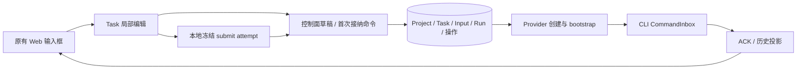
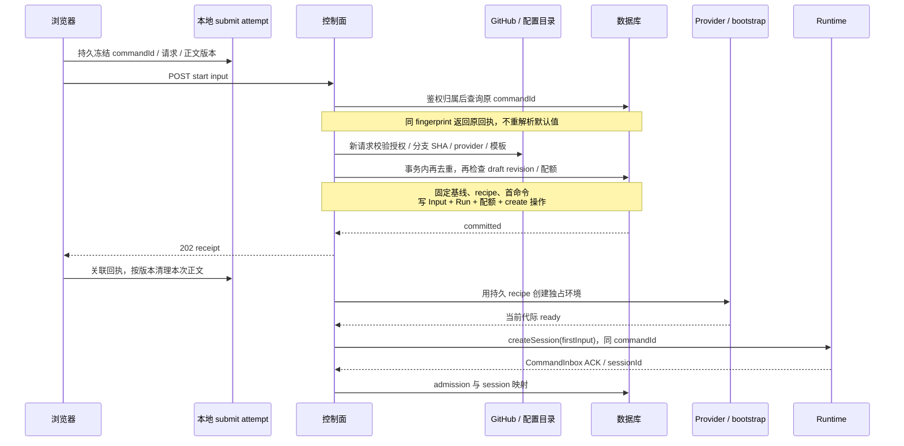

# Spec 11 — 项目、草稿任务与首次启动

状态：目标设计（2026-10-06 云端实现代码已整体回退），尚未实施；2026-10-05 经源码审阅及两个子 agent 对抗审查。本篇不代表已完成或测试已通过。
父文档：[00](./00-overview.md)。关联：[01](./01-provisioning.md)、[03](./03-control-plane.md)、[04](./04-web-client.md)、[08](./08-project-task-model.md)、[09](./09-github-integration.md)、[10](./10-implementation-plan.md)。

## 1. 范围与权威归属

用户确认：从已授权 GitHub 仓库创建项目，项目不占用沙箱；同项目可有多个任务，各任务执行时独占任务分支和沙箱 checkout；“新建任务”先生成草稿，选择基础分支与沙箱提供商，首次发送后才创建沙箱。

本篇负责项目创建到首次 runtime admission 的完整流程。云项目只支持 GitHub 仓库（2026-10-06 决议移除云 SSH attachment，见 00 §11⑥）。

| 文档 | 唯一负责的规则                                              |
| ---- | ----------------------------------------------------------- |
| 本篇 | 项目/草稿创建、配置提交、首次启动流程、失败分流及端到端验收 |
| 03   | HTTP schema、持久事务、幂等 fingerprint、输入投递及回执     |
| 04   | 首页/侧栏、共享输入框、客户端草稿与恢复、能力门控           |
| 08   | Project/Task/Run 模型、固定首命令、停止屏障、保存/终止/恢复 |
| 01   | provider driver、bootstrap、readiness、迟到资源清理         |
| 09   | 仓库授权、基础提交、任务分支、Git 产物与撤权                |
| 10   | 实施依赖、测试入口及退出门槛                                |

本篇引用这些契约，不另建生命周期状态机、错误体系或另一条 accepted 队列。

## 2. 当前源码依据与差距

工作区已有未提交 cloud 骨架，与原有 Local/SSH 功能分开评估；文件、dist、schema 或类型检查存在不等于云功能闭环。

| 当前源码                                                                                      | 可复用边界                                        | 仍需补齐                                          |
| --------------------------------------------------------------------------------------------- | ------------------------------------------------- | ------------------------------------------------- |
| `packages/ui/src/v4/ConversationComposer.tsx`                                                 | contextHeader、草稿 owner、发送回调、正文版本保护 | 无 runtime 的 Task 草稿、202/ACK 分离、稳定 scope |
| `packages/ui/src/v4/SessionPane.tsx`、`packages/ui/src/v4/composer/useDraftSessionPrewarm.ts` | 原路径 runtime draft 预热                         | Cloud draft 禁用预热，不能只替换连接地址          |
| `packages/ui/src/v4/composer/composerDraftStore.ts`                                           | identity 优先的存储键与 `__draft__` scope         | Cloud scope 不随 Run/sessionId 改变，原路径保留   |
| `packages/server/src/cloud/app/taskService/taskService.ts`                                    | createDraft 只写元数据                            | draftStartConfig 持久化与 revision 校验           |
| `packages/server/src/cloud/adapters/storage/handlers/inputHandlers.ts`                        | Input/Run/配额/create 操作同事务                  | 去重先于新请求 CAS、首命令、recipe、失败收口      |
| `packages/ui/src/hooks/cloud/useSubmitCloudInput.ts`                                          | 控制面提交与回执                                  | 完整请求重试；attempt 跨刷新恢复                  |
| `packages/server/src/cloud/adapters/github/branches.ts`                                       | 查询基础分支 SHA                                  | 接入首次接纳，不在创建重试时重新解析              |
| `packages/server/src/cloud/app/dispatch/createDispatch.ts`                                    | 持久操作驱动创建                                  | 消费固定 recipe；停止意图阻断启动与迟到 ready     |

这些是静态证据。真实 provider、runtime 路径映射、附件 materialization 与恢复必须实际验证。

## 3. 状态所有者

| 事实                                                  | 唯一所有者                      | 其他组件                              |
| ----------------------------------------------------- | ------------------------------- | ------------------------------------- |
| Project、Task 及 draftStartConfig                     | 控制面应用服务与数据库          | UI 缓存投影，未保存配置仅局部 overlay |
| 未提交正文、编辑器内容                                | 当前客户端 Task 草稿 owner      | 本地缓存；首版无跨设备正文协同        |
| commandId、完整冻结请求、提交 unknown                 | 当前客户端 submit-attempt owner | 持久对账记录，不是离线发送队列        |
| accepted input、firstInputCommandId、Run recipe、操作 | 控制面持久服务                  | 后台创建/投递，UI 展示 receipt        |
| admission、busy/running 队列、权限裁决                | CLI CommandInbox/runtime        | 控制面保存 ACK/历史投影               |
| 授权与远端 SHA/分支事实                               | GitHub                          | 控制面预检，副作用边界再核验          |

## 4. 创建项目

1. 使用 03 的 repositories API 查询当前主体可用仓库，支持分页、搜索；未配置、未安装与撤权分别呈现。
2. 用户选择 repositoryId。客户端的 repo slug、installationId、clone URL 不能自行证明权限。
3. 控制面按 09 核验 principal → installation → repository，取得权威 owner/name/defaultBranch 并保存 Project；请求展示信息不能覆盖仓库身份。
4. 同 principal 同 repositoryId 重复添加返回既有 Project。显示名可独立编辑；换仓库创建另一个 Project，不改历史任务归属。
5. 只访问 metadata/GitHub API，不调用 provider、不 clone、不创建 runtime session。选中项目或展开侧栏也不分配资源。

Project 默认值只初始化新草稿，不覆盖已有草稿的明确选择；仓库 rename/transfer 处理见 09。

## 5. 创建与编辑草稿

“新建任务”以稳定 creationKey 创建服务端 Task；响应丢失用原 key 恢复，不重复创建。

草稿满足：`status=draft`，无有效 Run、runtimeSessionId、真实 workspacePath 或冻结 baseSha。已存在 `workspaceIdentity=cloud-task:<taskId>`；identity 用于隔离，不是 cwd。

建议新增 `draftStartConfig={baseBranch, provider, templateRef?}`，严格 wire 以 03 为准：

- 分支取已核验的仓库默认分支，可搜索其他分支，不固定为 main，不进行 checkout。
- provider 来自服务端 capabilities；只提供已配置且实际解禁项，不无声换 provider。切换时清除不兼容模板，并显示有效默认或要求选择。
- templateRef 是服务端受控引用，不允许任意镜像、脚本或秘密；具体模板版本和资源在首次接纳时固定。
- 配置不全时可保留草稿，首发解释阻塞原因；模型/模式复用共享类型，读取选项不得启动 Agent。
- PATCH 仅 draft 可修改启动配置，必须带 expectedRevision；不能通过 metadata PATCH 修改状态、run 或路径。
- 配置唯一 owner 是控制面 Task 服务。客户端串行保存，首发等待其在途配置保存完成；CAS 冲突保留编辑，不自动覆盖另一设备。
- `draftStartConfig.baseBranch` 是草稿选择；Task 顶层 baseBranch/baseSha 表达首次接受后固定的基线，不并行维护两份可变分支。

正文按 04 的稳定 Task scope 本地保存。清浏览器存储仍有服务端 Task/配置，但未提交正文可能消失；不宣称首版正文跨端同步。

## 6. 首次接纳与启动顺序

start、append 和 reopen 是不同意图。首次 start 必须带 draft revision 和完整启动选择；append 绑定当前 generation；reopen 显式创建新执行，不借普通发送自动启动。

外部预检不占 SQLite 写事务。采用本次查询到的分支 SHA，接纳事务固定它，不承诺跨 GitHub/SQLite 原子取得“点击瞬间最新 HEAD”。以后该 SHA 无法获取则明确失败，不重新解析分支头。

03 的事务必须再次检查 duplicate，再检查任务/config revision、无有效 Run、配额与停止/归档条件；固定 Task 基线/任务分支，创建 provisioning Run 与 recipe，绑定 firstInputCommandId，写 Input、acceptanceSeq、配额及 create 操作。失败整体回滚，提交前禁止 provider create。

Run recipe 固定 provider、模板 revision/image digest、资源、baseSha/恢复起点、首命令模型配置及非秘密授权引用。各 Input 另存该命令的 resolvedExecutionConfig；ready 后新 append 选择模型不改写启动 recipe。原请求重试沿用相应快照，部署默认值变化不影响已接收工作。授权不能冻结为永久许可，grant/checkout/push 再核验当前权限。

202 表示持久接收，ready 不等于 runtime admission。后台只投递明确的 firstInputCommandId；不按毫秒/随机 UUID 挑首命令，不依赖浏览器 autoSend。

## 7. 未知提交、并发与追加

- 原 commandId 同 fingerprint 返回原回执，不因任务 revision 增长拒绝重放；不同 fingerprint 冲突。
- 两端 start 只有一个新命令成功；另一请求不能被降为 append 并忽略启动选择。
- HTTP 前持久 attempt，包含 principal/origin/taskId/commandId、完整 payload、阶段及正文版本。本地不能持久时阻止 Cloud 提交并解释恢复限制，不伪装具备跨刷新保证。
- 网络/查询失败保持 unknown。刷新、重新登录或切回任务恢复原 attempt；结果未明确前不换 key 重发旧要求。可编辑新正文，但不自动执行。
- 明确未接收后修改语义字段可成为新提交；unknown 请求不能用新分支/provider/模型重新组装。
- receipt 只清理本次冻结正文版本，不清等待期间新编辑或其他任务草稿。
- 首版仅 ready 且无 stopRequested 时接受新 append。provisioning/disconnected 可编辑下一条正文，发送返回 not-ready/recovery 错误；扩大待就绪追加能力须先定义排序/取消规则。
- ready 后仍经过同一 durable input port；CLI 决定 admission/执行队列。回执占位与 runtime user row 按 commandId 合并，不重复显示正文，不把 202 冒充 ACK。

## 8. 失败、取消与重试

| 故障                                 | 输入/资源事实                                                   | 下一步                       |
| ------------------------------------ | --------------------------------------------------------------- | ---------------------------- |
| 权限/ref/provider 预检或 DB 提交失败 | 无 accepted、无创建副作用                                       | 保留草稿，解释原因           |
| DB 已提交，HTTP 回包未知             | 原 input/Run/操作可查询                                         | 恢复原 attempt，不新建 start |
| provider create 未知                 | 操作、配额、代际保留，按 01 对账                                | 核验中，禁止另一写 Run       |
| 环境准备明确失败，输入确定未投递     | rejected，原因 environment-preparation-failed；资源另行核验清理 | 保留正文/recipe，显式重试    |
| 首命令已发、ACK 不明或执行后实例丢失 | uncertain/对账，不跨 Run 重放                                   | 显示未知结果，用户明确新意图 |
| 首命令取消或明确拒绝                 | 未执行部分按 03 收口；启动流程停止并清理                        | 不静默提拔其他命令           |
| 创建途中 stop                        | 08 持久屏障阻断启动/ready/投递，迟到资源回收                    | 停止/清理中，不提前释放配额  |

“重试启动”通过 reopen 使用新执行意图/commandId，关联原失败输入，保留旧失败事实；原首次输入已接纳的 Task 不退回 draft，不再调用 start。固定基线和明确选择的 provider 不无声改变。恢复已有工作按 08 的 resumeSha/branch 规则，不自动 clone 最新 main 或重放 unknown 工具副作用。

## 9. UI 复用与能力范围

页面及恢复以 04 为准。2026-10-06 用户明确：在原始 Web UI 上增量增加项目、任务管理，其他 UI 与交互不动；本篇遵守 04 §3.0。首页保留原输入框，项目/任务管理位于原首页和侧栏；设置新增“Cloud 运行时”，GitHub/Sandbox 位于该组。不得另造项目卡片首页、Cloud 外壳或以独立任务页替换原 App 工作区。Project 不是部署机本地目录。

建议首版支持正文、模型、基础分支、provider 与受控默认模板；draft 不预热 session，不执行文件/Git/终端。依赖 runtime 的附件、文件提及、slash/skill 目录按能力门控，覆盖按钮、粘贴、拖拽、快捷触发与 hook。

无沙箱 draft 的首发附件不是本轮已确认需求；该限制不授权删除 ready 工作区已有附件能力或改变原 UI。若扩展 draft 首发附件，先建立 task-owned 上传、持久归属、Run 内 materialization 和 artifact ref 授权。协议有 attachments 字段不证明原 session-bound 上传可直接复用；不伪造 sessionId 或先创建空 session 绕过无沙箱草稿。

Local/SSH 和手机附加 Desktop Host 保持原预热、附件及两种 delivery 语义。不宣称原 Composer 全部 runtime 能力在 Cloud draft 可用。

## 10. 验收场景（全部 planned）

用受控时钟、事务断点、provider fake/真实核验、ACK fixture 和浏览器刷新验证，不用 sleep 证明状态。每例需要设置、动作、断言及证据；当前未执行。

| ID    | 设置与动作                                     | 核心断言                                      | 必需证据                        |
| ----- | ---------------------------------------------- | --------------------------------------------- | ------------------------------- |
| CT-01 | 多端重复添加已授权 repo                        | 一个 Project，create=0                        | HTTP、DB 唯一约束、driver spy   |
| CT-02 | 篡改 installation/owner/name 或选择无权 repo   | 服务端不信客户端权限字段                      | 授权 adapter、DB、HTTP          |
| CT-03 | draft 响应丢失，以原 creationKey 重试          | 同 Task，无 provider/runtime 调用             | HTTP、DB、RPC spy               |
| CT-04 | 同项目两草稿选不同配置，刷新/换设备            | 服务端配置独立，正文本地按 Task 隔离          | UI、revision、缓存键            |
| CT-05 | 配置 PATCH/首发并发，两端选择冲突              | revision 明确，冲突保留编辑                   | UI、事务、receipt               |
| CT-06 | 分支更新后首发，等待创建时再次更新             | 固定查询 SHA，创建重试不取新 HEAD             | fake refs、Task/recipe          |
| CT-07 | 回包/查询丢失，刷新再重试，默认值已变          | 原 key/payload，一个 Input/Run，recipe 不漂移 | attempt、DB、driver spy         |
| CT-08 | unknown 时编辑新正文/模型/provider，旧回执迟到 | 原请求不重组，新编辑不被清除                  | UI revision、网络断点           |
| CT-09 | 两端不同 commandId 同时 start                  | 一个启动，另一冲突，不降为 append             | 并发事务、Run 约束              |
| CT-10 | 同毫秒反序 UUID、首命令取消/拒绝               | firstInputCommandId 固定，不提拔              | 时钟、首命令、CLI envelope      |
| CT-11 | 创建等待中修改模板/资源/模型默认               | 原 recipe 不漂移，新任务才用新默认            | 快照、create 参数、模型投影     |
| CT-12 | 预检后撤权，checkout/grant/push                | 操作拒绝，风险可见，不扩大权限                | GitHub adapter、grant 审计      |
| CT-13 | create 明确失败/未知、固定 SHA checkout 失败   | 分流正确，未投递 input 收口，unknown 不双建   | Input/operation、provider       |
| CT-14 | 202 后关闭唯一客户端                           | 后台启动并投递，浏览器无 autoSend             | receipt、后台日志、ACK          |
| CT-15 | create 前/在途/返回后 stop                     | 屏障阻断执行，迟到资源清理，配额待核验        | intent、worker、driver/RPC spy  |
| CT-16 | ready append / 旧 generation 提交              | durable port 唯一，旧目标 stale，202≠ACK      | HTTP/RPC、receipt、CommandInbox |
| CT-17 | draft 图片粘贴/drop、文件@/skill入口           | 门控，无隐藏预热/上传/runtime IO              | UI E2E、RPC spy                 |
| CT-18 | 换 Run/session，旧 ACK/正文回执迟到            | Task scope 稳定，旧 tuple 不覆盖              | 缓存、generation/epoch          |
| CT-19 | 保存失败/终止未知/分支外部变化后 reopen        | 08 的风险/配额/恢复边界成立                   | SHA、provider/branch 证据       |
| CT-20 | 手机/桌面、中英/主题及原 Local/SSH             | 主动作可达，原 delivery/预热回归              | 实际 E2E、原路径 fixture        |

## 11. 实施与裁剪

顺序：03/08 严格契约和数据库迁移 → Project 授权、draft 配置、首次事务及失败收口 → 固定 recipe bootstrap/停止屏障 → Cloud Task controller、原 UI、本地 attempt → CT 与原路径回归。真实能力未验证前不启用。

现有测试候选：`packages/server/test/cloudStorageWorker.test.ts`、`packages/server/test/cloudAppHttpApi.test.ts`、`packages/server/test/cloudDelivery.test.ts`、`packages/client/test/cloudControlPlaneClient.test.ts`、`packages/ui/test/cloudTasksStore.test.ts`。文件存在不代表本篇有覆盖；实际 runner/E2E 入口在 10 登记，不杜撰统一 `pnpm test`。

| 项目                                 | 状态                  | 边界                                                     |
| ------------------------------------ | --------------------- | -------------------------------------------------------- |
| 仓库项目、draft、首发才供给          | accepted              | 用户明确确认                                             |
| 正文首发、provisioning 暂不接 append | 实施建议默认          | 收敛取消/排序复杂度，可先修订契约再扩大                  |
| 首发附件、正文跨端协同、离线自动发送 | pruned 首版           | 未确认需求；不意味着用户否定这些功能                     |
| checkpoint、真实 provider、路径映射  | 待运行验证            | 静态审阅不能视作能力完成                                 |
| Cloud 创建/启动的 feature graph 索引 | graph-drift-candidate | 实施后按已跟踪公开模块补种子，不用未提交骨架冒充稳定边界 |

新增字段、路由与错误码必须同步权威 spec 和 shared schema；方案完成不等于实现或测试通过。
