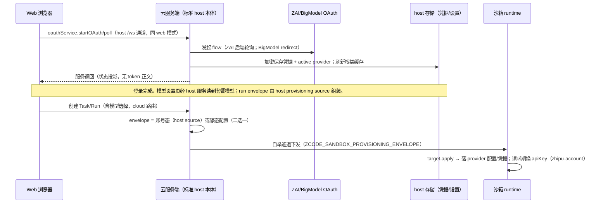

# Spec 12 — 账号域云适配（登录、套餐与套餐模型注入沙箱）

状态：目标设计（2026-10-06 决议⑦⑧，见 [00 §11](./00-overview.md)）；云端实现代码已整体回退（[10 §10](./10-implementation-plan.md)），按本 spec 重新实施。本文是账号域的唯一负责文档：OAuth 登录、凭据保管、套餐权益、套餐 provider 模型进入沙箱。

## 1. 范围与决议

产品决议（2026-10-06，00 §11⑦）：**云模式下必须保留官方模型登录（OAuth）与 Coding Plan（套餐）入口**；登录后的套餐模型信息必须能被沙箱内运行的 agent server 使用——沙箱回连复用 SSH 同构的 agent server 交互，模型链路也应与 SSH 模式同构。

**决议（2026-10-06，00 §11⑧，方向修正）**：不存在需要单独建设的"控制面账号子系统"。**云服务端就是一台标准 ZCode host 本体**——与 web 模式完全相同的装配（`createLocalServices` + HTTP/WS，见 `entry-http.ts`）；登录/凭据/权益/provisioning source 都是 host 自带能力，零改动直接可用。cloud 的沙箱任务编排是叠加层。浏览器按 web 模式同款方式连接该 host（`/ws` 服务通道）获得账号域服务。

本设计的剩余实现只有两件事：①云服务端把 host 本体跑起来并把 `/ws` 服务通道挂到云入口；②浏览器把 host accessor 作为 base、执行域由 Task attachment 覆盖（与 SSH 桌面 renderer 的合并方式同款）。

### 1.1 与既有机制的关系（不做第二套）

| 本地/SSH 模式事实                                        | 云侧对应                                                                 |
| -------------------------------------------------------- | ------------------------------------------------------------------------ |
| Web/桌面 host 进程内 `IOAuthService` 完成 OAuth 换 token | **同一个 host 本体**（云服务端 = 标准 ZCode host；零改动）               |
| 凭据加密存 `~/.zcode/v2/credentials.json`（AES-256-GCM） | 同一实现，数据目录指向云持久卷（`ZCODE_DATA_BASE_DIR`）                  |
| `providerProvisioningSource` 读本机事实组 envelope       | 同一实现读 host 自身凭据/设置（零改动）                                  |
| `providerProvisioningTarget` 在远端落盘配置+凭据         | 沙箱内同款 target 经自举通道安装（01 §6.2，既有机制）                    |
| 套餐 provider 请求期动态换 apiKey（`zhipu-account`）     | 沙箱内同款解析（node.ts 云执行节点已装配账号服务），凭据由 envelope 供给 |

明确不引入：新的 provider 配置格式、第二个 durable 队列、浏览器持长期凭据、部署侧模型请求代理（多租户条件性基线保留）。

### 1.2 云服务端 = 标准 host 本体（决议⑧）

**云服务端不另建账号子系统**：它就是 web 模式的同一装配（`createLocalServices` + HTTP/WS）。登录、账号、凭据、模型目录（registry）、provisioning source 全部按 host 原生能力提供，浏览器按 web 模式同款连 `/ws` 服务通道。cloud 沙箱任务编排（`cloud/` 模块）作为 HTTP/WS 路由与后台循环叠加在同一进程/服务图上。

需要保持的边界：

- 云任务的**执行目标**只路由到沙箱 attachment（owner/run/generation 校验）；host 本体自带的执行域能力不构成云任务的隐式 fallback（03 §2）。
- 沙箱持凭据副本，故刷新传播需显式重推（见 §6）；原 Web 模式因执行与凭据同进程而无需此步。

## 2. 唯一所有者

| 事实                                        | 唯一所有者                                                                                                                           | 其他组件职责                                              |
| ------------------------------------------- | ------------------------------------------------------------------------------------------------------------------------------------ | --------------------------------------------------------- |
| OAuth 会话（state/flow/pending 轮询）       | 云服务端 host 的 `oauthService`（既有实现）                                                                                          | 浏览器只发起与查询状态，不接触 token 正文                 |
| OAuth 凭据（access/refresh/user_info）      | host 凭据存储（既有加密实现）                                                                                                        | run envelope 只读快照；浏览器永不持有                     |
| 账号设置（providerFamilyDomain/selections） | host `settingService`（既有实现）                                                                                                    | 设置页经 WS RPC 读写；沙箱只接收投影                      |
| 套餐权益快照                                | host `usageStatsService`（既有实现）                                                                                                 | UI 经服务读取；不落沙箱                                   |
| 模型目录（模型设置页 providers/models）     | host provider registry（既有，唯一的目录所有者）；Task ready 后执行侧目录由沙箱 attachment 提供（同 SSH 模式的"目录属目标环境"语义） | 浏览器经 host `/ws` 读；`ui-bootstrap` 静态投影不再被消费 |
| 沙箱内 provider 配置与凭据副本              | 沙箱 runtime（安装时点）                                                                                                             | 仅创建期下发；不入库、不进日志、轮换即重装                |

## 3. 时序

失败语义：token 交换失败/取消 → 会话回到未登录，不发 envelope、不注入沙箱；权益查询失败 → catalog 标记 `unavailableReason`（已有 schema），不阻断其他 provider；envelope 安装失败 → run 失败补偿（既有 `onRunFault`），不携带旧凭据重试。

## 4. 服务面（= host 本体自带的 `/ws`，零新增装配）

**云服务端运行标准 host**（`createLocalServices` + HTTP/WS，同 `entry-http.ts`）。账号域服务（oauth/credential/usage/setting/provider registry/provisioning source）全部是 host 自带能力，**不新增任何装配代码**；浏览器按 web 模式同款连接 host 的 `/ws` 服务通道（`http.ts` 的 `setupChannelServer`，`web-remote-replayable` 角色）获得全部 host 服务代理。

云入口的工作 = 在同一进程/服务图上叠加 cloud 模块：既有 cloud HTTP/WS 路由（tasks/bridge/interactions 等）与后台循环保持不变，只是与 host 服务图共存。实现取向（最小侵入）：

- 云入口调用 `createLocalServices()` 得到 host 服务图，复用 `http.ts` 的 `/ws` 暴露逻辑（把 `setupChannelServer` 等抽出为可复用导出）；
- cloud 路由继续用现有注册函数挂在同一 Hono app 上；鉴权按 03 既有条款。

硬边界：

- **云任务的执行目标只路由到沙箱 attachment**（owner/run/generation 校验，既有实现）；host 自带执行域不构成云任务的隐式 fallback。
- 数据目录：host 装配前 `setDataBaseDir(cloudDataDir)` / env `ZCODE_DATA_BASE_DIR` 指向云持久卷；`ZCODE_CREDENTIAL_SECRET` 部署注入；OAuth runtime env 与部署同源配置。
- token 正文不进入任何 HTTP 响应体与浏览器存储（host 既有契约）。

## 5. 客户端（Web/UI）

- **base accessor = host 的 `/ws` accessor**（与 web 模式同款连接，`?token=` 放行同既有 lite token 机制）；`createCloudBrowserServices` 不再提供账号域的 static/unavailable 覆盖——账号域（oauth/credential/usage/setting）与模型目录直接来自 host accessor；客户端 scope 键（`principalId`）改由 `GET /api/cloud/capabilities` 返回（已认证，非秘密），不再需要 `ui-bootstrap` 端点（可删）。
- **执行域按当前 Task 由 attachment 覆盖**：选择 Task 进入工作区时，`file/git/terminal/agent/session` 等来自 `/ws/cloud/tasks/:taskId` 的沙箱 attachment（与桌面 renderer 的 `buildRemoteWorkspaceSessionServices` 合并模式同款）；无 Task/断连时这些服务回落 unavailable。
- 模型设置页、WelcomeScreen 等原组件**零改动**：登录/套餐/目录都走 host 服务，路径与原 web 模式完全一致。
- 凭据相关 UI 文案不得回显 token；日志脱敏（AGENTS 日志规范）。

## 6. 沙箱注入（按 SSH 原本逻辑，复用 host 的 provisioning source）

- **Source = host 自己的 `providerProvisioningSource`**：`createLocalServices` 已装配它（node.ts:1589），经既有 `getProviderProvisioningSource(services)` 取出（桌面 host 同款用法）。**零新增装配**。
- run 创建时 envelope 二选一（互斥）：①账号登录态存在（`oauth:active_provider` 非空）→ `providerProvisioningSource.read(randomUUID())` 结果；②否则退回既有静态 `config.model` envelope。不合并两份凭据。envelope 经 **bridge 认证通道的 `bootstrap.config`（[02 §4](./02-bridge-protocol.md)）**下发，并携带 `credentialGeneration` 供 A-08 代际核对；**不走 provider env/元数据**（provider API 可读，禁承载凭据）。
- 凭据白名单与安全边界沿用既有实现（`PROVIDER_PROVISIONING_OAUTH_CREDENTIAL_KEYS` + account-provider 缓存键；不进日志/元数据）。
- 套餐 provider 必须按 `zhipu-account` 类型工作：不得转成 `api-key` 型注入（否则请求期换 key 不触发，表现为 `provider_not_ready`）。
- 沙箱内 builtin catalog（`zcode-builtin.json`）为模型清单来源；部署须确保沙箱内存在同一份 builtin 配置。
- **运行中凭据刷新传播（A-08）**：host 刷新 token 成功后把新 envelope 重推到运行中的 Run。v1 采用"标记 + 下次 bridge 连接时重装"的简化实现；不得改造 bridge 协议或引入第二队列。重推失败按 run fault 语义记录。只记录代际而不做重装的实现不满足 A-08，必须作为明确 gap 记录，不能声称已满足。
- 登出/换账号：新 Run 不携带旧凭据；运行中 Run 不中途撤销凭据，由用户显式停止/重开进入新代际。

## 7. 验收（计划）

| ID   | 场景                                      | 断言                                                                         |
| ---- | ----------------------------------------- | ---------------------------------------------------------------------------- |
| A-01 | 云模式未登录打开模型设置                  | 登录/套餐入口可见可用；catalog 为空态有明确引导                              |
| A-02 | ZAI 后端轮询登录 + BigModel redirect 登录 | 会话状态正确；token 不出现于任何 HTTP 响应/浏览器存储                        |
| A-03 | 登录后套餐模型出现在 catalog 与选择器     | 与权益状态一致；未登录/无权益时 fail-closed                                  |
| A-04 | 创建 Run → 沙箱内请求成功                 | 沙箱凭据经 envelope 安装；请求期换 apiKey 生效（真实模型回复证据）           |
| A-05 | 登出后创建新 Run                          | envelope 不含凭据；旧 Run 不受影响；重复登出幂等                             |
| A-06 | 凭据文件损坏/权益接口 5xx                 | fail-closed 且可恢复；不静默降级为静态配置                                   |
| A-07 | 云服务端重启                              | 登录态恢复；envelope 来源一致（账号 vs 静态互斥判定无漂移）                  |
| A-08 | 运行中 token 过期 → UI 401 → 刷新         | host 单飞刷新 → 新 envelope 重推运行中 Run → 请求恢复；重推失败有 fault 记录 |
