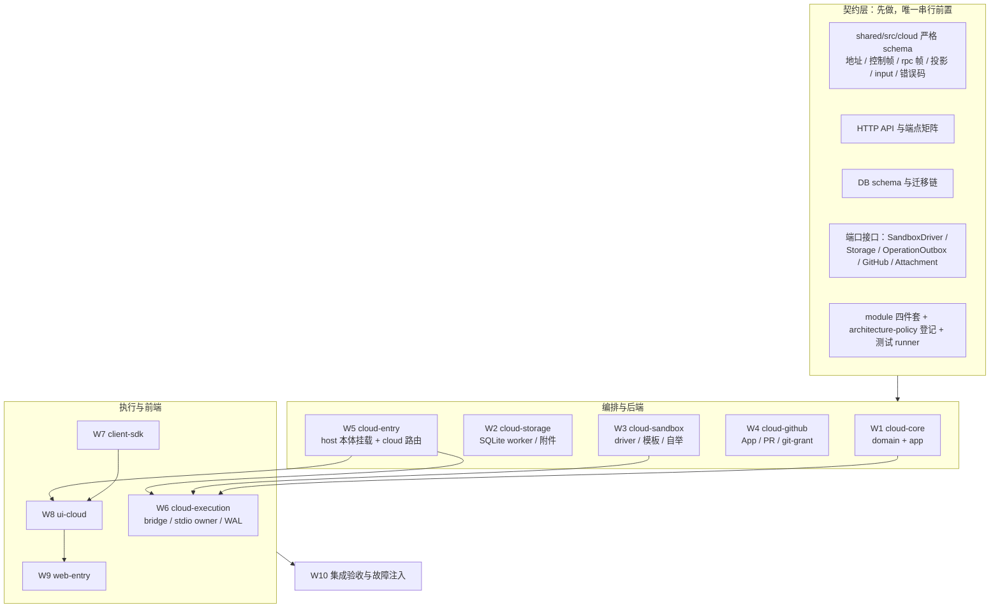
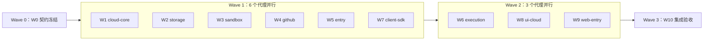

# Spec 13 — 模块地图、代理分工与工作单规范

状态：目标设计（2026-10-06 代码已整体回退，工作区只有本 spec 组）。本文是**实施期的组织文档**：谁负责哪个模块、按什么顺序并行、每个代理拿到的输入输出是什么。

## 1. 为什么分三层

现有 01–12 是**按关注点**切的（供给、协议、控制面、账号域、UI…），一份文档横跨多个模块。直接按模块把它们剪开复制会有两个后果：同一规则出现多份副本，改一处漏一处；跨模块的时序（输入幂等、投影 ingest、run 围栏）在各自文档里被解释成不同版本。

所以实施期采用三层：

| 层             | 文件                                                                                        | 内容                                                            | 谁能改                               |
| -------------- | ------------------------------------------------------------------------------------------- | --------------------------------------------------------------- | ------------------------------------ |
| 契约层（冻结） | [00](./00-overview.md)–[12](./12-account-domain.md) + [W0](./modules/W0-contract-freeze.md) | 产品规则、领域状态机、协议/HTTP/DB schema、身份与错误码、账号域 | 只在发现设计缺陷时，按 §5 流程改     |
| 模块工作单层   | `modules/W1..W10-*.md`                                                                      | 每个模块的范围、交付物、对外接口、边界、验收、依赖              | 该模块的负责代理，且不得改契约层结论 |
| 计划与记录层   | [10](./10-implementation-plan.md)                                                           | 里程碑、PR 拆分、验证结果、回退记录                             | 集成阶段统一维护                     |

规则：**工作单不得内联复制契约层规则**，只引用章节号（如 `01 §7.1`）。需要新增契约时，先提 W0 变更，再写代码。

## 2. 模块地图



## 3. 工作单清单

| 工作单                                | 模块 / 归属                          | 主要 roots                                                           | 前置                      | 可并行                     |
| ------------------------------------- | ------------------------------------ | -------------------------------------------------------------------- | ------------------------- | -------------------------- |
| [W0](./modules/W0-contract-freeze.md) | 契约冻结（跨包）                     | `packages/shared/src/cloud`、`architecture-policy.yaml`              | 无                        | 串行唯一前置               |
| [W1](./modules/W1-cloud-core.md)      | `cloud-control-plane` domain+app     | `packages/server/src/cloud/{domain,app}`                             | W0                        | 与 W2–W5、W7 并行          |
| [W2](./modules/W2-cloud-storage.md)   | 存储 adapter                         | `packages/server/src/cloud/adapters/storage`                         | W0                        | 与 W1、W3–W5、W7 并行      |
| [W3](./modules/W3-cloud-sandbox.md)   | provider adapter + 沙箱资产          | `cloud/adapters/sandbox`、模板与脚本                                 | W0                        | 与 W1、W2、W4、W5、W7 并行 |
| [W4](./modules/W4-cloud-github.md)    | GitHub + 部署秘密 + git grant        | `cloud/adapters/github`、`cloud/adapters/secret`                     | W0                        | 与 W1–W3、W5、W7 并行      |
| [W5](./modules/W5-cloud-entry.md)     | 云入口装配（host 本体 + cloud 叠加） | `cloud/adapters/entry-cloud*.ts`、`packages/server/src/http.ts` 抽取 | W0                        | 与 W1–W4、W7 并行          |
| [W6](./modules/W6-cloud-execution.md) | `cloud-execution` 子模块（沙箱内）   | `packages/server/src/cloud/execution`                                | W1、W3、W5                | 与 W7–W9 并行              |
| [W7](./modules/W7-client-sdk.md)      | 客户端 SDK                           | `packages/client/src/cloud`                                          | W0                        | 与 W1–W5 并行              |
| [W8](./modules/W8-ui-cloud.md)        | UI 投影与原组件接入                  | `packages/ui/src/{hooks/cloud,store/cloud}` + 原组件接入点           | W7、W5（host `/ws` 语义） | 与 W6、W9 并行             |
| [W9](./modules/W9-web-entry.md)       | Web 入口与平台适配                   | `packages/web/src/cloud`、`webPlatform.ts`、`main.tsx`               | W5、W7                    | 与 W6、W8 尾部并行         |
| [W10](./modules/W10-verification.md)  | 集成验收、故障注入、跨模块回归       | 测试入口与证据                                                       | W1–W9                     | 最后                       |

## 4. 波次与代理分派



分派约定（每个代理都一样）：

- **输入**：该工作单整份 + 工作单「冻结依赖」列出的契约章节 + 允许写入的路径清单。
- **输出**：代码 + 测试 + 该工作单「验收」小节要求的真实命令结果；不得在报告里把未跑的检查写成通过。
- **禁止**：改契约层文件、改其他模块的 roots、改 `architecture-policy.yaml` 里别人的模块条目、跨模块深导入（只走公开入口）。
- **冲突处理**：需要改契约或改别人接口时，先停手并在工作单里记「契约变更请求」，由 W0 收口后再继续；不得自行在两处加兼容分支。

## 5. 冻结与变更规则

1. 契约层章节（`00`–`12`）与 W0 产物在 Wave 1 开始后**只接受带证据的修订**：写明违反的验收 ID（如 `B-06`、`A-04`、`CT-07`）与真实失败输出，同步改引用方，并在 [10 §10](./10-implementation-plan.md) 追加记录。
2. 跨模块接口（shared schema、HTTP 端点、控制帧、DB 表、端口）任一变更 = 契约变更：改 shared 单一来源 + 更新 W0 + 通知受影响工作单（表里「前置」列反查）。
3. 模块边界以 `architecture-policy.yaml` 的 `roots`/`layers`/`publicEntrypoints` 为准，代码不得用相对路径绕过公开入口；每个 PR 跑 `pnpm architecture:check --changed`。
4. 每个工作单完成时必须给出：交付物清单、对外接口、未做/受限项、验证命令真实结果（`pnpm typecheck`、`pnpm lint`、架构检查、该模块测试、交互 E2E 如适用）。

## 6. 工作单模板

新建或修订工作单按下面 8 节写，缺一节即视为不完整：

```text
# W<n> — <模块名>
状态 / 归属（roots、module id、owner、是否 managed）
## 1. 范围（做什么，不做什么）
## 2. 冻结依赖（必须读的契约章节 + 别人已冻结的接口）
## 3. 交付物（文件/目录清单，含 module 四件套）
## 4. 对外接口（导出符号、端口、端点、帧、事件）
## 5. 边界与禁止（不能碰的路径、必须遵守的 owner 规则）
## 6. 验收（用例 ID + 命令 + 需要的证据）
## 7. 前置与并行（阻塞谁、被谁阻塞）
## 8. 风险与需要 spike 的点
```
